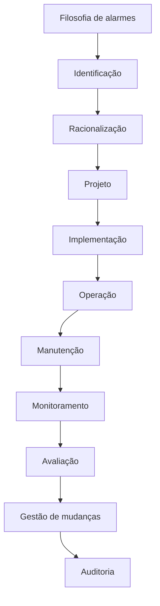

# Gerenciamento de alarmes

Tema estruturante da apostila (capítulo dedicado, alvo 17). Aplicar `promptSkill.md` §13–§14.

## Normas — escopo distinto, não misturar

| Referência | Natureza | Escopo |
|---|---|---|
| **ANSI/ISA-18.2** | norma (ISA) | gerenciamento de alarmes em indústrias de processo |
| **IEC 62682** | norma (IEC) | mesmo escopo, base internacional alinhada à ISA-18.2 |
| **EEMUA 191** | guia de engenharia (EEMUA) | projeto, gestão e contratação de sistemas de alarme; benchmarks de desempenho |
| **NAMUR NA 102** | folha de recomendação (NAMUR) | gerenciamento de alarmes na indústria química/farmacêutica |

Antes de publicar: verificar **edição, ano e status** de cada uma (ver
[normas-ciberseguranca.md](./normas-ciberseguranca.md)) e escrever apenas princípios,
sem reproduzir texto protegido.

> ⚠️ **Erro a evitar:** atribuir requisitos de ISA-18.2/IEC 62682 a **IEC 60839** ou a normas de
> alarme de segurança patrimonial/incêndio. São famílias distintas — se o material antigo fizer
> essa associação, corrigir e explicar a diferença.

## Ciclo de vida (§14)

Explicar cada fase com o que se produz nela (documento, decisão, métrica) e o retorno do ciclo:
alarme que não passa no monitoramento volta para racionalização, não para "ajuste de limite".

## Conceitos que precisam estar no capítulo

- **Prioridade × severidade:** severidade é consequência do desvio; prioridade é a ordem de
  resposta do operador e depende do tempo disponível. São coisas diferentes.
- **Limites:** valor de disparo, histerese/**deadband**, **atraso** de confirmação (on-delay).
- **Alarmes espúrios e repetitivos** (*chattering*), alarmes fugazes (*fleeting*).
- **Alarm flooding**: rajada que impede a identificação da causa raiz.
- **Shelving** (silenciar temporariamente com prazo), **suppression** (silenciar por projeto,
  enquanto a causa está ativa), **disable**, **standing alarm** (permanece ativo por longos
  períodos sem ação possível).
- **Carga de alarmes por operador** e **resposta do operador** (tempo para reconhecer e agir).
- **Racionalização:** ficha por alarme com causa, consequência, ação esperada, tempo de resposta,
  prioridade, limite, deadband, atraso, tipo (P, A), responsável.
- **Documentação, auditoria e gestão de mudanças** (MOC) — mudança de limite é mudança de projeto.
- **Desempenho:** taxas usuais citadas como referência de sistema maduro (~150 alarmes/dia por
  operador; máximo da ordem de 10 alarmes por 10 minutos por operador) — apresentar **como
  referência usualmente citada** de EEMUA 191/ISA-18.2 e confirmar a redação vigente da norma
  antes de publicar números, sem tratá-los como obrigação contratual.

## Estrutura proposta do capítulo

1. Por que gerenciar alarmes (custo do flood, incidentes).
2. Conceitos e taxonomia.
3. Normas e escopo de cada uma.
4. Ciclo de vida (diagrama acima).
5. Racionalização na prática (ficha de alarme em tabela).
6. Projeto de apresentação ao operador (cor, som, posição, agrupamento) — ancorado em **ISA-101**
   (há material no corpus: `ISA101.pdf`, simpósio Sabesp).
7. Implementação em SCADA (limites, deadband, atraso, prioridades, registro e histórico).
8. Monitoramento e avaliação (métricas, relatórios, alarmes por operador e por hora).
9. Estudo de caso: **alarme de alta temperatura** — do limite e deadband à ação do operador e à
   análise do histórico.
10. Atividade prática: racionalizar uma lista de alarmes de uma planta fictícia.

## Amarração com o resto da apostila

- Capítulo de HMI/dashboards: alarme como elemento de tela, hierarquia visual.
- Capítulo de redes/protocolos: timestamp e qualidade do dado afetam o alarme (atraso, perda,
  `quality` ruim em OPC UA não pode virar alarme silencioso).
- Capítulo de cibersegurança: quem pode alterar limite, silenciar e *shelve* (permissões e trilha
  de auditoria).
