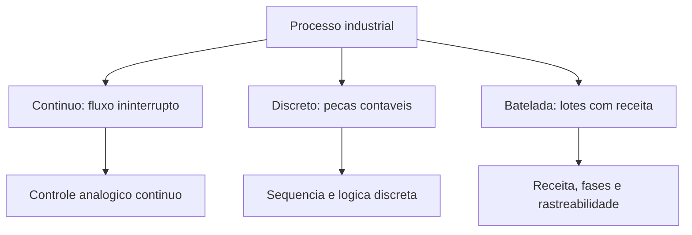
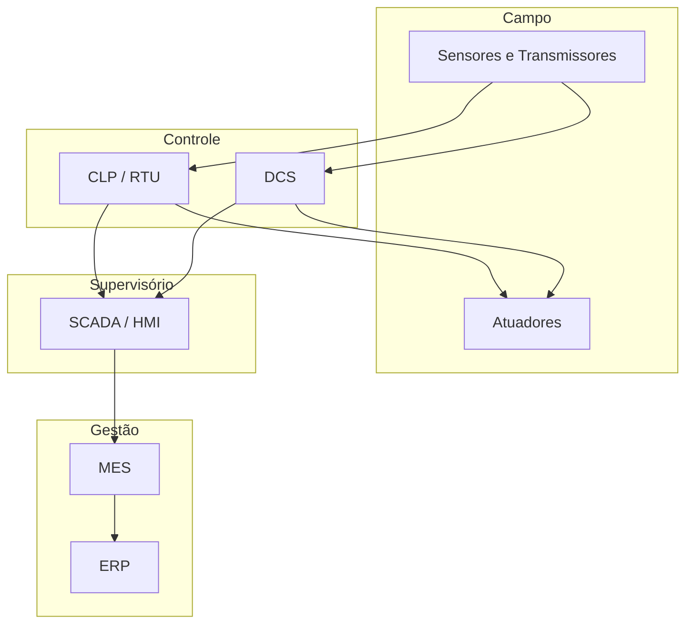

# Capítulo 1 – Introdução à Automação Industrial

## Objetivos de Aprendizagem

Ao final deste capítulo, o leitor será capaz de:

- Compreender o conceito de automação industrial e sua evolução histórica.
- Distinguir os tipos de processos industriais: contínuos, discretos e em batelada.
- Identificar os principais benefícios e desafios da automação.
- Reconhecer as tecnologias que compõem um sistema automatizado moderno.

---

## 1.1 O que é Automação Industrial?

**Automação industrial** é o conjunto de tecnologias, equipamentos e sistemas que permitem realizar processos produtivos com o mínimo de intervenção humana direta. Não se trata apenas de substituir mão de obra: o objetivo principal é aumentar a **produtividade**, melhorar a **qualidade**, garantir a **segurança operacional** e reduzir desperdícios.

Um sistema automatizado é composto, em essência, por três elementos fundamentais:

1. **Sensores** — capturam variáveis do processo (temperatura, pressão, nível, vazão, posição).
2. **Controladores** — processam as informações e tomam decisões (CLPs, DCS, microcontroladores).
3. **Atuadores** — executam as ações de controle (válvulas, motores, relés, inversores de frequência).

> 📌 **Nota:** A palavra "automação" vem do grego *automatos* ("que age por si mesmo"). O conceito, no entanto, é mais amplo: sistemas automatizados não agem de forma totalmente autônoma — eles seguem lógicas de controle programadas por engenheiros.

> 🖼️ **[Figura 1.1 – Elementos de um sistema automatizado]**
> *Diagrama de blocos simples mostrando o ciclo: Processo → Sensores → Controlador → Atuadores → Processo. Usar cores distintas para cada bloco. Incluir exemplos concretos em cada elemento (ex: sensor de temperatura PT-100, CLP Siemens S7-1200, válvula de controle Fisher).*

---

## 1.2 Evolução Histórica

A automação industrial passou por ondas de transformação que se aceleraram progressivamente:

| Era | Período | Tecnologia-Chave | Marco |
|---|---|---|---|
| Mecânica | séc. XVIII–XIX | Máquinas a vapor, teares automáticos | Revolução Industrial (1ª) |
| Eletromecânica | 1870–1960 | Relés, contatores, motores elétricos | Linha de montagem Ford (1913) |
| Eletrônica | 1960–1980 | Transistores, CIs, primeiros CLPs | 1º CLP: Modicon 084 (1969) |
| Digital | 1980–2000 | Microprocessadores, redes industriais, SCADA | Sistemas DCS (Honeywell TDC 2000, 1975) |
| Conectada | 2000–2015 | Ethernet industrial, OPC, MES, ERP | Integração TI/OT |
| Inteligente (Industry 4.0) | 2015–hoje | IIoT, Cloud, IA, Digital Twin, 5G | Plataformas de analytics industriais |

> 🖼️ **[Figura 1.2 – Linha do tempo da automação industrial]**
> *Infográfico horizontal com os marcos históricos acima. Cada era representada por uma cor e um ícone representativo. Destacar o surgimento do CLP (1969), do SCADA e do IIoT como pontos de inflexão.*

O primeiro **CLP** (*Controlador Lógico Programável*) comercial — o Modicon 084 — foi desenvolvido em 1969 por Dick Morley para substituir painéis de relés na indústria automobilística. A adoção do CLP marcou o início da era digital na automação de chão de fábrica.

A partir dos anos 1980, sistemas **SCADA** (*Supervisory Control and Data Acquisition*) emergiram para centralizar a supervisão de grandes instalações — usinas, oleodutos, subestações — onde os operadores precisavam monitorar centenas de variáveis simultaneamente a partir de uma sala de controle.

> 💡 **Dica:** Ao estudar a evolução da automação, observe que cada onda tecnológica não substituiu a anterior — ela a complementou. CLPs modernos ainda convivem com relés de segurança; sistemas SCADA legados coexistem com plataformas IIoT na mesma planta.

---

## 1.3 Tipos de Processos Industriais

Compreender o tipo de processo é fundamental para escolher a tecnologia de automação adequada. A escolha entre CLP, DCS e sistema supervisório começa aqui.

### 1.3.1 Processos Contínuos

Em processos **contínuos**, o produto flui ininterruptamente durante a operação. As variáveis de controle (temperatura, pressão, vazão, composição) variam continuamente e precisam ser mantidas dentro de faixas precisas.

**Exemplos:** refinarias de petróleo, usinas de papel e celulose, indústria química, tratamento de água e efluentes, estações de bombeamento.

**Tecnologia típica:** DCS (*Distributed Control System*), CLP com módulos analógicos (AI/AO), controladores PID, instrumentação com sinais 4–20 mA ou digitais (HART, PROFIBUS PA).

> 📌 **Nota:** Historicamente, DCS era a escolha padrão para processos contínuos devido à capacidade nativa de lidar com loops analógicos complexos. Contudo, CLPs modernos (Siemens S7-1200/1500, Allen-Bradley CompactLogix, Schneider M221) também implementam controle PID e leitura de sinais analógicos com excelente precisão. A escolha entre CLP e DCS hoje depende mais da complexidade da rede, redundância exigida e integração com níveis superiores (MES/ERP) do que do tipo de processo.

### 1.3.2 Processos Discretos

Processos **discretos** produzem unidades individuais e contáveis. As operações são sequenciais: peças passam por etapas definidas até completar o produto.

**Exemplos:** montagem de veículos, fabricação de eletrônicos, embalagem, usinagem CNC.

**Tecnologia típica:** CLP (*Controlador Lógico Programável*), robótica industrial, visão computacional.

### 1.3.3 Processos em Batelada (*Batch*)

Processos **em batelada** combinam características dos dois anteriores: lotes de produto passam por etapas sequenciais em equipamentos compartilhados. A norma **ISA-88** define os modelos de receita e controle para esses processos.

**Exemplos:** indústria farmacêutica, fabricação de tintas, produção de cerveja e alimentos.

**Tecnologia típica:** DCS ou CLP com módulos batch, MES (*Manufacturing Execution System*).

> 🖼️ **[Figura 1.3 – Comparativo dos tipos de processo industrial]**
> *Três ilustrações lado a lado: (1) fluxograma de uma refinaria e de uma estação de bombeamento (contínuo — ambos podem usar CLP ou DCS), (2) linha de montagem automotiva (discreto — CLP + robótica), (3) reator de batelada farmacêutico (batelada — CLP/DCS com sequenciamento ISA-88). Abaixo de cada uma, os atributos: variável de controle, tecnologia típica (destacando que contínuo pode ser CLP ou DCS), norma de referência.*

---

## 1.4 Benefícios e Desafios da Automação

### Benefícios

- **Produtividade:** operação 24/7 sem pausas, maior velocidade de produção.
- **Qualidade e repetibilidade:** eliminação de variações humanas no processo.
- **Segurança:** afastamento do operador de ambientes insalubres ou perigosos (altas temperaturas, produtos tóxicos, explosivos).
- **Rastreabilidade:** registro histórico de todas as variáveis e eventos do processo.
- **Eficiência energética:** controle preciso reduz consumo de energia e insumos.

### Desafios

- **Custo de implantação:** projetos de automação exigem investimento significativo em hardware, software e engenharia.
- **Qualificação da mão de obra:** demanda profissionais treinados em programação, redes e instrumentação.
- **Cibersegurança:** sistemas conectados estão expostos a ameaças digitais (ver Capítulo 8).
- **Integração de sistemas legados:** muitas plantas possuem equipamentos antigos sem interfaces digitais modernas.

> ⚠️ **Atenção:** A automação não elimina a necessidade do engenheiro de processo. Ela amplifica sua capacidade de monitorar e otimizar, mas a definição da lógica de controle, das condições de segurança e dos limites operacionais continua sendo responsabilidade humana.

---

## 1.5 Visão Geral das Tecnologias de Automação

> 🖼️ **[Figura 1.4 – Ecossistema de tecnologias de automação industrial]**
> *Versão ilustrada e colorida do diagrama acima, com ícones representativos para cada tecnologia. Usar a hierarquia de baixo para cima: campo → controle → supervisório → gestão. Adicionar exemplos de produtos reais em cada nível.*

**Tabela 1.1 – Principais tecnologias de automação e suas funções**

| Tecnologia | Sigla | Função Principal | Exemplos de Fabricantes |
|---|---|---|---|
| Controlador Lógico Programável | CLP | Controle de sequências lógicas e discretas | Siemens, Allen-Bradley, Schneider |
| Sistema de Controle Distribuído | DCS | Controle de processos contínuos | Honeywell, ABB, Yokogawa |
| Unidade Terminal Remota | RTU | Aquisição de dados em campo remoto | Emerson, SEL, Advantech |
| Interface Homem-Máquina | HMI | Visualização local do processo | Siemens, Weintek, Proface |
| Supervisório / SCADA | SCADA | Supervisão centralizada de múltiplos pontos | AVEVA, Ignition, Wonderware |
| Sistema de Execução da Manufatura | MES | Gestão e rastreabilidade da produção | SAP ME, Rockwell Plex |
| Planejamento de Recursos Empresariais | ERP | Gestão financeira e logística | SAP, Oracle, TOTVS |

---

## 1.6 Estudo de Caso — Da operação manual ao supervisório em uma estação de tratamento de água

**Cenário.** Estação de tratamento de água de uma cidade de 180 mil habitantes, com vazão de
projeto de 250 L/s. A operação é manual: a dosagem de coagulante é ajustada por tentativa, as
válvulas são acionadas no local, o nível do reservatório é lido em régua e o turno é registrado
em planilha.

**Diagnóstico.** Três problemas dominam a rotina:

1. **Variabilidade da qualidade.** A dosagem deveria acompanhar a turbidez da água bruta, que
   varia com a chuva. Sem medição contínua, a correção chega tarde e o coagulante acaba aplicado
   em excesso "por segurança".
2. **Consumo de energia.** As bombas de recalque são acionadas por horário fixo, não pelo nível
   do reservatório — há partidas desnecessárias em horário de ponta.
3. **Sem rastro para investigar.** Quando o reservatório baixa, não existe registro de quem
   operou o quê nem de quando a bomba partiu.

**Solução por ondas.** A automação não é um projeto único: entra em etapas, e cada etapa resolve
um problema específico. Nenhuma etapa depende da seguinte para dar resultado.

| Onda | O que entra | Nível da pirâmide | Problema resolvido |
|---|---|---|---|
| 1 | Sensores de turbidez, nível e vazão, com CLP na casa de química | 0 e 1 | Medição contínua em vez de amostragem manual |
| 2 | Malha de dosagem corrigida pela turbidez | 2 | Dosagem proporcional, sem excesso fixo |
| 3 | Supervisório com sinóticos, alarmes e histórico | 3 | Operação centralizada e rastreabilidade |
| 4 | Indicadores de consumo específico para a gestão | 4 | Decisão sobre horário de bombeamento |

**O que observar no resultado.** A primeira onda já muda a operação **antes de existir qualquer
tela**: passa a existir dado confiável. Projetos de automação costumam começar pela interface e
pela promessa visual, quando a ordem correta é instrumentar, controlar e só então supervisionar.

**Limitações do arranjo.** Analisadores de turbidez exigem limpeza e calibração periódicas: sem
plano de manutenção, o dado "confiável" deixa de ser confiável em poucos meses — e um supervisório
alimentado por sensor sujo é pior do que nenhum, porque produz confiança injustificada. Além
disso, a automação não substitui a decisão sobre a qualidade da água tratada, que permanece com
quem opera a estação.

---

## Resumo

Neste capítulo foram abordados:

- **Automação industrial** é o uso de tecnologias para executar processos com mínima intervenção humana, tendo como pilares sensores, controladores e atuadores.
- A evolução histórica vai das máquinas a vapor (séc. XVIII) à Industry 4.0, com o primeiro CLP lançado em 1969.
- Os **três tipos de processo** — contínuo, discreto e batelada — definem a escolha da tecnologia de controle.
- Os benefícios da automação incluem produtividade, qualidade, segurança e rastreabilidade; os desafios envolvem custo, qualificação e cibersegurança.
- O ecossistema tecnológico vai do nível de campo (sensores/atuadores) ao nível de gestão (ERP), passando por controle, supervisório e MES.

---

## Questões de Revisão

**Conceituais:**

1. Quais são os três elementos fundamentais de qualquer sistema automatizado? Explique a função de cada um com um exemplo concreto.
2. Qual é a diferença entre um processo contínuo e um processo em batelada? Cite uma indústria típica de cada tipo.
3. Por que o surgimento do CLP em 1969 foi um marco na história da automação?

**Práticas:**

4. Uma indústria farmacêutica deseja automatizar a produção de comprimidos, onde lotes passam por mistura, compressão e revestimento em equipamentos compartilhados. Qual tipo de processo e qual tecnologia de controle você recomendaria? Justifique.
5. Liste três desafios que uma empresa enfrentaria ao automatizar uma planta que atualmente opera de forma manual. Proponha ações para mitigar cada desafio.

**Desafio:**

6. Pesquise o conceito de "Industry 4.0" e identifique pelo menos três tecnologias abordadas nesta apostila que são consideradas pilares dessa revolução industrial. Como elas se inter-relacionam?

---

## Referências

- GROOVER, M. P. *Automação Industrial e Sistemas de Manufatura*. 3. ed. São Paulo: Pearson, 2011.
- ISA-5.1: *Instrumentation Symbols and Identification*. ISA, 2009.
- NATIONAL INSTRUMENTS. *What is Industrial Automation?* Disponível em: ni.com. Acesso: 2024.
- SIEMENS. *History of Automation*. Disponível em: siemens.com/global/en/markets/machinebuilding/automation.html.
