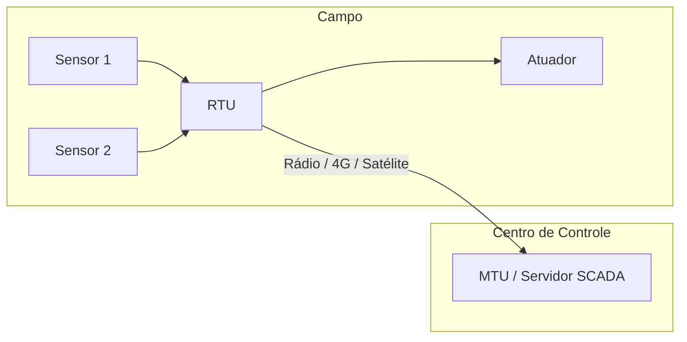
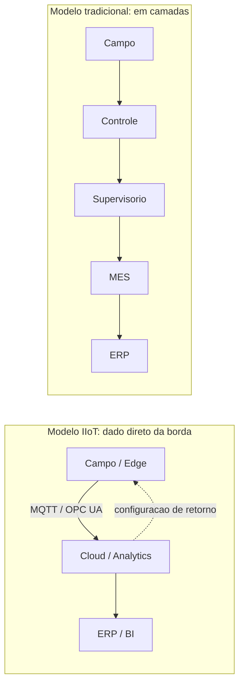

# Capítulo 2 – Pirâmide de Automação e Níveis Hierárquicos

## Objetivos de Aprendizagem

Ao final deste capítulo, o leitor será capaz de:

- Descrever a pirâmide de automação clássica e os cinco níveis hierárquicos.
- Identificar as tecnologias e funções de cada nível.
- Compreender como se dá a integração vertical e horizontal entre sistemas.
- Analisar como o IIoT está transformando a hierarquia tradicional.

---

## 2.1 A Pirâmide de Automação

A **pirâmide de automação** é um modelo hierárquico amplamente utilizado para organizar e compreender os diferentes sistemas tecnológicos presentes em uma indústria. Desenvolvida com base no modelo **ISA-95** (*ANSI/ISA-95 — Enterprise-Control System Integration*), a pirâmide é dividida em cinco níveis, do chão de fábrica até a gestão corporativa.

Cada nível possui:

- **Função específica** no processo produtivo.
- **Velocidade de resposta** diferente: quanto mais próximo do campo, mais rápido deve ser o controle.
- **Volume de dados** processados: os níveis superiores lidam com informações consolidadas; os inferiores, com sinais brutos em tempo real.

> 🖼️ **[Figura 2.1 – Pirâmide de Automação Clássica (ISA-95)]**
> *Pirâmide em cinco camadas coloridas (de baixo para cima): Campo → Controle → Supervisório → Gerenciamento → Corporativo. Cada nível com ícones representativos, exemplos de sistemas (CLP, SCADA, MES, ERP) e indicação de tempo de resposta típico (ms, s, min, horas, dias).*

---

## 2.2 Nível 0 — Campo (Processo Físico)

O **Nível 0** é a base da pirâmide: o processo físico em si — os equipamentos, tubulações, motores, reatores e as variáveis físicas que precisam ser medidas e controladas.

**Componentes típicos:**
- Variáveis: temperatura, pressão, vazão, nível, posição, velocidade.
- Equipamentos: bombas, compressores, válvulas, correias transportadoras, fornos.

> 📌 **Nota:** Tecnicamente, o "Nível 0" representa o processo e não contém nenhum componente eletrônico de automação. Ele é o objeto a ser controlado pelos demais níveis.

---

## 2.3 Nível 1 — Instrumentação de Campo

O **Nível 1** engloba todos os dispositivos que fazem a interface direta com o processo: **sensores** (que medem variáveis) e **atuadores** (que executam ações de controle).

### 2.3.1 Sensores e Transmissores

| Variável | Princípio de Medição | Exemplos de Sensores |
|---|---|---|
| Temperatura | Resistência elétrica (RTD), termopar (EMF) | PT-100, termopar tipo K/J |
| Pressão | Célula capacitiva, extensométrica | Rosemount 3051, Endress+Hauser PMC |
| Vazão | Pressão diferencial, efeito Coriolis, eletromagnético | Yokogawa ADMAG, Emerson Micro Motion |
| Nível | Ultrassônico, radar, pressão hidrostática | VEGA VEGAPULS, Siemens Sitrans LR |
| Posição/Velocidade | Encoder, resolver, sensor indutivo | Heidenhain, Balluff |

### 2.3.2 Atuadores

- **Válvulas de controle:** ajustam vazão de fluidos (ex.: Fisher, Metso).
- **Motores elétricos:** acionados por inversores de frequência (ex.: WEG, ABB ACS).
- **Relés e contatores:** acionamento de cargas elétricas.
- **Sistemas pneumáticos:** cilindros e válvulas solenoides.

> 🖼️ **[Figura 2.2 – Exemplos de instrumentos de campo]**
> *Montagem fotográfica com: (a) transmissor de pressão diferencial Rosemount; (b) válvula de controle com posicionador; (c) sensor de nível radar; (d) encoder industrial. Legendas indicando variável medida e protocolo de comunicação (4-20 mA, HART, Profibus PA).*

> 💡 **Dica:** O protocolo **HART** (*Highway Addressable Remote Transducer*) permite a comunicação digital bidirecional sobre o sinal analógico 4-20 mA. Isso possibilita configurar remotamente e obter diagnósticos de um transmissor sem interromper o sinal de controle.

---

## 2.4 Nível 2 — Controle

O **Nível 2** é responsável pelo controle automático do processo. Os equipamentos deste nível recebem os sinais dos sensores, executam os algoritmos de controle e enviam comandos aos atuadores.

### 2.4.1 CLP — Controlador Lógico Programável

O **CLP** é o equipamento dominante na automação discreta e em batelada. Suas características:

- Programação em linguagens da norma **IEC 61131-3**: Ladder (LD), Blocos de Função (FBD), Texto Estruturado (ST), Lista de Instruções (IL), SFC.
- Alta confiabilidade e robustez para ambientes industriais.
- Ciclos de varredura da ordem de **1 a 100 ms**.
- Comunicação via Modbus, Profibus, Profinet, EtherNet/IP, OPC UA.

**Principais fabricantes:** Siemens (S7-1200/1500), Allen-Bradley (ControlLogix), Schneider (Modicon M340/M580), Mitsubishi (MELSEC iQ-R).

### 2.4.2 DCS — Sistema de Controle Distribuído

O **DCS** (*Distributed Control System*) é projetado para processos contínuos de grande escala. Suas características:

- Controle distribuído em múltiplos controladores de campo, com banco de dados centralizado.
- Algoritmos PID (*Proportional-Integral-Derivative*) otimizados para controle de processo.
- Alta disponibilidade: arquitetura redundante (CPU, rede, fonte de alimentação).
- Integração nativa com instrumentação de campo (Foundation Fieldbus, HART).

**Principais fabricantes:** Honeywell (Experion PKS), ABB (Ability System 800xA), Yokogawa (CENTUM VP), Emerson (DeltaV).

### 2.4.3 RTU — Unidade Terminal Remota

A **RTU** (*Remote Terminal Unit*) é usada em aplicações geograficamente distribuídas, onde não há rede elétrica confiável ou conectividade local. Possui baixo consumo energético e comunicação via rádio, GPRS, 4G ou satélite.

**Aplicações típicas:** oleodutos, gasodutos, subestações de energia, estações de bombeamento de água, telemetria agrícola.

> 🖼️ **[Figura 2.3 – Arquitetura RTU em campo remoto]**
> *Diagrama mostrando: campo remoto com RTU conectada a sensores e atuadores; link de comunicação sem fio (ícone de antena ou satélite) até o centro de controle com servidor SCADA. Exemplo real: estação de bombeamento de água em área rural.*

---

## 2.5 Nível 3 — Supervisório (SCADA/HMI)

O **Nível 3** é o nível **supervisório**: onde os operadores monitoram o processo, visualizam tendências históricas, respondem a alarmes e, quando necessário, fazem intervenções manuais.

Este nível é abordado em detalhes nos Capítulos 3 e 4. Em resumo:

- **HMI local:** painel com tela touchscreen instalado próximo ao equipamento.
- **SCADA centralizado:** servidor com banco de dados, servidor de alarmes, cliente web e thin clients espalhados pela planta ou sala de controle.

---

## 2.6 Nível 4 — Gerenciamento de Produção (MES)

O **MES** (*Manufacturing Execution System*) conecta o chão de fábrica ao mundo corporativo. Suas funções incluem:

- **Rastreabilidade:** registro do histórico completo de cada lote produzido.
- **Qualidade:** coleta de dados de qualidade e gestão de não-conformidades.
- **Programação:** sequenciamento de ordens de produção.
- **OEE** (*Overall Equipment Effectiveness*): cálculo de disponibilidade, desempenho e qualidade dos equipamentos.
- **Gestão de energia:** monitoramento e otimização do consumo energético.

**Exemplos:** SAP ME, Rockwell Plex, Siemens Opcenter, TOTVS.

---

## 2.7 Nível 5 — Corporativo (ERP)

O **ERP** (*Enterprise Resource Planning*) integra as funções de negócio da empresa: finanças, recursos humanos, logística, vendas e planejamento estratégico. Recebe do MES os dados consolidados de produção e os contextualiza com dados de negócio.

**Integração ERP ↔ MES:** normatizada pela **ISA-95**, que define os modelos de informação e interfaces entre os dois sistemas.

---

## 2.8 Integração Vertical e Horizontal

### Integração Vertical

A **integração vertical** conecta os níveis hierárquicos — do sensor ao ERP — permitindo que dados de processo sejam visíveis em tempo real para a gestão e que decisões corporativas influenciem a programação da produção.

> 🖼️ **[Figura 2.4 – Integração vertical na pirâmide de automação]**
> *Seta bidirecional percorrendo todos os cinco níveis da pirâmide. Exemplos de dados que fluem para cima (telemetria, OEE, consumo) e para baixo (ordens de produção, receitas, metas de qualidade).*

### Integração Horizontal

A **integração horizontal** conecta sistemas do mesmo nível — por exemplo, diferentes células de produção, linhas de manufatura ou plantas geograficamente distribuídas — compartilhando dados em tempo real.

**Protocolos de integração comuns:** OPC UA (nativo), REST/HTTP, banco de dados compartilhado, MQTT com broker centralizado.

---

## 2.9 A Pirâmide Revisitada: IIoT e a Convergência TI/OT

O modelo tradicional de pirâmide foi concebido em uma época em que os sistemas de **TI** (*Tecnologia da Informação*) e **OT** (*Operational Technology*) eram completamente separados. Com o advento do **IIoT** (*Industrial Internet of Things*), essa separação está sendo eliminada.

**Principais mudanças:**

- **Edge Computing:** processamento de dados ocorre diretamente em gateways de campo, sem passar pelos níveis intermediários.
- **Cloud SCADA:** o nível supervisório pode ser hospedado na nuvem, acessível de qualquer lugar.
- **Acesso direto sensor → nuvem:** dispositivos IIoT publicam dados diretamente em plataformas como AWS IoT ou Azure IoT Hub via MQTT, "pulando" os níveis da pirâmide.
- **Analytics e IA:** algoritmos de aprendizado de máquina operam sobre dados históricos de processo, retroalimentando decisões de controle.

> 🖼️ **[Figura 2.5 – Pirâmide clássica versus arquitetura IIoT]**
> *Dois diagramas lado a lado: (esquerda) pirâmide tradicional de 5 níveis; (direita) arquitetura IIoT com Edge, Cloud e acesso direto. Destacar em vermelho as "conexões que pulam níveis" no modelo IIoT.*

> ⚠️ **Atenção:** A convergência TI/OT traz desafios significativos de **cibersegurança**. Sistemas de controle que antes eram isolados fisicamente (*air gap*) passam a ter conectividade com redes externas, aumentando a superfície de ataque. Este tema é aprofundado no Capítulo 8.

---

## 2.10 Estudo de Caso — Duas plantas, duas formas de integrar

**Cenário.** Duas unidades do mesmo grupo industrial. A **planta A** opera desde 1998:
controladores de gerações diferentes, barramento PROFIBUS no chão de fábrica, supervisório
instalado em 2006 e um historiador que só recebe dados do supervisório. A **planta B** entrou em
operação recentemente, com Ethernet industrial em toda a fábrica e *gateways* que publicam dados
diretamente na nuvem.

**O que a pirâmide explica bem — nas duas plantas.**

- **Integração vertical** entre os níveis 2 e 4: a ordem de produção desce, o resultado da
  produção sobe.
- **Separação de responsabilidade**: quem controla o quê e com qual requisito de tempo.
- **Vocabulário comum**: quando alguém diz "nível 2", o escopo é o mesmo em qualquer unidade.

**Onde a pirâmide deixa de descrever o que existe — na planta B.**

| Comportamento observado na planta B | Leitura pela pirâmide | Por que a leitura falha |
|---|---|---|
| Sensor de vibração publica na nuvem sem passar pelo CLP | Salto de níveis | A pirâmide pressupõe caminho único e ascendente |
| Modelo analítico devolve *setpoint* ao CLP | Fluxo descendente do nível 4 para o 2 | Não há atividade de gestão de produção envolvida |
| Dado bruto chega ao time de analytics antes do supervisório | Nível 1 comunicando com o nível 4 | A ordem hierárquica não se aplica ao caminho do dado |

**Conclusão de engenharia.** A pirâmide continua sendo o melhor **mapa de responsabilidades** —
e é isso que ela deve ser usada para responder: onde mora a lógica de controle, quem decide o quê,
qual requisito de tempo se aplica. O que ela não descreve mais é a **topologia física** do fluxo de
dados. Projetos que confundem as duas coisas acabam criando arquiteturas em que a nuvem participa
de um laço de controle crítico — erro que a Seção 2.9 já antecipa e o Capítulo 11 reforça.

**Pergunta de verificação.** Na planta B, se o link de internet cair às 3 h da manhã, o processo
continua em segurança? Se a resposta depende de algum serviço fora da fábrica, o desenho está
apoiado na pirâmide errada.

---

## Resumo

- A **pirâmide de automação** organiza os sistemas industriais em cinco níveis: Campo (0), Instrumentação (1), Controle (2), Supervisório (3), Gerenciamento (4) e Corporativo (5).
- Cada nível tem função, tecnologia e velocidade de resposta específicas.
- **CLP**, **DCS** e **RTU** são as tecnologias dominantes no nível de controle, cada uma adequada a um tipo de processo.
- O **MES** conecta o chão de fábrica ao **ERP**, normatizado pela ISA-95.
- O **IIoT** está achatando a pirâmide, permitindo que dados de campo cheguem diretamente à nuvem e às ferramentas de analytics.

---

## Questões de Revisão

**Conceituais:**

1. Quais são os cinco níveis da pirâmide de automação? Descreva a função principal de cada um.
2. Qual é a diferença fundamental entre um CLP e um DCS? Em qual tipo de processo cada um é mais indicado?
3. O que é uma RTU e em que situação ela é mais adequada do que um CLP convencional?

**Práticas:**

4. Uma empresa deseja integrar os dados de produção de três linhas automatizadas ao seu sistema ERP. Quais níveis da pirâmide precisam ser interconectados? Quais protocolos ou sistemas fariam essa integração?
5. Explique com suas palavras como o Edge Computing altera o fluxo de dados na pirâmide de automação tradicional.

**Desafio:**

6. Compare a pirâmide de automação clássica com o modelo de referência RAMI 4.0 (*Reference Architecture Model Industry 4.0*). Quais conceitos são equivalentes? Quais são as principais diferenças?

---

## Referências

- ISA-95: *Enterprise-Control System Integration*. ISA, 2010.
- NIST: *Guide to Industrial Control Systems (ICS) Security*. NIST SP 800-82 Rev. 2, 2015.
- KAGERMANN, H. et al. *Recommendations for implementing the strategic initiative Industrie 4.0*. Acatech, 2013.
- SIEMENS. *Totally Integrated Automation Portal (TIA Portal)*. siemens.com/tia.
