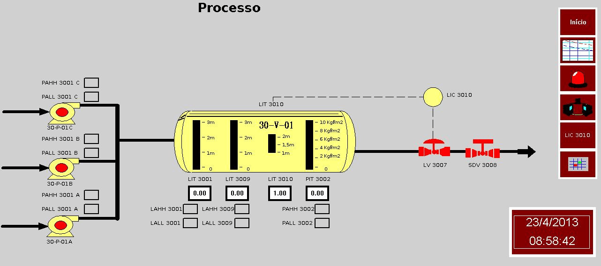
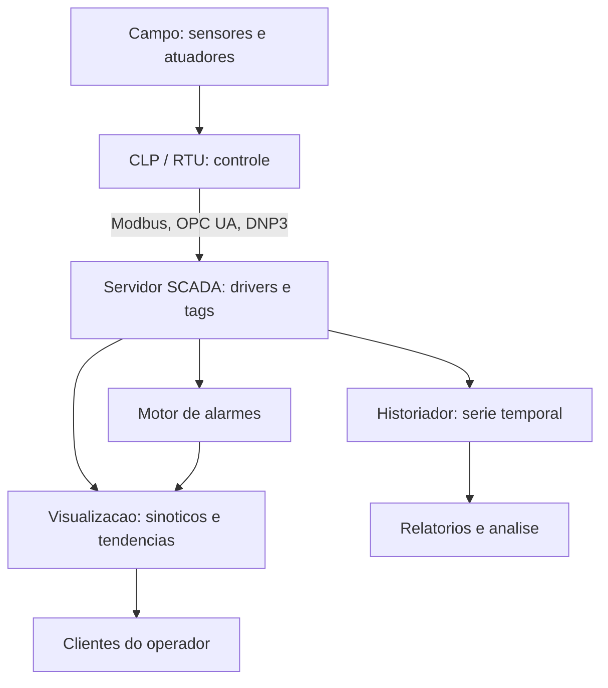
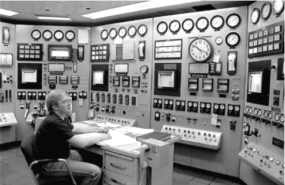
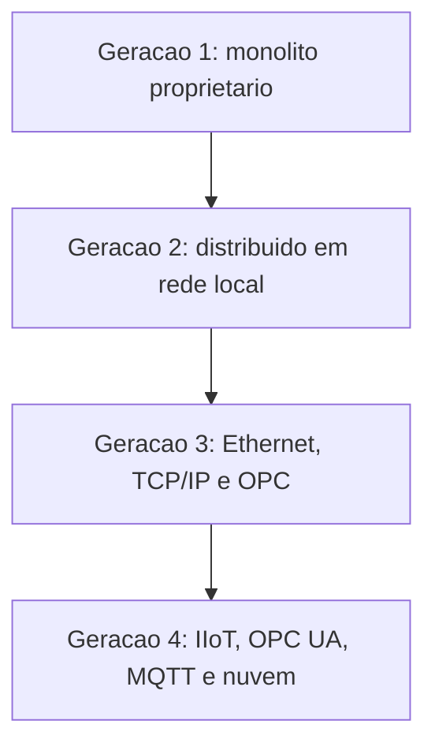

# Capítulo 3 – Sistemas Supervisórios — SCADA e HMI

## Objetivos de Aprendizagem

Ao final deste capítulo, o leitor será capaz de:

- Definir SCADA e distinguir suas funções principais.
- Diferenciar SCADA, DCS e HMI local, reconhecendo quando usar cada um.
- Identificar os principais softwares SCADA comerciais e open-source.
- Descrever a evolução do SCADA: das primeiras gerações ao Cloud SCADA.

---

## 3.1 O que é SCADA?

**SCADA** (*Supervisory Control and Data Acquisition* — Controle Supervisório e Aquisição de Dados) é um sistema de software e hardware que permite **monitorar e controlar remotamente processos industriais e infraestruturas críticas** a partir de uma central de operações.

O nome descreve bem suas funções essenciais:

- **Supervisory Control:** permite que operadores visualizem o estado do processo e intervenham quando necessário — ajustando setpoints, abrindo válvulas, desligando equipamentos.
- **Data Acquisition:** coleta continuamente dados dos equipamentos de campo (CLPs, RTUs, transmissores) e os armazena em banco de dados histórico.

> 📌 **Nota:** O SCADA **não realiza controle em malha fechada diretamente** na maioria das arquiteturas. Quem controla o processo em tempo real são os CLPs e DCSs no Nível 2. O SCADA supervisiona, centraliza e historiza — e intervém de forma supervisória quando necessário.

> **Fonte:** *Livro SCADA — versão para análise*, p. 51 (Machado, Pontes e Vianna, reproduzida com crédito).

A tela acima reúne os elementos que a ISA-101 trata como camada de operação: o sinótico do
processo à esquerda, a **barra de navegação** à direita (acesso a processo, tendência, alarmes e
visão geral), a data e a hora de referência no canto inferior e a indicação de estado de cada
equipamento sobre o próprio desenho. Repare que a quantidade de informação é deliberadamente
pequena: o detalhamento pertence aos níveis de tela seguintes, não à visão de área — princípio
desenvolvido no Capítulo 11.

---

## 3.2 Funções Principais de um SCADA

Um sistema SCADA moderno oferece as seguintes funções. Elas não são independentes: todas
dependem do mesmo conjunto de dados adquiridos do processo.

### 3.2.1 Aquisição de Dados

Coleta cíclica de variáveis analógicas (temperatura, pressão, vazão) e digitais (status de bombas, posição de válvulas, alarmes) a partir dos equipamentos de campo. A frequência de coleta pode variar de milissegundos a minutos, dependendo da criticidade da variável.

### 3.2.2 Visualização (HMI Centralizado)

Apresentação gráfica do processo em **sinóticos** animados, onde:
- Válvulas mudam de cor conforme seu estado (aberta/fechada).
- Tanques e reatores mostram nível preenchido dinamicamente.
- Valores numéricos atualizam em tempo real.
- Gráficos de tendência mostram a evolução da variável ao longo do tempo.

### 3.2.3 Gerenciamento de Alarmes

- Detecção automática de condições anormais (variável fora de faixa, falha de equipamento, perda de comunicação).
- Priorização de alarmes por criticidade (informativo, advertência, crítico, emergência).
- Registro de alarmes com timestamp, operador responsável e ação tomada.
- Relatórios de desempenho de alarmes (norma **EEMUA 191** e **ISA-18.2**).

> ⚠️ **Atenção:** Sistemas SCADA mal configurados podem gerar **inundação de alarmes** (*alarm flooding*) — situações em que centenas de alarmes disparam simultaneamente, dificultando a identificação da causa raiz. O gerenciamento racional de alarmes é uma disciplina de engenharia por si só.

### 3.2.4 Controle Supervisório

O operador pode enviar comandos ao processo através do SCADA:
- Alteração de setpoints de controladores PID.
- Abertura/fechamento de válvulas on/off.
- Partida e parada de motores.
- Execução de sequências de operação.

### 3.2.5 Historização

Armazenamento de séries temporais de dados de processo em banco de dados otimizado para esse fim. Permite:
- Análise de tendências históricas.
- Investigação de incidentes (reconstrução do evento).
- Relatórios de produção.
- Alimentação de sistemas de analytics e IA.

**Bancos de dados de processo populares:** OSIsoft PI System (agora AVEVA PI), Honeywell Uniformance, InfluxDB (open-source), TimescaleDB.

### 3.2.6 Relatórios

Geração automática de relatórios operacionais, de qualidade e de desempenho de equipamentos (OEE), em formatos PDF, Excel ou dashboards web.

> 🖼️ **[Figura 3.2 – Funções de um SCADA moderno]**
> *Diagrama circular ou de hexágonos com as seis funções: Aquisição de Dados, Visualização, Alarmes, Controle, Historização e Relatórios — com ícones representativos para cada uma. No centro, o logo ou nome do sistema SCADA.*

---

## 3.3 SCADA × DCS × HMI Local

Uma dúvida comum entre estudantes e profissionais é a diferença entre SCADA, DCS e HMI. A **Tabela 3.1** resume as principais distinções:

**Tabela 3.1 – Comparativo SCADA × DCS × HMI Local**

| Critério | HMI Local | SCADA | DCS |
|---|---|---|---|
| **Escopo** | Um equipamento ou célula | Planta inteira ou múltiplos sites | Processo contínuo integrado |
| **Localização** | Junto ao equipamento | Sala de controle centralizada | Sala de controle + campo |
| **Controle** | Visualização + comandos locais | Supervisório (via CLP/RTU) | Controle distribuído nativo |
| **Conectividade** | Serial, Ethernet | WAN, rádio, fibra, 4G | Rede proprietária de campo |
| **Histórico** | Limitado ou nenhum | Banco de dados de processo | Banco de dados integrado |
| **Redundância** | Geralmente sem | Servidores redundantes | Redundância total nativa |
| **Aplicação típica** | Máquina CNC, bomba, compressor | Oleoduto, ETAP, subestação | Refinaria, petroquímica, papel e celulose |
| **Custo relativo** | Baixo | Médio | Alto |

> 💡 **Dica:** Na prática moderna, as fronteiras entre SCADA e DCS estão se apagando. Sistemas como AVEVA System Platform e Honeywell Experion são, simultaneamente, SCADA e DCS — com controle nativo distribuído e supervisão centralizada na mesma plataforma.

---

## 3.4 Gerações do SCADA

A evolução do SCADA ocorreu em quatro gerações bem definidas:

**Geração 1 — Monolítico (anos 1970–1980)**
- Sistemas proprietários, sem conectividade entre sistemas.
- Hardware dedicado de cada fabricante (protocolos fechados).
- Computadores de grande porte (*mainframes*) ou minicomputadores.

**Geração 2 — Distribuído (anos 1980–1990)**
- Redes locais (LANs) conectam múltiplas estações de trabalho.
- Aparecimento dos primeiros padrões abertos (Modbus, RS-485).
- Servidores Unix e estações Sun Sparc.

**Geração 3 — Em Rede (anos 1990–2000)**
- Adoção da infraestrutura Ethernet e TCP/IP.
- OPC (OLE for Process Control) como padrão de integração.
- Interfaces gráficas Windows, banco de dados SQL.

**Geração 4 — IoT / Cloud SCADA (2010–presente)**
- Integração nativa com IIoT, MQTT, OPC UA.
- SCADA como serviço (SaaS) na nuvem.
- Acesso via navegador web e aplicativos móveis.
- Analytics, Machine Learning e IA embarcados.

> **Fonte:** *Livro SCADA — versão para análise*, p. 15 (fotografia de Solomon, 2005, adaptada pelos autores).

A cena corresponde à geração **anterior** ao SCADA: cada variável tem um mostrador dedicado
no painel e o histórico do processo existe apenas na pena do registrador. Substituir esse painel
por estações de supervisão reduziu o espaço físico da sala de controle e transferiu a informação
para um banco de dados único — a mudança que a Seção 3.4 descreve em quatro gerações.

Cada geração resolveu o problema da anterior e criou o seu próprio:

---

## 3.5 Principais Plataformas SCADA

### 3.5.1 Plataformas Comerciais

**AVEVA System Platform (ex-Wonderware)**
- Uma das plataformas mais difundidas globalmente.
- Arquitetura de objetos reutilizáveis (Application Server).
- Forte integração com o AVEVA PI System para historização.

**Ignition (Inductive Automation)**
- Licenciamento por servidor (não por tag), modelo altamente econômico.
- Baseado em Java, com designer web — sem instalação no cliente.
- Módulos para SCADA, IIoT (MQTT), MES e relatórios.
- Comunidade open-source ativa.

**Rockwell FactoryTalk View**
- Nativo do ecossistema Allen-Bradley/Rockwell Automation.
- Excelente integração com CLPs ControlLogix e CompactLogix.

**Siemens WinCC**
- Integrado ao TIA Portal.
- Versões para HMI local (WinCC flexible) e SCADA (WinCC SCADA / WinCC OA).

**Honeywell Experion PKS**
- Plataforma DCS+SCADA integrada para grandes processos contínuos.

### 3.5.2 Plataformas Open-Source e Gratuitas

| Plataforma | Características | Ideal para |
|---|---|---|
| **ScadaBR** | Brasileira, baseada em Java, suporte a Modbus/DNP3/SNMP | Projetos educacionais e PMEs |
| **OpenSCADA** | Linux-first, modular, suporte a SNMP e Modbus | Ambientes Linux industriais |
| **Node-RED** | Programação visual (flow-based), extensível, leve | IIoT, prototipagem, supervisão simples |
| **Grafana + InfluxDB** | Dashboard + banco de dados de série temporal | Visualização e analytics de dados históricos |

> 📌 **Nota:** O **ScadaBR** é especialmente relevante no contexto educacional brasileiro por ser open-source, em português e já ter sido utilizado em projetos de pesquisa em diversas universidades brasileiras. O Node-RED é detalhado no Capítulo 7.

---

## 3.6 Requisitos para Implantação de um SCADA

Ao especificar e implantar um sistema SCADA, os seguintes aspectos devem ser considerados:

**Tabela 3.2 – Checklist de especificação de um SCADA**

| Aspecto | Questões a Responder |
|---|---|
| **Escopo** | Quantos pontos (tags)? Quantos sites? |
| **Conectividade** | Quais protocolos os CLPs/RTUs usam? |
| **Disponibilidade** | É necessária redundância de servidores? |
| **Usuários** | Quantos clientes simultâneos? Acesso remoto? |
| **Histórico** | Quais variáveis historizar? Por quanto tempo? |
| **Alarmes** | Quantos alarmes? Notificação por email/SMS? |
| **Relatórios** | Quais relatórios são obrigatórios (regulatórios)? |
| **Segurança** | Controle de acesso por perfil de usuário? |
| **Integração** | Interface com MES/ERP? |
| **Normas** | IEC 62264, ISA-18.2, LGPD (dados de operadores)? |

---

## 3.7 Estudo de Caso — Migração de um SCADA de geração 3 para geração 4

**Cenário.** Distribuidora de água com 42 estações de bombeamento, elevatórias e reservatórios
distribuídos em quatro municípios. O SCADA atual é de geração 3: rodou sobre Windows Server
2003, com OPC DA e drivers proprietários de dois fabricantes de RTU. O sistema funciona — o
problema é que ninguém consegue mantê-lo.

**Sintomas que dispararam o projeto.**

- **Máquina virtual parada de atualizar** três anos, sem fornecedor para o sistema operacional.
- **Um engenheiro** na equipe domina o pacote antigo; as demais pessoas dependem dele.
- **Dados presos**: o historiador é proprietário e não aceita consulta externa, o que impede
  qualquer análise no Grafana ou no Excel.
- **Integração impossível**: o novo sistema corporativo de manutenção não fala OPC DA, e não há
  caminho para levar dados das RTUs até ele.

**Estratégia adotada — em camadas, não em big bang.**

| Etapa | Movimento | Efeito imediato |
|---|---|---|
| 1 | *Gateway* OPC UA na frente dos drivers antigos | Moderniza a interface sem tocar nas RTUs |
| 2 | Novo servidor SCADA em paralelo, com OPC UA | Operação continua no sistema antigo |
| 3 | Espelhamento do histórico para banco de séries temporais | Dados deixam de ficar presos |
| 4 | Migração de telas em blocos, por área | Cada área migra e é validada separadamente |
| 5 | Desligamento do sistema antigo, mantido em leitura por 6 meses | Saída reversível |

**O que observar no resultado.** A etapa 1 é a que destrava o projeto: um *gateway* de protocolo
converte o que existe **sem exigir substituição de campo**. É o padrão descrito na Seção 5.4 e
reaproveitado no Capítulo 13 — raramente a migração começa pelo equipamento mais caro.

**Limitações do arranjo.** O *gateway* é mais um ponto de falha e precisa de supervisão própria:
se ele para, o dado para, mesmo com CLP e rede em pleno funcionamento. Além disso, migrar telas em
blocos só funciona se as duas gerações coexistirem por um período — o que exige disciplina de
numeração de tags e de *timestamps* entre os dois ambientes.

---

## Resumo

- **SCADA** é um sistema de supervisão centralizada que combina aquisição de dados, visualização gráfica, gerenciamento de alarmes, controle supervisório e historização.
- **SCADA** difere do **DCS** (que controla diretamente o processo) e da **HMI local** (escopo restrito a um equipamento).
- O SCADA evoluiu em quatro gerações: de sistemas monolíticos proprietários (anos 70) a plataformas cloud-native com IIoT (hoje).
- Plataformas líderes incluem AVEVA, Ignition e Siemens WinCC; no segmento open-source, destacam-se ScadaBR e Node-RED.

---

## Questões de Revisão

**Conceituais:**

1. Expanda a sigla SCADA e explique o significado de cada palavra.
2. Quais são as seis funções principais de um sistema SCADA moderno? Descreva duas delas.
3. Qual é a diferença entre um sistema DCS e um SCADA? Em qual situação você escolheria um DCS em vez de um SCADA?

**Práticas:**

4. Uma distribuidora de água deseja implantar um sistema para monitorar remotamente 50 estações de bombeamento distribuídas em um município, com histórico de consumo, alarmes de falhas e acesso web para a equipe de manutenção. Qual tipo de sistema (HMI local, SCADA ou DCS) e qual plataforma você recomendaria? Justifique.
5. O que é "alarm flooding" e quais práticas de engenharia podem ser adotadas para evitá-lo?

**Desafio:**

6. Compare o modelo de licenciamento do SCADA Ignition (por servidor, tags ilimitados) com o modelo tradicional por número de tags (ex.: AVEVA). Quais são as vantagens e desvantagens de cada modelo para uma empresa que está expandindo sua operação?

---

## Referências

- BOYER, S. A. *SCADA: Supervisory Control and Data Acquisition*. 4. ed. ISA, 2010.
- ISA-18.2: *Management of Alarm Systems for the Process Industries*. ISA, 2016.
- EEMUA Publication 191: *Alarm Systems — A Guide to Design, Management and Procurement*. EEMUA, 2013.
- INDUCTIVE AUTOMATION. *Ignition SCADA Platform*. Disponível em: inductiveautomation.com.
- AVEVA. *System Platform Overview*. Disponível em: aveva.com.
- MACHADO, C. F. B.; PONTES, M. O.; VIANNA, W. S. *SCADA — Supervisory Control and Data
  Acquisition: sistemas de supervisão e aquisição de dados para automação*. (Material de origem desta
  apostila; figuras dos autores reproduzidas com crédito.)
