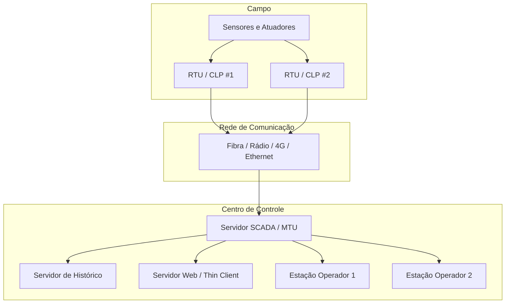
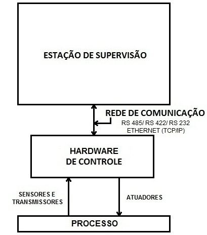
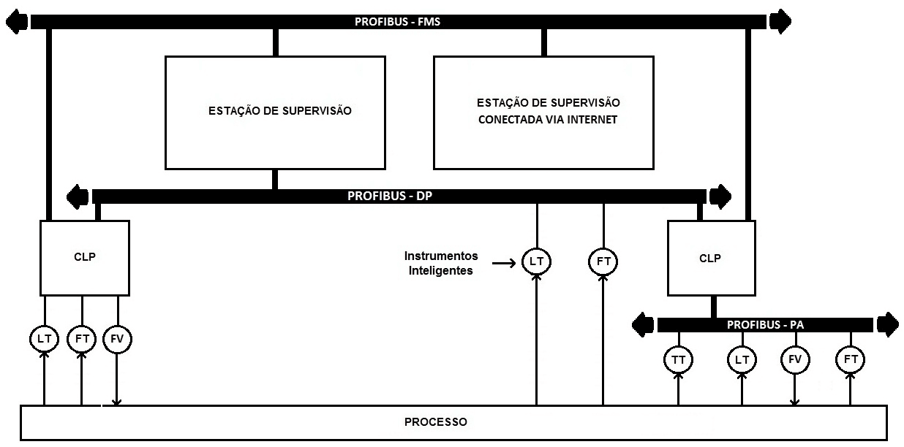
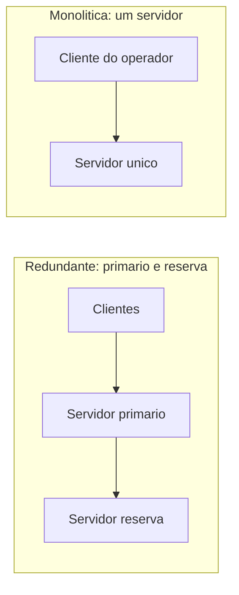
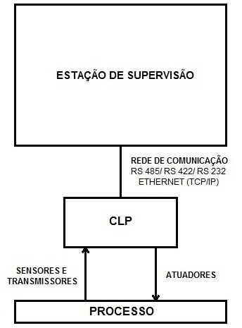
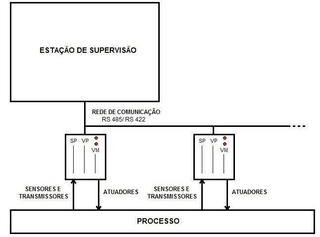
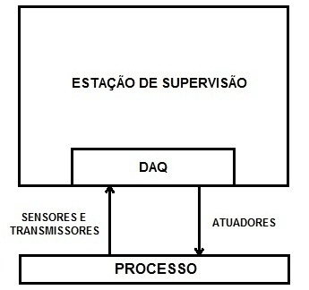
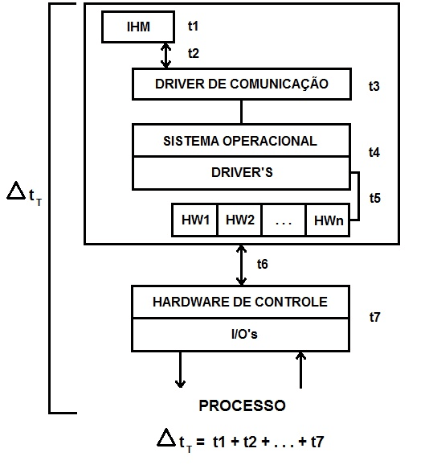

# Capítulo 4 – Arquitetura e Componentes de um Sistema SCADA

## Objetivos de Aprendizagem

Ao final deste capítulo, o leitor será capaz de:

- Identificar e descrever os componentes físicos e lógicos de uma arquitetura SCADA.
- Compreender as funções da MTU, RTU e servidor de dados.
- Distinguir arquiteturas monolíticas, distribuídas e redundantes.
- Dimensionar os elementos de uma arquitetura SCADA para um cenário típico.

---

## 4.1 Componentes de uma Arquitetura SCADA

Uma arquitetura SCADA típica é composta pelos seguintes elementos:

> **Fonte:** *Livro SCADA — versão para análise*, p. 22 (Machado, Pontes e Vianna, reproduzida com crédito).

A estação de supervisão comunica-se pelos meios RS-485, RS-422, RS-232 ou Ethernet e conversa
com o hardware de controle, que por sua vez lê sensores e transmissores e aciona os atuadores
sobre o processo.

---

## 4.2 RTU — Unidade Terminal Remota

A **RTU** (*Remote Terminal Unit*) é o dispositivo de campo responsável por:

1. **Coletar** dados dos sensores e instrumentos (entradas analógicas e digitais).
2. **Executar** lógicas de controle locais simples.
3. **Transmitir** os dados ao servidor central (MTU) via protocolo SCADA.
4. **Receber** comandos da MTU e aplicá-los aos atuadores.

### 4.2.1 Características Técnicas

| Parâmetro | Valores Típicos |
|---|---|
| Entradas analógicas | 4–64 canais, 4-20 mA / ±10 V |
| Entradas digitais | 8–256 pontos, 24 VCC / 120 VCA |
| Saídas analógicas | 2–16 canais, 4-20 mA |
| Saídas digitais | 4–64 relés ou transistores |
| Protocolos suportados | Modbus RTU/TCP, DNP3, IEC 60870-5-101/104 |
| Alimentação | 12–48 VCC (bateria + painel solar em campo remoto) |
| Temperatura operação | -40°C a +70°C |

### 4.2.2 RTU vs. CLP no Papel de RTU

Em instalações modernas, **CLPs de pequeno porte** frequentemente substituem RTUs tradicionais, pois oferecem maior capacidade de processamento e conectividade Ethernet nativa. A escolha entre RTU dedicada e CLP depende de:

- **Consumo energético:** RTUs consomem menos energia — essencial em locais com energia solar.
- **Robustez ambiental:** RTUs certificadas para ambientes extremos (offshore, subestações).
- **Custo:** CLPs de pequeno porte (ex.: Siemens S7-1200 Basic) são competitivos.

> 💡 **Dica:** Em aplicações de telemetria de água e saneamento, é comum encontrar RTUs com comunicação GPRS/4G incorporada, alimentadas por painel solar e bateria, operando sem intervenção por meses. Fabricantes como Advantech, Emerson (Bristol) e SEL atendem bem esse nicho.

---

## 4.3 MTU — Unidade Terminal Mestre

A **MTU** (*Master Terminal Unit*) é o **servidor central** do sistema SCADA. Suas funções:

- **Polling:** interroga periodicamente cada RTU/CLP para coletar dados.
- **Banco de dados em tempo real (RTDB):** mantém na memória o estado atual de todas as variáveis do sistema.
- **Processamento de alarmes:** avalia condições de alarme e notifica os operadores.
- **Registro de eventos:** armazena com timestamp cada mudança de estado e alarme.
- **Execução de controle supervisório:** processa os comandos dos operadores e os encaminha às RTUs.
- **Interface com clientes HMI:** serve dados às estações de operação e thin clients.

### 4.3.1 Redundância da MTU

Em sistemas críticos (energia elétrica, óleo e gás, água), a MTU opera em configuração **ativo-passivo** ou **ativo-ativo**:

- **Ativo-passivo:** Servidor primário em operação; o secundário sincroniza continuamente o banco de dados em tempo real. Em caso de falha, assume em segundos (failover).
- **Ativo-ativo:** Dois servidores processam dados simultaneamente; os clientes HMI recebem de ambos.

> 🖼️ **[Figura 4.2 – Configuração redundante de servidores SCADA]**
> *Diagrama mostrando dois servidores SCADA (Primário e Backup) conectados por link dedicado de sincronização. As RTUs de campo conectam-se aos dois servidores. Os clientes HMI recebem dados do servidor ativo. Seta pontilhada indicando o failover automático.*

---

## 4.4 Servidor de Historização (Historiador)

O **historiador de processo** é um banco de dados especializado em armazenar séries temporais de variáveis industriais com alta eficiência de compressão e acesso.

### 4.4.1 Por que não usar SQL convencional?

Bancos de dados relacionais (SQL Server, PostgreSQL) são inadequados para a escala de dados industriais:

- Uma planta com 10.000 tags coletados a cada segundo gera **864 milhões de registros por dia**.
- Bancos relacionais não comprimem séries temporais eficientemente.
- Queries de tendência histórica são lentas em SQL não otimizado para séries temporais.

### 4.4.2 Soluções de Historização

| Produto | Tipo | Empresa | Diferencial |
|---|---|---|---|
| **AVEVA PI System** | Comercial | AVEVA | Padrão da indústria de O&G; ecossistema amplo (PI Vision, PI AF) |
| **Honeywell Uniformance PHD** | Comercial | Honeywell | Integrado ao Experion |
| **InfluxDB** | Open-source | InfluxData | Alta performance; linha do tempo nativa; integração com Grafana |
| **TimescaleDB** | Open-source | Timescale | Extensão PostgreSQL para séries temporais |
| **Prometheus** | Open-source | CNCF | Focado em métricas de infraestrutura; integra com Grafana |

> 📌 **Nota:** O **AVEVA PI System** é o historiador mais utilizado na indústria de petróleo, gás e energia elétrica no Brasil e no mundo. Conhecer sua estrutura de atributos (PI AF — Asset Framework) é uma competência valorizada no mercado.

---

## 4.5 Estações de Operação e Thin Clients

As **estações de operação** são os computadores onde os operadores monitoram o processo e executam comandos. Podem ser:

- **Fat clients (clientes completos):** PC com software SCADA instalado — alto desempenho, menor dependência de rede.
- **Thin clients:** estações sem disco local que executam a interface SCADA a partir de um servidor (Terminal Server ou Citrix). Mais fáceis de manter e atualizar.
- **Web clients:** acesso via navegador (Chrome, Edge) sem instalação. Tendência predominante em plataformas modernas como Ignition.
- **Mobile clients:** aplicativos iOS/Android para supervisão em campo ou acesso remoto.

---

## 4.6 Infraestrutura de Comunicação

A rede de comunicação é o sistema circulatório do SCADA. Suas características determinam a confiabilidade e o desempenho do sistema.

### 4.6.1 Meios Físicos

| Meio | Vantagem | Limitação | Aplicação |
|---|---|---|---|
| **Fibra ótica** | Alta velocidade, imune a EMI | Custo de instalação | Redes industriais críticas |
| **Ethernet par trançado** | Baixo custo, fácil instalação | Distância ~100 m | Ambiente de controle local |
| **Rádio UHF/VHF** | Sem infraestrutura física | Sujeito a interferência | Áreas remotas sem cabeamento |
| **4G/5G** | Cobertura ampla, fácil implantação | Custo recorrente, latência variável | RTUs remotas, telemetria |
| **Satélite** | Cobertura global | Alta latência, custo elevado | Offshore, locais sem cobertura celular |

### 4.6.2 Topologias de Rede

> **Fonte:** *Livro SCADA — versão para análise*, p. 30 (Machado, Pontes e Vianna, reproduzida com crédito).

Observe a topologia em barramento nos dois níveis: PROFIBUS DP entre CLPs e instrumentos,
PROFIBUS PA no nível dos transmissores, e uma estação de supervisão que também é alcançada
pela rede corporativa.

> ⚠️ **Atualização tecnológica:** o próprio material de origem anota, na página da figura, que
> ela **seria alterada**: na prática, o PROFIBUS DP passou a ser substituído por **Ethernet**
> industrial (PROFINET ou EtherNet/IP) no nível de controle, e o PROFIBUS FMS foi descontinuado.
> O barramento PROFIBUS permanece relevante onde já está instalado — sobretudo na camada de
> instrumentação (PROFIBUS PA) —, não como escolha para projetos novos. A figura é mantida como
> registro de uma arquitetura real de campo, e não como recomendação de projeto.

---

## 4.7 Comparativo de Arquiteturas SCADA

A escolha da arquitetura é uma decisão de engenharia de disponibilidade: quanto mais crítico o
processo, mais a redundância deixa de ser opcional.

**Tabela 4.1 – Arquiteturas SCADA e suas características**

| Arquitetura | Descrição | Vantagens | Desvantagens | Indicada para |
|---|---|---|---|---|
| **Monolítica** | Um único servidor SCADA | Simples, baixo custo | Ponto único de falha | Pequenas plantas, projetos piloto |
| **Cliente-Servidor** | Servidor central + múltiplos clientes | Escalável, acesso multiusuário | Exige rede confiável | Plantas médias e grandes |
| **Distribuída** | Múltiplos servidores por área ou site | Falha isolada por área | Mais complexa de integrar | Múltiplos sites |
| **Redundante** | Servidor primário + backup automático | Alta disponibilidade (HA) | Custo dobrado | Infraestruturas críticas |
| **Cloud SCADA** | Servidor hospedado na nuvem | Acesso global, sem hardware local | Latência, segurança de dados | Supervisão distribuída, SaaS |

As três variantes abaixo são as arquiteturas históricas que a tabela resume: com CLP, com
controladores dedicados e com sistema de aquisição de dados. Elas continuam aparecendo em campo,
mesmo quando o CLP é a escolha padrão.

> **Fonte:** *Livro SCADA — versão para análise*, p. 26 (Machado, Pontes e Vianna, reproduzida com crédito).

Com o CLP, o controle fica concentrado no controlador e a supervisão deixa de conversar
diretamente com os instrumentos: ela fala com o CLP pela rede de comunicação.

> **Fonte:** *Livro SCADA — versão para análise*, p. 27 (Machado, Pontes e Vianna, reproduzida com crédito).

Cada controlador dedicado fecha uma ou mais malhas, e a supervisão lê e escreve setpoints
sobre o barramento RS-485.

> **Fonte:** *Livro SCADA — versão para análise*, p. 28 (Machado, Pontes e Vianna, reproduzida com crédito).

No DAQ não há controle pelo sistema supervisório: ele apenas adquire, apresenta e registra.

> **Fonte:** *Livro SCADA — versão para análise*, p. 33 (Machado, Pontes e Vianna, reproduzida com crédito).

O tempo total de resposta é a soma das parcelas: interface homem-máquina, driver de comunicação,
sistema operacional, hardware de controle e E/S. É por isso que o tempo medido na tela nunca é
igual ao tempo de varredura do CLP.

---

## 4.8 Estudo de Caso — SCADA para Sistema de Abastecimento de Água

**Contexto:** Uma companhia de saneamento opera 35 estações de bombeamento distribuídas em uma cidade de médio porte, com distâncias de até 80 km do centro de controle.

**Desafio:** Monitorar em tempo real nível dos reservatórios, pressão nas redes de distribuição e status das bombas; detectar vazamentos; gerar relatórios de consumo para a concessionária reguladora.

**Solução adotada:**

- **Campo:** RTUs alimentadas por energia solar + bateria, com medidores de vazão eletromagnéticos, transmissores de pressão e nível ultrassônico.
- **Comunicação:** Link 4G (operadora) com VPN criptografada; backup via rádio UHF para estações críticas.
- **SCADA:** Servidor central com ScadaBR (open-source) + módulo de relatórios. Interface web para acesso da equipe de operação e manutenção via tablets.
- **Histórico:** InfluxDB para séries temporais + Grafana para dashboards de consumo e OEE das bombas.

**Resultados:** redução de 35% nas perdas comerciais (detecção de vazamentos), tempo médio de resposta a falhas caiu de 4 horas para 25 minutos.

> 🖼️ **[Figura 4.8 – Arquitetura do SCADA de saneamento]**
> *Diagrama da arquitetura completa do estudo de caso: mapa geográfico esquemático da cidade com as 35 estações; link 4G até o centro de controle; servidor SCADA, InfluxDB e Grafana; estações de operação e acesso mobile.*

---

## Resumo

- A arquitetura SCADA é composta por RTUs de campo, infraestrutura de comunicação, MTU (servidor central), historiador e estações de operação.
- **RTUs** coletam dados do campo; a **MTU** centraliza, processa e distribui para os clientes.
- O **historiador de processo** armazena séries temporais; soluções modernas como InfluxDB são alternativas open-source ao AVEVA PI.
- A arquitetura deve ser dimensionada conforme criticidade: desde monolítica (simples) até redundante com failover automático (infraestruturas críticas).
- A comunicação pode usar fibra, Ethernet, rádio ou 4G — cada meio com trade-offs de custo, velocidade e confiabilidade.

---

## Questões de Revisão

**Conceituais:**

1. Qual é a diferença entre MTU e RTU em um sistema SCADA?
2. Por que bancos de dados relacionais convencionais são inadequados para historização de dados de processo industrial?
3. Quais são as diferenças entre as arquiteturas SCADA cliente-servidor e cloud SCADA?

**Práticas:**

4. Uma planta petroquímica opera 24 horas por dia, 7 dias por semana, com zero tolerância a paradas não programadas do sistema de supervisão. Qual arquitetura SCADA você recomendaria? Descreva os componentes de redundância necessários.
5. Para um sistema com 500 RTUs coletando 20 variáveis cada uma, a cada 10 segundos, calcule o volume de dados históricos gerado por dia e por ano. Qual solução de historização você escolheria?

**Desafio:**

6. Projete uma arquitetura SCADA para uma fazenda com 10 pivôs de irrigação localizados em área sem cobertura de fibra. Defina: meios de comunicação, equipamento de campo, servidor e interface de supervisão.

---

## Referências

- BOYER, S. A. *SCADA: Supervisory Control and Data Acquisition*. 4. ed. ISA, 2010.
- INFLUXDATA. *InfluxDB Documentation*. Disponível em: docs.influxdata.com.
- AVEVA. *PI System Overview*. Disponível em: aveva.com/en/products/pi-system/.
- IEC 60870-5: *Telecontrol Equipment and Systems*. IEC, 2006.
- MACHADO, C. F. B.; PONTES, M. O.; VIANNA, W. S. *SCADA — Supervisory Control and Data
  Acquisition: sistemas de supervisão e aquisição de dados para automação*. (Material de origem desta
  apostila; figuras das arquiteturas dos autores, reproduzidas com crédito.)
