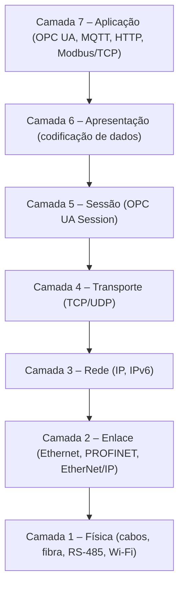
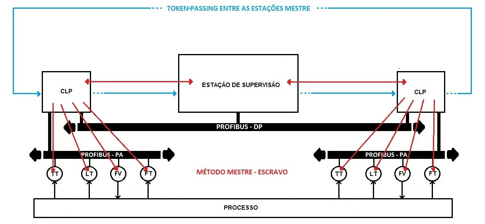
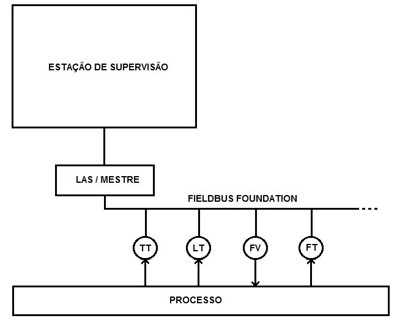
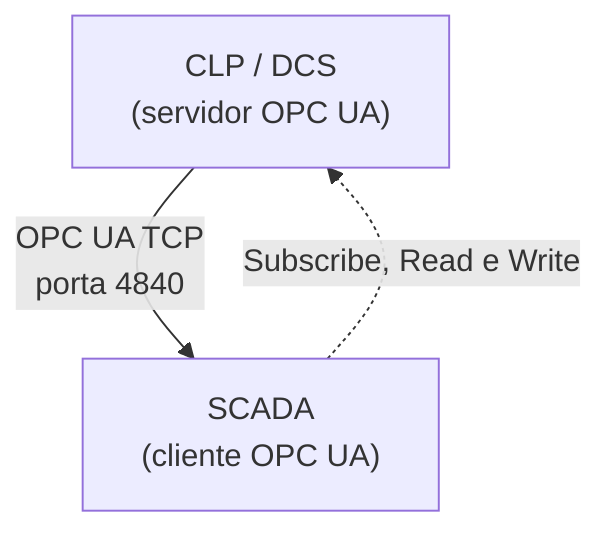
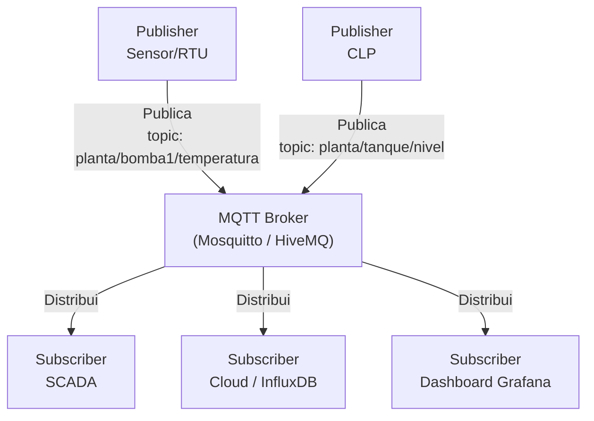
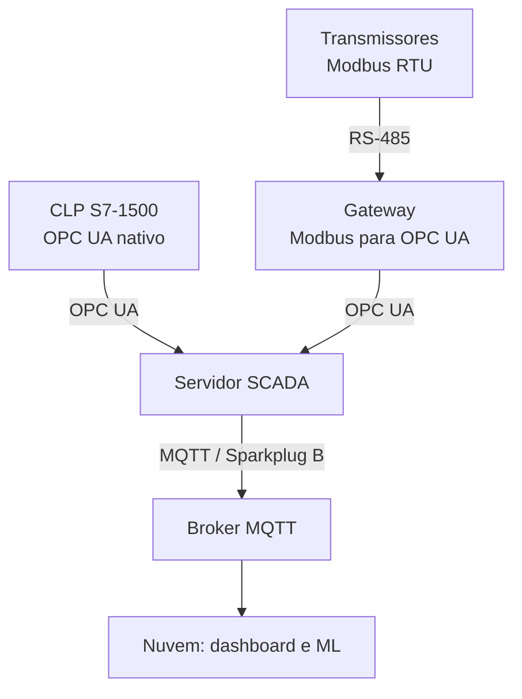
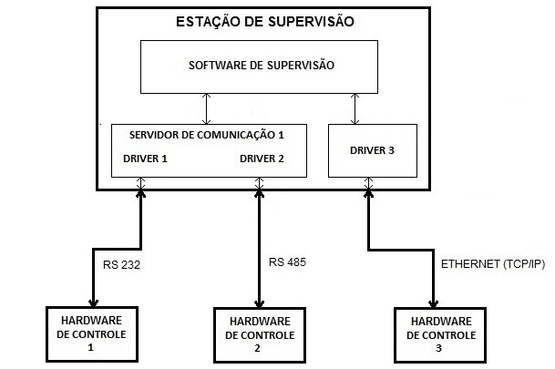

# Capítulo 5 – Redes e Protocolos de Comunicação Industrial

## Objetivos de Aprendizagem

Ao final deste capítulo, o leitor será capaz de:

- Identificar os principais protocolos de comunicação industrial e suas características.
- Distinguir protocolos clássicos (Modbus, Profibus) de protocolos modernos (OPC UA, MQTT).
- Compreender o papel de cada protocolo na arquitetura de um sistema SCADA.
- Aplicar critérios técnicos para seleção de protocolo em projetos de automação.

---

## 5.1 Redes Industriais versus Redes Corporativas

As redes industriais possuem requisitos distintos das redes corporativas de TI:

**Tabela 5.1 – Comparativo: Rede Corporativa × Rede Industrial**

| Critério | Rede Corporativa (TI) | Rede Industrial (OT) |
|---|---|---|
| Prioridade | Confidencialidade, disponibilidade | Determinismo, tempo real |
| Latência | Tolerável (ms a s) | Crítica (µs a ms) |
| Disponibilidade | Alta (99,9%) | Muito alta (99,999%) |
| Equipamentos | PCs, servidores, switches | CLPs, RTUs, inversores, sensores |
| Ambiente | Sala climatizada | Calor, vibração, poeira, EMI |
| Ciclo de vida | 3–5 anos | 10–30 anos |
| Atualização | Frequente | Raramente (risco de parada) |

> ⚠️ **Atenção:** A convergência TI/OT é inevitável com o IIoT, mas deve ser feita com cuidado. Trazer protocolos e infraestrutura de TI (ex.: Wi-Fi público, VLAN sem segmentação) para o ambiente OT sem as devidas proteções é a principal causa de incidentes de segurança industrial. Ver Capítulo 8.

---

## 5.2 Modelo OSI Aplicado à Automação

O modelo **OSI** (*Open Systems Interconnection*) de 7 camadas é frequentemente referenciado para classificar os protocolos industriais:

> 🖼️ **[Figura 5.1 – Protocolos industriais mapeados no modelo OSI]**
> *Diagrama de 7 camadas OSI com protocolos industriais posicionados nas camadas correspondentes. Destacar: Modbus RTU (camadas 1-2), Modbus TCP (completo), OPC UA (7), MQTT (7), Profibus (1-2-7), PROFINET (1-2-7).*

---

## 5.3 Protocolos Clássicos

### 5.3.1 Modbus

O **Modbus** foi criado pela Modicon em 1979 e é um dos protocolos mais simples e amplamente suportados no mundo. Sua popularidade se deve à especificação aberta, gratuita e fácil de implementar.

**Variantes:**
- **Modbus RTU:** comunicação serial (RS-232 ou RS-485), codificação binária compacta. Máximo de 247 escravos por barramento RS-485.
- **Modbus ASCII:** comunicação serial, codificação hexadecimal. Raramente usado hoje.
- **Modbus TCP/IP:** encapsula o Modbus RTU sobre TCP, na porta 502. Permite comunicação via Ethernet com distâncias ilimitadas.

**Modelo de dados Modbus:**

| Área | Tipo | Acesso | Exemplo |
|---|---|---|---|
| Coils (0x) | Bit | Leitura/Escrita | Status de válvula, partida de motor |
| Discrete Inputs (1x) | Bit | Somente Leitura | Estado de botoeira, fim de curso |
| Holding Registers (4x) | Word 16 bits | Leitura/Escrita | Setpoint de temperatura, referência de velocidade |
| Input Registers (3x) | Word 16 bits | Somente Leitura | Valor de temperatura, corrente de motor |

> 💡 **Dica:** Para representar valores de ponto flutuante (ex.: 25,4°C) em Modbus, utiliza-se 2 registradores consecutivos de 16 bits no formato **IEEE 754** (32 bits). A ordem dos bytes (*byte order* ou *endianness*) varia por fabricante — sempre verifique na documentação do equipamento.

> **Fonte:** *Livro SCADA — versão para análise*, p. 31 (Machado, Pontes e Vianna, reproduzida com crédito).

No método **mestre-escravo**, o mestre conduz a comunicação e cada instrumento responde quando
interrogado — é o modelo do Modbus RTU. No **token passing**, o direito de transmitir circula entre
as estações mestre por um quadro especial, o que evita colisão sem precisar de um mestre único.

### 5.3.2 Profibus

O **Profibus** (*Process Field Bus*) foi desenvolvido na Alemanha em 1987 e tornou-se o protocolo de fieldbus mais utilizado na Europa para automação discreta e de processo.

**Variantes:**
- **Profibus DP** (*Decentralized Peripherals*): otimizado para comunicação rápida com CLPs e módulos de I/O distribuído. Velocidades até 12 Mbps.
- **Profibus PA** (*Process Automation*): para instrumentação de processo em zonas de risco (alimentação e comunicação pelo mesmo par de fios — barramento intrínseco).

**Limitações:** padrão aberto e publicado (séries IEC 61158/61784), mas com certificação obrigatória
para conformidade; não trafega nativamente sobre IP — a evolução sobre Ethernet é o **PROFINET**;
e o diagnóstico é menos imediato que o de uma rede IP.

### 5.3.3 DNP3

O **DNP3** (*Distributed Network Protocol 3*) foi desenvolvido para sistemas SCADA de infraestrutura crítica — energia elétrica, água, óleo e gás. Características:

- Comunicação assíncrona: RTU reporta espontaneamente ao mestre quando uma variável muda (*unsolicited response*) — diferente do polling periódico do Modbus.
- Suporte a **time-stamping** preciso nos eventos — crucial para análise de incidentes em subestações.
- Suporte a comunicação com integridade de dados e autenticação (DNP3 Secure Authentication v5).
- Norma IEEE Std 1815-2012.

### 5.3.4 Foundation Fieldbus

O **Foundation Fieldbus** (FF) leva a lógica de controle para dentro do próprio barramento: os
instrumentos são inteligentes, comunicam-se entre si e podem executar blocos de controle sem
passar pelo CLP. Como não existe um mestre único, o direito de uso do meio é arbitrado pelo
**LAS** (*Link Active Scheduler*), que distribui as janelas de tempo entre as estações.

> **Fonte:** *Livro SCADA — versão para análise*, p. 29 (Machado, Pontes e Vianna, reproduzida com crédito).

O LAS **não** é um mestre no sentido do Modbus: ele agenda *quando* cada dispositivo pode falar,
e outro instrumento habilitado pode assumir a função de LAS ativo se o original falhar. Os
transmissores da figura (TT, LT, FV, FT) ligam-se ao mesmo par que os alimenta — característica
que viabiliza o uso do FF em áreas classificadas, onde a alimentação intrinsecamente segura e a
comunicação precisam compartilhar o cabo.

---

## 5.4 Protocolos Modernos

### 5.4.1 OPC e OPC UA

O **OPC** (*OLE for Process Control*) surgiu em 1996 como padrão de interoperabilidade entre softwares SCADA e CLPs no ambiente Windows. O problema: dependia fortemente de tecnologia Microsoft COM/DCOM, limitando seu uso a redes Windows.

O **OPC UA** (*Unified Architecture*), lançado em 2008 pela OPC Foundation, resolve essas limitações:

- **Plataforma-independente:** funciona em Linux, embarcados, CLPs modernos — não mais dependente de Windows.
- **Modelo de informação orientado a objetos:** dados são expostos como objetos com tipos, métodos e eventos — muito mais rico que endereços de registradores.
- **Segurança nativa:** TLS/SSL e assinatura de certificados embutidos no protocolo.
- **Transporte flexível:** TCP binário (eficiente) ou HTTPS/WebSocket (firewall-friendly).
- **Publisher-Subscriber:** adicionado no OPC UA Pub/Sub, permitindo comunicação via MQTT ou UDP multicast — integração nativa com IIoT.

> 🖼️ **[Figura 5.4 – Arquitetura OPC UA: servidor no CLP, cliente no SCADA]**
> *Diagrama mostrando CLP com OPC UA Server integrado, conectado via rede Ethernet ao servidor SCADA (OPC UA Client). Indicar as operações: Read, Write, Subscribe, Browse. Destacar o certificado de segurança na conexão.*

> 📌 **Nota:** O OPC UA é hoje o protocolo preferido para integração SCADA-CLP em novos projetos. Todos os grandes fabricantes de CLP (Siemens, Rockwell, Beckhoff, Schneider) oferecem servidores OPC UA nativos em seus equipamentos.

### 5.4.2 MQTT

O **MQTT** (*Message Queuing Telemetry Transport*) foi criado em 1999 pela IBM para telemetria em oleodutos via satélite — com requisitos de baixo consumo de banda. Hoje é o protocolo dominante para IIoT.

**Arquitetura Publish-Subscribe:**

> 🖼️ **[Figura 5.5 – Modelo Publish-Subscribe do MQTT]**
> *Diagrama colorido mostrando múltiplos publishers (CLPs, sensores IIoT, edge gateways) publicando em um broker central (mosquitto). Múltiplos subscribers (SCADA, banco de dados, dashboards, mobile app) recebendo dados por tópicos. Destacar a escalabilidade horizontal.*

**Características técnicas:**
- Leve: overhead mínimo (cabeçalho de 2 bytes) — ideal para dispositivos com memória e banda limitadas.
- **QoS** (*Quality of Service*): 3 níveis: 0 (at-most-once), 1 (at-least-once), 2 (exactly-once).
- **Retained messages:** o broker armazena o último valor de cada tópico; novos subscribers recebem imediatamente.
- **Last Will and Testament (LWT):** mensagem publicada automaticamente se o cliente desconectar inesperadamente — mecanismo de detecção de falha.
- Porta padrão: 1883 (TCP) ou 8883 (TLS).
- **Sparkplug B:** especificação sobre MQTT com esquema de dados padronizado para IIoT industrial — define payloads, timestamps e gerenciamento de sessão.

**Brokers MQTT populares:**
- **Mosquitto** (Eclipse Foundation) — open-source, leve, amplamente usado.
- **HiveMQ** — enterprise, alta escalabilidade, clustering.
- **EMQX** — alta performance, suporte a MQTT 5.0.
- **AWS IoT Core, Azure IoT Hub** — brokers gerenciados na nuvem.

### 5.4.3 PROFINET

O **PROFINET** é o sucessor do Profibus para redes Ethernet industrial, desenvolvido pela Siemens e padronizado pela PI (PROFIBUS & PROFINET International).

- **PROFINET RT** (*Real-Time*): para I/O distribuído — ciclos de 1–4 ms.
- **PROFINET IRT** (*Isochronous Real-Time*): para motion control — ciclos de 250 µs com sincronismo de relógio.
- Compatível com infraestrutura Ethernet padrão (switches, cabos Cat5e/6).

### 5.4.4 EtherNet/IP

O **EtherNet/IP** (*Ethernet Industrial Protocol*) é o protocolo da Rockwell Automation e ODVA para automação discreta. Usa o protocolo CIP (*Common Industrial Protocol*) encapsulado em TCP/UDP/IP. Muito utilizado no ecossistema Allen-Bradley.

---

## 5.5 Comparativo de Protocolos

**Tabela 5.2 – Principais protocolos industriais: comparativo**

| Protocolo | Camada Física | Topologia | Velocidade | Segurança | Aplicação Principal |
|---|---|---|---|---|---|
| Modbus RTU | RS-485 | Barramento | 9,6k–115,2 kbps | Nenhuma nativa | CLP ↔ instrumento |
| Modbus TCP | Ethernet | Estrela/Anel | 10/100 Mbps | Opcional (TLS) | CLP ↔ SCADA |
| Profibus DP | RS-485 | Barramento | até 12 Mbps | Nenhuma | Automação discreta EU |
| DNP3 | Serial / TCP | Barramento / Estrela | variável | SAv5 opcional | SCADA energia/água |
| OPC DA | Ethernet (DCOM) | Estrela | variável | Windows DCOM | SCADA legado Windows |
| **OPC UA** | Ethernet / qualquer | Qualquer | variável | TLS + certificado | SCADA moderno, IIoT |
| **MQTT** | Ethernet / 4G / Wi-Fi | Pub/Sub (broker) | variável | TLS opcional | IIoT, telemetria, cloud |
| PROFINET | Ethernet | Estrela/Anel | 100 Mbps | Opcional | I/O distribuído Siemens |
| EtherNet/IP | Ethernet | Estrela | 100 Mbps / 1 Gbps | CIPsecurity | I/O Rockwell/AB |

---

## 5.6 Estudo de Caso — Integração Modbus + OPC UA + MQTT

**Contexto:** Uma planta química possui CLPs Siemens S7-1500 (OPC UA nativo) e instrumentos de campo com Modbus RTU (transmissores antigos sem Ethernet).

**Solução de integração:**

> **Fonte:** *Livro SCADA — versão para análise*, p. 25 (Machado, Pontes e Vianna, reproduzida com crédito).

O software de supervisão não fala "Modbus" nem "PROFIBUS": ele conversa com **drivers**. Na
figura, três hardwares de controle com interfaces distintas (RS-232, RS-485 e Ethernet) chegam à
mesma estação de supervisão por dois caminhos — dois deles compartilham um servidor de comunicação
com dois drivers, e o terceiro exige um driver independente, o que obriga o supervisório a manter
**dois links lógicos**. É por isso que o esforço de integração se mede pelo número de links e não
pelo número de equipamentos.

**Gateways de protocolo populares:** Moxa MGate (Modbus→OPC UA), Kepware (OPC UA para praticamente qualquer protocolo), Ignition OPC UA Module, Prosys OPC UA.

---

## Resumo

- Redes industriais priorizam **determinismo e disponibilidade**; redes corporativas priorizam **largura de banda e confidencialidade**.
- **Modbus** (1979) é o protocolo mais simples e difundido; ainda amplamente utilizado em instrumentação.
- **DNP3** é o padrão para SCADA de infraestrutura crítica (energia, água).
- **OPC UA** é o protocolo preferido para integração moderna SCADA-CLP, com segurança nativa e modelo de informação rico.
- **MQTT** domina o IIoT: leve, escalável, arquitetura pub/sub com broker central.
- A integração multiprotocolo via gateways e OPC UA é a realidade de plantas industriais com equipamentos de diferentes gerações.

---

## Questões de Revisão

**Conceituais:**

1. Quais são as principais diferenças entre o Modbus RTU e o Modbus TCP?
2. Por que o OPC UA substituiu o OPC DA como padrão de interoperabilidade? Liste três vantagens do OPC UA.
3. Explique a arquitetura Publish-Subscribe do MQTT. Qual é o papel do broker?

**Práticas:**

4. Um inversor de frequência WEG CFW-11 e um transmissor de temperatura Endress+Hauser iTEMP TMT série são conectados via Modbus RTU a um CLP. O SCADA precisa ler a temperatura e a frequência de saída do inversor. Quantos registradores Modbus serão lidos (aproximadamente)? Qual é o endereço da função de leitura?
5. Cite três critérios que influenciam a escolha entre OPC UA e MQTT para a comunicação entre um CLP e um sistema SCADA.

**Desafio:**

6. Um operador de rede elétrica precisa integrar 200 subestações distribuídas em um estado. Cada subestação possui equipamentos com DNP3 e IEC 61850. Proponha uma arquitetura de comunicação, justificando a escolha dos protocolos em cada camada.

---

## Referências

- MODBUS ORGANIZATION. *Modbus Application Protocol Specification V1.1b3*. Disponível em: modbus.org.
- OPC FOUNDATION. *OPC Unified Architecture Specification*. Disponível em: opcfoundation.org.
- OASIS. *MQTT Version 5.0 Specification*. Disponível em: docs.oasis-open.org.
- IEEE Std 1815-2012: *IEEE Standard for Electric Power Systems Communications — DNP3*.
- PI (PROFIBUS & PROFINET International). *PROFINET System Description*. Disponível em: profibus.com.
- MACHADO, C. F. B.; PONTES, M. O.; VIANNA, W. S. *SCADA — Supervisory Control and Data
  Acquisition: sistemas de supervisão e aquisição de dados para automação*. (Material de origem desta
  apostila; figuras dos autores reproduzidas com crédito.)
