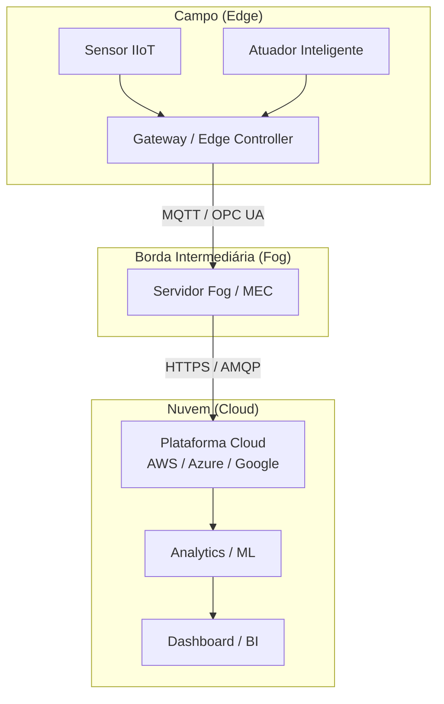
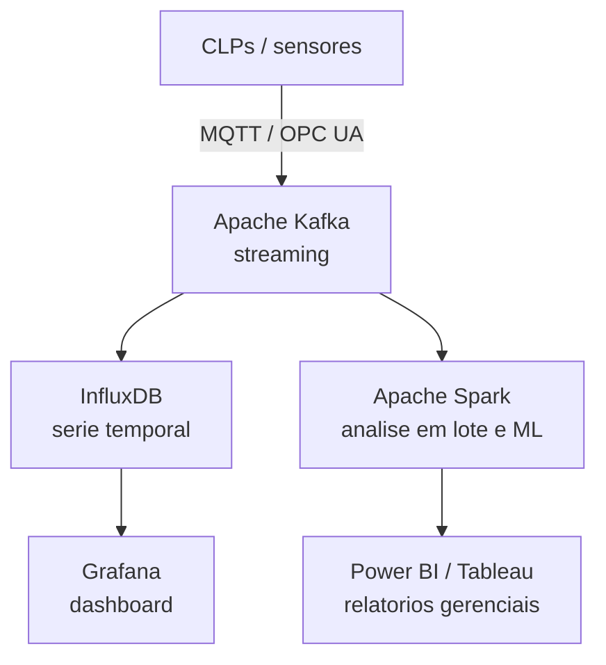

# Capítulo 6 – IIoT e Tecnologias Emergentes

## Objetivos de Aprendizagem

Ao final deste capítulo, o leitor será capaz de:

- Distinguir IoT de IIoT e compreender seus requisitos industriais específicos.
- Descrever as arquiteturas de Edge, Fog e Cloud Computing e seu papel na automação.
- Compreender o conceito de Digital Twin e suas aplicações industriais.
- Identificar ferramentas de análise de dados industriais (Grafana, InfluxDB, Kafka).

---

## 6.1 IoT versus IIoT

A **IoT** (*Internet of Things* — Internet das Coisas) é o paradigma em que objetos físicos são conectados à internet, coletando e trocando dados. Aplicações populares: termostatos inteligentes, câmeras de segurança, rastreadores de fitness.

O **IIoT** (*Industrial Internet of Things* — Internet Industrial das Coisas) aplica esses conceitos ao ambiente industrial, mas com requisitos muito mais rigorosos:

**Tabela 6.1 – IoT × IIoT: principais diferenças**

| Critério | IoT (Consumidor) | IIoT (Industrial) |
|---|---|---|
| **Confiabilidade** | Tolerável falha ocasional | Falha pode causar acidente ou parada de planta |
| **Latência** | Segundos a minutos | Milissegundos a segundos |
| **Ciclo de vida** | 3–5 anos | 15–30 anos |
| **Ambiente** | Ambientes domésticos | Calor, vibração, poeira, EMI, atmosfera explosiva |
| **Segurança** | Importante | Crítica — sistemas de segurança funcional |
| **Integração** | App + nuvem | CLP + SCADA + MES + ERP |
| **Protocolos** | HTTP, CoAP, MQTT, BLE | MQTT, OPC UA, Modbus, DNP3, Sparkplug B |
| **Normas** | ETSI, IEEE | IEC 62443, ISA-99, IEC 61508 |

> 🖼️ **[Figura 6.1 – IoT versus IIoT: ambientes e requisitos]**
> *Duas ilustrações lado a lado: (esquerda) casa inteligente com dispositivos IoT consumidor (termostato, lâmpada, câmera, smartwatch); (direita) planta industrial com sensores IIoT, gateway de borda, CLP e servidor SCADA. Destacar os requisitos distintos: segurança, latência, robustez.*

---

## 6.2 Arquitetura IIoT: Edge, Fog e Cloud

A arquitetura IIoT é tipicamente organizada em três camadas:

> 🖼️ **[Figura 6.2 – Arquitetura IIoT em três camadas: Edge, Fog e Cloud]**
> *Diagrama em camadas horizontais com ícones: campo industrial (sensores, CLPs, RTUs) na base; gateway/edge controller no meio; e a nuvem no topo com plataformas AWS IoT, Azure IoT Hub e ferramentas de analytics. Indicar os protocolos em cada enlace.*

### 6.2.1 Edge Computing

O **Edge Computing** (computação na borda) leva o processamento o mais próximo possível da fonte de dados — no próprio equipamento ou em um gateway de campo.

**Por que processar na borda?**
- **Latência:** ações de controle críticas não podem esperar a nuvem (viagem de ida e volta ~100 ms).
- **Largura de banda:** pré-processar e filtrar dados na borda reduz drasticamente o volume a ser transmitido à nuvem.
- **Operação offline:** o sistema continua funcionando mesmo sem conectividade com a nuvem.
- **Privacidade:** dados sensíveis de produção não precisam sair da planta.

**Exemplos de edge devices:**
- **Gateways industriais:** Moxa UC-8100, Advantech UNO-2372G, Siemens SIMATIC IPC.
- **Edge controllers:** PLCnext (Phoenix Contact), Bedrock Automation, Beckhoff C6015.
- **Microprocessadores embarcados:** Raspberry Pi (prototipagem), NVIDIA Jetson (IA na borda).

> 💡 **Dica:** O **AWS IoT Greengrass** e o **Azure IoT Edge** são plataformas de software que transformam um gateway industrial em um nó de computação inteligente — executando funções Lambda/containers localmente, com sincronização automática com a nuvem quando conectado.

### 6.2.2 Fog Computing

O **Fog Computing** adiciona uma camada intermediária entre o edge e a nuvem — geralmente um servidor instalado na subestação, sala de controle da planta ou datacenter de borda (*MEC — Mobile Edge Computing*).

**Funções do Fog:**
- Agregação de dados de múltiplos gateways de campo.
- Processamento de analytics local (detecção de anomalias, correlação de eventos).
- Cache de dados para resiliência a falhas de conectividade WAN.

---

## 6.3 Plataformas IIoT em Nuvem

As principais plataformas de nuvem oferecem serviços especializados para IIoT:

**Tabela 6.2 – Plataformas cloud para IIoT**

| Plataforma | Empresa | Serviços IIoT | Diferencial |
|---|---|---|---|
| **AWS IoT Core** | Amazon | Broker MQTT gerenciado, Rules Engine, Greengrass | Ecossistema AWS; integração Lambda, S3, SageMaker |
| **Azure IoT Hub** | Microsoft | Device management, DPS, Stream Analytics | Integração com Azure Digital Twins e Power BI |
| **Google Cloud IoT** | Google | Pub/Sub, BigQuery, Vertex AI | Analytics e ML nativo |
| **AVEVA Insight** | AVEVA | Historização industrial em nuvem | Integrado ao PI System e System Platform |
| **Ignition Cloud Edition** | Inductive Automation | SCADA nativo em nuvem | Mesma experiência Ignition on-premises |
| **Siemens MindSphere** | Siemens | IoT industrial, analytics, apps | Integração nativa com Siemens TIA Portal |

---

## 6.4 Digital Twin

O **Digital Twin** (*Gêmeo Digital*) é uma representação virtual dinâmica de um ativo físico, processo ou sistema que sincroniza em tempo real com seu equivalente real.

### 6.4.1 Tipos de Digital Twin

| Tipo | Descrição | Exemplo |
|---|---|---|
| **Digital Twin de Componente** | Modelo de um único componente | Curva de desgaste de um rolamento |
| **Digital Twin de Sistema** | Modelo de um conjunto de equipamentos | Linha de produção completa |
| **Digital Twin de Processo** | Modelo do processo produtivo | Refinaria simulada em tempo real |
| **Digital Twin de Planta** | Modelo completo de uma instalação industrial | Fábrica virtual com layout 3D |

### 6.4.2 Aplicações

- **Manutenção preditiva:** o modelo virtual prevê quando um componente atingirá o limite de desgaste com base nos dados reais operados.
- **Otimização de processo:** simular ajustes de setpoints no twin antes de aplicar na planta real — sem risco de parada.
- **Treinamento de operadores:** simuladores realistas sem risco à operação real.
- **Comissionamento virtual:** testar a lógica de controle no twin antes de ligar o equipamento físico.
- **Análise de falhas:** reconstruir o evento de uma falha usando os dados históricos do twin.

> 🖼️ **[Figura 6.3 – Conceito de Digital Twin industrial]**
> *Diagrama mostrando: (esquerda) planta física com sensores enviando dados via SCADA/IIoT; (direita) representação virtual 3D da planta com os mesmos dados sincronizados em tempo real. Setas bidirecionais indicando o fluxo de dados e feedback de otimização.*

**Plataformas de Digital Twin:** Azure Digital Twins, AWS IoT TwinMaker, AVEVA E3D Digital Twin, Siemens NX / Tecnomatix, Bentley iTwin, ANSYS Twin Builder.

---

## 6.5 Analytics Industrial e Big Data

A coleta massiva de dados de processo gerou a necessidade de ferramentas especializadas:

### 6.5.1 Stack Típica de Analytics Industrial

> 🖼️ **[Figura 6.4 – Stack de analytics industrial]**
> *Diagrama pipeline de dados: campo → Kafka (streaming) → InfluxDB (armazenamento) → Grafana (visualização operacional) e → Spark (processamento batch) → BI (relatórios gerenciais). Ícones oficiais de cada ferramenta.*

**Apache Kafka:** plataforma de streaming distribuído — ideal para processar fluxos de dados de centenas de equipamentos simultaneamente, com retenção configurável e tolerância a falhas.

**InfluxDB + Grafana:** a dupla open-source mais popular para monitoramento industrial. O InfluxDB armazena séries temporais com compressão eficiente; o Grafana exibe dashboards interativos com alertas.

### 6.5.2 Machine Learning Aplicado à Indústria

| Aplicação | Técnica de ML | Ferramenta |
|---|---|---|
| Manutenção preditiva | Classificação, anomalia (Isolation Forest, LSTM) | AWS SageMaker, Azure ML, Python/scikit-learn |
| Otimização de processo | Regressão, otimização bayesiana | Aspen GDOT, TIBCO Spotfire |
| Visão computacional (qualidade) | CNN (VGG, ResNet, YOLO) | NVIDIA Jetson + TensorRT |
| Detecção de intrusão (cibersegurança) | Anomalia de rede, clustering | Darktrace, Claroty |

> ⚠️ **Atenção:** Modelos de ML para uso industrial devem ser **explicáveis** (*Explainable AI*). Um operador precisa entender por que o sistema recomendou uma ação — não pode confiar cegamente em uma "caixa-preta" em decisões que afetam segurança.

---

## 6.6 Estudo de Caso — IIoT em Planta de Celulose

**Contexto:** Uma fábrica de celulose no Brasil desejava reduzir as paradas não programadas de seus digestores (equipamentos críticos que operam a 170°C e 8 bar).

**Solução implementada:**

1. **Sensores adicionais:** acelerômetros em rolamentos das bombas de circulação + sensores de vibração nos agitadores dos digestores.
2. **Edge gateway:** coletou dados de vibração a 1 kHz; calculou localmente FFT (análise espectral) e transmitiu apenas os indicadores de frequência (não os dados brutos).
3. **Plataforma IIoT:** Azure IoT Hub recebeu os indicadores; modelo LSTM detectou padrões precursores de falha.
4. **Integração SCADA:** o modelo enviava alertas ao sistema SCADA (AVEVA System Platform) com antecedência de 72–120 horas antes da falha.

**Resultados:** redução de 68% nas paradas não programadas dos digestores; ROI atingido em 11 meses.

> 🖼️ **[Figura 6.5 – Arquitetura IIoT da planta de celulose]**
> *Diagrama completo do estudo de caso: digestores com sensores de vibração → edge gateway com FFT → Azure IoT Hub → modelo LSTM → alerta no SCADA. Fotos ou ilustrações dos digestores industriais. Timeline mostrando detecção antecipada vs. falha real.*

---

## Resumo

- O **IIoT** aplica o paradigma IoT à indústria com requisitos rigorosos de confiabilidade, latência e segurança.
- A arquitetura IIoT divide-se em três camadas: **Edge** (campo), **Fog** (intermediária) e **Cloud** (análise e gestão).
- O **Edge Computing** é essencial para controle em tempo real, redução de banda e operação offline.
- O **Digital Twin** permite simulação, otimização e manutenção preditiva sem risco à planta real.
- A stack de analytics industrial (Kafka + InfluxDB + Grafana) democratizou o acesso a ferramentas de Big Data para o setor industrial.

---

## Questões de Revisão

**Conceituais:**

1. Cite três diferenças fundamentais entre IoT consumidor e IIoT industrial.
2. O que é Edge Computing? Por que processar dados na borda é vantajoso em aplicações industriais?
3. Explique o conceito de Digital Twin. Quais são os quatro tipos de Digital Twin descritos neste capítulo?

**Práticas:**

4. Uma empresa de mineração deseja monitorar remotamente 50 correias transportadoras, coletando vibração, temperatura de rolamentos e corrente dos motores. Proponha uma arquitetura IIoT com as camadas Edge, Fog e Cloud, especificando protocolos e ferramentas em cada camada.
5. Uma fábrica coleta 200 variáveis a cada segundo de um CLP. Calcule o volume de dados diário (em GB) sem compressão (assumindo float32 = 4 bytes por variável). Justifique por que o processamento na borda e a compressão de séries temporais são essenciais.

**Desafio:**

6. Elabore um projeto conceitual de Digital Twin para uma estação de bombeamento de água. Descreva: quais variáveis seriam sincronizadas, que modelo físico seria utilizado, como o twin poderia prever falhas e como ele se integraria ao SCADA existente.

---

## Referências

- IIC (Industrial Internet Consortium). *Industrial Internet Reference Architecture (IIRA)*. IIC, 2019.
- MICROSOFT. *Azure IoT Reference Architecture*. Disponível em: docs.microsoft.com/azure/architecture.
- AMAZON. *AWS IoT Core Documentation*. Disponível em: docs.aws.amazon.com/iot.
- GRIEVES, M. *Digital Twin: Manufacturing Excellence through Virtual Factory Replication*. White Paper, 2014.
- INFLUXDATA. *InfluxDB and Grafana for Industrial IoT*. Disponível em: influxdata.com.
