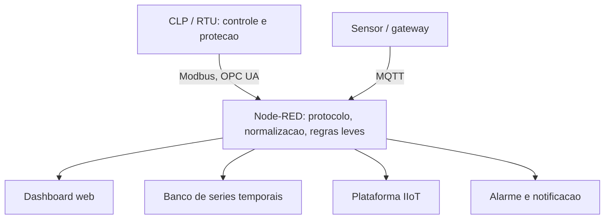
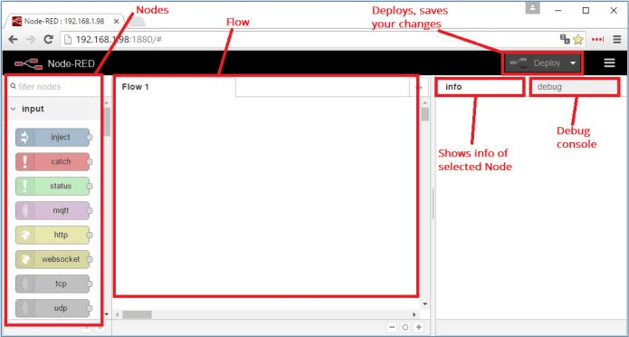
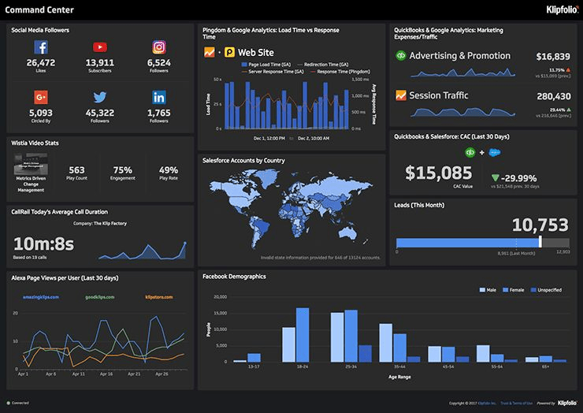
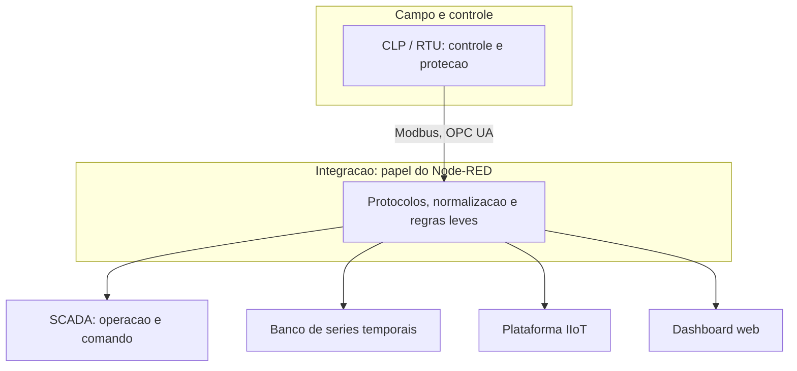

# Capítulo 7 – Node-RED como Interface Supervisória

## Objetivos de Aprendizagem

Ao final deste capítulo, o leitor será capaz de:

- Descrever a arquitetura e os conceitos fundamentais do Node-RED.
- Criar flows para aquisição de dados via Modbus TCP e MQTT.
- Desenvolver dashboards de supervisão com o módulo node-red-dashboard.
- Avaliar quando Node-RED é adequado como solução supervisória e suas limitações.

---

## 7.1 O que é Node-RED?

O **Node-RED** é uma plataforma de programação visual *flow-based* desenvolvida pela IBM em 2013, inicialmente para conectar dispositivos de hardware, APIs e serviços online de forma rápida. Tornou-se open-source e hoje é mantido pela **OpenJS Foundation**.

Sua filosofia: **"wiring together"** — conectar entradas, processamentos e saídas arrastando e soltando nós (*nodes*) em um editor visual, sem escrever código complexo.

**Por que Node-RED para automação?**

- **Baixo custo:** open-source, sem licenciamento.
- **Prototipagem rápida:** um flow funcional em minutos.
- **Biblioteca ampla:** mais de 4.000 nodes na comunidade (Modbus, OPC UA, MQTT, HTTP, banco de dados).
- **Leve:** roda em Raspberry Pi, gateways industriais, servidores Linux.
- **Dashboard integrado:** módulo `node-red-dashboard` gera interfaces web sem HTML/CSS.

Na prática, o Node-RED costuma ocupar a posição de **camada de integração**: ele conversa com
quem tem protocolo industrial, normaliza e entrega para quem consome dado.





> **Fonte:** *Node-RED — Interface de Supervisão* (material do curso), p. 13.

O editor é uma única página web dividida em quatro regiões, cada uma com um papel definido:

| Região | Posição | Função |
|---|---|---|
| **Palette** | esquerda | Catálogo de nodes disponíveis, agrupados por categoria |
| **Canvas** | centro | Área de desenho do flow; os fios ligam a saída de um node à entrada de outro |
| **Sidebar** | direita | Saída do node `debug`, ajuda do node selecionado, contexto e configurações |
| **Deploy** | topo | Publica o flow em edição para execução |

A figura anota as três primeiras regiões. O botão **Deploy** é o que separa "desenho" de
"sistema em operação": enquanto não for acionado, o processo continua rodando com a versão
anterior do flow.

---

## 7.2 Instalação e Configuração

### 7.2.1 Instalação via npm (Linux / Raspberry Pi)

```bash
# Instalar Node.js (versão LTS recomendada)
curl -fsSL https://deb.nodesource.com/setup_18.x | sudo bash -
sudo apt-get install -y nodejs

# Instalar Node-RED globalmente
sudo npm install -g --unsafe-perm node-red

# Iniciar Node-RED
node-red
```

### 7.2.2 Instalação via Docker

```bash
docker run -it -p 1880:1880 \
  -v node_red_data:/data \
  --name mynodered nodered/node-red
```

### 7.2.3 Acessando o Editor

Abra o navegador em: `http://localhost:1880`

> 💡 **Dica:** Para uso em produção, configure o Node-RED com autenticação de usuários (arquivo `settings.js`), HTTPS e uma solução de inicialização automática como `pm2` ou `systemd`, para que o serviço reinicie automaticamente após reboot.

---

## 7.3 Conceitos Fundamentais

### 7.3.1 Nodes (Nós)

Os **nodes** são os blocos de construção do Node-RED. Cada node realiza uma função específica:

| Categoria | Exemplos de Nodes | Função |
|---|---|---|
| **Entrada (Input)** | `mqtt in`, `modbus-read`, `http in`, `inject` | Recebe dados ou eventos |
| **Processamento** | `function`, `change`, `filter`, `json` | Transforma ou filtra dados |
| **Saída (Output)** | `mqtt out`, `modbus-write`, `http request`, `debug` | Envia dados ou executa ações |
| **Dashboard** | `gauge`, `chart`, `text`, `button`, `slider` | Exibe dados na interface web |
| **Banco de Dados** | `influxdb in`, `influxdb out`, `mongodb` | Persistência de dados |
| **Utilitários** | `delay`, `trigger`, `rbe` (report-by-exception) | Controle de fluxo |

### 7.3.2 Flows e Wires

Um **flow** é uma sequência de nodes conectados por **wires** (fios). Cada wire transporta uma mensagem (`msg`) do node anterior para o próximo.

A mensagem é um objeto JSON com campos padrão:

```json
{
  "topic": "planta/bomba1/temperatura",
  "payload": 72.5,
  "timestamp": 1704067200000,
  "retain": false
}
```

- `msg.payload`: o dado principal — número, texto, objeto ou buffer.
- `msg.topic`: identificador do dado (muito usado com MQTT).
- Campos adicionais podem ser adicionados em qualquer node.

### 7.3.3 Context (Contexto)

O Node-RED permite armazenar dados persistentes em três escopos:

- **Node context:** disponível apenas para aquele node.
- **Flow context:** compartilhado entre todos os nodes do mesmo flow.
- **Global context:** compartilhado entre todos os flows da aplicação.

```javascript
// Exemplo: incrementar contador no flow context
let count = flow.get('counter') || 0;
count++;
flow.set('counter', count);
msg.payload = count;
return msg;
```

---

## 7.4 Aquisição de Dados via Modbus TCP

### 7.4.1 Instalando o Node Modbus

No editor Node-RED, acesse **Menu → Manage Palette → Install** e instale:
```
node-red-contrib-modbus
```

### 7.4.2 Flow: Leitura de Temperatura via Modbus TCP

```
[Modbus Read] ---> [Function (converter)] ---> [MQTT Out]
     |                                              |
 (CLP/RTU)                                 (broker MQTT)
```

**Configuração do node `Modbus Read`:**
- Server: IP do CLP (ex.: `192.168.1.100`), porta `502`
- FC (Function Code): `3` (Read Holding Registers)
- Address: `40001` (registrador de temperatura)
- Quantity: `2` (float32 = 2 registradores)
- Poll Rate: 1000 ms

**Node `function` para converter dois registradores em float:**

```javascript
// Converter dois registradores Modbus em float IEEE 754
const buf = Buffer.alloc(4);
buf.writeUInt16BE(msg.payload.data[0], 0);
buf.writeUInt16BE(msg.payload.data[1], 2);
const temperature = buf.readFloatBE(0);
msg.payload = parseFloat(temperature.toFixed(2));
msg.topic = "planta/reator1/temperatura";
return msg;
```

> 🖼️ **[Figura 7.2 – Flow Node-RED: leitura Modbus TCP e publicação MQTT]**
> *Screenshot do editor Node-RED mostrando o flow completo: node "Modbus Read" (cor laranja) → node "function" → node "mqtt out". Mostrar as configurações do node Modbus: IP do CLP, FC3, endereço e quantidade. Destacar o debug node mostrando o valor 72.5°C.*

---

## 7.5 Comunicação MQTT no Node-RED

### 7.5.1 Configurando Conexão com Broker MQTT

Os nodes `mqtt in` e `mqtt out` compartilham uma configuração de broker:

- **Server:** `localhost` (Mosquitto local) ou endereço do broker externo.
- **Port:** `1883` (sem TLS) ou `8883` (com TLS).
- **Client ID:** identificador único do Node-RED no broker.
- **Username/Password:** credenciais (se o broker exigir autenticação).

### 7.5.2 Flow: Assinatura de Tópico MQTT e Alarme

```javascript
// Node function: verificar temperatura e gerar alarme
const temp = msg.payload;
if (temp > 85) {
    msg.payload = {
        level: "CRITICO",
        value: temp,
        message: `Temperatura alta: ${temp}°C`,
        timestamp: new Date().toISOString()
    };
    msg.topic = "planta/reator1/alarmes";
    return msg;
}
return null; // não propagar se temperatura normal
```

---

## 7.6 Dashboard — Interface de Supervisão Web

O módulo `node-red-dashboard` transforma flows em interfaces web responsivas acessíveis pelo navegador.

### 7.6.1 Instalação

```
Menu → Manage Palette → Install → node-red-dashboard
```

O dashboard fica acessível em: `http://localhost:1880/ui`

### 7.6.2 Widgets Disponíveis

| Widget | Descrição | Uso típico |
|---|---|---|
| `gauge` | Velocímetro/medidor analógico | Temperatura, pressão, nível |
| `chart` | Gráfico de linhas/barras em tempo real | Tendência histórica de variável |
| `text` | Exibição de texto ou valor numérico | Status de equipamento |
| `slider` | Controle deslizante | Ajuste de setpoint |
| `button` | Botão de ação | Partida/parada, reconhecimento de alarme |
| `switch` | Toggle on/off | Habilitar/desabilitar saída |
| `notification` | Toast de notificação | Alertas de alarme |
| `table` | Tabela de dados | Log de eventos, lista de variáveis |



> **Fonte:** *Node-RED — Interface de Supervisão* (material do curso), p. 4.

O painel foi montado apenas com widgets do `node-red-dashboard`: medidores do tipo `gauge` para
os valores instantâneos, `chart` para as tendências e `text` para os totais. Dois pontos merecem
atenção didática. Primeiro, os blocos de *status* no topo repetem a mesma ideia de **visão geral**
(nível 1) discutida no Capítulo 11. Segundo, o painel convive com uma imagem ao vivo de câmera no
mesmo quadro — recurso comum em supervisão de acesso e logística, mas que **não** deve competir
com as variáveis de processo pela atenção do operador.

### 7.6.3 Exemplo de Flow Completo com Dashboard

```text
[mqtt in] --> [function: payload] --> [gauge: temperatura]
                                  --> [chart: tendencia]
                                  --> [function: alarme]
                                  --> [notification]
[button: resetar] --> [mqtt out: reset]
```

---

## 7.7 Integração com InfluxDB e Grafana

Para histórico e visualização avançada, o Node-RED integra-se facilmente com InfluxDB:

### 7.7.1 Instalação

```
node-red-contrib-influxdb
```

### 7.7.2 Node `influxdb out`

Configuração:
- Host: `localhost` (ou IP do servidor InfluxDB)
- Database: `industrial_data`
- Measurement: `temperatura_reator1`

O node recebe uma mensagem com `msg.payload` contendo os campos a gravar:

```javascript
// Preparar dados para InfluxDB (formato line protocol)
msg.payload = [
    {
        measurement: "temperatura",
        tags: { equipamento: "reator1", planta: "unidade_A" },
        fields: { valor: msg.payload },
        timestamp: new Date()
    }
];
return msg;
```

O **Grafana** se conecta ao InfluxDB como fonte de dados e exibe dashboards ricos, com alertas e anotações automáticas.

> 🖼️ **[Figura 7.4 – Pipeline Node-RED → InfluxDB → Grafana]**
> *Diagrama do pipeline: SCADA/CLP → Node-RED (flow de coleta e transformação) → InfluxDB (séries temporais) → Grafana (dashboard). Screenshot do Grafana mostrando painel com múltiplas variáveis industriais, seletor de período e alerta configurado.*

---

## 7.8 Node-RED versus SCADA Comercial

**Tabela 7.1 – Comparativo Node-RED × SCADA Comercial**

| Critério | Node-RED | SCADA Comercial (ex.: Ignition, AVEVA) |
|---|---|---|
| **Custo** | Gratuito (open-source) | Licença cara (US$ 5k–500k+) |
| **Curva de aprendizado** | Baixa | Média a alta |
| **Sinóticos gráficos** | Limitado (dashboard básico) | Rico: P&IDs, animações, SVG |
| **Segurança / acesso** | Básica (plugin) | Controle de acesso robusto, LDAP |
| **Historização** | Via plugins externos | Nativa, otimizada |
| **Alarmes** | Manual (flow) | Motor de alarmes dedicado, ISA-18.2 |
| **Suporte** | Comunidade | Suporte profissional 24/7 |
| **Certificação** | Não certificado | IEC 62443, FDA 21 CFR Part 11 |
| **Redundância** | Manual (infraestrutura) | Nativa e testada |
| **Escalabilidade** | Milhares de tags (com cuidado) | Centenas de milhares de tags |

**Quando usar Node-RED:**
- Prototipagem e provas de conceito.
- Integrações e glue code entre sistemas.
- Dashboards de monitoramento complementares.
- Projetos educacionais.
- Planta pequena com baixo requisito de disponibilidade.

**Quando usar SCADA comercial:**
- Infraestruturas críticas (energia, água, óleo e gás).
- Requisitos de certificação regulatória (FDA, ISO, ANEEL).
- Operação 24/7 com SLA de disponibilidade.
- Equipe de operação sem perfil técnico de programação.

O desenho que vem se consolidando na indústria não é "Node-RED **ou** SCADA": é cada um no seu
papel, com o comando e a proteção no CLP e no SCADA, e a integração no Node-RED.



---

## 7.9 Estudo de Caso — Node-RED como camada de integração em uma planta-piloto

**Cenário.** Planta-piloto de uma indústria de alimentos, com um CLP de médio porte controlando um
tanque de mistura e temperatura. O CLP não tem OPC UA nem MQTT: expõe Modbus TCP. A equipe de
processo quer acompanhar a curva de temperatura sem esperar pelo projeto corporativo de SCADA,
que está na fila há oito meses.

**Arranjo montado.** Um microcomputador na rede de controle roda o Node-RED. O fluxo tem três
trechos, cada um com um papel claro:

1. **Coleta** — *nodes* `modbus-read` leem os registradores de temperatura e velocidade do
   agitador, em ciclo de 2 s.
2. **Tratamento** — um *node* `function` converte o inteiro de 16 bits em valor de engenharia
   (escala e *offset* do transmissor), aplica o *deadband* de 0,2 °C e marca a qualidade do dado
   quando o CLP não responde.
3. **Distribuição** — os mesmos dados vão para três destinos: `mqtt out` para o broker, `influxdb
   out` para o banco de séries temporais e `ui_gauge` / `ui_chart` para o dashboard web.

```text
[modbus-read: temperatura]
      |
      v
[function: escala + deadband + qualidade]
      |
      +--> [mqtt out: planta/tanque/temperatura]
      +--> [influxdb out: processo]
      +--> [ui_chart: tendencia de 8 h]
```

**Resultado.** A equipe de processo passou a ter a curva de temperatura no navegador em três dias
de trabalho. Quando o projeto corporativo de SCADA entrou em operação, o mesmo fluxo continuou
rodando ao lado, agora consumindo OPC UA e servindo a plataforma de analytics.

**Limitações que precisam ser ditas em voz alta.**

- **Sem redundância.** Se o microcomputador reiniciar, a coleta para; o CLP continua controlando,
  mas o registro tem buraco. Para um piloto é aceitável; para um registro regulatório, não.
- **Sem trilha de auditoria.** Qualquer pessoa com acesso ao editor altera o fluxo; não há
  controle de versão nem aprovação. Versionar o JSON do fluxo é o mínimo.
- **Node-RED não substitui o motor de alarmes.** O alarme montado com `switch` + `notification`
  não tem reconhecimento, supressão nem *timestamp* de origem — os requisitos tratados no
  Capítulo 10 continuam valendo.
- **Comando não é papel do Node-RED.** Partida de bomba, abertura de válvula e intertravamento
  pertencem ao CLP e ao SCADA.

---

## Resumo

- **Node-RED** é uma plataforma de programação visual flow-based, open-source, ideal para integrações e supervisão simples.
- Conceitos fundamentais: **nodes**, **wires**, **flows** e **context**.
- Módulos `node-red-contrib-modbus` e `mqtt in/out` permitem integração com CLPs e brokers MQTT.
- O módulo `node-red-dashboard` gera interfaces web de supervisão sem necessidade de HTML/CSS.
- A integração com **InfluxDB + Grafana** fornece histórico e visualização de alto nível.
- Node-RED **complementa** SCADA comercial; raramente o substitui em aplicações críticas.

---

## Questões de Revisão

**Conceituais:**

1. O que é programação *flow-based*? Como ela difere da programação sequencial tradicional?
2. Qual é a estrutura de uma mensagem (`msg`) no Node-RED? Quais campos são padrão?
3. Cite três vantagens e três limitações do Node-RED como solução supervisória industrial.

**Práticas:**

4. Crie (descreva o flow) para: ler a temperatura de um CLP via Modbus TCP (registrador 40010, float32), exibir em um gauge no dashboard, gerar um alarme no painel se temperatura > 90°C e gravar em InfluxDB a cada 5 segundos.
5. Como você configuraria o Node-RED para operar com autenticação de usuário e HTTPS? Quais configurações no arquivo `settings.js` seriam necessárias?

**Desafio:**

6. Implemente um flow Node-RED que: (a) subscreva ao tópico MQTT `fabrica/+/temperatura`; (b) calcule a média móvel das últimas 10 leituras; (c) publique a média em `fabrica/media/temperatura`; (d) exiba em um gráfico de tendência no dashboard. Descreva a lógica JavaScript do node `function`.

---

## Referências

- NODE-RED. *Node-RED Documentation*. Disponível em: nodered.org/docs.
- OpenJS Foundation. *Node-RED GitHub Repository*. github.com/node-red/node-red.
- MQTT.ORG. *MQTT Essentials*. Disponível em: mqtt.org.
- INFLUXDATA. *Node-RED InfluxDB Integration*. Disponível em: docs.influxdata.com.
- MATERIAL DE ORIGEM: *Node-Red_InterfaceDeSupervisão* (material do curso) — telas do editor e do
  dashboard reproduzidas com crédito.
