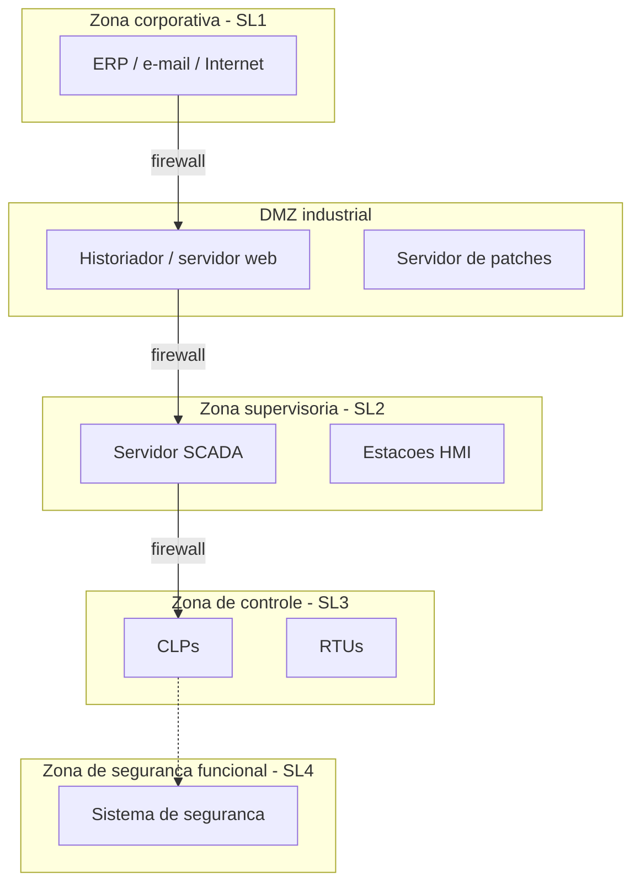
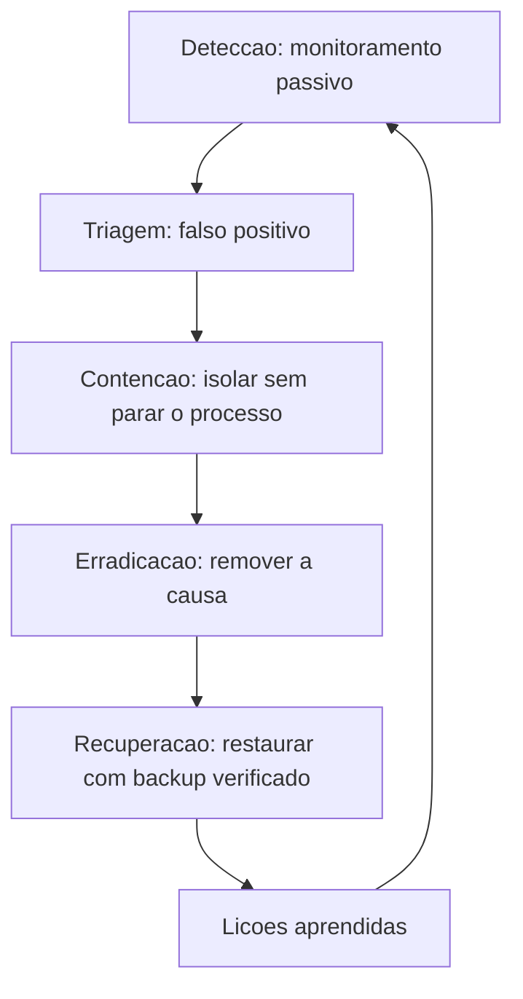

# Capítulo 8 – Segurança em Sistemas SCADA

## Objetivos de Aprendizagem

Ao final deste capítulo, o leitor será capaz de:

- Compreender por que a cibersegurança em OT é diferente da segurança em TI.
- Identificar as principais ameaças e vetores de ataque a sistemas SCADA.
- Aplicar os conceitos da norma IEC 62443 para proteção de ambientes industriais.
- Descrever as melhores práticas de segmentação de redes TI/OT.

---

## 8.1 OT Security: Por que é Diferente?

A cibersegurança em **OT** (*Operational Technology*) segue princípios distintos da segurança em **TI** (*Information Technology*). A tríade clássica de segurança **CIA** (Confidencialidade, Integridade, Disponibilidade) tem pesos diferentes:

**Tabela 8.1 – Prioridades CIA: TI × OT**

| Prioridade | TI (Corporativa) | OT (Industrial) |
|---|---|---|
| **1ª** | Confidencialidade | **Disponibilidade** |
| **2ª** | Integridade | **Integridade** |
| **3ª** | Disponibilidade | Confidencialidade |

Na OT, **parar um sistema pode significar:** explosão em uma refinaria, blackout em uma cidade, contaminação de abastecimento de água, acidentes com operadores. A segurança das **pessoas** e do **processo** está acima da confidencialidade dos dados.

**Outras diferenças críticas:**

- **Ciclo de vida:** sistemas OT operam por décadas; patches e atualizações são raros ou impossíveis sem parada programada.
- **Tempo real:** latências introduzidas por firewalls e antivírus podem afetar o controle.
- **Protocolos legados:** Modbus, DNP3 e outros foram projetados sem autenticação ou criptografia.
- **Air gap histórico:** sistemas OT eram fisicamente isolados; a convergência TI/OT eliminou essa barreira.

> ⚠️ **Atenção:** Um antivírus mal configurado em um servidor SCADA pode consumir CPU durante um scan e causar timeouts de comunicação — resultando em falsos alarmes ou perda de controle do processo. Soluções de segurança para OT devem ser **específicas para o ambiente industrial**.

---

## 8.2 Linha do Tempo de Ataques a Infraestruturas Críticas

> 🖼️ **[Figura 8.1 – Linha do tempo de ataques a sistemas SCADA e infraestruturas críticas]**
> *Infográfico com os principais incidentes de segurança em OT: Stuxnet (2010), Ukraine Power Grid (2015, 2016), Triton/Trisis (2017), Colonial Pipeline (2021), Oldsmar Water Treatment (2021). Para cada evento: ano, país, setor afetado, impacto e vetor de ataque.*

**Stuxnet (2010):** malware sofisticado criado para sabotar centrífugas de enriquecimento de urânio no Irã, manipulando CLPs Siemens S7-315/417. Primeiro ataque cibernético documentado a causar dano físico real.

**Ukraine Power Grid (2015):** ataque via phishing comprometeu estações SCADA de distribuidoras de energia, resultando em blackout para 230.000 pessoas.

**Triton/Trisis (2017):** ataque direcionado a sistemas de segurança funcional (SIS — Safety Instrumented System) em uma refinaria petroquímica no Oriente Médio. O objetivo era desabilitar a proteção que impede explosões.

**Colonial Pipeline (2021):** ransomware no sistema de TI da maior operadora de oleodutos dos EUA. A empresa desligou preventivamente o SCADA — causando escassez de combustível na Costa Leste americana.

---

## 8.3 Principais Vetores de Ataque

| Vetor | Descrição | Mitigação |
|---|---|---|
| Phishing | Email falso induz operador a instalar malware | Treinamento, MFA, filtro de email |
| USB / mídia removível | Malware em pen drives usados na rede OT | Política zero USB, portas bloqueadas |
| Acesso remoto inseguro | VPN sem MFA, RDP exposto | MFA obrigatório, jump server, PAM |
| Vulnerabilidades em sistemas legados | CLPs/HMIs sem patch por anos | Segmentação, monitoramento passivo |
| Supply chain | Firmware malicioso em hardware comprado | Verificação de integridade, fornecedores certificados |
| Movimento lateral TI→OT | Atacante compromete TI e se move para OT | Segmentação, DMZ industrial |

---

## 8.4 Norma IEC 62443

A **IEC 62443** (*Security for Industrial Automation and Control Systems*) é a família de normas internacional para cibersegurança em sistemas de automação e controle industrial. É estruturada em quatro séries:

| Série | Título | Conteúdo |
|---|---|---|
| **IEC 62443-1** | Geral | Terminologia, conceitos, modelos |
| **IEC 62443-2** | Políticas e Procedimentos | Requisitos para operadores e integradores |
| **IEC 62443-3** | Sistema | Avaliação de risco, zonas e condutos |
| **IEC 62443-4** | Componentes | Requisitos para produtos (CLPs, SCADA) |

### 8.4.1 Zonas de Segurança e Condutos

O conceito central da IEC 62443-3-2 é dividir o sistema em **zonas** (*Security Zones*) e **condutos** (*Conduits*):

- **Zona de Segurança:** agrupamento de ativos com requisitos de segurança semelhantes e nível de confiança equivalente.
- **Conduto:** canal de comunicação que conecta duas zonas, com controles de segurança aplicados ao tráfego.

> 🖼️ **[Figura 8.2 – Modelo de zonas e condutos IEC 62443]**
> *Diagrama de zonas concêntricas ou em camadas: Zona Corporativa (exterior) → DMZ Industrial → Zona Supervisória → Zona de Controle → Zona de Segurança (centro, mais protegida). Firewalls e diodos de dados entre cada zona. Cores indicando nível de segurança crescente.*

### 8.4.2 Security Levels (SL)

A norma define quatro **Níveis de Segurança** (*Security Level*):

| SL | Proteção contra | Descrição |
|---|---|---|
| **SL 1** | Causas não intencionais | Erros humanos, falhas acidentais |
| **SL 2** | Atacantes com baixa habilidade e motivação | Script kiddies, ataques oportunistas |
| **SL 3** | Atacantes sofisticados, motivados | Hackers patrocinados por concorrentes |
| **SL 4** | Atores estatais, recursos ilimitados | Ataques como Stuxnet |

---

## 8.5 Boas Práticas de Segurança em SCADA

### 8.5.1 Segmentação de Redes

> 🖼️ **[Figura 8.3 – Segmentação em zonas, com o tráfego permitido e o bloqueado]**
> *Diagrama de blocos com quatro zonas empilhadas (corporativa, DMZ industrial, supervisória e de controle), mostrando as setas de tráfego permitido e as bloqueadas. Anotar junto a cada seta o protocolo e a porta, e destacar os pontos de inspeção: firewall industrial e proxy reverso. Incluir legenda com o nível de segurança (SL) de cada zona.*

- Isolar completamente a rede OT da rede corporativa com **firewall industrial** (ex.: Fortinet FortiGate, Cisco ASA, Schneider Electric ConneXium).
- Criar **DMZ Industrial** para sistemas que precisam compartilhar dados com TI (historiador, servidor web de relatórios).
- Usar **diodos de dados** (*data diodes*) em pontos onde apenas fluxo unidirecional é necessário — fisicamente impossível de hackear de volta.

### 8.5.2 Controle de Acesso Remoto

- **VPN com MFA** (*Multi-Factor Authentication*) para todos os acessos remotos.
- **Jump Server / Bastion Host:** toda conexão remota passa por um servidor intermediário — nunca acesso direto a CLPs.
- **PAM** (*Privileged Access Management*): registro e gravação de todas as sessões de manutenção remota.
- **Tempo limitado:** acessos remotos habilitados apenas durante janelas de manutenção, com aprovação.

> 💡 **Dica:** Nunca exponha a porta RDP (3389) ou SSH (22) de servidores SCADA diretamente para a internet. Uma busca no Shodan.io revela milhares de sistemas SCADA acessíveis publicamente — a maioria sem autenticação adequada.

### 8.5.3 Gestão de Vulnerabilidades e Patches

- **Inventário de ativos:** manter catálogo atualizado de todos os equipamentos OT (fabricante, modelo, firmware, protocolos).
- **Avaliação de vulnerabilidades passiva:** ferramentas como **Claroty**, **Dragos** ou **Tenable OT** identificam vulnerabilidades sem enviar pacotes ativos (que poderiam impactar o processo).
- **Patch em janelas de manutenção:** atualizações testadas em ambiente de homologação antes da produção.
- **EOL Management:** equipamentos sem suporte (End-of-Life) devem ser isolados e substituídos no prazo.

### 8.5.4 Backup e Recuperação

- Backup regular de: configurações de CLPs, configurações do SCADA (tags, telas, scripts), banco de dados histórico.
- Teste periódico de restauração.
- Plano de **DRP** (*Disaster Recovery Plan*) específico para o ambiente OT.

### 8.5.5 Treinamento e Cultura de Segurança

- Operadores e técnicos de manutenção são o principal vetor de ataque (phishing, USB).
- Treinamentos regulares de **segurança cibernética industrial** para toda a equipe OT.
- Política clara sobre uso de dispositivos pessoais e mídias removíveis na planta.

> 📌 **Nota:** No Brasil, o setor de energia elétrica é regulado pela **Resolução Normativa ANEEL nº 964/2021**, que estabelece requisitos mínimos de segurança cibernética para o Ambiente de TI e OT de agentes do setor elétrico, baseados na IEC 62443 e no NIST Cybersecurity Framework.

---

## 8.6 Monitoramento e Resposta a Incidentes (SOC OT)

Responder a um incidente em rede industrial é diferente de responder em rede corporativa: não se
pode simplesmente desligar o equipamento suspeito se ele estiver operando o processo.

### 8.6.1 Monitoramento Passivo da Rede OT

Ferramentas de monitoramento OT analisam o tráfego de rede de forma **passiva** — sem injetar pacotes — para:

- Criar inventário automático de ativos (dispositivo, firmware, protocolo).
- Detectar comunicações anômalas (CLP falando com IP desconhecido, volume atípico de dados).
- Alertar sobre tentativas de varredura de rede.

**Soluções especializadas em OT:**

| Ferramenta | Empresa | Diferencial |
|---|---|---|
| Claroty | Claroty | Amplo suporte a protocolos OT; integração com SIEM |
| Dragos | Dragos | Threat intelligence focado em OT (grupos de ameaça) |
| Tenable OT | Tenable | Integração com gestão de vulnerabilidades TI |
| Microsoft Defender for IoT | Microsoft | Integrado ao Azure Sentinel |
| Nozomi Networks | Nozomi | IA para detecção de anomalias OT |

### 8.6.2 Plano de Resposta a Incidentes OT

Em caso de incidente cibernético em ambiente OT:

1. **Detecção:** sistema de monitoramento alerta sobre atividade suspeita.
2. **Avaliação:** equipe de segurança avalia se é falso positivo ou ameaça real.
3. **Contenção:** isolar segmento afetado sem parar o processo (se possível).
4. **Erradicação:** remover o malware ou fechar o vetor de ataque.
5. **Recuperação:** restaurar sistemas a partir de backup limpo; testar antes de retornar à produção.
6. **Lições aprendidas:** documentar o incidente; atualizar procedimentos.

---

## 8.7 Estudo de Caso — Segmentação por zonas e condutos em uma planta de médio porte

**Cenário.** Planta de processamento contínuo com 340 funcionários. A rede de automação cresceu
por acumulação ao longo de 15 anos: CLPs, IHM, supervisório, servidor de histórico, estações de
engenharia e o Wi-Fi da manutenção dividem hoje o mesmo conjunto de *switches*, com o roteador
corporativo ligado a um deles. Não há documentação de endereçamento.

**Diagnóstico pelo modelo de zonas e condutos (IEC 62443).** O primeiro produto do trabalho não é
um firewall: é o **inventário de ativos com função e criticidade**. Só depois as zonas aparecem.

| Zona proposta | Ativos | Nível de criticidade |
|---|---|---|
| Zona de controle | CLPs, IHM locais, *drives* | Crítica — para a produção se parar |
| Zona de supervisão | Servidores SCADA e historiador, estações de operação | Crítica |
| Zona de engenharia | Estações de programação, *notebooks* de fornecedor | Alta |
| Zona corporativa | ERP, e-mail, estações administrativas | Média |
| Zona de acesso remoto | VPN de fornecedores e acesso de manutenção | Alta, com sessão auditada |

**Regras de conduto que fizeram a diferença.** A segmentação só reduz risco quando o tráfego entre
zonas é **explícito**:

- Supervisão **lê** do controle; o controle **não inicia** conexão para a supervisão.
- Engenharia acessa o controle apenas em janela agendada, com sessão gravada.
- Corporativo **nunca** alcança o controle diretamente — inclusive o tráfego de atualização de
  *antivírus*, que costuma ser o furo silencioso das segmentações.
- Nenhum acesso remoto entra sem duplo fator e sem registro de sessão.

**O que observar no resultado.** A segmentação **não** exige trocar CLP nem parar a produção: as
zonas são implementadas em VLANs e regras de firewall, com janelas de manutenção para repassar a
rede. O ganho maior, porém, costuma ser indireto: o inventário de ativos gerado na etapa 1 é o que
permite, depois, aplicar correções e detectar anomalias de tráfego.

**Limitações do arranjo.** Segmentar sem monitorar deixa o sistema mais difícil de operar e não
mais seguro — a rede fica opaca, e cada diagnóstico passa a depender de alguém com acesso ao
firewall. A segmentação precisa vir acompanhada de registro de tráfego nas fronteiras de zona
(Seção 8.6).

---

## Resumo

- Segurança OT prioriza **disponibilidade** acima de confidencialidade — ao contrário da TI.
- Sistemas SCADA foram projetados para disponibilidade, não para segurança; a convergência TI/OT os expôs a ameaças digitais.
- A **IEC 62443** estrutura a segurança industrial em zonas, condutos e níveis de segurança (SL1–SL4).
- Boas práticas essenciais: segmentação de rede, DMZ industrial, VPN com MFA, monitoramento passivo e treinamento de operadores.
- Ferramentas especializadas como Claroty e Dragos permitem monitoramento OT sem impactar o processo.

---

## Questões de Revisão

**Conceituais:**

1. Por que a prioridade de segurança em OT (Disponibilidade > Integridade > Confidencialidade) é inversa à de TI?
2. O que são "zonas de segurança" e "condutos" na IEC 62443? Cite dois exemplos de cada um.
3. Por que o antivírus convencional de TI pode ser inadequado para servidores SCADA?

**Práticas:**

4. Uma empresa petroquímica conectou sua rede OT diretamente à rede corporativa para facilitar o acesso ao historiador a partir do ERP. Identifique os riscos dessa arquitetura e proponha uma solução com DMZ industrial.
5. Um técnico de manutenção precisa acessar remotamente um CLP para realizar ajuste de parâmetros fora do horário comercial. Descreva o procedimento seguro de acesso remoto, incluindo autenticação, registro e controle de sessão.

**Desafio:**

6. Com base no incidente do Stuxnet (2010), analise: (a) Qual era o objetivo do ataque? (b) Qual vetor de infecção foi usado? (c) Como ele manipulou os CLPs Siemens? (d) Quais medidas de segurança da IEC 62443 poderiam ter dificultado ou impedido o ataque?

---

## Referências

- IEC 62443: *Security for Industrial Automation and Control Systems* (séries 1 a 4). IEC, 2018–2023.
- NIST SP 800-82 Rev. 3: *Guide to OT Security*. NIST, 2023.
- ANEEL Resolução Normativa nº 964/2021. Disponível em: aneel.gov.br.
- LANGNER, R. *Stuxnet: Dissecting a Cyberwarfare Weapon*. IEEE Security & Privacy, 2011.
- CLAROTY. *State of XIoT Security Report*. Disponível em: claroty.com/research.
