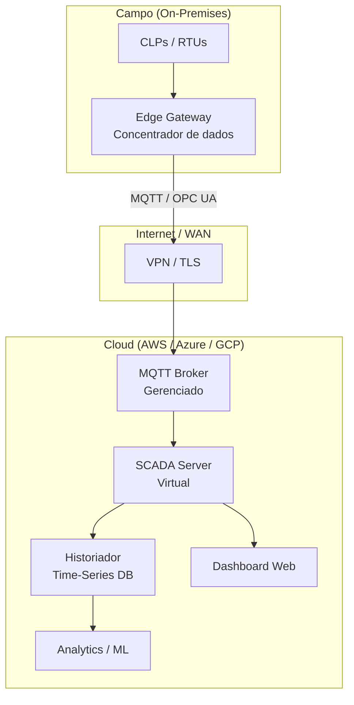
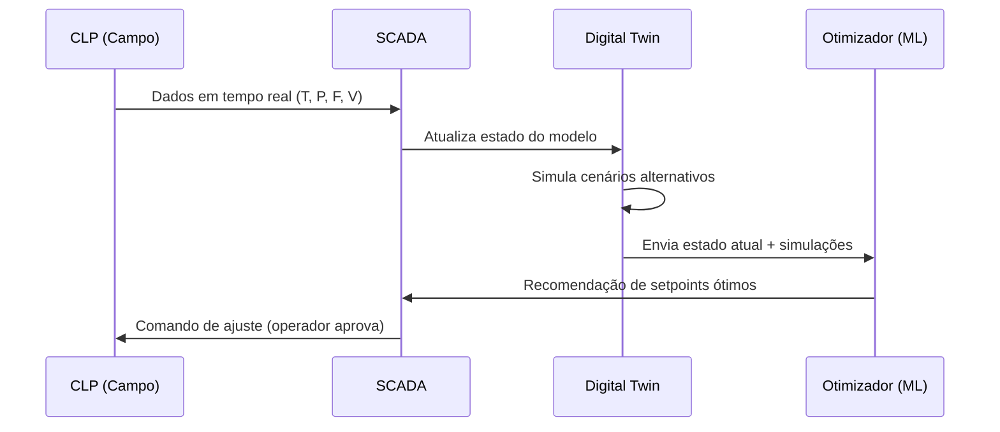

# Capítulo 9 – Tendências: Cloud SCADA e Digital Twin

## Objetivos de Aprendizagem

Ao final deste capítulo, o leitor será capaz de:

- Descrever as vantagens e desafios do Cloud SCADA versus SCADA on-premises.
- Identificar as principais plataformas de Cloud SCADA disponíveis no mercado.
- Compreender como o Digital Twin se integra aos sistemas SCADA para otimização.
- Analisar o impacto da IA/ML e do low-code/no-code no futuro dos sistemas supervisórios.

---

## 9.1 Cloud SCADA: Conceito e Motivações

O **Cloud SCADA** é a evolução natural dos sistemas supervisórios tradicionais: em vez de servidores físicos instalados na própria planta (*on-premises*), o software SCADA é hospedado em infraestrutura de nuvem pública (AWS, Azure, Google Cloud) ou privada.

### 9.1.1 Por que migrar para a nuvem?

**Tabela 9.1 – SCADA On-Premises × Cloud SCADA**

| Critério | SCADA On-Premises | Cloud SCADA |
|---|---|---|
| **Infraestrutura** | Servidores físicos na planta | Instâncias virtuais gerenciadas |
| **Custo inicial (CapEx)** | Alto (hardware + licenças) | Baixo ou zero |
| **Custo operacional (OpEx)** | Equipe de TI, manutenção, energia | Pagamento por uso (pay-as-you-go) |
| **Escalabilidade** | Limitada (hardware físico) | Elástica (escala automaticamente) |
| **Acesso remoto** | Via VPN, complexo | Nativo via browser, global |
| **Atualizações** | Manual, risco de incompatibilidade | Automáticas, sem downtime |
| **Latência** | Mínima (rede local) | Depende da conectividade WAN |
| **Disponibilidade garantida** | Depende do investimento local | SLAs de 99,9% a 99,99% |
| **Compliance / Soberania de dados** | Total controle | Depende da região do datacenter |

### 9.1.2 Arquitetura Cloud SCADA

> 🖼️ **[Figura 9.1 – Arquitetura Cloud SCADA com Edge Gateway]**
> *Diagrama colorido mostrando: (esquerda) campo industrial com CLPs e edge gateway; (centro) conexão segura via VPN/TLS pela internet; (direita) nuvem com os componentes SCADA virtualizados. Destacar que o controle em tempo real permanece no CLP local — a nuvem é supervisão e analytics.*

> ⚠️ **Atenção:** Em Cloud SCADA, o **controle em malha fechada permanece nos CLPs locais**. A latência da nuvem (decenas a centenas de ms) inviabiliza controle PID via cloud. A nuvem é responsável pela supervisão, historização, analytics e acesso remoto — não pelo controle direto do processo.

---

## 9.2 Plataformas de Cloud SCADA

### 9.2.1 Ignition Cloud Edition (Inductive Automation)

O **Ignition** foi pioneiro no modelo de licenciamento cloud-native:

- Hospedado na AWS ou Azure.
- Mesma interface do Ignition on-premises — sem curva de aprendizado adicional.
- Módulo de borda (*Ignition Edge*) instalado na planta coleta dados e sincroniza com a cloud.
- Ideal para empresas com múltiplos sites que precisam de visão unificada.

### 9.2.2 AWS IoT SiteWise

O **AWS IoT SiteWise** é a solução da Amazon para modelagem e supervisão de ativos industriais:

- **Asset Models:** define hierarquia de ativos (planta → unidade → equipamento → componente).
- **Asset Properties:** variáveis de processo com cálculos e transformações configuráveis.
- **SiteWise Monitor:** dashboards de supervisão sem código.
- **SiteWise Edge:** módulo local para operação sem conectividade.

### 9.2.3 Azure IoT Hub + Azure Digital Twins

A combinação **Azure IoT Hub** (ingestão de dados) + **Azure Digital Twins** (modelagem) + **Azure Time Series Insights** (histórico) + **Power BI** (dashboards) forma uma stack completa de Cloud SCADA na Microsoft.

### 9.2.4 AVEVA Insight

O **AVEVA Insight** é a solução cloud da AVEVA (herdeira do PI System e Wonderware):

- Historização de dados na nuvem com a mesma interface do PI System.
- KPIs e dashboards web sem necessidade de servidor local.
- Integração nativa com System Platform on-premises existentes.

> 💡 **Dica:** Para plantas industriais brasileiras com dados sensíveis de processo, verifique a conformidade com a **LGPD** (Lei Geral de Proteção de Dados) e a **soberania de dados**: dados de processo podem conter informações estratégicas. Priorize regiões de datacenter no Brasil (AWS São Paulo, Azure Brasil Sul) ou considere nuvem privada (*on-premises cloud*).

---

## 9.3 Digital Twin nos Sistemas SCADA

A integração do **Digital Twin** com o SCADA cria um sistema de supervisão que não apenas monitora — mas também simula, prevê e otimiza.

### 9.3.1 Como o SCADA alimenta o Digital Twin

> 🖼️ **[Figura 9.2 – Integração SCADA e Digital Twin: ciclo de otimização]**
> *Diagrama do ciclo acima com representações visuais: planta física com sensores → SCADA → modelo 3D digital twin → algoritmo de otimização → recomendação ao operador no SCADA → ajuste no processo real. Ciclo contínuo indicado por setas.*

### 9.3.2 Caso de Uso: Otimização de Destilação

Em uma coluna de destilação de uma refinaria, o Digital Twin permite:

1. **Modelo de primeiro princípio** (equações de equilíbrio termodinâmico) calibrado com dados reais do SCADA.
2. Simulação em tempo real de múltiplos setpoints alternativos de temperatura e refluxo.
3. Identificação do ponto ótimo que maximiza rendimento do produto e minimiza consumo de energia.
4. Recomendação ao operador com justificativa técnica e previsão de impacto.

**Resultado típico:** ganho de 2–5% no rendimento do destilado com redução de 8–12% no consumo de vapor.

---

## 9.4 Inteligência Artificial Aplicada a Sistemas Supervisórios

### 9.4.1 Manutenção Preditiva (PdM)

A **manutenção preditiva** usa modelos de ML para prever falhas antes que ocorram, com base em dados históricos e em tempo real:

| Algoritmo | Aplicação | Indicadores Monitorados |
|---|---|---|
| **LSTM (Long Short-Term Memory)** | Degradação de bombas e compressores | Vibração, temperatura de mancal, corrente |
| **Isolation Forest** | Detecção de anomalias em sensores | Desvios estatísticos multivariados |
| **Random Forest** | Classificação de modo de falha | Padrões de alarmes históricos |
| **Redes Neurais Convolucionais** | Análise de vibração espectral | FFT de sinal de acelerômetro |

### 9.4.2 Controle Avançado com IA

- **MPC** (*Model Predictive Control*): controlador baseado em modelo que prevê o comportamento futuro do processo e otimiza ações de controle considerando restrições.
- **RL** (*Reinforcement Learning*): agente aprende a operar o processo por tentativa e erro no Digital Twin — depois é implantado na planta real.

### 9.4.3 Processamento de Linguagem Natural (NLP) em SCADA

Interfaces conversacionais permitem que operadores consultem o SCADA por voz ou texto:

- *"Qual foi a temperatura máxima do Reator 3 na última semana?"*
- *"Mostre o histórico de alarmes do Compressor A12 nos últimos 30 dias."*
- *"Qual bomba teve o maior consumo de energia no turno da manhã?"*

---

## 9.5 Low-Code / No-Code em Supervisórios

A tendência **low-code/no-code** está democratizando o desenvolvimento de sistemas supervisórios:

| Plataforma | Abordagem | Ideal para |
|---|---|---|
| **Ignition** | Configuração por objetos, scripts Python/Jython | Integradores e engenheiros de automação |
| **Node-RED** | Flow-based visual, zero código | Prototipagem, técnicos, pequenas plantas |
| **AWS IoT SiteWise Monitor** | Dashboards sem código | Operadores, gerentes de planta |
| **Microsoft Power Apps + Power BI** | Low-code apps e dashboards | Integração com dados industriais no Office 365 |
| **Grafana** | Configuração visual de dashboards | Analytics, visualização avançada |

> 🖼️ **[Figura 9.3 – Espectro low-code / no-code em supervisórios]**
> *Gráfico de eixo horizontal: de "No-Code" (esquerda) a "Full-Code" (direita). Posicionar as ferramentas: AWS SiteWise Monitor e Power BI (no-code), Node-RED e Grafana (low-code), Ignition (low-code/code), AVEVA System Platform e Honeywell Experion (code intensivo). Eixo vertical: nível de customização × complexidade.*

---

## 9.6 O Futuro da Profissão: Convergência TI/OT

O engenheiro de automação do futuro precisa transitar entre dois mundos:

**Competências OT (tradicionais):**
- Instrumentação e controle de processo (PID, cascata, ratio).
- Programação de CLPs (IEC 61131-3).
- Redes industriais (Modbus, Profibus, PROFINET).
- Normas de segurança funcional (IEC 61511, IEC 61508).

**Competências TI (emergentes):**
- Redes TCP/IP, cloud computing.
- Protocolos IIoT (MQTT, OPC UA, REST).
- Análise de dados (Python, pandas, scikit-learn).
- Cibersegurança industrial (IEC 62443).
- DevOps industrial: containers (Docker), CI/CD para automação.

> 🖼️ **[Figura 9.4 – Roadmap de evolução do SCADA: dos anos 1970 ao futuro]**
> *Linha do tempo em perspectiva: (1970s) SCADA monolítico com mainframe; (1980s) sistemas proprietários distribuídos; (1990s) Ethernet + OPC; (2000s) SCADA em rede TCP/IP; (2010s) IIoT + cloud; (2020s) AI-SCADA + Digital Twin + 5G; (2030s?) Autonomous Operations. Ícones de tela de cada era.*

---

## 9.7 Estudo de Caso — Piloto de Cloud SCADA em uma frota de elevatórias

**Cenário.** Concessionária com 120 elevatórias de esgoto distribuídas em uma região
metropolitana. Cada unidade tem um CLP local, comunicação por 4G e inspeção presencial semanal. A
pergunta que o piloto precisa responder não é técnica: **quanto do trabalho de inspeção pode ser
trocado por supervisão remota sem aumentar o risco de extravasamento?**

**Escopo do piloto — 12 elevatórias, 90 dias.** Três decisões de arquitetura definiram o resto:

| Decisão | Escolha | Motivo |
|---|---|---|
| O que sobe para a nuvem | Telemetria agregada e eventos | Dado bruto de 1 s não agrega valor de gestão |
| O que fica na borda | Intertravamento, alarme local e corte por nível alto | A segurança não pode depender do link |
| Comunicação | MQTT com TLS, publicação por exceção | Link 4G intermitente cobra cada byte |

**Indicadores acompanhados.** O piloto só faz sentido se medir o efeito, não a instalação:

- **Número de extravasamentos** por mês, comparado com o histórico das mesmas 12 unidades.
- **Chamados de manutenção** por elevatória/mês.
- **Tempo entre a detecção de uma falha de bomba e a chegada da equipe.**
- **Disponibilidade do enlace**, que costuma ser o fator limitante — e não a plataforma.

**O que observar no resultado.** A primeira descoberta recorrente é que o gargalo não é a nuvem: é
a instrumentação existente. Sem medição confiável de nível e de corrente do motor, a supervisão
remota apenas transfere para a tela a mesma incerteza que hoje existe na inspeção presencial.

**Limitações do arranjo.**

- **Latência e indisponibilidade do link** tornam a nuvem inadequada para comando crítico. A
  proteção continua no CLP, na borda.
- **Custo recorrente** de conectividade e de plataforma, que precisa entrar no orçamento de
  operação — não no de projeto, onde costuma ser esquecido.
- **Dependência de fornecedor.** Modelo de dados, formato de exportação e mecanismo de saída dos
  dados devem ser exigidos no contrato; migrar de plataforma com os dados presos é o cenário mais
  caro da lista.
- **LGPD e retenção.** Telemetria agregada não identifica pessoas, mas imagens de câmera em
  instalação e registros de acesso de operadores podem fazê-lo.

---

## Resumo

- **Cloud SCADA** oferece escalabilidade, acesso remoto e redução de CapEx; o controle em tempo real permanece on-premises.
- As principais plataformas incluem Ignition Cloud, AWS IoT SiteWise, Azure IoT + Digital Twins e AVEVA Insight.
- A integração **SCADA + Digital Twin** cria ciclos de otimização contínua, combinando dados reais com simulações.
- **IA e ML** habilitam manutenção preditiva, controle avançado (MPC, RL) e interfaces conversacionais em SCADA.
- A tendência **low-code/no-code** democratiza o desenvolvimento de supervisórios para operadores e engenheiros sem perfil de programador.
- O profissional de automação moderno precisa dominar tanto competências OT (controle, instrumentação, CLP) quanto TI (cloud, redes, dados, segurança).

---

## Questões de Revisão

**Conceituais:**

1. Quais são as três principais vantagens do Cloud SCADA em relação ao SCADA on-premises? Cite também dois desafios.
2. Por que o controle em malha fechada não é realizado na nuvem em arquiteturas Cloud SCADA?
3. Como um Digital Twin se integra ao SCADA para criar um ciclo de otimização? Descreva o fluxo de dados.

**Práticas:**

4. Uma empresa com 5 plantas industriais em estados diferentes deseja implatar uma visão unificada de supervisão e relatórios gerenciais. Ela já possui SCADA Ignition on-premises em cada planta. Que arquitetura Cloud SCADA você recomendaria? Justifique.
5. Descreva como a manutenção preditiva com ML pode ser integrada a um sistema SCADA existente. Quais dados seriam necessários e como os alertas chegariam ao operador?

**Desafio:**

6. Elabore um **roadmap tecnológico de 5 anos** para a digitalização de uma planta industrial que atualmente opera com SCADA Wonderware antigo, sem IIoT e sem analytics. O roadmap deve incluir: fases, tecnologias a adotar, casos de uso prioritários, estimativa de benefícios e riscos a gerenciar.

---

## Referências

- INDUCTIVE AUTOMATION. *Ignition Cloud Edition*. Disponível em: inductiveautomation.com/ignition/cloud.
- AMAZON WEB SERVICES. *AWS IoT SiteWise User Guide*. Disponível em: docs.aws.amazon.com/iot-sitewise.
- MICROSOFT. *Azure Digital Twins Documentation*. Disponível em: docs.microsoft.com/azure/digital-twins.
- AVEVA. *AVEVA Insight Cloud SCADA*. Disponível em: aveva.com/en/products/insight.
- GRIEVES, M.; VICKERS, J. *Digital Twin: Mitigating Unpredictable, Undesirable Emergent Behavior in Complex Systems*. Transdisciplinary Perspectives on Complex Systems, 2017.
- LGPD — Lei nº 13.709/2018. *Lei Geral de Proteção de Dados Pessoais*. Disponível em: planalto.gov.br.
