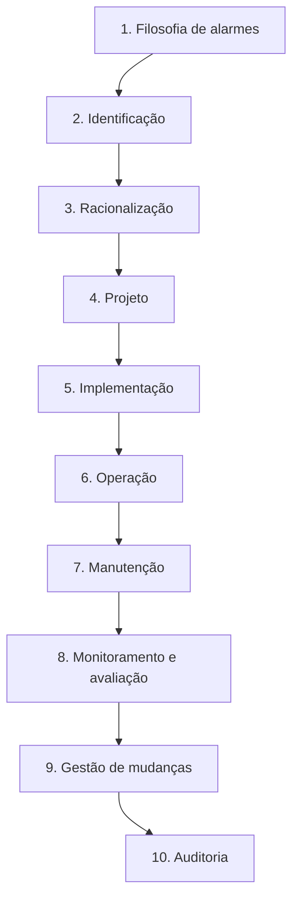
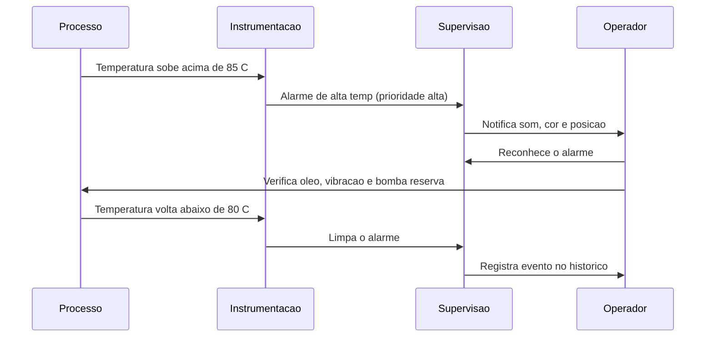
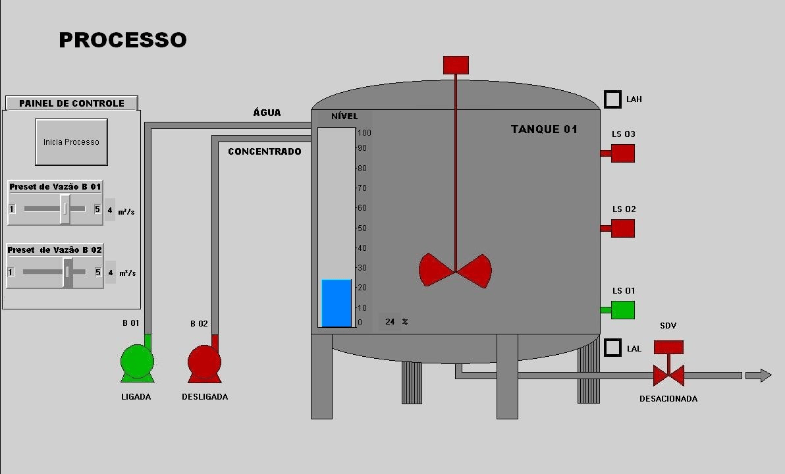
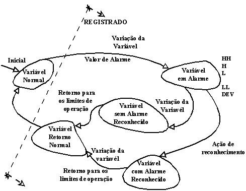
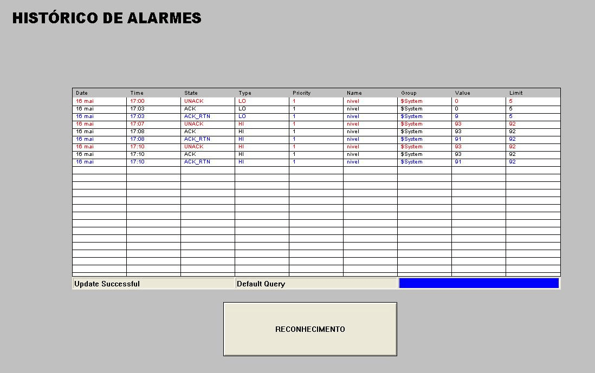
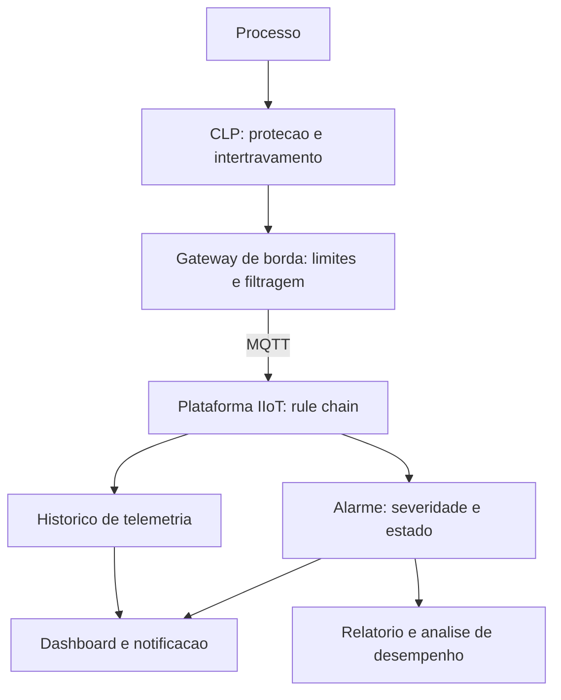

# Capítulo 10 – Gerenciamento de Alarmes

## Objetivos de Aprendizagem

Ao final deste capítulo, o leitor será capaz de:

- Explicar por que o gerenciamento de alarmes é uma disciplina de engenharia, e não uma configuração de software.
- Diferenciar alarme, evento e advertência, e distinguir prioridade de severidade.
- Reconhecer o escopo de cada referência normativa: ANSI/ISA-18.2, IEC 62682, EEMUA 191 e NAMUR NA 102.
- Descrever as dez etapas do ciclo de vida de gerenciamento de alarmes.
- Preencher uma ficha de racionalização de alarme.
- Analisar o desempenho de um sistema de alarmes a partir de métricas usuais de mercado.
- Implementar um alarme simples em SCADA e em plataforma IIoT.

---

## 10.1 O problema que o gerenciamento de alarmes resolve

Um sistema de alarmes é a última linha de defesa entre uma condição anormal e um acidente. Quando funciona, o operador é avisado exatamente do que importa, no momento em que ainda pode agir. Quando não funciona, o operador recebe centenas de mensagens simultâneas e passa a ignorá-las — ou, pior, desativa o som do sistema.

O sintoma mais conhecido é a **inundação de alarmes** (*alarm flood*): uma perturbação de processo dispara, em poucos segundos, um número de alarmes maior do que um operador consegue ler e processar.

> ⚠️ **Atenção:** A inundação de alarmes não é consequência de "operador desatento". É consequência de projeto: alarmes criados sem critério, limites copiados do valor de projeto, ausência de *deadband* e de atraso de confirmação, e nenhuma racionalização. O operador é a vítima, não a causa.

Alguns efeitos medíveis de um sistema de alarmes mal projetado:

- **Perda de priorização:** se 80% dos alarmes são "críticos", nenhum é crítico.
- **Cegueira por ruído:** alarmes repetitivos (*chattering*) escondem o alarme novo.
- **Fadiga de decisão:** cada mensagem irrelevante reduz a capacidade de julgamento.
- **Desconfiança do sistema:** o operador passa a silenciar (*shelve*) em massa, e a proteção desaparece.
- **Perda de rastreabilidade:** sem registro consistente, não há como investigar o incidente depois.

> 🖼️ **[Figura 10.1 – Inundação de alarmes: painel de alarmes antes e depois da racionalização]**
> *Lado esquerdo: lista com dezenas de alarmes ativos no mesmo segundo, todos em vermelho, sem ordem de prioridade visível. Lado direito: a mesma perturbação com dez alarmes, ordenados por prioridade, com o alarme de causa raiz destacado. Usar captura de tela genérica de um painel de alarmes; não usar marca de fabricante.*

---

## 10.2 Conceitos e taxonomia

A primeira dificuldade prática é terminológica: em muitos projetos, "alarme", "evento" e "aviso" são usados como sinônimos. Não são.

**Tabela 10.1 – Termos essenciais de gerenciamento de alarmes**

| Termo | Definição | Exemplo |
|---|---|---|
| **Evento** | Qualquer mudança de estado registrada pelo sistema | Bomba ligada; operador entrou no sistema |
| **Alarme** | Evento que exige **resposta do operador** dentro de um tempo definido | Alta temperatura do mancal acima de 85 °C |
| **Advertência** (*alert*) | Informação que não exige resposta imediata, mas pede atenção | Filtro com 70% de saturação |
| **Supressão** (*suppression*) | Ocultação temporária por projeto, enquanto a causa está ativa | Alarmes de nível suprimidos durante enchimento |
| **Silenciamento temporário** (*shelving*) | Ocultação manual, com prazo e justificativa | Alarme em manutenção por 4 h |
| **Alarme fixo** (*standing*) | Permanece ativo por longos períodos sem ação possível | Falha de sensor não reparado |
| **Alarme obsoleto** (*stale*) | Não é atualizado ou não é limpo por falha de configuração | Alarme ativo cuja condição já cessou |

A definição operacional de alarme tem duas partes que não podem ser separadas: **existe uma resposta possível** e **existe tempo para executá-la**. Se não há ação a tomar, não é alarme — é registro. Se o operador tem 30 segundos para agir e a tela mostra o alarme em uma página que ele abre em 40 segundos, também não é alarme: é informação histórica.

### 10.2.1 Prioridade e severidade não são a mesma coisa

Essa confusão aparece em quase toda especificação de SCADA.

- **Severidade** descreve a **consequência** da condição anormal: o que acontece se ninguém agir.
- **Prioridade** descreve a **urgência da resposta** do operador: em quanto tempo ele precisa agir.

Uma falha de instrumento pode ter consequência alta (perde-se a medição de vazão de um reator) e urgência baixa (há redundância e o processo continua seguro por horas). Prioridade alta, portanto, não é sinônimo de "coisa grave": é "aja agora".

**Tabela 10.2 – Matriz usual de prioridade por tempo de resposta**

| Prioridade | Tempo de resposta esperado | Referência de apresentação |
|---|---|---|
| Crítica | Segundos a poucos minutos | Destaque máximo, som distinto, exige reconhecimento |
| Alta | Minutos | Destaque visual forte, som padrão |
| Média | Dezenas de minutos | Destaque visual moderado |
| Baixa | Horas ou próximo turno | Apenas registro em lista, sem som |

A distribuição de prioridades também é um critério de qualidade: em um sistema maduro, a maior parte dos alarmes é de prioridade baixa e média, e a prioridade crítica é rara. Um sistema em que metade dos alarmes é crítica está mal priorizado, por definição.

> 💡 **Dica:** antes de discutir prioridade, responda por escrito, para cada alarme: *"qual é a ação esperada do operador e em quanto tempo ela precisa começar?"* Alarmes que não sobrevivem a essa pergunta são candidatos a remoção, não a reclassificação.

### 10.2.2 Ajustes que definem o comportamento

Três parâmetros determinam se um alarme é útil ou ruído:

- **Limite** (*setpoint*): valor que dispara a condição.
- **Faixa morta** (*deadband*): diferença necessária para limpar o alarme, evitando oscilação em torno do limite.
- **Atraso de confirmação** (*on-delay*): tempo que a condição precisa persistir para que o alarme seja gerado. Elimina disparos fugazes (*fleeting*) causados por transitórios de partida.

> 🖼️ **[Figura 10.2 – Limite, faixa morta e atraso de confirmação]**
> *Gráfico de tendência com a variável cruzando o limite três vezes em poucos segundos. Marcar: (a) disparo no cruzamento com atraso de 3 s; (b) zona de faixa morta impedindo o disparo/limpeza repetitivo; (c) os alarmes que existiriam sem esses ajustes, em linha tracejada. Incluir eixo de tempo legível.*

---

## 10.3 Normas e o escopo de cada uma

Quatro referências dominam o assunto, e elas **não são equivalentes**.

**Tabela 10.3 – Comparação das referências normativas**

| Referência | Natureza | Escopo e uso típico |
|---|---|---|
| **ANSI/ISA-18.2** | Norma (ISA) | Gerenciamento de alarmes na indústria de processo; define o ciclo de vida; edição vigente de 2016 (a primeira é de 2009) |
| **IEC 62682** | Norma (IEC) | Mesmo escopo em base internacional, alinhada à ISA-18.2; edição vigente de **2022**, que substitui a de 2014 |
| **EEMUA 191** | Guia de engenharia (EEMUA) | Projeto, gestão e contratação de sistemas de alarme; traz valores de referência de desempenho; 3ª edição, 2013 |
| **NAMUR NA 102** | Recomendação (NAMUR) | Gerenciamento de alarmes na indústria química e farmacêutica; publicada em 2003, referência histórica que influenciou as normas |

Notas de uso, verificadas na documentação pública dos organismos:

- ISA-18.2 e IEC 62682 são **quase idênticas** — a versão IEC foi modificada a partir da ISA. Como normas, dizem **o que** deve existir em um programa de gerenciamento de alarmes, não **como** fazer.
- EEMUA 191 é um **guia**, não uma norma: cobre parcialmente o "como" e é muito usada como referência de desempenho.
- A série de **relatórios técnicos ISA-18.2** (sete documentos, alinhados à norma) aprofunda o "como" em cada etapa.
- ISA-18.2 foi escrita para **não conflitar** com EEMUA 191 e NAMUR NA 102: o objetivo foi criar terminologia e atividades consistentes entre as referências.

> 📌 **Atualização tecnológica:** o conceito de gerenciamento de alarmes não muda com IIoT — muda o **alcance**. Em SCADA clássico, os alarmes vivem no servidor de supervisão. Em arquiteturas atuais, plataformas IIoT possuem entidade de alarme própria (por exemplo, o tipo *alarm* do ThingsBoard, com severidade, estado e detalhes) e podem gerar alarmes na borda, antes da nuvem. A disciplina (filosofia, racionalização, prioridade, monitoramento) permanece a mesma.

> ⚠️ **Atenção:** não atribua requisitos de ISA-18.2/IEC 62682 a normas de outra família, como **IEC 60839** (alarme de segurança eletrônica/patrimonial e sistemas de detecção de intrusão) ou a normas de detecção e alarme de incêndio. São escopos distintos: alarme de **processo** exige resposta de operador sobre uma variável de processo; alarme de **segurança patrimonial** trata de detecção de intrusão. Se o material antigo do curso fizer essa associação, corrija e explique a diferença.

---

## 10.4 Ciclo de vida

Normas e guias organizam o trabalho em etapas. O ciclo é iterativo: a saída da auditoria alimenta a filosofia.

**Tabela 10.4 – O que cada etapa entrega**

| Etapa | Pergunta que responde | Produto |
|---|---|---|
| Filosofia | Quais são os princípios, papéis e critérios de desempenho? | Documento de filosofia de alarmes |
| Identificação | Que condições precisam de alarme? | Lista de eventos candidatos |
| Racionalização | Cada alarme é necessário, único e acionável? | Ficha de racionalização por alarme |
| Projeto | Como o alarme se apresenta e se comporta? | Especificação de limite, prioridade, deadband, atraso |
| Implementação | Está configurado como especificado? | Alarmes configurados e testados |
| Operação | O operador consegue responder? | Rotina de operação e tratamento de shelving |
| Manutenção | O sistema continua íntegro? | Correção de alarmes fixos, obsoletos e falhas |
| Monitoramento e avaliação | O desempenho é adequado? | Relatórios de métricas |
| Gestão de mudanças | A alteração está justificada e registrada? | Registro de mudança aprovado |
| Auditoria | O programa funciona como previsto? | Relatório de auditoria e plano de ação |

> 💡 **Dica:** a etapa que separa plantas maduras das demais é a de **gestão de mudanças**. Mudar um limite de alarme é alterar um projeto: precisa de justificativa, aprovação e registro. Sem esse controle, o sistema degrada em poucos meses — é o chamado *drift* de configuração.

---

## 10.5 Racionalização na prática

Racionalizar é documentar, alarme por alarme, por que ele existe e o que o operador deve fazer. A saída é uma ficha (no jargão em inglês, *Alarm Basis Form* ou *rationalization record*).

**Tabela 10.5 – Campos de uma ficha de racionalização**

| Campo | Conteúdo |
|---|---|
| Identificação | Tag do instrumento, descrição e tipo de alarme |
| Causa | O que provoca a condição anormal |
| Consequência | O que acontece se ninguém agir (e em quanto tempo) |
| Ação esperada | O que o operador deve fazer, em passos objetivos |
| Tempo de resposta | Tempo disponível para agir |
| Prioridade | Derivada da consequência e do tempo |
| Limite, deadband e atraso | Valores justificados por processo, não copiados do projeto |
| Classificação | Prioridade, tipo (alarme/trip) e agrupamento na tela |
| Responsável e revisão | Quem aprovou e quando revalidar |

Um teste rápido de qualidade: se a coluna "ação esperada" está vazia ou diz "verificar o processo", o alarme ainda não foi racionalizado.

### 10.5.1 Um exemplo completo

Considere um alarme de **alta temperatura** no mancal de uma bomba de processo.

- **Causa:** perda de lubrificação, desalinhamento ou falha de resfriamento.
- **Consequência:** desgaste acelerado e falha do mancal em dezenas de minutos; parada não programada.
- **Ação esperada:** verificar vazamento de óleo, checar vibração, avaliar acionamento da bomba reserva.
- **Prioridade:** alta (há tempo de minutos, mas a ação é obrigatória).
- **Limite:** 85 °C; **deadband:** 5 °C; **atraso:** 5 s.
- **Justificativa:** a faixa normal é 45–70 °C; 85 °C indica perda de lubrificação; o *deadband* evita alternância de estado perto do limite; o atraso elimina a leitura espúria de partida.

> **Fonte:** *Livro SCADA — versão para análise*, p. 135 (Machado, Pontes e Vianna, reproduzida com crédito).

A tela separa três coisas que não podem se misturar: o **sinótico** com o estado do equipamento
(cor e forma das válvulas, altura do nível), o **painel de controle** com os *setpoints* e os
indicadores de estado discreto (LAH, LS-01 a LS-03) e a **barra de navegação** que leva à lista de
alarmes. O alarme não é anunciado dentro do desenho do processo; ele recebe uma tela própria, com
horário, prioridade e botão de reconhecimento — a separação que a Seção 10.6 justifica.

---

## 10.6 Apresentação ao operador e desempenho

### 10.6.1 Como o alarme chega ao operador

A ergonomia de telas e a sinalização de alarmes são tratadas pela **ISA-101** (*Human-Machine Interfaces for Process Automation Systems*), que está no material de origem desta apostila (inclui o simpósio ISA-101 realizado em São Paulo, com aplicação em saneamento).

Princípios práticos:

- **Cor com significado único:** vermelho para prioridade crítica, âmbar para média, ciano/azul para informação. Nunca usar vermelho para decoração.
- **Posição estável:** a lista de alarmes não deve reordenar a cada segundo; quem reordena esconde o alarme novo.
- **Som distinto por prioridade**, com silenciamento temporário e auditável.
- **Agrupamento:** a tela precisa indicar a **área** afetada, não apenas a tag.
- **Taxa de atualização coerente** com a dinâmica do processo — atualizar 10 vezes por segundo um valor que muda por hora só consome rede e desvia atenção.

### 10.6.2 Métricas de desempenho

O acompanhamento é o que dá objetividade à discussão. As métricas mais usadas:

**Tabela 10.6 – Métricas usuais e valores de referência citados**

| Métrica | Como se lê | Referência usualmente citada |
|---|---|---|
| Taxa média de alarmes | Alarmes por hora por operador | Máximo da ordem de 10 alarmes a cada 10 minutos |
| Volume diário | Alarmes por dia por operador | Cerca de 150 alarmes/dia como meta de sistema maduro |
| Alarmes repetitivos | Percentual que chattering | Pequena fração do total; reduzir com deadband e atraso |
| Alarmes fixos | Ativos por mais de 24 h | Tendência a zero |
| Distribuição por prioridade | Fração de críticos | Críticos como minoria clara do total |
| Tempo de resposta | Intervalo entre alarme e ação | Compatível com o tempo de resposta definido na ficha |

> 📌 **Nota:** esses valores são referências de mercado difundidas por EEMUA 191 e ISA-18.2. Antes de usá-los em contrato ou relatório, **verifique a redação vigente da edição atual** da referência escolhida — a redação e a apresentação das metas mudam entre edições, e a norma não deve ser citada por aquilo que ela não afirma.

---

## 10.7 Alarmes em SCADA e em plataformas IIoT

### 10.7.1 No SCADA clássico

O servidor de supervisão mantém o motor de alarmes:

- Avaliação cíclica dos limites, com deadband e atraso por tag.
- Estado por alarme: ativo/não reconhecido, reconhecido, limpo, suprimido, silenciado, fora de serviço.
- Registro em base de dados de eventos, com **timestamp de origem** e **timestamp de detecção** distintos — a diferença entre eles é um dado de engenharia valioso.
- Área de auditoria: quem reconheceu, quem silenciou, quem alterou limite, quando e por quê.

> **Fonte:** *Livro SCADA — versão para análise*, p. 61 (Machado, Pontes e Vianna, reproduzida com crédito).

Este é o modelo de estados do alarme, e ele explica por que **reconhecer** e **normalizar** não
são a mesma coisa. A variável parte de *Normal*, entra em *alarme* ao cruzar o limite e passa a
*alarme reconhecido* quando o operador age. Se a condição persistir, ela **volta** ao estado de
alarme — agora com o reconhecimento registrado. Só o retorno da variável aos limites de operação
devolve o estado *normal*. Um sistema que oferece apenas "alarme ativo/inativo" perde essa
distinção e não consegue auditar quem agiu, quando e sobre qual condição.

> **Fonte:** *Livro SCADA — versão para análise*, p. 116 (Machado, Pontes e Vianna, reproduzida com crédito).

A janela de histórico é o lado do sistema que **não** é apagado pelo reconhecimento. As colunas
são as da ficha de racionalização transformadas em dado: *state* (UNACK/ACK/RTN), *type*, *priority*,
*name*, *group*, *value*, *limit*. Repare no botão de reconhecimento separado da consulta: quem
consulta é auditoria, quem reconhece é operação — e as duas ações exigem perfis de acesso
diferentes.

> ⚠️ **Atenção:** alarme gerado a partir de dado com qualidade ruim (*bad quality*) é uma armadilha frequente. Se o valor é inválido por falha de comunicação, o sistema não deve gerar "temperatura baixa" — deve gerar **falha de comunicação**. Tratar qualidade de dado como dado é uma das causas mais comuns de alarmes espúrios.

### 10.7.2 Na borda e na plataforma

Em arquiteturas com MQTT e plataformas IIoT, o alarme pode ser gerado em três lugares: no CLP (intertravamento e proteção), no *gateway* de borda (primeira avaliação de limites) e na plataforma (correlação, notificação, acompanhamento e relatório).

No ThingsBoard, o alarme é uma **entidade** com tipo, severidade e estado (*active unacknowledged*, reconhecido, limpo), criada e encerrada por nós de uma *rule chain*. Os campos observáveis na documentação oficial incluem tipo, severidade, origem, instante de início e de fim, estado de reconhecimento e um campo de detalhes com valores do momento.

A divisão de responsabilidade recomendada:

| Onde | O que faz | Nunca deve fazer |
|---|---|---|
| CLP | Proteção, intertravamento, trip | Depender da rede para segurança |
| Borda | Filtragem, agregação, alarme local | Assumir lógica de segurança funcional |
| Plataforma | Correlação, notificação, histórico, relatório | Ser o único caminho para uma ação crítica |
| SCADA | Supervisão e comando do operador | Ser o único repositório de eventos |

---

## 10.8 Estudo de caso — alarmes de uma estação de bombeamento

**Cenário.** Estação com quatro bombas, uma em operação e três em espera, controlando vazão para um reservatório a 12 km. Instrumentação: pressão de sucção e descarga, temperatura de mancal, corrente do motor, nível do reservatório. Comunicação: CLP local com o SCADA por rádio; telemetria para a nuvem por MQTT via *gateway*.

**Situação inicial.** 420 alarmes por dia por operador; nos primeiros minutos após a partida de uma bomba, 70 alarmes em 90 segundos. Operadores mantinham o som silenciado.

**Diagnóstico.** Os alarmes de pressão de sucção e de corrente disparavam durante a partida (transitório de aceleração), o que caracteriza alarme fugaz. Todos os alarmes tinham prioridade alta. Quatro alarmes de temperatura permaneciam ativos há semanas, sem ação possível — alarmes fixos indicando sensor com falha não reparada.

**Ações.**

1. **Racionalização** dos 180 alarmes do sistema: 62 removidos (não acionáveis), 41 tiveram prioridade reclassificada, 23 tiveram limite e deadband revistos.
2. **Atraso de 10 s** nos alarmes de partida de bomba, com supressão automática por 20 s durante a sequência de partida (supressão por projeto, não manual).
3. **Correção dos alarmes fixos** com ordem de serviço para os sensores.
4. **Separação de falha de comunicação** de alarme de processo: falta de dado no rádio passou a gerar alarme de comunicação único por estação, não um por tag.
5. **Monitoramento mensal** com relatório de taxa, alarmes fixos, chattering e distribuição de prioridade.

**Resultado (após 90 dias).** Taxa média de 6 alarmes a cada 10 minutos, cerca de 90 alarmes/dia por operador, nenhum alarme fixo, e o silenciamento permanente substituído por silenciamento com prazo registrado.

**Leitura de engenharia.** Nenhuma alteração exigiu troca de software. O ganho veio de **racionalização, atraso, deadband, prioridade e disciplina de gestão de mudanças** — exatamente o que o ciclo de vida propõe.

---

## 10.9 Atividade prática

Em grupos de três, com a lista de alarmes fictícia fornecida pelo professor (ou extraída de um projeto real, anonimizado):

1. Classifique cada item como **alarme**, **advertência** ou **registro**, justificando.
2. Preencha a ficha de racionalização (Tabela 10.5) para os cinco itens de maior criticidade.
3. Defina limite, deadband e atraso, justificando cada escolha com a dinâmica do processo.
4. Proponha a apresentação na tela do operador: cor, prioridade, som, agrupamento.
5. Liste as métricas que serão usadas para avaliar o sistema em 90 dias e o critério de sucesso.

---

## Resumo

- Alarme é um evento que exige **resposta do operador em tempo definido**; sem ação possível, é registro.
- **Prioridade** (urgência da resposta) e **severidade** (consequência) são dimensões diferentes.
- Limite, **deadband** e **atraso de confirmação** definem se o alarme é útil ou ruído.
- **ANSI/ISA-18.2** (edição vigente de 2016) e **IEC 62682** (edição vigente de 2022) são normas de mesmo escopo; **EEMUA 191** (3ª ed., 2013) é guia de engenharia e referência de desempenho; **NAMUR NA 102** (2003) é recomendação de indústria química/farmacêutica.
- O **ciclo de vida** tem dez etapas, da filosofia à auditoria, e é iterativo.
- A **racionalização** documenta causa, consequência, ação esperada, tempo de resposta e prioridade.
- A **gestão de mudanças** é o que impede a degradação do sistema ao longo do tempo.
- Em arquiteturas IIoT, o alarme pode ser gerado no CLP, na borda e na plataforma — sem transferir à nuvem nenhuma função de proteção.

## Questões de Revisão

1. Explique a diferença entre alarme e evento e dê um exemplo de cada em um processo de tratamento de água.
2. Um alarme de nível alto tem severidade alta e prioridade baixa. Isso é contraditório? Justifique.
3. Qual é a função da faixa morta (*deadband*) e o que acontece se ela for configurada com valor muito alto?
4. Por que um atraso de confirmação reduz alarmes fugazes? Em que situação ele seria prejudicial?
5. Compare ISA-18.2, IEC 62682, EEMUA 191 e NAMUR NA 102 quanto a natureza (norma ou guia) e escopo.
6. Descreva três etapas do ciclo de vida de gerenciamento de alarmes e o produto de cada uma.
7. Um sistema tem 40% dos alarmes classificados como críticos. O que se pode concluir e que ação tomar?
8. O que é *alarm flooding* e quais ajustes de projeto reduzem sua ocorrência?
9. Explique por que a qualidade do dado (*quality*) deve ser tratada separadamente do valor no motor de alarmes.
10. Em uma arquitetura com CLP, *gateway* e plataforma em nuvem, qual camada deve concentrar a proteção do processo e por quê?

## Referências

- INTERNATIONAL SOCIETY OF AUTOMATION. **ANSI/ISA-18.2 — Management of Alarm Systems for the Process Industries**. Research Triangle Park: ISA, edição vigente de 2016 (1ª edição: 2009).
- INTERNATIONAL ELECTROTECHNICAL COMMISSION. **IEC 62682 — Management of alarm systems for the process industries**. Genebra: IEC, edição vigente de 2022 (substitui a edição de 2014).
- ENGINEERING EQUIPMENT AND MATERIALS USERS ASSOCIATION. **EEMUA 191 — Alarm Systems: A Guide to Design, Management and Procurement**. Londres: EEMUA, 3ª edição, 2013.
- NAMUR. **NA 102 — Alarm Management**. Leverkusen: NAMUR, 2003 (recomendação).
- ISA. *Alarm management questions that everyone asks*. InTech, 2020. Disponível em: isa.org/intech-home/2020/march-april/features/alarm-management-questions-that-everyone-asks.
- INTERNATIONAL SOCIETY OF AUTOMATION. **ISA-101 — Human-Machine Interfaces for Process Automation Systems**. (Material de origem desta apostila: `ISA101.pdf` e simpósio ISA-101 de novembro de 2016.)
- MATERIAL DE ORIGEM: *Livro SCADA — versão para análise* (capítulos sobre supervisão e alarmes,
  figuras dos autores reproduzidas com crédito); *ISA boas práticas SCADA/PIMS (2017)*.
