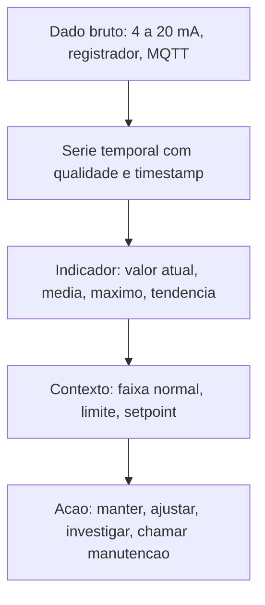
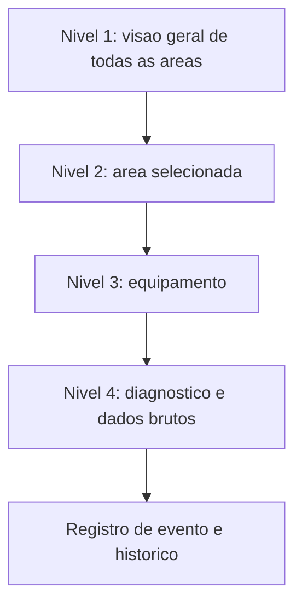
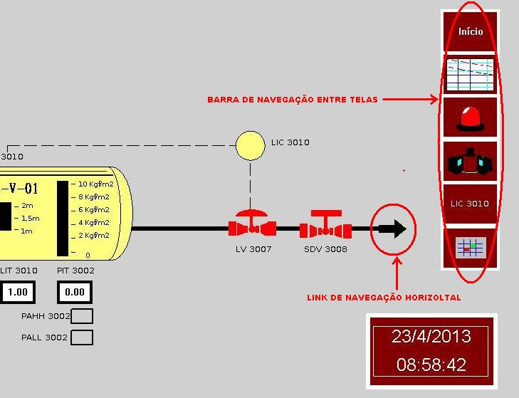
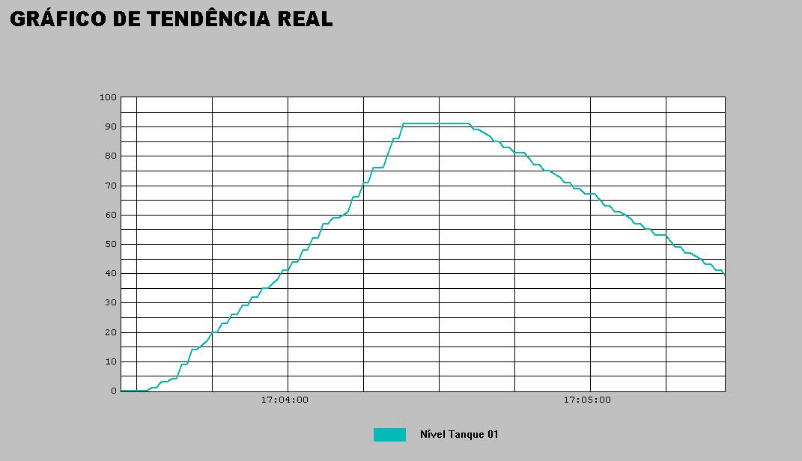
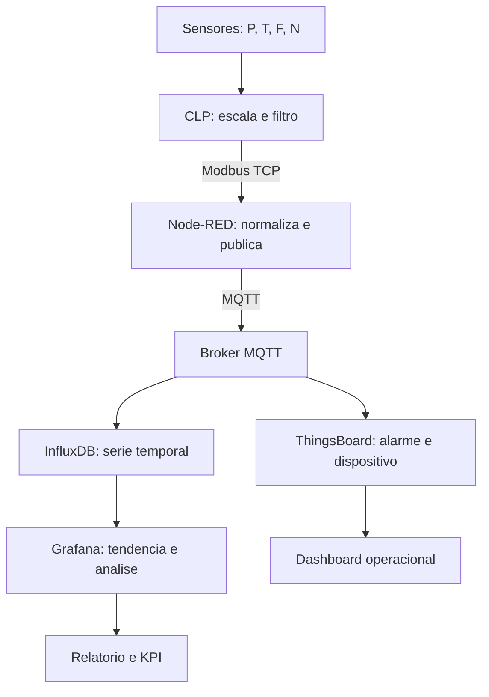
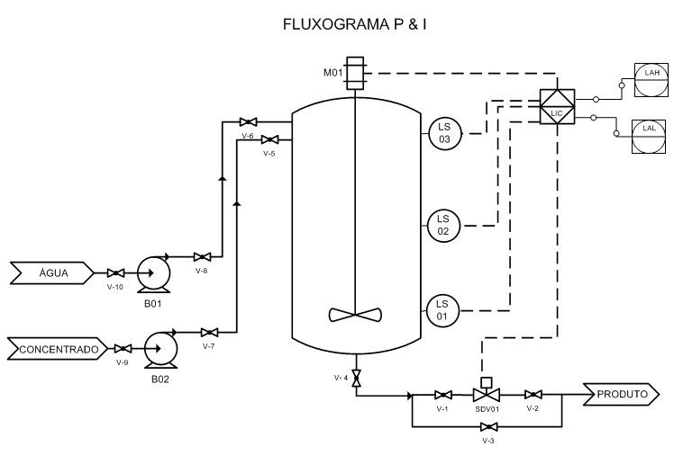

# Capítulo 11 – Dashboards e Visualização de Dados

## Objetivos de Aprendizagem

Ao final deste capítulo, o leitor será capaz de:

- Explicar a diferença entre dado, indicador e decisão, e o papel do dashboard nessa cadeia.
- Projetar uma hierarquia de telas coerente com a tarefa do operador, gestor e engenheiro.
- Escolher o tipo de painel adequado a cada tipo de dado.
- Aplicar princípios de cor, escala, precisão e atualização em painéis industriais.
- Comparar SCADA HMI, Node-RED Dashboard, ThingsBoard e Grafana sem tratá-los como substitutos.
- Configurar fontes de dados, variáveis e *alerting* no Grafana, incluindo provisionamento por arquivo.
- Montar um dashboard de processo com pressão, temperatura, vazão e nível.

---

## 11.1 Do dado ao indicador

Um dashboard não é um repositório de números: é um instrumento de decisão. A cadeia que leva do dado bruto à ação tem quatro elos, e cada elo tem sua responsabilidade.



A falha mais comum em dashboards industriais é pular o elo do **contexto**. Um painel que mostra `72,4` não diz nada; o mesmo valor com a faixa normal (45–70), o limite de alarme (85) e a tendência de 30 minutos permite decidir em segundos.

**Tabela 11.1 – Vocabulário mínimo do dashboard**

| Elemento | Função | Cuidado |
|---|---|---|
| Valor instantâneo | Situação atual | Sem contexto vira número decorativo |
| Tendência | Comportamento no tempo | Janela de tempo tem de ser escolhida, não fixa |
| Indicador de estado | Ligado/desligado, aberto/fechado, manual/automático | Não usar cor de alarme para estado normal |
| KPI de processo | Vazão média, consumo específico, disponibilidade | Precisa de fórmula e período explícitos |
| Alarme | Condição que exige ação | Não despejar a lista completa de alarmes no painel de gestão |
| Meta/limite | Referência de comparação | Marcar graficamente no próprio painel |

> 💡 **Dica:** antes de desenhar qualquer tela, escreva a pergunta que ela responde. "Esta tela responde: a estação está entregando a vazão contratada?" Se a pergunta não estiver clara, o painel será uma coleção de widgets.

---

## 11.2 Hierarquia de telas

A ISA-101 organiza as telas de operação em níveis de detalhe. A mesma ideia vale para dashboards web de processo.

**Tabela 11.2 – Níveis de detalhe e responsabilidade**

| Nível | Público | Pergunta que responde | Densidade |
|---|---|---|---|
| 1 — Visão geral | Gerência, operação | A planta inteira está saudável? | Muito baixa, uma informação por área |
| 2 — Área/processo | Operador | Esta área está dentro do esperado? | Média, sinótico com valores-chave |
| 3 — Equipamento | Operador e manutenção | A bomba 2 está em condição normal? | Alta, todas as variáveis relevantes |
| 4 — Diagnóstico | Manutenção e engenharia | Por que o mancal está aquecendo? | Máxima, tendências, eventos, dados brutos |



A regra prática é **navegação a dois cliques**: do nível 1 ao dado que explica a anomalia em no máximo dois cliques. Se o engenheiro precisa abrir três telas e consultar um banco separado, o dashboard não cumpriu sua função.



> **Fonte:** *Livro SCADA — versão para análise*, p. 83 (Machado, Pontes e Vianna, reproduzida com crédito).

A figura mostra os dois mecanismos de navegação que sustentam a hierarquia da Tabela 11.2. A
**barra de navegação** (à direita) é persistente e dá acesso direto aos níveis 1 e 4 — processo,
tendência e alarmes. O **link horizontal** (no corpo do sinótico, apontando para o equipamento)
é contextual: leva ao nível 3 daquele ativo específico. O relógio fixo no canto inferior direito
não é decoração: sem hora de referência, o operador não consegue comparar a tela com o registro
de eventos.

---

## 11.3 Tipos de painel e quando usar cada um

A escolha do painel depende do tipo de dado e da pergunta.

**Tabela 11.3 – Tipo de painel por tipo de dado**

| Tipo de dado | Painel adequado | Painel inadequado |
|---|---|---|
| Analógico contínuo (temperatura, pressão) | Tendência + valor com faixa | Gauge de ponteiro para 30 variáveis |
| Estado discreto (liga/desliga) | Indicador de estado com rótulo textual | Gráfico de linha |
| Contador acumulativo | Valor com unidade e período | Média do contador |
| Evento esporádico | Tabela ou linha do tempo de eventos | Média móvel |
| Comparação entre unidades | Barra ordenada ou mapa de calor | Pizza com mais de cinco fatias |
| Distribuição no tempo | Histograma e curva de duração | Valor instantâneo |
| Posição geográfica | Mapa com estado por ponto | Lista sem ordenação |



> **Fonte:** *Livro SCADA — versão para análise*, p. 114 (Machado, Pontes e Vianna, reproduzida com crédito).

O painel de tendência é o tipo mais subestimado do dashboard industrial: ele responde "para onde
está indo" e não apenas "quanto está". Repare nos três elementos que fazem a leitura funcionar —
escala **fixa** de 0 a 100, eixo de tempo com hora explícita e legenda nomeando a variável
(`Nível Tanque 01`). Um valor instantâneo de 45 seria idêntico em uma subida ou em uma descida; a
tendência distingue os dois casos em um relance.

### 11.3.1 Cor, escala e precisão

- **Cor é semântica, não decoração.** Vermelho, âmbar e verde ficam reservados para condição anormal, atenção e normal — se a paleta da empresa usar vermelho no cabeçalho, o operador perde a referência.
- **Escala fixa em painéis de processo.** Escala automática faz um desvio de 2% parecer catástrofe. Fixe mínimo e máximo coerentes com a faixa de operação.
- **Precisão significativa.** Registrar 24,8735 °C quando o transmissor tem incerteza de 1 °C é ruído numérico. Duas casas decimais já é exagero para a maioria das variáveis de processo.
- **Atualização coerente com a dinâmica.** Nível de reservatório muda por minuto; atualizar a cada segundo consome rede e chama atenção para o que não muda.
- **Unidade sempre visível.** Um número sem unidade é um erro esperando para acontecer.
- **Nada piscando sem motivo.** Pisca é reservado para alarme não reconhecido de prioridade alta.

**Tabela 11.4 – Antipadrões frequentes e a correção**

| Antipadrão | Por que é ruim | Correção |
|---|---|---|
| Sinótico como papel de parede | Reproduz o desenho do processo, não a informação | Reduzir ao essencial, uma informação por elemento |
| Dezenas de gauges de ponteiro | Exigem leitura lenta e comparação ruim | Tendências agrupadas com faixa fixa |
| Escala automática em painel de alarme | Amplifica ruído e assusta | Escala fixa com limites marcados |
| Dashboard de gestão com dados de 1 s | Ruído e custo de rede | Agregar por período e documentar a agregação |
| Muitas métricas sem hierarquia | Nada se destaca | No máximo cinco indicadores principais por tela |
| Filtro sem indicação de contexto | Usuário não sabe o que está vendo | Cabeçalho com período, ativo e unidade |

---

## 11.4 Comparando plataformas de dashboard

Não existe vencedor: existe tarefa. A comparação útil é por função.

**Tabela 11.5 – Comparação de plataformas de visualização**

| Plataforma | Função principal | Fonte de dados | Perfil de uso | Limitação típica |
|---|---|---|---|---|
| SCADA / HMI | Operação e comando em tempo real | Drivers industriais, CLP | Sala de controle, ação crítica | Custo por licença e pouca flexibilidade analítica |
| Node-RED Dashboard | Prototipagem e painéis operacionais simples | MQTT, HTTP, OPC UA, banco | Bancada, laboratório, integração rápida | Recursos limitados de autenticação e escala |
| ThingsBoard | Gestão de dispositivos e telemetria | MQTT, HTTP, CoAP | Frotas de dispositivos, alarme e RPC | Curva de aprendizado no motor de regras |
| Grafana | Análise e monitoramento sobre séries temporais | InfluxDB, Prometheus, SQL, MQTT | Engenharia, manutenção, gestão | Não é sistema de comando: não substitui o SCADA |

A leitura correta dessas linhas: o SCADA **comanda**, o Grafana **analisa**, o ThingsBoard **gerencia dispositivos e telemetria**, o Node-RED **integra e prototipa**. Em uma planta real, os quatro podem coexistir, cada um no seu papel.

> ⚠️ **Atenção:** dashboard web **não** é interface de segurança nem de comando crítico. Comando de válvula, partida de equipamento e intertravamento pertencem ao CLP e à IHM/SCADA, com requisitos de disponibilidade e latência que um painel em nuvem não garante. Se a rede cai, o painel cai — o processo não pode depender dele.

---

## 11.5 Grafana na prática

O Grafana é uma plataforma de visualização que consulta fontes externas: ele não armazena os dados de processo (com exceção de configuração e estado de alerta). Isso define o desenho da arquitetura: primeiro o banco de séries temporais, depois o painel.

### 11.5.1 Fonte de dados: InfluxDB

A configuração de fonte de dados pode ser feita por interface ou por arquivo de provisionamento. Os dois formatos abaixo são os documentados oficialmente para InfluxDB 1.x e 2.x.

```yaml
# InfluxDB 1.x — banco e modo HTTP
apiVersion: 1
datasources:
  - name: InfluxDB_SCADA
    type: influxdb
    access: proxy
    url: http://influxdb:8086
    jsonData:
      dbName: processos
      httpMode: GET
    secureJsonData:
      password: ${INFLUX_SENHA}
```

```yaml
# InfluxDB 2.x — Flux, organizacao e bucket padrao
apiVersion: 1
datasources:
  - name: InfluxDB_V2
    type: influxdb
    access: proxy
    url: http://influxdb:8086
    jsonData:
      version: Flux
      organization: iffluminense
      defaultBucket: processo
    secureJsonData:
      token: ${INFLUX_TOKEN}
```

Observações de engenharia:

- O `access: proxy` faz o Grafana consultar o banco; o navegador do operador não fala direto com o banco — melhor para segurança e para redes segmentadas.
- Credenciais vão em `secureJsonData`, nunca em `jsonData`. Em ambiente real, use variáveis de ambiente ou cofre de segredos, como indicado no `${...}`.
- No InfluxDB 1.x o campo recomendado é `dbName` (o campo `database` é legado); no 2.x o idioma de consulta é o Flux.

### 11.5.2 Variáveis de dashboard

Variáveis transformam um dashboard em um instrumento reutilizável: em vez de uma tela por área, uma tela com seletor de área, bomba e período.

```json
"templating": {
  "list": [
    {
      "name": "area",
      "type": "query",
      "datasource": "InfluxDB_V2",
      "query": "tag_values(processo, \"area\")",
      "includeAll": true,
      "multi": true,
      "refresh": 1
    }
  ]
}
```

O campo `query` é resolvido pela fonte de dados (por exemplo `tag_values` para InfluxDB) e `refresh` controla quando a lista é recarregada. Um cuidado de desempenho: variável com `refresh: 1` (a cada carregamento) em painel com muitos usuários gera consultas repetidas — considerar `refresh: 2` (sob demanda).

### 11.5.3 Alertas: a limitação que pega todo mundo

> ⚠️ **Atenção:** regras de alerta do Grafana são avaliadas no **backend**, sem o contexto do dashboard. Por isso, **uma regra de alerta não pode usar variáveis de template** (`$area`, `$bomba`): a consulta falha ou não retorna o esperado. Se a mesma consulta precisa existir no painel e no alerta, mantenha **duas versões**: uma com variáveis, para o painel, e outra com valores fixos, para o alerta. É a causa mais comum de "o alerta nunca dispara".

### 11.5.4 Provisionamento como código

Configurar dashboards à mão não escala e não é auditável. O Grafana aceita provisionamento por arquivo em quatro tipos de recurso: **fontes de dados, plugins, dashboards e alertas**. Usuários **não** são provisionados por arquivo — isso é feito por integração com provedor de identidade.

Na prática: dashboards versionados em Git, provisionados por arquivo, revisados por *pull request*. É o equivalente, para a camada de visualização, da gestão de mudanças discutida no capítulo de alarmes.

---

## 11.6 Estudo de caso — dashboard de pressão, temperatura, vazão e nível

**Cenário.** Estação elevatória com quatro variáveis principais: pressão de descarga (0–16 bar), temperatura do mancal (0–120 °C), vazão (0–420 m³/h) e nível do reservatório (0–6 m). Telemetria publicada em MQTT a cada 5 s; persistida em InfluxDB; visualizada em Grafana.



**Esquema de medição (InfluxDB).** Um *measurement* por variável, *tags* para localização e *fields* para valor e qualidade:

```text
measurement: processo
  tags:   area=estacao-1, equipamento=bomba-2, variavel=pressao
  fields: valor=11.4, qualidade=1
```

A **tag** identifica o ativo (cardinalidade baixa e estável); o **field** carrega o número. Trocar isso — usar valor na tag — destrói o desempenho do banco. E a **qualidade** entra como campo, não como comentário: painel que ignora qualidade mostra valor inválido como se fosse bom.

**Painéis do dashboard operacional.**

| Painel | Conteúdo | Configuração relevante |
|---|---|---|
| Faixa de estado geral | Quatro indicadores com faixa normal | Escala fixa, unidade, limites marcados |
| Tendências | P, T, F e N com janela de 8 h | Sobreposição apenas de variáveis correlatas |
| Nível | Tendência longa (7 dias) + marcador de meta | Agregação por hora na janela longa |
| Consumo | KPI de m³/h médio e energia por m³ | Período explícito no título |
| Eventos | Lista de alarmes e mudanças de estado | Ordenada por tempo, com reconhecimento |
| Diagnóstico | Vibração e corrente do motor | Nível 4, acesso restrito |

**Consultas (exemplos em Flux, InfluxDB 2.x).**

```text
from(bucket: "processo")
  |> range(start: -8h)
  |> filter(fn: (r) => r._measurement == "processo")
  |> filter(fn: (r) => r.variavel == "pressao")
  |> filter(fn: (r) => r._field == "valor")
  |> aggregateWindow(every: 1m, fn: mean, createEmpty: false)
```

```text
from(bucket: "processo")
  |> range(start: -7d)
  |> filter(fn: (r) => r.variavel == "nivel")
  |> filter(fn: (r) => r._field == "valor")
  |> aggregateWindow(every: 1h, fn: max)
```



> **Fonte:** *Livro SCADA — versão para análise*, p. 89 (Machado, Pontes e Vianna, reproduzida com crédito).

Antes de desenhar qualquer painel, é preciso ter o **P&I** do processo. O fluxograma acima é a
referência de verdade do estudo de caso: tanque misturador com agitação, duas linhas de
alimentação (água e concentrado) com bombas B01 e B02, linha de produto com a válvula de controle
V-1 e o conjunto de instrumentos que gera cada variável do dashboard — FT (vazão), LT (nível),
TT (temperatura) e o controlador de vazão. O painel só pode mostrar o que o P&I instrumenta; o
resto é expectativa.

**Resultado de engenharia.** O painel de gestão passou a mostrar consumo específico e disponibilidade; o painel do operador ficou com quatro variáveis e a lista de eventos; o nível 4 ficou restrito à manutenção. O tempo de leitura da condição geral caiu de cerca de dois minutos (consulta em três telas diferentes) para menos de dez segundos.

---

## 11.7 Atividade prática

Com os dados históricos disponibilizados em um arquivo CSV (ou em um InfluxDB local) contendo pressão, temperatura, vazão e nível de um período de sete dias:

1. Importe os dados para o banco de séries temporais e defina *tags* e *fields* com justificativa.
2. Crie três dashboards: visão geral (nível 1), área (nível 2) e diagnóstico (nível 4).
3. Escolha o tipo de painel para cada variável, justificando com a Tabela 11.3.
4. Use escala fixa nos painéis de processo e explique os limites escolhidos.
5. Crie uma variável de dashboard para selecionar o período e teste a navegação.
6. Crie **uma** regra de alerta, respeitando a limitação de variáveis de template, e explique a solução adotada.
7. Exporte os dashboards como JSON, versione os arquivos e descreva o fluxo de provisionamento.

---

## Resumo

- Dashboard é instrumento de decisão: sem **contexto** (faixa normal, limite, período), o valor não informa.
- A hierarquia de telas (níveis 1 a 4, alinhada aos princípios da ISA-101) organiza o detalhe por público e por pergunta, com navegação a dois cliques.
- O tipo de painel deve seguir o tipo de dado: tendência para analógico, indicador de estado para discreto, tabela para evento.
- Cor, escala fixa, precisão significativa, unidade visível e atualização coerente são requisitos, não preferências.
- SCADA, Node-RED, ThingsBoard e Grafana têm papéis distintos e complementares; nenhum substitui o comando crítico do SCADA.
- No Grafana, a fonte de dados carrega o dado (InfluxDB 1.x por banco, 2.x com Flux), variáveis tornam o painel reutilizável, o provisionamento por arquivo traz auditabilidade e o *alerting* não aceita variáveis de template.
- Um dashboard industrial mínimo tem quatro variáveis de processo, contexto visual e uma lista de eventos — não trinta gauges.

## Questões de Revisão

1. Explique por que um dashboard que mostra apenas o valor instantâneo é insuficiente para a operação.
2. Descreva os quatro níveis de detalhe de tela e o público de cada um.
3. Qual painel você escolheria para o estado ligado/desligado de oito bombas? Justifique.
4. Por que escala automática é desaconselhada em painéis de processo? Em que caso ela é aceitável?
5. Descreva três antipadrões de dashboard industrial e a correção de cada um.
6. Compare SCADA HMI, Node-RED Dashboard, ThingsBoard e Grafana quanto à função principal e à limitação típica.
7. Qual a diferença entre `jsonData` e `secureJsonData` na configuração de uma fonte de dados no Grafana?
8. Por que uma regra de alerta do Grafana não pode usar variáveis de template? Como resolver?
9. Em um banco de séries temporais, por que o valor medido deve ser *field* e não *tag*?
10. Um gestor pede um dashboard com dados de 1 segundo de todas as 40 variáveis da planta. Apresente duas objeções técnicas e uma proposta alternativa.

## Referências

- GRAFANA LABS. **Documentação oficial do Grafana** — provisionamento de fontes de dados (InfluxDB 1.x e 2.x), modelo JSON de dashboards, variáveis de template e limitações de *alerting* com variáveis. Disponível em: grafana.com/docs. Consulta: 2026.
- INFLUXDATA. **InfluxDB — documentação oficial** (modelo de dados, *tags* e *fields*, linguagem Flux).
- INTERNATIONAL SOCIETY OF AUTOMATION. **ISA-101 — Human-Machine Interfaces for Process Automation Systems** (hierarquia de telas, uso de cor e alarme visual).
- MATERIAL DE ORIGEM: `ISA101.pdf`; *ISA-101 — III Simpósio ISA São Paulo / Sabesp, novembro de 2016*; *ISA boas práticas SCADA/PIMS, 2017*; `Node-Red_InterfaceDeSupervisão.pdf`; `IIoT e suas Tecnologias Aderentes.pdf`.
- OPC FOUNDATION. **OPC UA** — modelo de informação e qualidade de dado (*quality*), usados no contexto de dashboards de processo.
