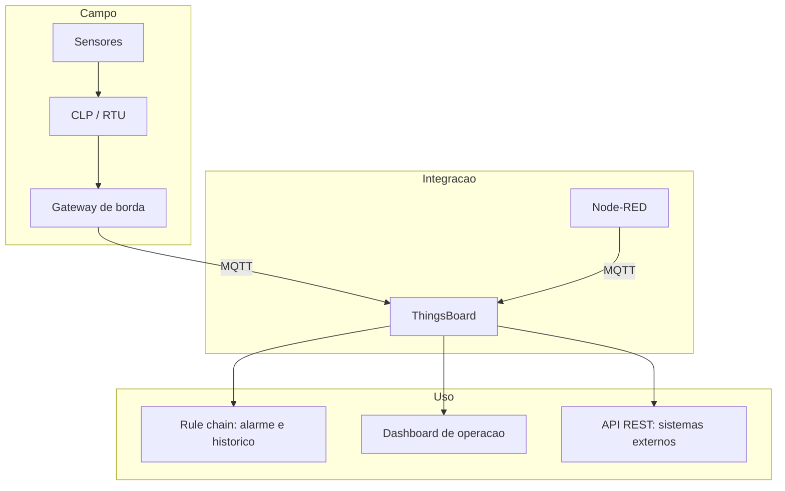
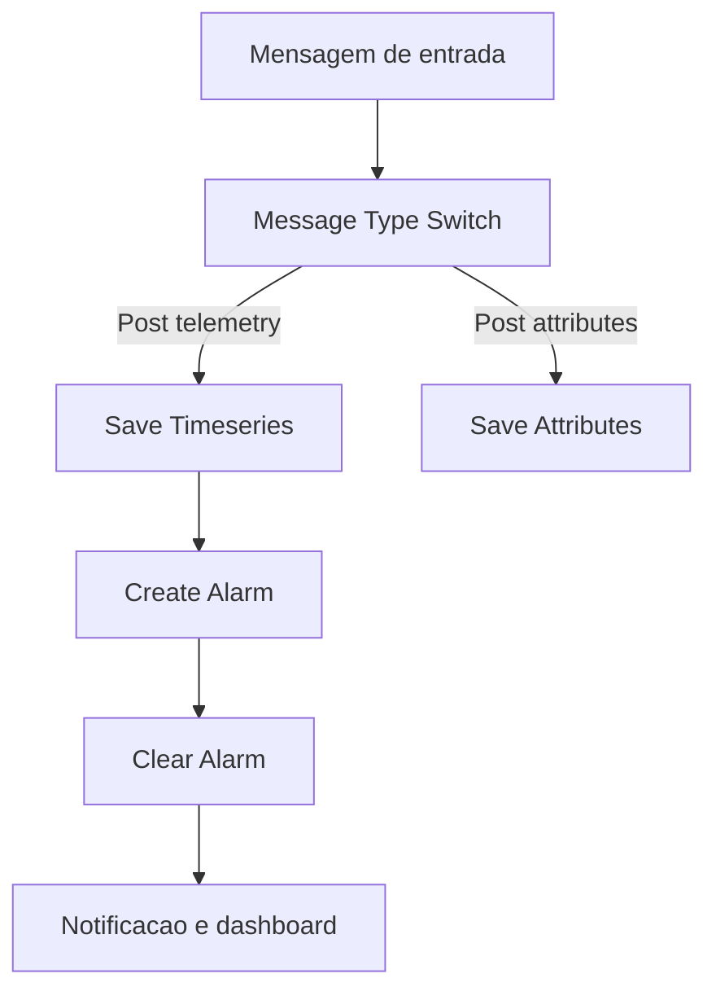

# Capítulo 12 – ThingsBoard

## Objetivos de Aprendizagem

Ao final deste capítulo, o leitor será capaz de:

- Explicar o papel do ThingsBoard em uma arquitetura de supervisão e onde ele **não** deve ser usado.
- Descrever o modelo de entidades da plataforma: locatário, cliente, dispositivo, ativo e perfil.
- Distinguir telemetria de atributos e os escopos de atributo.
- Publicar telemetria por MQTT e por HTTP e explicar o formato do *payload*.
- Construir uma *rule chain* que persiste telemetria e cria e limpa um alarme.
- Distinguir RPC do lado do servidor e do lado do dispositivo.
- Integrar CLP e Node-RED a uma instância ThingsBoard, inclusive por *gateway*.
- Montar um dashboard com telemetria, atributos e alarmes.

---

## 12.1 O que é o ThingsBoard e onde ele se encaixa

O ThingsBoard é uma plataforma de código aberto para **coleta, processamento, visualização e gestão de dados de dispositivos IoT e IIoT**. Ele oferece três modos de uso:

**Tabela 12.1 – Modos de uso**

| Modo | O que é | Quando faz sentido |
|---|---|---|
| Community Edition (CE) | Código aberto, instalado pelo usuário | Estudo, laboratório, piloto, projeto com controle total da infraestrutura |
| Professional Edition (PE) | Distribuição com recursos adicionais de gestão e integração | Operação comercial com requisitos de suporte e escala |
| ThingsBoard Cloud | Serviço gerenciado | Prova de conceito rápida, sem infraestrutura própria |

A documentação oficial concentra a maior parte dos exemplos em três domínios equivalentes: o *site* principal (`thingsboard.io/docs`), a versão profissional (`/docs/pe/`) e a nuvem (`/docs/paas/`). A API de dispositivo, no entanto, é a mesma — o que aprende no laboratório vale na operação.

**Onde ele se encaixa.** O ThingsBoard entra na camada de **integração, telemetria, alarme informativo e visualização** de frotas de dispositivos. Ele não substitui o CLP (controle e proteção) nem o SCADA (operação e comando do processo em tempo real).



> ⚠️ **Atenção:** o ThingsBoard **não** é sistema de comando de processo. Comandos enviados por *dashboards* em nuvem dependem de rede, proxy e disponibilidade da plataforma — nenhum deles é adequado a uma função de segurança ou de controle em malha fechada. Use a plataforma para supervisão, diagnóstico, manutenção e análise; mantenha proteção e controle no CLP.

---

## 12.2 Modelo de entidades

Entender o modelo de entidades é o que separa "usar a plataforma" de "usar a plataforma corretamente".

**Tabela 12.2 – Entidades principais**

| Entidade | Papel | Exemplo na planta |
|---|---|---|
| **Locatário** (*tenant*) | Instância do cliente, raiz dos dados | A concessionária |
| **Cliente** (*customer*) | Subdivisão de negócio dentro do locatário | Município atendido |
| **Dispositivo** (*device*) | Ativo que publica dados | Gateway da estação, transmissor |
| **Ativo** (*asset*) | Agrupamento lógico de dispositivos | Estação elevatória 1, adutora norte |
| **Perfil de dispositivo** (*device profile*) | Modelo com comportamento comum | Perfil "transmissor de pressão" |
| **Grupo de entidades** (*entity group*) | Agrupamento para permissões e consultas | Bombas críticas |

A hierarquia recomendada para processo industrial é: **ativo** representa a instalação física (estação, subestação, adutora) e **dispositivo** representa o equipamento conectado. Relações explícitas entre ativos e dispositivos permitem consultar "todas as variáveis da estação 1" sem armazenar isso no nome de cada dispositivo.

> 💡 **Dica:** nomes de entidade são interface. `EST1-BOMBA2-TEMP-MANCAL` informa; `device_0017` não. Em projeto com mais de vinte dispositivos, um padrão de nomenclatura definido antes do cadastro vale mais que qualquer recurso da plataforma.

---

## 12.3 Telemetria e atributos

A distinção é conceitual e tem consequência direta em custo de armazenamento e desempenho.

**Tabela 12.3 – Telemetria × atributos**

| Aspecto | Telemetria | Atributos |
|---|---|---|
| Natureza | Série temporal: cada valor é um ponto no tempo | Valor de estado: o último valor substitui o anterior |
| Exemplo | Temperatura, pressão, vazão | Número de série, versão de firmware, faixa de medição |
| Armazenamento | Histórico com todos os pontos | Apenas valor atual por chave |
| Escopo | Único | Cliente, compartilhado e servidor |

Os **escopos de atributo** definem quem lê e quem escreve:

- **Atributo de servidor** (*server scope*): gerenciado apenas pela plataforma e pela API; o dispositivo não vê. Útil para dados de gestão, contrato e configuração central.
- **Atributo compartilhado** (*shared scope*): definido na plataforma e **enviado ao dispositivo**. É o mecanismo de configuração remota, como intervalo de amostragem ou limite de alarme.
- **Atributo de cliente** (*client scope*): publicado pelo dispositivo e visível na plataforma. Útil para metadados do próprio equipamento.

### 12.3.1 MQTT: tópicos e formato

O dispositivo autentica com o **token de acesso** e publica em tópicos definidos.

**Tabela 12.4 – Tópicos MQTT de dispositivo**

| Operação | Tópico padrão | Forma curta |
|---|---|---|
| Publicar telemetria | `v1/devices/me/telemetry` | `v2/t` |
| Publicar atributo de cliente | `v1/devices/me/attributes` | — |
| Assinar atributo compartilhado | `v1/devices/me/attributes` | — |
| Assinar RPC do servidor | `v1/devices/me/rpc/request/+` | — |
| Requisição RPC do dispositivo | `v1/devices/me/rpc/request/$id` | `v2/r/req/$id` |
| Resposta de RPC do dispositivo | `v1/devices/me/rpc/response/$id` | `v2/r/res/+` |

Formatos de *payload* aceitos para telemetria:

```json
{"temperature": 22.5, "humidity": 61}
```

```json
{"ts": 1757429087063, "values": {"temperature": 22.5}}
```

```json
[
  {"ts": 1757429080000, "values": {"temperature": 22.5}},
  {"ts": 1757429090000, "values": {"temperature": 22.7}}
]
```

O primeiro formato usa o horário de recebimento na plataforma. O segundo e o terceiro usam **timestamp do dispositivo** (`ts`, em milissegundos Unix) — indispensável quando a publicação pode atrasar, como em enlace de rádio ou *store and forward* na borda.

> ⚠️ **Atenção:** sem *timestamp* do dispositivo, todo dado que chega atrasado é gravado com a hora de chegada. Em enlace instável isso produz séries temporais que mentem: uma leitura de duas horas atrás aparece como atual. Se o seu *gateway* tem fila local, **sempre** envie `ts`.

### 12.3.2 HTTP e REST

Para dispositivos sem MQTT ou para integração com sistemas externos, a plataforma expõe:

```text
POST https://<host>/api/v1/$ACCESS_TOKEN/telemetry
POST /api/plugins/telemetry/{tipoEntidade}/{id}/attributes/{escopo}
```

A mesma estrutura de *payload* é aceita. O segundo *endpoint* é usado por aplicações com credencial de usuário (API REST administrativa), não pelo dispositivo.

---

## 12.4 Rule engine

O motor de regras é o núcleo de processamento: cada mensagem (telemetria, alteração de atributo, evento de ciclo de vida, chamada RPC) percorre uma **rule chain** (*cadeia de regras*), composta por nós conectados.



Nós mais usados em um projeto de supervisão:

| Nó | Função |
|---|---|
| Message Type Switch | Encaminha conforme o tipo da mensagem (telemetria, atributo, RPC) |
| Save Timeseries | Persiste a telemetria com retenção configurável |
| Save Attributes | Grava atributos no escopo definido |
| Create Alarm | Cria ou atualiza um alarme a partir da condição avaliada |
| Clear Alarm | Encerra o alarme quando a condição cessa |
| Fetch Device Info | Enriquece a mensagem com dados da entidade de origem |
| Kafka / MQTT / REST | Publica a mensagem em sistemas externos |

> 🖼️ **[Figura 12.1 – Editor de rule chain com o fluxo de alarme]**
> *Captura do editor com quatro nós conectados: Message Type Switch, Save Timeseries, Create Alarm e Clear Alarm. Anotar as saídas "Post telemetry", "Success" e "Alarm created"; destacar onde ficam o tipo do alarme e a severidade. Interface em inglês, captura genérica.*

Um nó comum é o **Message Type Switch**, que separa o fluxo: mensagens `Post telemetry`, `Post attributes` e `RPC Request` seguem caminhos diferentes na mesma cadeia.

### 12.4.1 Alarme como entidade

No ThingsBoard o alarme é uma **entidade** com estado. Os campos relevantes observáveis na documentação oficial:

- **Tipo** (*type*), como `High Temperature`.
- **Severidade** (*severity*): `CRITICAL`, `MAJOR`, `MINOR`, `WARNING`, `INDETERMINATE`.
- **Origem** (*originator*): dispositivo ou ativo que gerou.
- **Estado**: ativo não reconhecido (`ACTIVE_UNACK`), ativo reconhecido, limpo não reconhecido, limpo reconhecido.
- **Instantes** de início (`startTs`) e fim (`endTs`).
- **Detalhes** (*details*): valores do momento, definidos por script.

```json
{
  "scriptLang": "TBEL",
  "alarmType": "High Temperature",
  "severity": "CRITICAL",
  "alarmDetailsBuildTbel": "return { temperature: msg.temperature };"
}
```

O nó **Clear Alarm** encerra o alarme quando a condição normaliza — e o **reconhecimento** é dado operacional, não de configuração: é o registro de que alguém assumiu o alarme.

> 📌 **Atualização tecnológica:** o alarme em plataforma IIoT **não substitui** o gerenciamento de alarmes de processo do capítulo 10. Ele cobre o ciclo operacional de notificação, reconhecimento e histórico de uma frota de dispositivos, mas a filosofia de alarmes, a matriz de prioridade, a racionalização e o controle de mudanças continuam sendo o que dá qualidade ao sistema. Sem essas disciplinas, a plataforma apenas automatiza a produção de alarmes em excesso.

---

## 12.5 RPC — comando e consulta

RPC (*Remote Procedure Call*) permite trocar comandos e respostas entre plataforma e dispositivo.

- **RPC do lado do servidor** (*server-side*): a plataforma (ou um dashboard) envia um comando ao dispositivo. Exemplos: alterar intervalo de amostragem, solicitar leitura imediata, acionar reinício controlado.
- **RPC do lado do dispositivo** (*client-side*): o dispositivo solicita algo à plataforma por um tópico de requisição e recebe a resposta em outro.

```text
Dispositivo publica:  {"method": "getCurrentTime", "params": {}}
em v1/devices/me/rpc/request/42
Plataforma responde:  {"currentTime": 1757429087063}
em v1/devices/me/rpc/response/42
```

Cuidado de engenharia: RPC é um canal de **comando**, e comando exige autorização e auditoria. Antes de habilitar RPC de escrita em um dispositivo de processo, defina quem pode chamar, qual o efeito de um comando repetido (idempotência) e como o evento aparece no registro de auditoria.

---

## 12.6 Dashboards e visualização

Os dashboards da plataforma oferecem painéis de série temporal, indicadores, tabelas, mapas e widgets de alarme. O que muda em relação ao capítulo 11 é a **origem do dado**: aqui o painel consulta a própria plataforma, e não um banco externo.

Diretrizes que continuam valendo integralmente:

- Escala fixa em painéis de processo; unidade visível; precisão significativa.
- Poucos indicadores por tela, com hierarquia clara.
- Cor reservada para significado, não para estética.
- Lista de alarmes separada do painel de indicadores — no painel de operação, o alarme entra como destaque e como contagem por severidade.

> 🖼️ **[Figura 12.2 – Dashboard de operação com telemetria, atributos e alarmes]**
> *Tela com quatro indicadores de processo com faixa normal, duas tendências (24 h), um widget de estado de alarme por severidade e uma tabela de dispositivos com último contato. Destacar o uso de escala fixa e a ausência de cor decorativa. Captura genérica, sem marca de terceiros.*

---

## 12.7 Integração com CLP e com Node-RED

### 12.7.1 Direto do CLP

CLPs com função de cliente MQTT publicam telemetria diretamente, desde que o *payload* siga o formato esperado e o token esteja protegido. Como token em CLP é difícil de rotacionar, o padrão mais defensável é **não** expor a credencial no controlador.

### 12.7.2 Por gateway de borda

O *gateway* concentra credenciais, fila local e conversão de protocolo. A plataforma define tópicos específicos para esse papel:

**Tabela 12.5 – Tópicos MQTT de gateway (prefixo `v1/gateway/`)**

| Tópico | Direção | Uso |
|---|---|---|
| `connect` / `disconnect` | Publica | Anunciar conexão e desconexão de dispositivo subordinado |
| `telemetry` | Publica | Enviar telemetria de um ou vários dispositivos |
| `attributes` | Publica / Assina | Enviar atributos de cliente e receber atributos compartilhados |
| `attributes/request` e `attributes/response` | Publica / Assina | Solicitar valores de atributo |
| `rpc` | Assina / Publica | Receber comandos do servidor e enviar respostas |
| `claim` | Publica | Iniciar processo de reivindicação de dispositivo |

Esse desenho é o que viabiliza o caso clássico: **um gateway para N dispositivos**, com uma única credencial e um único ponto de filtragem e buffer.

> 🖼️ **[Figura 12.3 – Gateway de borda concentrando dispositivos para a plataforma]**
> *Diagrama com três CLPs e quatro transmissores de campo à esquerda; no centro, o gateway de borda com fila local e conversão de protocolo; à direita, a plataforma recebendo um único fluxo MQTT. Marcar com tracejado o caminho que permanece local quando o enlace cai. Sem logomarca de fabricante.*

### 12.7.3 Com Node-RED

O Node-RED atua como camada de integração e normalização — papel discutido no capítulo 7:

```text
CLP -> Node-RED (Modbus TCP) -> normaliza -> MQTT -> ThingsBoard
```

Vantagens: conversão de unidades e escalas no fluxo, agregação, cálculo de indicadores antes da publicação (reduz volume na nuvem) e buffer em caso de queda de enlace.

> ⚠️ **Atenção:** publique na nuvem a **taxa que a decisão exige**, não a taxa que o CLP produz. Publicar 50 variáveis a 100 ms gera gigabytes por mês de dado que ninguém vai analisar. Agregue na borda (média, máximo e mínimo por minuto) e mantenha a alta taxa apenas para diagnóstico sob demanda.

---

## 12.8 Estudo de caso — monitoramento de frota de transmissores

**Cenário.** Uma estação de tratamento possui 24 transmissores de pressão e nível em campo, conectados a dois CLPs. Objetivo: acompanhar falhas de instrumento e condições anormais sem depender do operador para perceber o problema.

**Arquitetura.** CLP lê os transmissores; Node-RED na borda lê o CLP por Modbus TCP, normaliza escalas, calcula média de 1 minuto e publica em MQTT; um único *gateway* ThingsBoard encaminha 24 dispositivos; a *rule chain* persiste telemetria, cria alarme de desvio e de falha de comunicação e notifica a manutenção.

**Regras implementadas.**

| Condição | Alarme | Severidade |
|---|---|---|
| Pressão fora da faixa por mais de 5 min | Desvio de processo | MAJOR |
| Valor com qualidade ruim por mais de 2 min | Falha de comunicação | CRITICAL |
| Sem mensagem por mais de 10 min | Dispositivo silencioso | CRITICAL |
| Bateria abaixo de 20% (onde aplicável) | Manutenção preventiva | WARNING |

**Decisões de projeto que fizeram diferença.**

1. **Timestamp do dispositivo** mantido em todos os pontos, porque o enlace de rádio enfileira mensagens em dias de chuva.
2. **Alarme de comunicação separado** de alarme de processo — o mesmo erro discutido no capítulo 10.
3. **Agregação na borda**: 24 variáveis a 10 s na coleta, 1 minuto na publicação; volume na nuvem reduzido em cerca de 80%.
4. **Limite de alarme como atributo compartilhado**, ajustável pela plataforma sem reconfigurar o CLP — com registro de quem alterou.
5. **Autorização por papel**: operação reconhece alarmes; engenharia altera limites; nenhum perfil de dashboard pode acionar RPC de escrita.

**Limitações reconhecidas.** A plataforma não participa de proteção nem de intertravamento; o reconhecimento de alarme na plataforma não substitui o registro do SCADA; e nenhum comando crítico depende de disponibilidade de Internet.

---

## 12.9 Atividade prática

1. Suba uma instância ThingsBoard local (Docker) ou use uma instância de teste fornecida pelo professor.
2. Cadastre um **ativo** representando uma estação e dois **dispositivos** (transmissor de pressão e transmissor de nível) com perfil adequado.
3. Publique telemetria por MQTT com e sem `ts` e compare os horários registrados. Explique a diferença.
4. Defina um **atributo compartilhado** de limite de alarme e altere seu valor; descreva o efeito.
5. Monte uma *rule chain* que salve telemetria, crie alarme quando a pressão exceder o limite compartilhado e limpe o alarme na normalização; teste os dois caminhos.
6. Configure um dashboard com dois indicadores, uma tendência de 24 h e um widget de alarmes.
7. Simule falha de comunicação (pare de publicar por 10 min) e verifique o alarme correspondente.
8. Entregue um relatório de uma página com a arquitetura, a lista de alarmes configurados com severidade e justificativa, e um parágrafo sobre o que **não** deve ser feito por essa plataforma.

---

## Resumo

- ThingsBoard é plataforma de **coleta, processamento, gestão e visualização** de dados de dispositivos — não é CLP nem SCADA, e não participa de proteção ou controle crítico.
- O modelo de entidades (locatário, cliente, dispositivo, ativo, perfil) precisa de padrão de nomenclatura e hierarquia definidos antes do cadastro.
- **Telemetria** é série temporal; **atributo** é estado. Escopos: servidor, compartilhado (desce para o dispositivo) e cliente.
- A API MQTT usa `v1/devices/me/...` (com formas curtas `v2/...`); o *gateway* usa o prefixo `v1/gateway/`.
- Sempre envie **timestamp do dispositivo** quando houver fila ou enlace instável.
- A **rule chain** processa cada mensagem; alarme é uma entidade com severidade, estado, instantes e detalhes, criada por Create Alarm e encerrada por Clear Alarm.
- **RPC** é canal de comando: exige autorização, idempotência e auditoria.
- A integração típica é CLP → Node-RED → MQTT → ThingsBoard, com **agregação na borda** e limites ajustáveis por atributo compartilhado.
- A plataforma automatiza o ciclo operacional do alarme, mas não substitui a disciplina de gerenciamento de alarmes.

## Questões de Revisão

1. Em que camada da pirâmide de automação o ThingsBoard atua e por que ele não substitui o SCADA?
2. Explique a diferença entre *device* e *asset* e dê um exemplo de hierarquia para uma estação elevatória.
3. Qual a diferença entre telemetria e atributo? Por que o histórico completo só existe para telemetria?
4. Descreva os três escopos de atributo e dê um caso de uso para cada um.
5. Um dispositivo publica sem `ts` e o enlace de rádio fica 30 minutos fora. O que aparece no gráfico? Como corrigir?
6. Escreva o tópico MQTT e um *payload* válido para publicar temperatura e umidade com carimbo de tempo.
7. Para que serve o prefixo `v1/gateway/` e qual problema ele resolve?
8. Descreva o papel dos nós Create Alarm e Clear Alarm e o que significa o estado `ACTIVE_UNACK`.
9. Qual a diferença entre RPC do lado do servidor e do lado do dispositivo? Cite um risco de segurança de cada um.
10. Um projeto pretende usar ThingsBoard em nuvem para fechar uma válvula automaticamente quando a pressão exceder 12 bar. Avalie tecnicamente a proposta e apresente uma alternativa.

## Referências

- THINGSBOARD. **Documentação oficial** — conceitos de entidades, API MQTT de telemetria e atributos, API de *gateway*, motor de regras (nós Create Alarm e Clear Alarm, exemplo de *rule chain*), RPC de dispositivo e API REST de atributos. Disponível em: thingsboard.io/docs (versões CE, PE e PaaS). Consulta: 2026.
- MATERIAL DE ORIGEM: `IIoT e suas Tecnologias Aderentes.pdf`; `IoT.pdf`; `Node-Red_InterfaceDeSupervisão.pdf`; *Livro SCADA — versão para análise* (arquitetura de integração).
- OASIS. **MQTT Version 3.1.1 e 5.0** — especificação do protocolo de mensagens usado na integração.
- ECLIPSE FOUNDATION. **Sparkplug 3.0** — especificação de tópicos e estado para integração MQTT industrial.
