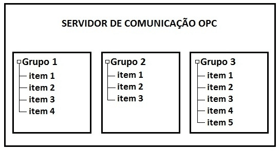
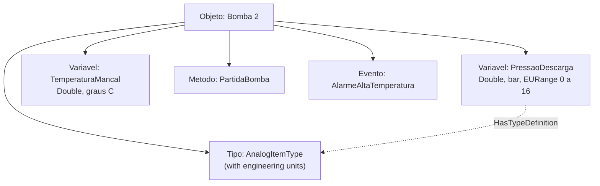
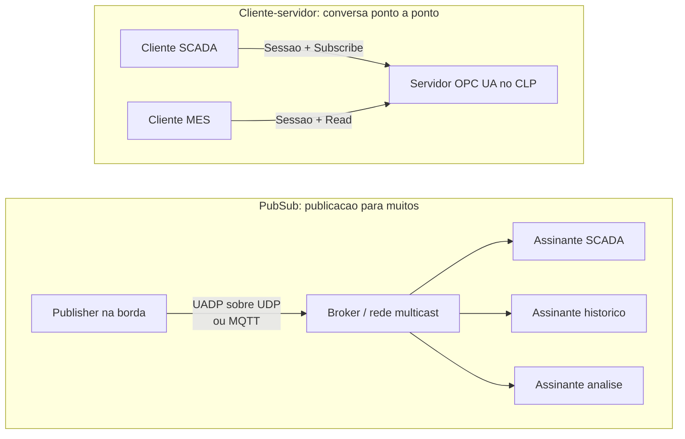
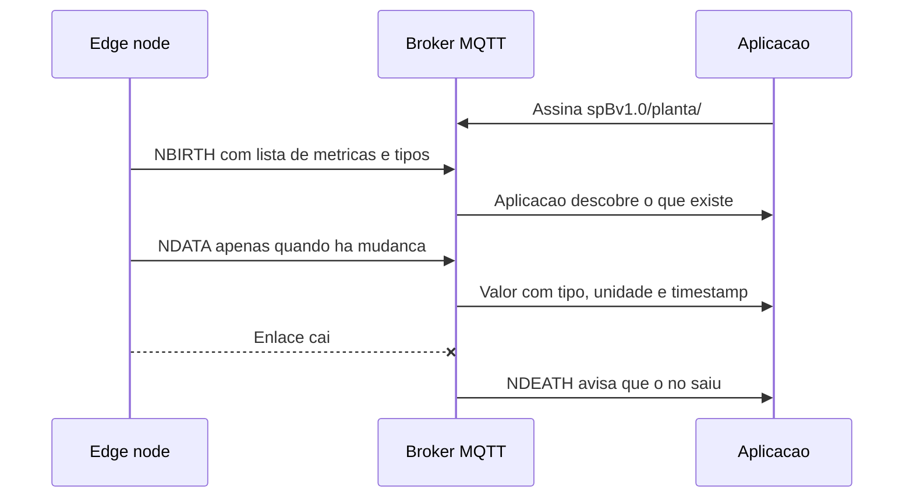
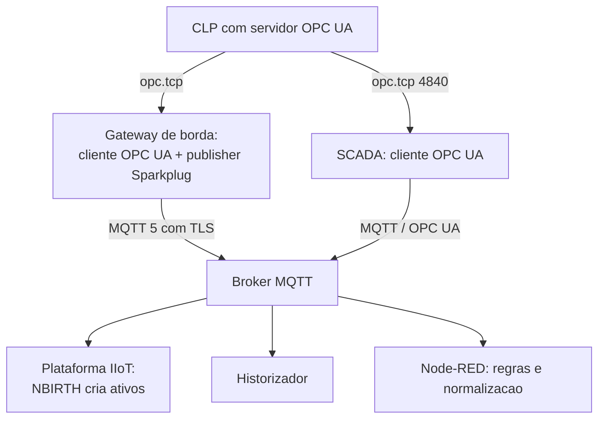

# Capítulo 13 – OPC UA, MQTT e Sparkplug B

## Objetivos de Aprendizagem

Ao final deste capítulo, o leitor será capaz de:

- Explicar por que a integração de sistemas é um problema de **semântica**, não apenas de protocolo.
- Descrever o modelo de informação do OPC UA e a função do espaço de endereços.
- Distinguir os modos de segurança do OPC UA e escolher uma política adequada.
- Diferenciar o OPC UA cliente-servidor do OPC UA PubSub e dizer quando cada um se aplica.
- Explicar o modelo publish-subscribe do MQTT, seus níveis de QoS, *retained messages* e *last will*.
- Descrever o que o Sparkplug B acrescenta ao MQTT e por que isso importa em IIoT.
- Projetar uma integração CLP → borda → SCADA → plataforma combinando os três.
- Reconhecer os erros de projeto mais comuns nessas integrações.

---

## 13.1 O problema: conectar é fácil, entender é difícil

Um CLP que expõe 4.000 registradores Modbus está "conectado". Mas o que é o registrador 40012? É a pressão de descarga da bomba 2? Em que unidade? Está escalado? Qual o valor que significa "sem medição"?

Essa é a diferença entre **transporte** e **semântica**:

- **Transporte** leva bytes de um ponto a outro: Modbus, TCP, MQTT, HTTP.
- **Semântica** diz o que os bytes significam: identificação do ativo, unidade, escala, tipo de dado, qualidade, relação entre variáveis.

Modbus e outros protocolos clássicos resolvem o transporte e deixam a semântica para a documentação — que envelhece, se perde e diverge entre projetos. OPC UA e Sparkplug B são respostas diferentes ao mesmo problema: **levar significado junto com o dado**.

**Tabela 13.1 – Onde cada solução atua**

| Camada | O que define | Quem resolve bem |
|---|---|---|
| Transporte confiável | Entrega da mensagem | TCP, MQTT, OPC UA |
| Identificação do dado | Qual variável, de qual ativo | OPC UA (espaço de endereços); Sparkplug B (tópico + métricas) |
| Significado do dado | Tipo, unidade, escala, faixa | OPC UA (modelo de informação); Sparkplug B (payload tipado) |
| Qualidade e tempo | Valor válido? De quando? | OPC UA (*status code*, *source timestamp*); Sparkplug B (*timestamp* por métrica) |
| Comportamento | Como ler, escrever, assinar, descobrir | OPC UA (serviços); Sparkplug B (estado, nascimento/morte) |

> 💡 **Dica:** antes de escolher o protocolo, escreva a **lista de variáveis com unidade, faixa e regra de qualidade**. Metade dos projetos de integração falha porque essa lista não existe e a outra metade porque ela existe apenas na cabeça de quem escreveu o CLP.

---

## 13.2 OPC UA

A **OPC UA** (*OPC Unified Architecture*) foi lançada pela OPC Foundation em **2008** e é normalizada como a série **IEC 62541** (verifique a edição vigente antes de citá-la em projeto). Ela sucedeu o OPC clássico (DCOM) resolvendo três limitações que inviabilizavam seu uso em redes industriais modernas: dependência de Windows/DCOM, dificuldade de atravessar *firewalls* e ausência de um modelo de informação padronizado.

> 📌 **Referência histórica:** o **OPC clássico** (OPC DA, 1996) organizava o acesso a dados em
> três níveis — **servidor**, **grupo** e **item**. O grupo existia por uma razão prática: era a
> unidade de *scan rate* e de ativação, o que permitia ler mais devagar o que não mudava.
> Referência atualmente aplicável: **OPC UA (IEC 62541)**. Motivo da atualização: o OPC clássico
> depende de DCOM/Windows e não atravessa *firewall* corporativo de forma segura.



> **Fonte:** *Livro SCADA — versão para análise*, p. 48 (Machado, Pontes e Vianna, reproduzida com crédito).

Vale entender essa hierarquia porque o OPC UA **manteve a ideia** e trocou a implementação: o que
no OPC clássico era "grupo com taxa de leitura" virou **sessão com assinatura**
(`Subscription` + `MonitoredItem`), e o "item" virou **nó** de um espaço de endereços com tipo,
unidade e qualidade. A herança explica por que tantos clientes OPC UA ainda expõem a leitura
"por grupo de itens": é a tradução direta do modelo antigo.

### 13.2.1 Modelo de informação

O OPC UA não expõe "registradores": expõe um **espaço de endereços** (*address space*) organizado em **nós** ligados por **referências** hierárquicas.



Cada nó tem **atributos** (valor, tipo, *status code*, *source timestamp*, descrição) e **referências** para outros nós. A hierarquia é definida pelo servidor, não pelo cliente — o cliente **descobre** a estrutura com `Browse` em vez de receber um mapa de registradores.

Os **tipos** vêm de *ObjectTypes* e *VariableTypes* padronizados, e a OPC Foundation publica **especificações de acompanhamento** (*companion specifications*) por domínio, com numeração própria (séries OPC 3xxxx e 4xxxx). Quando existe uma especificação de acompanhamento para o seu setor, usá-la é o caminho mais curto para interoperar com terceiros.

### 13.2.2 Serviços

Os serviços são agrupados em conjuntos. Os que aparecem em todo projeto:

| Serviço | Para que serve |
|---|---|
| `Browse` | Descobrir a estrutura e os nós disponíveis |
| `Read` / `Write` | Ler e escrever valores |
| `Subscribe` + `MonitoredItem` | Assinar variações: o servidor envia quando muda (menos tráfego que *polling*) |
| `Call` | Chamar métodos no servidor (comandos) |
| `HistoryRead` | Ler histórico do próprio servidor |
| `CreateSession` / `ActivateSession` | Estabelecer e autenticar a sessão |

Dois detalhes de engenharia que mudam o resultado do projeto:

- **Assinatura com *sampling interval* e *deadband*.** Assinar sem *deadband* inunda o cliente com variações irrelevantes da última casa decimal. O *deadband* (absoluto ou percentual) resolve o mesmo problema que a faixa morta de um alarme.
- **`StatusCode` obrigatório.** Todo valor lido carrega um código de status. Um valor "0,0 bar" pode ser leitura válida de pressão zero **ou** indicar que a variável está com qualidade ruim. Tratar os dois casos como iguais é a origem de diagnóstico errado (e de alarme espúrio, como discutido no Capítulo 10).

### 13.2.3 Segurança

O OPC UA traz segurança no próprio protocolo, o que nenhum protocolo clássico da camada de campo oferece:

- **Endpoints e políticas de segurança.** Um servidor anuncia vários *endpoints* com políticas diferentes — de `None` (nenhuma) até `Basic256Sha256` e variantes com AES/SHA-256. A política define assinatura e cifragem das mensagens.
- **Modos de mensagem**: `None`, `Sign` (integridade) e `SignAndEncrypt` (integridade e confidencialidade).
- **Certificados X.509** para aplicação e para usuário, com troca e validação de confiança (*trust lists*).
- **Autenticação de usuário** por senha, certificado ou *token* de identidade.

> ⚠️ **Atenção:** aceitar `SecurityPolicy: None` "porque é mais fácil" em rede compartilhada significa expor leitura e escrita de qualquer variável. Em rede de laboratório, documente a exceção; em rede de campo, não faça. E lembre: certificado expirado derruba a comunicação **exatamente como uma falha de rede** — coloque a renovação no calendário de manutenção.

### 13.2.4 Cliente-servidor e PubSub



| Critério | Cliente-servidor | PubSub |
|---|---|---|
| Modelo | Sessão entre cliente e servidor, ponto a ponto | Publicação em rede, muitos assinantes |
| Transporte | `opc.tcp` (porta 4840), HTTPS, WebSocket | UADP sobre UDP, MQTT, AMQP |
| Escala | Boa para supervisão e engenharia | Melhor para muitos consumidores do mesmo dado |
| Latência | Baixa e determinística | Depende do transporte (MQTT acrescenta broker) |
| Uso típico | Diagnóstico, comando, configuração, engenharia | Telemetria em massa, IIoT, integração com nuvem |

A regra prática: **cliente-servidor para quem conversa com o ativo; PubSub para quem consome o dado em escala.**

> 🖼️ **[Figura 13.2 – Espaço de endereços de um servidor OPC UA]**
> *Captura de um cliente OPC UA genérico mostrando a árvore de nós: Objects → Servidor → Bomba 1 → variáveis com tipo, unidade e valor; ao lado, o painel de atributos do nó selecionado, com StatusCode e SourceTimestamp visíveis. Destacar que a estrutura é descoberta pelo cliente, não digitada em planilha.*

---

## 13.3 MQTT

O **MQTT** (*Message Queuing Telemetry Transport*) é um protocolo publish-subscribe padronizado pela OASIS — versão **3.1.1** e versão **5.0** —, pensado para enlaces instáveis e dispositivos com poucos recursos.

O desenho é simples: dispositivos **publicam** em um **tópico**; o **broker** entrega a quem **assinou** aquele tópico (ou um padrão de tópicos). Publisher e subscriber não se conhecem.

### 13.3.1 Tópicos e curingas

Os tópicos são hierárquicos, separados por `/`:

```text
planta/estacao-1/bomba-2/pressao
planta/estacao-1/bomba-2/temperatura
```

| Curinga | Alcance | Exemplo |
|---|---|---|
| `+` | Um nível | `planta/estacao-1/+/pressao` |
| `#` | Todos os níveis abaixo (só no fim) | `planta/estacao-1/#` |

O tópico é **contrato de interface**: renomear um nível quebra todos os assinantes silenciosamente. Trate a estrutura de tópicos como se fosse o mapa de registradores do seu Modbus — documentada e versionada.

### 13.3.2 Recursos que definem o comportamento

| Recurso | O que faz | Cuidado prático |
|---|---|---|
| QoS 0 | Entrega "no máximo uma vez" (pode perder) | Aceitável para telemetria de tendência, não para evento |
| QoS 1 | Entrega "ao menos uma vez" (pode duplicar) | O assinante precisa ser idempotente |
| QoS 2 | Entrega exatamente uma vez (mais custoso) | Use com parcimônia em enlace de campo |
| *Retained message* | O broker guarda a última mensagem do tópico e a entrega a novos assinantes | Excelente para "último valor"; perigoso para dado temporal |
| *Last will and testament* (LWT) | Mensagem publicada pelo broker quando o cliente cai | É como se detecta "dispositivo silencioso" |
| Sessão persistente | Assinaturas e fila sobrevivem à desconexão | No 5.0 a expiração de sessão é explícita |

A versão 5.0 acrescentou o que faltava para uso industrial: códigos de motivo (*reason codes*), propriedades de usuário, *shared subscriptions* (vários consumidores dividindo a carga de um tópico), apelidos de tópico e expiração de sessão.

**Tabela 13.2 – MQTT 3.1.1 × 5.0 (o que muda em projeto industrial)**

| Aspecto | 3.1.1 | 5.0 |
|---|---|---|
| Motivo de falha | Limitado | Códigos de motivo e propriedades |
| Sessão | Binária (limpa ou persistente) | Expiração configurável |
| Escala de consumo | Um assinante por mensagem | *Shared subscriptions* |
| Diagnóstico | Difícil | Propriedades de usuário e fluxo de motivo |

> ⚠️ **Atenção:** MQTT puro não diz **o que** está no *payload* nem **de quando** ele é. Um JSON `{"t": 23.4}` não informa unidade, ativo nem instante. Sem convenção, cada integração inventa a sua — e o resultado é o que se vê em muitas plantas: dado na nuvem que ninguém consegue interpretar sem perguntar a quem escreveu o *gateway*.

---

## 13.4 Sparkplug B: MQTT com regras

O **Sparkplug B** é uma especificação mantida pela **Eclipse Foundation** (versão **3.0**) que **define a convenção** que faltava no MQTT industrial: estrutura de tópicos, formato de *payload* e uma máquina de estados para os dispositivos.

### 13.4.1 Estrutura de tópicos

```text
spBv1.0/<grupo>/<tipo de mensagem>/<edge node>/[device]
```

| Tipo de mensagem | Significado |
|---|---|
| `NBIRTH` / `NDEATH` | Nascimento e morte do *edge node*: o que ele publica e quando ele deixa de existir |
| `DBIRTH` / `DDEATH` | Nascimento e morte de um dispositivo subordinado |
| `NDATA` / `DDATA` | Dados do nó e do dispositivo |
| `NCMD` / `DCMD` | Comandos para o nó e para o dispositivo |
| `STATE` | Estado do próprio sistema hospedeiro (online/offline) |



O ganho é direto:

- **`NBIRTH` entrega o dicionário de dados.** O consumidor descobre nomes, tipos e unidades das métricas sem planilha externa.
- **`NDEATH`/`DDEATH`** resolvem a detecção de dispositivo offline de forma explícita (é o LWT organizado).
- **Publicação por exceção** (*report by exception*): publica quando muda, reduzindo tráfego de enlace caro.
- **Payload com tipo e *timestamp* por métrica** — resolve o problema do "número sem contexto".
- **Número de sequência** permite detectar perda de mensagens.

### 13.4.2 O que o Sparkplug **não** resolve

- Não é controle: não é protocolo de malha fechada nem de segurança funcional.
- Não substitui o OPC UA para descoberta rica de estrutura, métodos e histórico em equipamento que já fala OPC UA.
- Não dispensa a disciplina de modelagem: um sistema Sparkplug mal nomeado continua sendo um sistema difícil de integrar.

---

## 13.5 Combinando as três peças

Na prática, os protocolos se sobrepõem em papéis diferentes:

**Tabela 13.3 – Comparação para decisão de projeto**

| Critério | OPC UA cliente-servidor | MQTT 5.0 | Sparkplug B sobre MQTT |
|---|---|---|---|
| Descoberta de estrutura | Completa (espaço de endereços) | Nenhuma | Dicionário no `NBIRTH` |
| Semântica do dado | Tipos, unidades, *status code* | Definida pelo usuário | Métrica tipada no *payload* |
| Segurança | Nativa (X.509, políticas) | TLS no transporte + credenciais | Herdada do MQTT/TLS |
| Comando | Serviços e métodos | Tópico de comando (livre) | `NCMD`/`DCMD` padronizados |
| Escala de consumidores | Sessão por cliente | Alta, com *shared subscriptions* | Alta |
| Melhor uso | Equipamento, engenharia, comando | Telemetria, integração, nuvem | IIoT padronizado, frota de *gateways* |
| Limitação típica | Mais pesado na borda | Sem semântica | Menos flexível que OPC UA |



> 📌 **Atualização tecnológica:** este capítulo não existia no material original, que tratava OPC UA e MQTT apenas como "protocolos modernos" em um subtópico. A separação entre transporte, semântica e comportamento — e o papel do Sparkplug B como convenção — refletem a prática atual de projetos de integração industrial. As fontes estão citadas ao final.

> 🖼️ **[Figura 13.3 – Arquitetura de integração com OPC UA e Sparkplug B]**
> *Diagrama em camadas: à esquerda o CLP com servidor OPC UA (endpoint e política de segurança anotados); no centro o gateway de borda com as duas funções destacadas (cliente OPC UA e publisher Sparkplug); à direita o broker e os consumidores (SCADA, historizador, plataforma, Node-RED). Anotar o sentido das setas e marcar com cadeado o trecho cifrado.*

---

## 13.6 Estudo de caso — integração de uma frota de gateways

> 🖼️ **[Figura 13.4 – Tela de configuração do publisher Sparkplug no gateway de borda]**
> *Captura de uma interface de configuração de gateway (genérica, sem marca) com: endereço do broker e porta, TLS habilitado e certificado carregado, `group id` e `edge node id`, intervalo de publicação e *deadband* por métrica, e a lista de métricas mapeadas com nome, tipo e unidade. Destacar a área onde aparece o `NBIRTH` publicado e o estado da conexão.*

**Cenário.** Cinco subestações de distribuição de água, cada uma com um CLP e um *gateway* de borda. O SCADA central precisa de supervisão em tempo real; a engenharia precisa de histórico; a gestão precisa de indicadores; e a manutenção precisa saber quando um *gateway* cai. O enlace é 4G, com franquia de dados.

**Decisão de arquitetura.**

| Necessidade | Solução | Por quê |
|---|---|---|
| Supervisão do CLP em tempo real | OPC UA cliente-servidor, assinatura com *deadband* | Descoberta de estrutura, *status code* e controle de tráfego |
| Telemetria agregada para a nuvem | Sparkplug B sobre MQTT 5 com TLS | Dicionário no `NBIRTH`, publicação por exceção, detecção de queda |
| Detecção de *gateway* offline | `NDEATH` + monitoramento do broker | Não depende de alguém perceber o dado parado |
| Comando de *setpoint* | OPC UA `Write` autenticado, com registro de auditoria | Comando exige controle de acesso e trilha |
| Histórico | Historizador assinando OPC UA e consumindo MQTT | Duas fontes, mesma modelagem de nomes |

**Regras adotadas.**

1. **Um único dicionário de nomes.** O mesmo identificador de ativo e de variável vale no espaço de endereços do OPC UA, no tópico Sparkplug e no historizador. Sem isso, o relatório da gestão e o sinótico do operador falam línguas diferentes.
2. **Política de segurança obrigatória** no OPC UA e **TLS** no MQTT, com certificados renovados no calendário de manutenção.
3. **Agregação na borda:** amostragem de 1 s no CLP, publicação por exceção com *deadband* — consumo de dados reduzido a menos de um décimo do que seria com publicação periódica de tudo.
4. **`StatusCode` propagado até a tela.** Variável com qualidade ruim aparece como tal, e não como valor zero.
5. **Sem comando pela nuvem.** O comando de *setpoint* sai do SCADA por OPC UA; a nuvem é somente leitura. É a aplicação direta da regra do Capítulo 12.

**Resultado.** A manutenção passou a ver a queda de um *gateway* em segundos (pelo `NDEATH`), em vez de descobrir a falha no dia seguinte pela ausência de dados. O diagnóstico de sensor com defeito deixou de ser confundido com "pressão zero". E o consumo de dados caiu o suficiente para manter o enlace 4G dentro da franquia.

---

## 13.7 Atividade prática

1. Suba um servidor OPC UA de teste (por exemplo, um simulador público de servidor OPC UA) e navegue pelo espaço de endereços com um cliente genérico.
2. Escolha três variáveis e monte uma assinatura com *sampling interval* de 1 s e *deadband* de 0,5%. Compare o número de notificações com e sem *deadband*.
3. Verifique quais políticas de segurança o servidor anuncia e tente conectar com `SecurityPolicy: None`. Registre o que aconteceu e o risco correspondente.
4. Publique a mesma telemetria em MQTT com QoS 0 e QoS 1; simule queda de enlace e compare o que o assinante recebe.
5. Estruture os tópicos conforme Sparkplug B para um *edge node* com dois dispositivos e simule `NBIRTH`, `NDATA` e `NDEATH`.
6. Escreva, em uma página, o dicionário de dados (ativo, variável, tipo, unidade, faixa, regra de qualidade) usado nos itens anteriores. Esse documento é o produto mais importante da atividade.

---

## Resumo

- Conectar é transporte; **integrar é semântica**. A maior parte das falhas de integração é falta de modelagem, não de protocolo.
- **OPC UA** (OPC Foundation, 2008; série IEC 62541) oferece espaço de endereços, tipos, *status code*, assinatura com *deadband*, métodos e segurança nativa com X.509.
- Modos de segurança `None`, `Sign` e `SignAndEncrypt`: escolher `None` em rede compartilhada é expor leitura e escrita.
- **Cliente-servidor** atende quem conversa com o ativo; **PubSub** atende muitos consumidores do mesmo dado.
- **MQTT** (OASIS 3.1.1 e 5.0) é publish-subscribe com QoS 0/1/2, *retained*, *last will* e, na versão 5.0, códigos de motivo e *shared subscriptions* — mas **não define o conteúdo**.
- **Sparkplug B 3.0** (Eclipse Foundation) define tópicos, *payload* tipado, `NBIRTH`/`NDEATH` e publicação por exceção: é o MQTT com regras de interoperabilidade.
- A combinação típica é OPC UA para equipamento e comando, MQTT/Sparkplug para telemetria em escala, e um **dicionário de nomes único** atravessando SCADA, historizador e plataforma.
- Nenhuma dessas tecnologias substitui CLP e SCADA em controle, proteção e segurança funcional.

## Questões de Revisão

1. Explique a diferença entre transporte e semântica, com um exemplo de falha causada pela ausência de semântica.
2. O que é o espaço de endereços do OPC UA e por que o cliente descobre a estrutura em vez de receber um mapa?
3. Qual a função do `StatusCode` e o que acontece se ele for ignorado na tela do operador?
4. Compare `SecurityPolicy: None`, `Sign` e `SignAndEncrypt` quanto à garantia oferecida.
5. Em que situação o OPC UA PubSub é preferível ao cliente-servidor? Justifique com um exemplo de planta.
6. Descreva o papel do broker MQTT e por que publisher e subscriber não precisam se conhecer.
7. Explique QoS 0, 1 e 2 com um caso de uso industrial para cada, indicando o risco de escolher mal.
8. O que um *retained message* resolve e qual é o seu risco quando o dado é temporal?
9. O que o Sparkplug B acrescenta ao MQTT? Cite três elementos concretos da especificação.
10. Uma planta quer publicar 500 variáveis a cada 100 ms na nuvem, por enlace 4G com franquia. Critique a proposta e proponha uma arquitetura alternativa com OPC UA e Sparkplug.

## Referências

- OPC FOUNDATION. **OPC Unified Architecture** — conceitos, modelo de informação, serviços, segurança e especificação PubSub. Disponível em: opcfoundation.org. Consulta: 2026.
- INTERNATIONAL ELECTROTECHNICAL COMMISSION. **IEC 62541 — OPC Unified Architecture** (série; verificar edição vigente).
- OASIS. **MQTT Version 3.1.1** (2014) e **MQTT Version 5.0** (2019) — especificações do protocolo. Disponível em: docs.oasis-open.org.
- ECLIPSE FOUNDATION. **Sparkplug Specification 3.0** — estrutura de tópicos, *payload* e máquina de estados. Disponível em: eclipse.org/tahu.
- MATERIAL DE ORIGEM: *Livro SCADA — versão para análise* (integração de sistemas e protocolos;
  figura da arquitetura lógica OPC dos autores, reproduzida com crédito);
  `Node-Red_InterfaceDeSupervisão.pdf` (cliente OPC UA e MQTT no Node-RED); `IoT.pdf` e
  `IIoT e suas Tecnologias Aderentes.pdf` (protocolos de IIoT).
