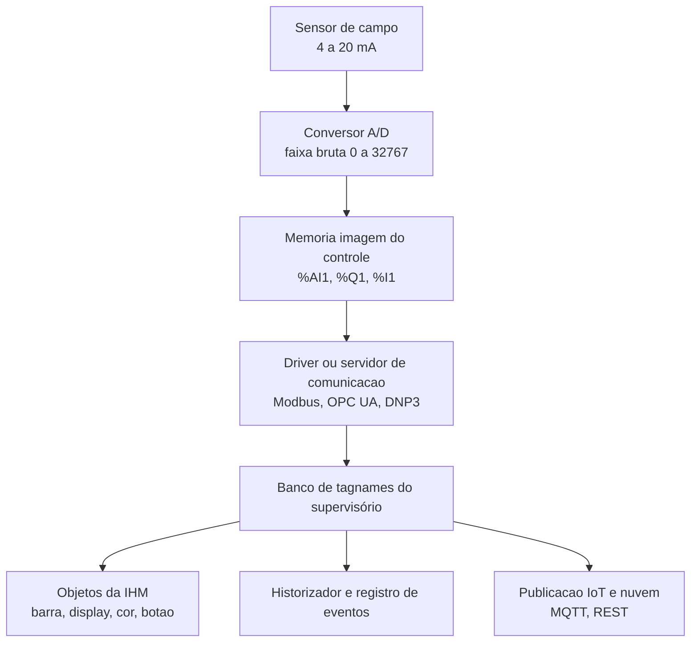
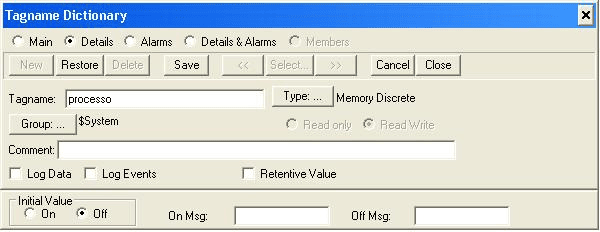
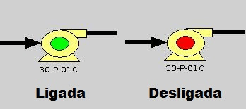
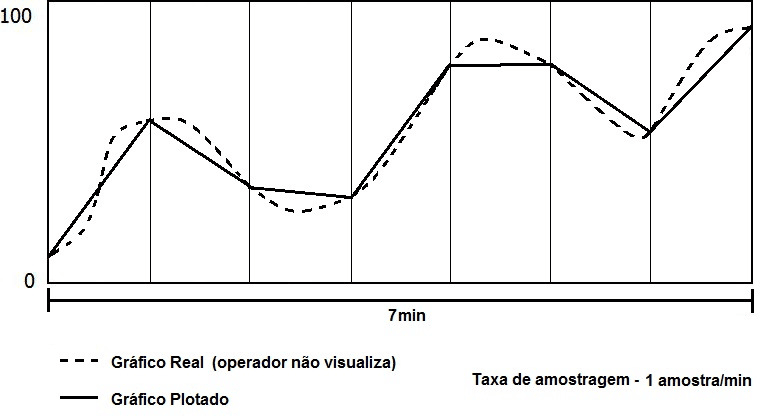
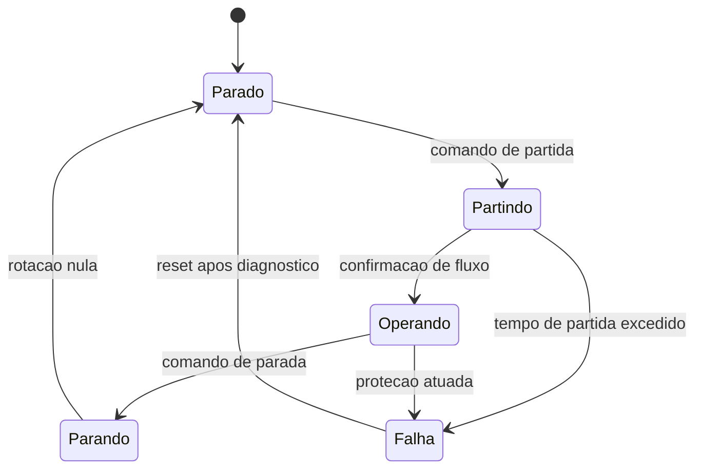
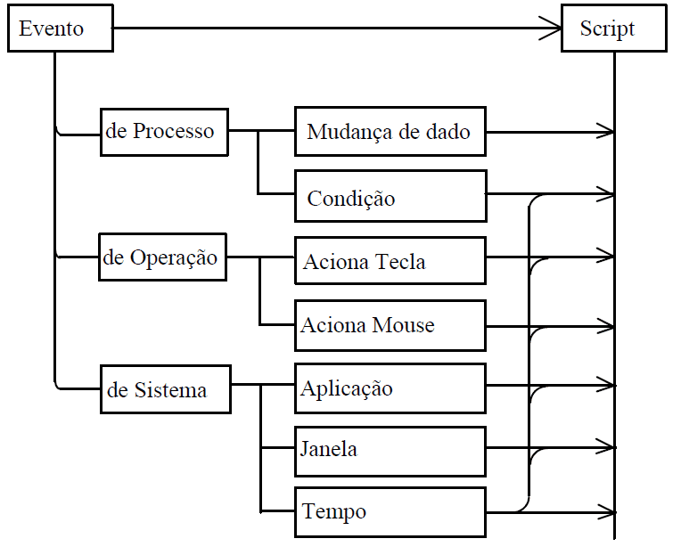
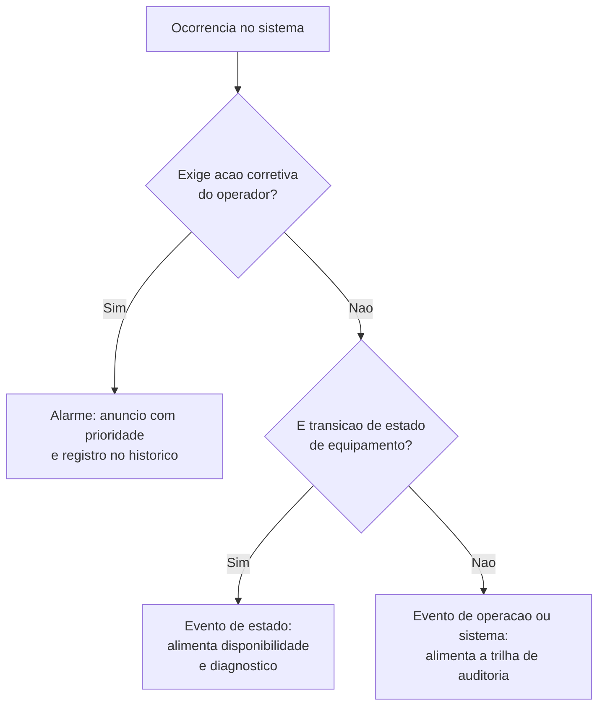

# Capítulo 14 – Tags, Variáveis, Estados e Eventos

## Objetivos de Aprendizagem

Ao final deste capítulo, o leitor será capaz de:

- Definir *tag* (*tagname*) e distinguir tag interno de tag de I/O.
- Descrever os campos de um cadastro de tag e montar um mapa de memória entre o CLP e o supervisório.
- Escalonar um valor bruto para unidade de engenharia e justificar a taxa de amostragem escolhida.
- Diferenciar **valor**, **estado**, **evento** e **alarme** — e explicar por que confundir os quatro degrada a operação.
- Modelar o estado de um equipamento e usá-lo como fonte de evento na IHM, no historizador e na nuvem.

---

## 14.1 O tag é o contrato entre o campo e a tela

Um sistema supervisório não "lê instrumentos": ele lê **tags**. Entre o transmissor de nível instalado no tanque e o número que aparece na tela do operador existem vários elos, e cada um deles guarda uma representação diferente do mesmo dado.



**Tag** (ou *tagname*) é a variável criada no software de supervisão: um espaço de memória destinado a guardar um valor de um tipo determinado. Ele é o **contrato** do sistema — o nome pelo qual engenharia, operação, manutenção e sistemas vizinhos passam a se referir ao mesmo dado. Quando o contrato é cumprido, o sinótico, o histórico, o relatório de produção e o painel na nuvem mostram o mesmo número; quando não é, cada área passa a calcular o seu próprio indicador.

Quanto à **origem da atualização**, o tag se classifica em duas classes:

**Tabela 14.1 – Tag interno e tag de I/O**

| Classe | Onde o valor é atualizado | Comportamento | Uso típico |
|---|---|---|---|
| **Interno** (memória ou RAM) | No próprio software de supervisão | Sem vínculo de atualização com outro software | Cálculos, contadores, estado da aplicação, textos de receita |
| **De I/O** (comunicação) | No servidor de comunicação (*driver*), que lê e escreve a memória do hardware de controle | Vinculado a uma variável do servidor | Medições, posições de válvula, comandos, *setpoints* |

O conjunto dos cadastros forma o **banco de dados de tagnames**, que é a estrutura que o supervisório consulta para receber, manipular e atualizar valores, e de onde os objetos das telas tiram o que exibir.

> 📌 **Nota:** um mesmo software pode ser cliente e servidor ao mesmo tempo. Nesse caso, um tag interno também é legível por outro cliente que se conecte — o que é útil para compartilhar cálculos entre estações, mas exige disciplina de nomenclatura, porque o cálculo passa a ser um dado público do sistema.

---

## 14.2 Anatomia de um cadastro de tag

O cadastro é curto, mas cada campo tem consequência prática na operação. Os campos essenciais são:

**Tabela 14.2 – Campos de um cadastro de tag**

| Campo | O que define | Exemplo |
|---|---|---|
| **Nome** | Identificador único; de preferência derivado do TAG do instrumento de campo | `LT100` |
| **Tipo** | Natureza do valor armazenado | Discreto (*bit*), numérico (inteiro ou real), texto |
| **Contexto** | De onde o valor vem | Interno (memória) ou I/O (comunicação com o CLP) |
| **Endereçamento** | Só para tag de I/O: servidor de comunicação, endereço e grupo | `ServCom` — `%AI1` |
| **Faixa** | Para analógicos: unidade de engenharia, mínimo, máximo e os limites correspondentes na memória do controle | 0 a 100 % / 4 a 20 mA |



> **Fonte:** *Livro SCADA — versão para análise*, p. 99 (Machado, Pontes e Vianna, reproduzida com crédito).

Na janela acima, o campo `Type` é o que fixa a natureza do dado (`Memory Discrete`), o campo
`Group` define o contexto (`$System`, ou seja, interno) e os modificadores `Read only`/`Read Write`
estabelecem se o operador pode escrever. Repare nos marcadores `Log Data` e `Log Events`: eles ligam
o tag ao historizador e ao registro de eventos — dois destinos diferentes para o mesmo valor, como
se verá na seção 14.7.

O cadastro é a metade da história. A outra metade é o **mapa de memória** (ou tabela de alocação):
o documento que relaciona o tagname ao endereço real do hardware de aquisição e ao driver de
comunicação.

**Tabela 14.3 – Exemplo de mapa de memória**

| TAG | Tagname | Driver | Protocolo | Endereço | Descrição |
|---|---|---|---|---|---|
| LT100 | LT100 | ServCom | proprietário | `%AI1` | Transmissor de nível |
| LSH100 | LSH100 | ServCom | proprietário | `%I1` | Chave de nível alto |

> **Fonte:** *Sistemas Supervisórios para Processos Industriais — parte 2*, p. 10 (Vianna), reescrita como tabela.

⚠️ **Atenção:** o mapa de memória é o primeiro documento a ser consultado quando um valor "não
atualiza na tela". Sem ele, o diagnóstico vira tentativa: não se sabe se o problema está no
instrumento, na faixa da entrada analógica, no endereço do driver ou no cadastro do tag. Mantenha o
mapa versionado junto do projeto do CLP — quando alguém insere uma entrada analógica no meio do
programa e desloca os endereços seguintes, esse documento é a diferença entre uma hora e um dia de
parada.

---

## 14.3 Tipos, resolução e escalonamento

Os tags primitivos fundamentais são três: **discreto** (*bit*, *bool*, *discrete*), **numérico**
(inteiro ou real) e **caracter** (mensagem ou texto). Os compostos são associações de primitivos —
uma estrutura de bomba com estado, corrente e horas de operação, por exemplo.

Nos controladores, a família de tipos vem da linguagem de programação definida pela **IEC 61131-3**
(4ª edição, maio de 2025), que padroniza `BOOL`, `INT`, `DINT`, `REAL`, `LREAL`, `TIME`, `STRING` e
as variantes sem sinal. O supervisório não precisa suportar todos eles: ele precisa **não perder
informação** na conversão. Um contador de 32 bits lido como inteiro de 16 bits estoura em 32.768 e
volta a zero — e o histórico passa a mostrar um consumo que "reinicia" sozinho.

### 14.3.1 Da faixa bruta à unidade de engenharia

A entrada analógica de um CLP não entrega graus Celsius nem litros por segundo: entrega um número
inteiro proporcional ao sinal elétrico. Com resolução de 15 bits, o conversor A/D divide a faixa de
tensão em $2^{15} = 32768$ degraus. Para uma entrada de 0 a 5 VCC, a correspondência é direta:
0 V vira 0 e 5 V viram 32767.

O supervisório faz o resto do caminho, convertendo a faixa bruta na **faixa de engenharia** do
instrumento:

```text
EU = EU_min + (bruto - bruto_min) * (EU_max - EU_min)
                      / (bruto_max - bruto_min)

Exemplo: LT100, entrada 4 a 20 mA em 12 bits (0 a 4095)
  bruto = 2047   (metade da faixa)
  EU    = 0 + (2047 - 0) * (100 - 0) / (4095 - 0) = 50,0 %
```

**Tabela 14.4 – Faixas brutas usuais e a resolução correspondente**

| Resolução | Faixa bruta | Degraus | Degrau em 4 a 20 mA (faixa de 100 %) |
|---|---|---|---|
| 12 bits | 0 a 4095 | 4096 | 0,024 % |
| 15 bits | 0 a 32767 | 32768 | 0,003 % |
| 16 bits | 0 a 65535 | 65536 | 0,0015 % |

> 💡 **Dica:** a resolução raramente é o fator limitante — o ruído do sinal é. Aumentar a resolução
> do cartão de entrada não melhora a leitura de um transmissor cujo sinal chega com 1 % de ruído.
> Antes de trocar o hardware, verifique aterramento, blindagem e a origem da alimentação.

O complicador aparece quando a faixa configurada no CLP não é a mesma do instrumento. Um transmissor
de 0 a 200 mbar cadastrado no supervisório com faixa de 0 a 250 mbar informa valores **plausíveis e
errados** — o pior tipo de defeito, porque não gera alarme nem mensagem de erro. A verificação é
simples e obrigatória na partida: compare a leitura com um valor conhecido (tanque vazio, tanque
cheio, *setpoint* de teste) e confira os dois extremos.

---

## 14.4 O tag na tela: representação de discretos e analógicos

A variável discreta corresponde a 1 bit e assume apenas dois estados. Ela é apresentada por três
formas básicas:

- **Visibilidade de texto:** exibe o status da variável — `LIGADO/DESLIGADO`, `ABERTO/FECHADO`,
  `AUTOMÁTICO/MANUAL`, `LOCAL/REMOTO`.
- **Mudança de cor** (ou de outro atributo) do objeto, conforme o valor da variável.
- **Visibilidade do objeto:** o objeto aparece ou não no sinótico segundo o valor do tag — usado
  para representar a presença de um equipamento ou de um trecho de processo.



> **Fonte:** *Livro SCADA — versão para análise*, p. 55 (Machado, Pontes e Vianna, reproduzida com crédito).

A variável analógica é apresentada por **objetos dinâmicos**, cada um com uma finalidade distinta.
A escolha do objeto é uma decisão de ergonomia, não de estética.

**Tabela 14.5 – Formas de apresentação instantânea da variável analógica**

| Objeto dinâmico | O que representa | Quando usar | Cuidado |
|---|---|---|---|
| Display numérico | O valor do tag, com casas decimais | Registro, anotação, conferência | Exige leitura; não comunica proporção |
| Barra gráfica | Valor em percentual de enchimento | Nível, pressão, carga | Precisa de escala visível |
| Ponteiro de deslocamento | Translado do objeto proporcional ao valor | Válvulas, comportas, posição | Não serve para valores muito ruidosos |
| Mostrador circular | Simula *gauges* e dials convencionais | Recuperar a leitura de painéis antigos | Ocupa muito espaço na tela |

A mudança de cor do display é o recurso mais usado para codificar os limites da variável: muito
baixa (LL), baixa (L), normal, alta (H) e muito alta (HH). Isso tem um custo que a apostila já
discutiu no Capítulo 11: a mesma cor que informa também compete com as outras telas do sistema. Uma
tela em que quase tudo é colorido não informa nada.

---

## 14.5 Amostragem, varredura e qualidade do dado

Todo valor que chega ao supervisório é uma **amostra**, não um contínuo. Quem define a frequência
dessa amostragem é a taxa de varredura do protocolo (o *polling*), no caso de leitura periódica, ou
o intervalo de amostragem da assinatura, no caso de leitura por exceção.

Na tendência real, cada curva guarda seus valores em um vetor na memória RAM da estação de
supervisão. O tamanho do vetor determina o tempo máximo registrado: taxa de amostragem
multiplicada pelo número de amostras. Com 100 ms e 1024 amostras, a janela é de 1,7 minuto;
com 5 s e a mesma memória, a janela passa a 85 minutos. Não existe almoço grátis — ou se amplia a
janela, ou se aumenta a taxa.



> **Fonte:** *Livro SCADA — versão para análise*, p. 68 (Machado, Pontes e Vianna, reproduzida com crédito).

A figura é o argumento mais direto a favor de se escolher a taxa de amostragem pela dinâmica da
variável e não pela capacidade do enlace. A curva pontilhada é o comportamento real do processo; a
curva cheia é o que o operador vê com uma amostra por minuto. A variável oscilou quatro vezes no
intervalo e o operador enxergou uma oscilação lenta — informação suficiente para tomar a decisão
errada. Vazão responde mais rápido que temperatura, e a taxa de amostragem deve refletir isso.

### 14.5.1 Qualidade: o valor sozinho não basta

Todo valor lido carrega, na arquitetura moderna, um **código de qualidade** ao lado do número. No
OPC UA (Capítulo 13), esse campo é o `StatusCode`; em plataformas IIoT, é um atributo de qualidade
ou um simples indicador de *timestamp* antigo.

**Tabela 14.6 – O que a qualidade indica**

| Situação | O que o número significa | O que a tela deve mostrar |
|---|---|---|
| `Good` | Leitura válida do campo | O valor e a unidade |
| `Uncertain` | Valor calculado, em inicialização ou com precisão degradada | O valor, marcado como incerto |
| `Bad` | Sem comunicação, sem alimentação, fora de faixa ou falha do sensor | Traço, e não zero |

> ⚠️ **Atenção:** tratar qualidade ruim como valor zero é uma das causas mais comuns de decisão
> errada na sala de controle. "Pressão 0 bar" e "pressão sem dado" levam a ações opostas: a primeira
> sugere linha despressurizada, a segunda sugere instrumento fora do ar. O Capítulo 10 já tratou esse
> ponto do lado dos alarmes; aqui ele aparece do lado do dado, que é a origem do problema.

Outro requisito é o **timestamp de origem**. Se o valor é carimbado na chegada, todo dado atrasado
(em rádio, em enlace 4G ou em fila na borda) é gravado como se fosse atual, e a série temporal passa
a existir em ordem diferente da que aconteceu no processo.

> 📌 **Atualização tecnológica:** no material original, a qualidade do dado era tratada apenas
> indiretamente, pela indicação de falha de comunicação do supervisório. Com OPC UA, Sparkplug B e
> gateways de borda, o código de qualidade passou a ser um campo obrigatório que atravessa toda a
> cadeia, do CLP até o painel na nuvem. A recomendação atual é propagá-lo até a tela, em vez de
> substituí-lo por um valor padrão.

---

## 14.6 Estados: quando o valor não conta a história

Saber que a bomba está ligada não diz se ela está funcionando. Esse é o limite do tag discreto: ele
responde "ligado" ou "desligado", mas a operação precisa saber se o equipamento está **partindo**,
**operando**, **parando** ou em **falha**. Essas são condições qualitativamente diferentes, com
alarmes, intertravamentos e procedimentos diferentes.

A solução é separar **valor** de **estado** e construir a máquina de estados explicitamente — no
CLP, no supervisório ou em ambos.



A máquina de estados muda três coisas na prática:

1. **A IHM deixa de deduzir.** Em vez de o desenvolvedor combinar dois ou três tags na tela para
   adivinhar o estado, o estado é um dado publicado, com nome e valor conhecidos.
2. **O evento ganha significado.** "Partindo → Operando" e "Partindo → Falha" são transições
   distintas, e é a transição — não o valor — que interessa ao registro de eventos e à estatística
   de disponibilidade.
3. **O alarme fica mais preciso.** Alarmes condicionados ao estado (avisar somente se a bomba está
   em operação) eliminam uma classe inteira de alarmes espúrios durante a partida e a parada.

Quando o controle é feito por estado, é útil adotar as convenções já consolidadas em vez de inventar
as suas. A identificação de instrumentos e de funções de controle segue a prática de projeto de
instrumentação — letras para a variável medida e para a função (`LT` para transmissor de nível, `LSH`
para chave de nível alto, `FT` para transmissor de vazão). A definição de estados de equipamento e
de procedimento aparece nos modelos de automação de batelada e de automação de procedimento
(ISA-88/IEC 61512 e ISA-106, verificar edição vigente antes de citar em projeto). Adotar o
vocabulário já conhecido pela equipe custa menos do que defender um vocabulário próprio.

> 💡 **Dica:** escreva a máquina de estados em uma tabela antes de desenhar a tela. Para cada estado,
> registre o que a operação vê, qual alarme é possível, qual comando é aceito e qual transição é
> proibida. Essa tabela é o que impede o clássico defeito de dois caminhos que deveriam ser
> exclusivos acabarem ligados ao mesmo tempo.

---

## 14.7 Eventos e alarmes: a diferença que evita a sobrecarga

O supervisório precisa distinguir duas coisas que o senso comum trata como uma só:

- **Evento** é uma ocorrência com importância para o operador, mas que **não exige ação corretiva**.
  Exemplo: um equipamento entrou em operação, um operador assumiu o turno, uma receita foi carregada.
- **Alarme** é uma situação que **exige intervenção corretiva** do operador. Exemplo: nível acima do
  limite alto, falha de comunicação com o CLP.

Essa distinção não é preciosismo de nomenclatura. É o que separa um sistema de alarmes utilizável de
um sistema em que o operador abandona a tela: se tudo for tratado como alarme, o operador perde a
capacidade de identificar o que exige ação.

Os eventos têm três proveniências, e cada uma delas dispara ações diferentes no supervisório:



> **Fonte:** *Livro SCADA — versão para análise*, p. 72 (figura de Seixas, 2002, reproduzida com crédito na obra de Machado, Pontes e Vianna).

A decisão de classificar uma ocorrência como evento ou como alarme pode ser organizada em uma
sequência de perguntas:



**Tabela 14.7 – Tipos de evento e quando a rotina é executada**

| Proveniência | Evento | Tipo de disparo |
|---|---|---|
| De processo | Mudança de dado | `On true` |
| De processo | Condição verdadeira ou falsa | `On true`, `On false`, `While true`, `While false` |
| De operação | Acionar teclado (ex.: `Ctrl + H`) | `On key up`, `On key down`, `While down` |
| De operação | Acionar mouse sobre um objeto ativo | `On up`, `On down`, `Double click` |
| De sistema | Aplicação entra ou sai de execução | `On startup`, `On shutdown`, `While run` |
| De sistema | Janela aberta, fechada ou em exibição | `On show`, `On hide`, `While show` |

Nem todo software de supervisão oferece todos esses eventos, e o conjunto de tipos varia entre
fabricantes. O que não varia é a consequência do registro: um evento gravado com carimbo de tempo e
com o nome de quem o reconheceu é a matéria-prima da análise de causas e da apuração de
responsabilidade operacional.

O destino do dado também difere. O **sumário** de alarmes vive na memória primária e mostra somente
o que está em andamento agora; o **histórico** é gravado em memória secundária e permite recuperação
posterior. Um tag pode estar ligado ao historizador de séries temporais sem estar ligado ao registro
de eventos, e vice-versa — foi o que se viu nos marcadores `Log Data` e `Log Events` da
Figura 14.1.

> 📌 **Referência histórica:** o material de origem desta apostila citava quatro referências para o
> gerenciamento de alarmes: EEMUA 191, ISA S18.02, IEC 60839 e NAMUR NA 102.
> **Referência atualmente aplicável:** para alarmes de processo, **ANSI/ISA-18.2**, **IEC 62682**,
> **EEMUA 191** e **NAMUR NA 102**. **Motivo da atualização:** a IEC 60839 trata de sistemas de
> alarme de segurança eletrônica e patrimonial — outro escopo, que não define os requisitos de
> gerenciamento de alarmes de processo. O detalhamento está no Capítulo 10.

---

## 14.8 Comparativo: tag clássico, nó OPC UA e métrica IoT

O conceito de tag sobreviveu a três gerações de tecnologia. O que mudou foi onde a informação
adicional — tipo, unidade, faixa, qualidade, carimbo de tempo — é declarada e quem a mantém.

**Tabela 14.8 – O mesmo dado em três modelos**

| Tecnologia | Função | Protocolo | Aplicação | Vantagens | Limitações |
|---|---|---|---|---|---|
| Tag de supervisório | Variável do banco de tags | Driver proprietário, Modbus, DNP3 | Supervisão e comando local | Simples, consolidado, independe do modelo de informação do equipamento | Estrutura digitada à mão; tipo e unidade vivem em planilha; sem qualidade padronizada |
| Nó OPC UA | Nó de um espaço de endereços | `opc.tcp` (IEC 62541) | Integração equipamento–supervisão–MES | Tipos, unidade, `StatusCode` e carimbo de tempo no próprio dado; descoberta automática | Exige servidor no equipamento; mais pesado na borda |
| Métrica Sparkplug B | Métrica tipada em payload | MQTT 5 com TLS | Telemetria em escala e nuvem | Dicionário declarado no `NBIRTH`; detecção de queda pelo `NDEATH` | Semântica dependente da convenção; histórico depende do consumidor |

> 📌 **Nota:** a convivência é a regra, não a exceção. Um projeto típico mantém o tag clássico no
> supervisório, expõe o mesmo dado por OPC UA para integração e publica uma versão agregada por
> MQTT para a nuvem. O que não pode divergir é o **nome e o significado** do dado nas três pontas —
> é por isso que o dicionário de dados, e não o protocolo, é o artefato central do projeto.

---

## 14.9 Estudo de Caso — Mapa de tags de uma estação de bombeamento

**Cenário.** Uma estação de bombeamento de água opera com três conjuntos motobomba e um painel de
supervisão local. A equipe herdou um projeto em que a tela do supervisório foi montada por
tentativa: os nomes dos tags são abreviações próprias (`b1_lig`, `pressao2`, `nivel_novo`), a faixa
dos transmissores foi cadastrada em percentual e o mapa de memória existe apenas como anotação à mão
em uma folha dentro do painel.

**Diagnóstico.** Três sintomas apareceram no primeiro mês de operação:

1. O histórico mostra a vazão "reiniciando" a cada poucas horas. O contador é de 32 bits no CLP e
   foi cadastrado como inteiro de 16 bits no supervisório.
2. O operador relatou "pressão zero" em uma madrugada; a manutenção trocou um transmissor saudável.
   O que havia era queda de comunicação com o CLP naquela entrada, apresentada como valor zero.
3. O relatório de disponibilidade das bombas não fecha com o horário real de operação. A tela deduz
   o estado a partir de dois tags combinados, e a combinação `ligado + sem fluxo` tanto pode ser
   partida quanto falha — a estatística somou as duas coisas.

**Decisão de engenharia.**

| Problema | Ação adotada | Resultado esperado |
|---|---|---|
| Estouro de contador | Cadastro corrigido para inteiro de 32 bits; faixa bruta reconferida | Fim do "reinício" no histórico |
| Valor zero em falha | Qualidade propagada até a tela; valor exibido como traço quando `Bad` | Fim da troca de transmissor saudável |
| Estado ambíguo | Máquina de estados publicada pela lógica: `Parado`, `Partindo`, `Operando`, `Falha` | Disponibilidade passa a ser contada por estado, com transições registradas |
| Nomes ilegíveis | Renomeação para o padrão do projeto (`P101_ESTADO`, `PT101_PV`, `FIT101_PV`) | Rastreabilidade entre CLP, supervisório, histórico e nuvem |
| Mapa inexistente | Mapa de memória em planilha versionada, com TAG, endereço, driver e faixa | Diagnóstico em minutos em vez de horas |

**Limitações do arranjo.** A renomeação de tags exige atualizar o histórico já gravado por meio de um
dicionário de tradução, e não por alteração retroativa — sob pena de o histórico virar uma coleção de
curvas sem nome. A máquina de estados foi implementada na lógica do CLP, o que limita a mudança de
comportamento a uma janela de manutenção. E a estação continua sem redundância de servidor: o ganho
foi de diagnóstico e de confiabilidade do dado, não de disponibilidade do sistema.

---

## Resumo

- **Tag** é a variável do supervisório e funciona como contrato de nomes entre CLP, IHM, histórico, relatórios e nuvem.
- Tag **interno** é atualizado no próprio software; tag de **I/O** é atualizado pelo driver, ligado à memória do hardware de controle.
- Um bom cadastro define **nome, tipo, contexto, endereço e faixa**; o **mapa de memória** liga o tagname ao endereço real do CLP.
- A conversão de faixa bruta para **unidade de engenharia** é aritmética simples, mas a divergência entre a faixa do instrumento e a cadastrada produz valores plausíveis e errados.
- A **taxa de amostragem** deve seguir a dinâmica da variável: amostrar devagar mostra uma curva que não existe.
- **Qualidade** é dado, não enfeite: `Bad` deve aparecer como ausência de dado, nunca como zero.
- **Valor** e **estado** são informações diferentes; a máquina de estados explícita melhora a IHM, os alarmes e o cálculo de disponibilidade.
- **Evento** é ocorrência sem ação corretiva exigida; **alarme** exige intervenção. Misturar os dois destrói a credibilidade do sistema de alarmes.
- O conceito de tag sobreviveu ao OPC UA e ao MQTT: o que mudou foi o lugar onde tipo, unidade e qualidade são declarados.

## Questões de Revisão

1. Explique a diferença entre tag interno e tag de I/O e dê um exemplo de uso legítimo para cada um.
2. Cite os cinco campos essenciais de um cadastro de tag e explique a consequência de preencher mal cada um deles.
3. Um transmissor de 0 a 400 mmH₂O foi cadastrado no supervisório com faixa de 0 a 250 mmH₂O. Descreva o que o operador vê e por que esse defeito é mais perigoso que uma falha franca de comunicação.
4. Calcule o valor em unidade de engenharia de um tag de nível com entrada de 15 bits, faixa de 0 a 5000 L e leitura bruta de 19660. Apresente o cálculo.
5. Um gráfico de tendência real é configurado com taxa de amostragem de 10 s e 512 amostras. Qual é a janela de tempo registrada? O que se ganha e o que se perde ao reduzir a taxa para 2 s?
6. Por que a qualidade do dado deve ser exibida na tela em vez de substituída por zero? Relacione a resposta com o diagnóstico de falha de instrumento.
7. Descreva uma máquina de estados para um misturador com motor e válvula de alimentação. Indique ao menos quatro estados, as transições permitidas e um alarme possível em cada estado.
8. Explique a diferença entre evento e alarme com um exemplo de cada em um processo de tratamento de água, e diga o que acontece com a operação quando essa diferença é ignorada.
9. Um projeto publica a mesma variável no supervisório, no servidor OPC UA e no broker MQTT com três nomes diferentes. Descreva dois problemas concretos que essa escolha cria e proponha uma correção.

## Referências

- MACHADO, R.; PONTES, W.; VIANNA, W. **Livro SCADA — versão para análise**. Material didático do curso (capítulos sobre recursos do software SCADA, tagnames, alarmes, eventos e tendências). Figuras reproduzidas com crédito.
- VIANNA, W. S. **Sistemas Supervisórios para Processos Industriais — parte 2**. Material didático do curso (conceitos de tagname, banco de dados de tagnames e mapa de memória).
- INTERNATIONAL ELECTROTECHNICAL COMMISSION. **IEC 61131-3 — Programmable controllers: Programming languages**. 4ª edição, maio de 2025 (a 3ª edição é de 2013; verificar a edição vigente antes de citar em projeto).
- INTERNATIONAL SOCIETY OF AUTOMATION. **ANSI/ISA-18.2 — Management of Alarm Systems for the Process Industries**. Edição vigente de 2016 (1ª edição: 2009).
- INTERNATIONAL ELECTROTECHNICAL COMMISSION. **IEC 62682 — Management of alarm systems for the process industries**. Edição vigente de 2022.
- NAMUR. **NA 102 — Alarm Management**. Leverkusen: NAMUR, 2003 (recomendação).
- SEIXAS, F. **Diagrama de eventos de um sistema SCADA**. 2002 (figura reproduzida no *Livro SCADA — versão para análise*, p. 72).
- ISA-88 / IEC 61512 (modelo de controle de batelada) e ISA-106 (automação de procedimento): citados apenas como vocabulário de estados de equipamento e procedimento — verificar edição e escopo vigentes antes de usar como requisito.
- OPC FOUNDATION. **OPC Unified Architecture** — atributos de nó, `StatusCode` e carimbo de tempo. Disponível em: opcfoundation.org. Consulta: 2026.
