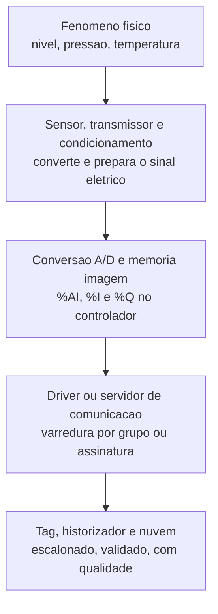
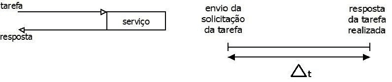
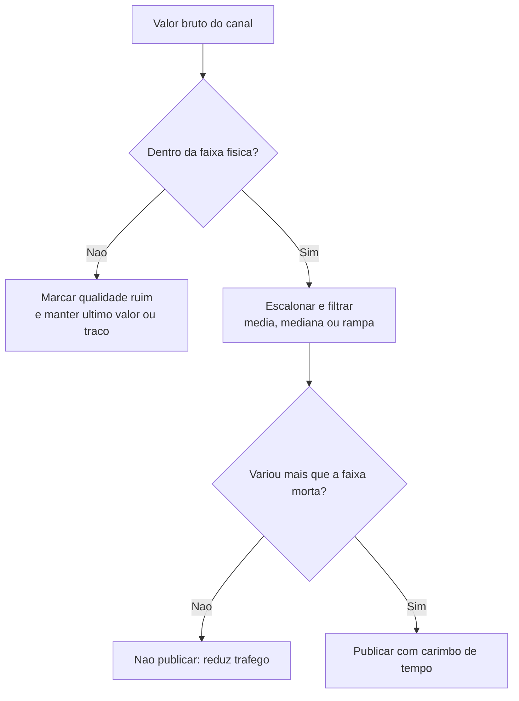
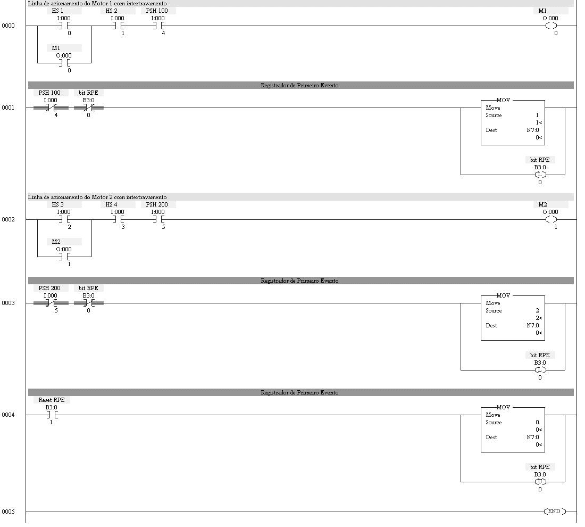

# Capítulo 15 – Aquisição e Tratamento de Dados

## Objetivos de Aprendizagem

Ao final deste capítulo, o leitor será capaz de:

- Descrever a cadeia completa de aquisição, do fenômeno físico ao valor gravado no histórico.
- Escolher o tipo de sinal e a forma de conexão adequados a cada medição.
- Explicar resolução, exatidão e ruído e distinguir um do outro na prática da instalação.
- Justificar as taxas de varredura de cada elo e reconhecer quando um evento se perde entre eles.
- Aplicar tratamento de dados: filtração, validação de faixa, faixa morta e publicação por exceção.
- Projetar o registro da primeira falha de uma parada de planta.

---

## 15.1 A cadeia de aquisição

Nenhum dado industrial nasce pronto. Entre o fenômeno físico e o número que o historiador grava
existe uma cadeia de elos, e cada elo degrada, atrasa ou descarta informação. Conhecer a cadeia é o
que permite diagnosticar por que o valor na tela não corresponde ao que aconteceu no processo.



**Tabela 15.1 – O que cada elo pode fazer com o dado**

| Elo | O que ele acrescenta | Como ele degrada |
|---|---|---|
| Sensor e transmissor | Converte a grandeza física em sinal elétrico | Erro de exatidão, deriva, tempo de resposta do próprio sensor |
| Condicionamento | Filtra ruído, isola, protege contra surto | Filtro mal dimensionado atrasa a resposta e suaviza o evento |
| Conversor A/D | Quantifica o sinal em degraus discretos | Perde resolução se a faixa utilizada for muito maior que o sinal |
| Memória imagem | Mantém o valor atual no controle | É sobrescrita a cada varredura: o que não é copiado, desaparece |
| Driver e rede | Transporta em blocos, com taxa configurável | Atraso e perda sob congestionamento; ordem de chegada fora de sequência |
| Tag e historizador | Escalona, valida, filtra e arquiva | Descarta por faixa morta, por validação ou por política de retenção |

> 📌 **Nota:** o elo mais barato de corrigir quase nunca é o transmissor. Antes de trocar um
> instrumento, verifique a faixa configurada, o filtro do canal, o endereço no mapa de memória e a
> taxa de varredura — os mesmos quatro itens que explicam a maior parte das reclamações de "leitura
> errada".

---

## 15.2 Tipos de sinal e forma de conexão

A escolha do sinal determina o custo do cabeamento, a imunidade a ruído e o que é possível fazer com
o dado depois. As formas mais usadas:

**Tabela 15.2 – Comparativo dos sinais de campo**

| Sinal | Natureza | Vantagem | Limitação | Uso típico |
|---|---|---|---|---|
| 4 a 20 mA | Analógico de corrente | Imune a queda de tensão no cabo; o 4 mA denuncia cabo rompido | Um par por variável; exige resistor de precisão na entrada | Pressão, nível, vazão, posição |
| 0 a 10 V | Analógico de tensão | Simples de gerar e de medir | Sensível a queda de tensão e a ruído indutivo | Sinais curtos, bancada, comandos |
| RTD (Pt100) | Resistência | Estável e preciso em faixa larga | Exige 3 ou 4 fios para compensar o cabo | Temperatura de processo |
| Termopar | Tensão em microvolts | Faixa ampla de temperatura | Exige cabo de extensão e junta de referência corretas | Temperatura alta, fornos |
| Pulso / contagem | Frequência | Totaliza volume e energia sem perda acumulada | Exige entrada de alta velocidade dedicada | Hidrômetros, medidores de energia |
| Discreto 24 VCC | Dois estados | Simples, robusto, barato | Um ponto por informação | Fim de curso, chave, partida de motor |

> ⚠️ **Atenção:** o **4 mA** da faixa de 4 a 20 mA existe para distinguir "valor zero" de "sem
> sinal". Se a leitura de um transmissor de 4 a 20 mA chega como zero na tela, há um erro de
> configuração ou de hardware em algum lugar — o zero é justamente o valor que o sinal *não* pode
> assumir em condição normal. Tratar isso como "pressão zero" leva à ação errada (Capítulo 14).

---

## 15.3 Digitalização: resolução, exatidão e ruído

Três grandezas diferentes costumam ser confundidas em uma só frase:

- **Resolução** — o menor degrau que o conversor consegue representar. Um A/D de 15 bits divide a
  faixa em 32.768 degraus (dois elevado a quinze); em 4 a 20 mA, isso dá menos de 0,004 % por degrau.
- **Exatidão** — o quanto a leitura se aproxima do valor verdadeiro. É definida pelo transmissor e
  pela instalação, não pelo conversor.
- **Ruído** — a variação aleatória em torno do valor. É o que, na prática, limita o que se enxerga.

Um cartão de 16 bits lendo um transmissor com 1 % de erro continua tendo 1 % de erro: a resolução
não substitui a exatidão. E um sinal com ruído de 0,5 % não melhora nada ao passar de 12 para 16
bits — apenas passa a mostrar o ruído com mais casas decimais.

```text
Exemplo de proporção entre as três grandezas:

  Faixa de 0 a 100 %
  A/D de 12 bits -> degrau de 0,024 %
  Transmissor de classe 0,5 % -> erro de ate 0,5 %
  Ruido observado na instalacao -> 0,3 % de variacao pico a pico

  Conclusao: o gargalo e o transmissor e a instalacao, nao o cartao.
```

O tratamento começa no **filtro analógico** do canal de entrada e continua no **filtro digital** do
controlador ou do supervisório. Um filtro de média móvel de *n* amostras reduz o ruído na proporção
da raiz quadrada de *n*, mas atrasa a resposta — e um atraso grande em uma variável de proteção é
pior que o ruído que ele resolve.

> 💡 **Dica:** antes de configurar qualquer filtro, meça. Com o processo estável, colete dois minutos
> de amostra crua e observe quanto a leitura varia sem que nada aconteça na planta. Esse número é o
> seu limite inferior de faixa morta e o seu critério para decidir se o problema é filtro, blindagem
> ou aterramento.

---

## 15.4 Varredura: quem decide o ritmo

Cada elo da cadeia tem o seu próprio ritmo, e eles são muito diferentes:

**Tabela 15.3 – Ordens de grandeza típicas das taxas de atualização**

| Elo | Faixa típica | Quem define |
|---|---|---|
| Ciclo de varredura do controlador | Poucos milissegundos a dezenas de milissegundos | Fabricante e tamanho do programa |
| Taxa de varredura do driver | Centenas de milissegundos a segundos, por grupo de tags | Engenharia de configuração do servidor de comunicação |
| Atualização dos objetos na IHM | Décimos de segundo a poucos segundos | Desempenho do conjunto (rede, estação, driver) |
| Intervalo de amostragem da assinatura | Configurável por variável, com faixa morta | Projeto (OPC UA; ver Capítulo 13) |
| Gravação no historiador | Por exceção ou por período, conforme política | Projeto do histórico (ver Capítulo 16) |



> **Fonte:** *Livro SCADA — versão para análise*, p. 33 (Machado, Pontes e Vianna, reproduzida com crédito).

O tempo de resposta de um sistema SCADA é a **soma** dos tempos de cada subsistema envolvido —
sensoriamento, ciclo do controlador, driver, rede, processamento na estação e desenho na tela. Como
as estações de supervisão não são determinísticas (*Windows* ou *Linux* com carga variável), o valor
exato não pode ser calculado a priori: ele é estimado, configurado e medido em campo.

O erro clássico de projeto é dimensionar a comunicação como se toda a banda configurada estivesse
disponível para dados. Em uma serial de 19.200 bps, cada *frame* gasta bits de partida, de parada e
de verificação: sobra cerca de **dois terços** da banda para o dado útil. Em um intervalo de
atualização de 100 ms, isso significa algo em torno de 1.280 bits de dado — suficiente para poucas
dezenas de variáveis, não para o cadastro inteiro.

### 15.4.1 O evento que se perde entre as varreduras

Há uma consequência mais grave que o atraso: o controlador pode **ver** um sinal que o supervisório
**não registra**. Se um pressostato atua por 20 ms e provoca o desligamento da planta, o CLP executa
o intertravamento no seu ciclo de varredura de poucos milissegundos — mas a atualização da IHM pode
levar um segundo, e o alarme nunca aparece. A planta parou, e a tela não mostra por quê.

Esse é o tipo de falha mais difícil de investigar, porque não deixa rastro. A solução não é reduzir
a taxa do sistema inteiro — é **capturar o evento no controlador**, onde a resolução é suficiente, e
transferir o resultado, e não o sinal.

> 🖼️ **[Figura 15.2 – Configuração de tópicos com tempos de varredura distintos em um servidor de comunicação]**
> *Captura de tela de configuração de driver com três grupos de tags e a respectiva taxa: grupo rápido (200 ms) com variáveis de intertravamento e estado de bombas; grupo médio (1 s) com medições analógicas de processo; grupo lento (10 s) com totalizadores, temperaturas de mancal e diagnóstico. Ao lado, o campo de faixa morta por tag. Destacar que a classificação por dinâmica, não por área da planta, é o critério da divisão.*

---

## 15.5 Tratamento: o que se faz com o dado antes de mostrá-lo

Tratamento não é maquiagem: é a parte do projeto que separa informação de ruído. As operações usuais,
na ordem em que costumam ser aplicadas:



**Tabela 15.4 – Operações de tratamento e o risco de cada uma**

| Operação | Para que serve | Efeito colateral |
|---|---|---|
| Validação de faixa | Rejeitar leituras fisicamente impossíveis (fora da faixa do sensor) | Faixa mal cadastrada rejeita dado bom |
| Escalonamento | Levar o valor bruto à unidade de engenharia | Divergência de faixa entre instrumento e cadastro gera erro silencioso |
| Média móvel | Reduzir ruído aleatório | Atrasa a resposta; mascara transitório real |
| Mediana móvel | Remover picos espúrios isolados | Custa mais processamento que a média |
| Faixa morta (*deadband*) | Evitar publicação de variação irrelevante | Faixa morta alta esconde a tendência lenta |
| Publicação por exceção | Reduzir tráfego na rede e no enlace remoto | Exige *refresh* periódico para não deixar a tela "congelada" |

O critério para escolher entre eles não é estético. Em uma variável de proteção, o filtro deve ser o
menor possível ou inexistente; em uma variável de indicação lenta, como temperatura de mancal, um
filtro largo e uma faixa morta generosa reduzem tráfego sem prejuízo.

> ⚠️ **Atenção:** filtro e faixa morta se somam. Um canal com média de 10 amostras e faixa morta de
> 2 % pode levar mais de dois minutos para anunciar uma variação real de 1,5 % — e o operador só vai
> descobrir isso no dia em que precisar da resposta rápida. Documente, para cada tag, o filtro e a
> faixa morta configurados.

---

## 15.6 Registro da primeira falha

Quando uma planta para, quase sempre vários instrumentos atuam em sequência: os intertravamentos
abraem, as bombas desligam, os pressostatos comutam. Se todos os eventos chegam ao supervisório com
carimbo de tempo do próprio supervisório, a ordem aparente é apenas a ordem de chegada — e a causa
raiz se perde na avalanche.

O **registrador de primeiro evento** resolve isso dentro do controlador: cada linha de
intertravamento ganha, logo abaixo, um bloco que grava o código do sensor em um endereço de memória
e aciona um bit de bloqueio. Do segundo sensor em diante, o bloqueio impede a sobrescrita. O
supervisório lê apenas um endereço — o código do primeiro sensor que atuou.



> **Fonte:** *Livro SCADA — versão para análise*, p. 36 (Machado, Pontes e Vianna, reproduzida com crédito).

**Tabela 15.5 – Tabela de alocação do registrador de primeiro evento**

| Endereço | Tagname | Descrição |
|---|---|---|
| `I:000/0` | `HS 1` | Chave de acionamento do motor 1 (NA) |
| `I:000/1` | `HS 2` | Chave de desacionamento do motor 1 (NF) |
| `I:000/4` | `PSH 100` | Chave de pressão alta (NF) |
| `I:000/5` | `PSH 200` | Chave de pressão alta (NF) |
| `B3:0/0` | `bit RPE` | Bit de bloqueio que impede alteração do valor gravado |
| `B3:0/1` | `Reset RPE` | Botão que reinicia o registrador pela IHM |
| `N7:0` | `Codigo RPE` | Número do sensor que originou a parada |

Três cuidados determinam se a lógica funciona na prática:

1. **A linha de registro fica imediatamente abaixo do intertravamento correspondente.** Se ela for
   deslocada, o tempo de varredura pode fazer o código do segundo sensor chegar antes do primeiro.
2. **Existe uma lista de relação entre número e evento**, homologada e disponível para a operação —
   sem ela, o código gravado na memória é um número sem significado.
3. **O registrador é reiniciado pela IHM**, com registro de quem reiniciou e quando.

> 📌 **Atualização tecnológica:** o registrador em Ladder continua válido e é a solução mais barata
> em controladores que não têm cartão de sequência de eventos. Em arquiteturas atuais, a mesma
> função é obtida com **RTUs e controladores com SOE** (*Sequence of Events*), que carimbam cada
> entrada com resolução de milissegundo na origem, e com **sincronização de tempo** por NTP ou
> PTP (IEEE 1588) em toda a planta. A escolha depende do que se quer provar: a lógica em Ladder diz
> *qual* foi o primeiro a atuar; o SOE com carimbo na origem diz *quando*, com resolução suficiente
> para reconstruir a sequência inteira.

O carimbo de tempo é o outro lado do problema. Dados carimbados na chegada ao supervisório perdem a
ordem real, sobretudo em enlaces com atraso variável. A regra é simples: **carimbe na origem**
sempre que o equipamento permitir, e mantenha os relógios de todos os nós sincronizados — um
histórico com relógios discrepantes é pior que um histórico sem relógio, porque produz conclusões
erradas com aparência de precisão.

---

## 15.7 Comparativo das arquiteturas de aquisição

Quatro arranjos resolvem a aquisição, e a escolha depende do que existe no campo e do que se
pretende fazer com o dado.

**Tabela 15.6 – Comparativo das arquiteturas de aquisição**

| Tecnologia | Função | Protocolo | Aplicação | Vantagens | Limitações |
|---|---|---|---|---|---|
| CLP com cartões de I/O | Aquisição e controle no mesmo equipamento | Modbus, OPC UA, PROFINET, EtherNet/IP | Processo com lógica de controle local | Lógica e aquisição juntas; varredura rápida; diagnóstico de canal | Custo por ponto maior em instalações muito distribuídas |
| Sistema DAQ | Aquisição dedicada, sem controle | Modbus, OPC, proprietário | Bancada, ensaio, monitoramento de máquina | Alta resolução e taxa; pronto para ensaio | Sem controle, sem intertravamento |
| RTU | Aquisição remota com transmissão | DNP3, IEC 60870-5-101/104, Modbus | Campo remoto, baixo consumo | Baixo consumo, robustez, comunicação por rádio ou celular | Menor capacidade de lógica; programação menos padronizada |
| Gateway de borda | Aquisição, normalização e publicação | Modbus, OPC UA, MQTT, REST | Integração com nuvem e múltiplos protocolos | Concentra protocolos, faz *store and forward*, reduz tráfego | É mais um nó para manter, atualizar e proteger |

A tendência de projeto não é escolher um deles para toda a planta, e sim **usar cada um onde ele é
melhor**: CLP onde há controle e intertravamento, RTU onde há campo remoto, gateway onde há
integração. O Capítulo 18 trata da integração entre eles.

---

## 15.8 Estudo de Caso — A planta que parou e a tela não mostrou por quê

**Cenário.** Uma planta de tratamento de água com duas bombas de recalque e duas chaves de pressão
alta. Em três semanas, o conjunto parou quatro vezes por atuação da proteção. Em todas as
ocorrências, o histórico de alarmes registrou, com diferença de poucos segundos, o alarme de "pressão
alta" e o de "bomba desligada" — sem indicação confiável de qual veio primeiro. A manutenção
trocou um pressostato, verificou o outro e não encontrou defeito.

**Diagnóstico.** Três problemas somados:

1. O carimbo de tempo de todos os alarmes era atribuído pelo supervisório, na chegada — não na
   origem.
2. A varredura do driver para as chaves de pressão era de 1 s, maior que a duração do pulso de
   pressão alta no instante da atuação.
3. Os dois pressostatos atuavam em sequência por projeto (um é proteção, o outro é alarme), o que
   torna indistinguível a "primeira" atuação se os dois eventos chegam com o mesmo carimbo.

**Decisão de engenharia.**

| Medida | Efeito |
|---|---|
| Registrador de primeiro evento no CLP, com código por sensor e lista homologada | Passa a existir um único registro confiável de primeira atuação |
| Chaves migradas para o grupo de varredura rápido (200 ms) do driver | A atuação passa a ser observada, e não apenas inferida |
| Sincronização dos relógios do CLP, da estação e do servidor | Os carimbos de tempo passam a ser comparáveis |
| Alarme de "primeira atuação da proteção" distinto do alarme de processo | A operação deixa de receber dois alarmes concorrentes sem hierarquia |

**Resultado.** Na ocorrência seguinte, o registro apontou `PSH 100` como primeira atuação, nove
segundos antes do desligamento — a causa era uma válvula de retenção que fechava lentamente e
provocava golpe de aríete. O defeito era de processo, não do instrumento, e nenhuma das quatro
ocorrências anteriores permitiria essa conclusão.

**Limitações do arranjo.** O registrador de primeiro evento informa *qual* foi o primeiro, não
*quando* com precisão de milissegundo. Para análise de sequência real, a solução é cartão de SOE com
carimbo na origem e PTP. Além disso, a lógica em Ladder precisa ser revista sempre que um novo
intertravamento é acrescentado — e essa manutenção precisa estar no procedimento de gestão de
mudanças, não na memória de quem programou.

---

## Resumo

- A aquisição é uma **cadeia de elos**, e cada um acrescenta erro, atraso ou descarte.
- O **4 mA** da faixa de 4 a 20 mA existe para separar "valor zero" de "sem sinal".
- **Resolução, exatidão e ruído** são grandezas distintas; a resolução do conversor raramente é o gargalo.
- Cada elo tem o seu ritmo: o ciclo do controlador é de milissegundos, a atualização da IHM é de décimos de segundo a segundos.
- O tempo de resposta é a **soma** dos subsistemas e não é determinístico nas estações de supervisão.
- Eventos curtos podem atuar no intertravamento e **não aparecer** no supervisório — a solução é capturar no controlador.
- **Tratamento** (validação, escalonamento, filtração e faixa morta) separa informação de ruído, mas cada operação tem custo: atraso e perda de transitório.
- A **primeira falha** de uma parada precisa ser registrada na origem; lógica em Ladder resolve o "qual", o SOE com carimbo resolve o "quando".
- Relógios sincronizados são pré-requisito para qualquer análise de sequência.

## Questões de Revisão

1. Descreva a cadeia de aquisição de uma medição de nível, citando o que cada elo pode fazer com o dado.
2. Por que a faixa de 4 a 20 mA começa em 4 mA e qual a consequência prática de ler zero nessa entrada?
3. Explique a diferença entre resolução, exatidão e ruído, usando o exemplo de um transmissor de 0,5 % ligado a um cartão de 16 bits.
4. Um sistema tem ciclo de varredura de 10 ms no CLP, varredura de driver de 1 s e atualização de IHM de 2 s. Um sinal permanece alto por 300 ms. Descreva o que cada elo registra e qual o risco para a operação.
5. Por que o tempo de resposta de um sistema SCADA não pode ser calculado com precisão antes da instalação? Cite três fatores que o influenciam.
6. Explique como funciona o registrador de primeiro evento e por que a linha de registro precisa ficar logo abaixo do intertravamento correspondente.
7. Compare filtro de média e faixa morta quanto ao efeito sobre ruído, atraso e volume de tráfego.
8. Um histórico de alarmes mostra dois eventos com o mesmo carimbo de tempo. Que deficiências de projeto podem explicar isso e como corrigi-las?
9. Compare CLP, sistema DAQ, RTU e gateway de borda quanto à função, protocolo e limitação principal, e indique um cenário em que os quatro convivem na mesma planta.

## Referências

- MACHADO, R.; PONTES, W.; VIANNA, W. **Livro SCADA — versão para análise**. Material didático do curso (seções sobre desempenho do sistema de automação SCADA, sistemas de tempo real e registrador de primeiro evento). Figuras reproduzidas com crédito.
- VIANNA, W. S. **Sistema SCADA Supervisório**. IFF, 2008 (capítulos sobre componentes de hardware e software, drivers de comunicação e elementos dinâmicos).
- FARINES, J. M.; FRAGA, J. S.; OLIVEIRA, R. S. **Sistemas de Tempo Real**. São Paulo: Escola de Computação, 2000 (definição de sistema de tempo real citada na obra de origem).
- INTERNATIONAL ELECTROTECHNICAL COMMISSION. **IEC 61131-3 — Programmable controllers: Programming languages**. 4ª edição, maio de 2025.
- INSTITUTE OF ELECTRICAL AND ELECTRONICS ENGINEERS. **IEEE 1588 — Precision Clock Synchronization Protocol for Networked Measurement and Control Systems** (PTP; verificar edição vigente).
- INTERNATIONAL SOCIETY OF AUTOMATION. **ANSI/ISA-5.1 — Instrumentation Symbols and Identification** (identificação de instrumentos por letras; verificar edição vigente antes de citar em projeto).
- ISA. **ISA-101 — Human-Machine Interfaces for Process Automation Systems** (referência geral de apresentação de dados ao operador; verificar edição vigente).
- OPC FOUNDATION. **OPC Unified Architecture** — *subscription*, intervalo de amostragem e *deadband* por item monitorado. Disponível em: opcfoundation.org. Consulta: 2026.
