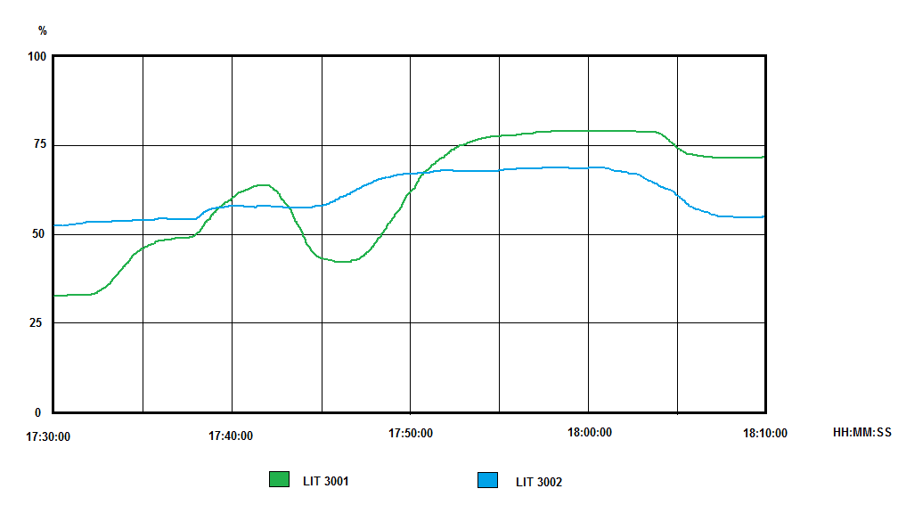
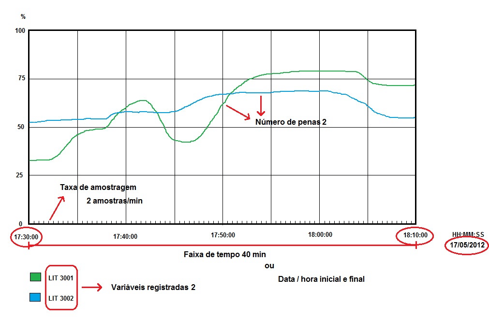

# Capítulo 16 – Historiadores e Séries Temporais

## Objetivos de Aprendizagem

Ao final deste capítulo, o leitor será capaz de:

- Distinguir tendência real de tendência histórica e dimensionar a janela de registro.
- Reconhecer por que bancos relacionais convencionais não atendem à historização de processo.
- Explicar o efeito da compressão por exceção e a consequência de configurá-la mal.
- Definir política de retenção, agregação e descarte por classe de dado.
- Separar histórico de processo de histórico de eventos e de trilha de auditoria.
- Comparar soluções de historização pela função e pela limitação, sem apelo de fabricante.

---

## 16.1 A pergunta que o histórico responde

O histórico de processo atende a três públicos que fazem perguntas diferentes:

| Público | Pergunta | O que precisa ser preservado |
|---|---|---|
| Operação | "O que está acontecendo agora e nos últimos minutos?" | Alta resolução no presente, com atualização contínua |
| Engenharia e manutenção | "Por que parou, o que mudou antes da falha, qual a tendência da variável?" | Resolução suficiente para reconstruir o transitório |
| Gestão e conformidade | "Quanto produzimos, qual o consumo, como estava a emissão naquele dia?" | Integridade, retenção longa e agregação confiável |

As três exigências são incompatíveis entre si quando o armazenamento é tratado como um só. Guardar
tudo com máxima resolução por anos é caro; guardar tudo comprimido o suficiente para caber em disco
destrói a resposta que a engenharia precisa. Todo sistema de historização real é uma negociação
entre essas demandas — e essa negociação é projeto, não parâmetro deixado no padrão.

---

## 16.2 Tendência real e tendência histórica

São dois objetos diferentes, com armazenamento diferente.

- A **tendência real** exibe os últimos valores em função do tempo, de forma dinâmica. Cada curva
  guarda os valores em um **vetor na memória** da estação de supervisão.
- A **tendência histórica** recupera valores gravados em memória secundária (disco, SSD) e exibe o
  intervalo escolhido pelo operador. É estática, aceita mais variáveis e permite recuperar qualquer
  período.



> **Fonte:** *Livro SCADA — versão para análise*, p. 67 (Machado, Pontes e Vianna, reproduzida com crédito).

Na tendência real, o tamanho do vetor é o recurso limitado, e a aritmética é implacável:

```text
janela de tempo = taxa de amostragem x numero de amostras

  100 ms x 1024 amostras = 102,4 s   (1,7 minuto)
  1 s    x 1024 amostras = 1024 s    (17 minutos)
  5 s    x 1024 amostras = 5120 s    (85 minutos)
  10 min / 5 s           = 120 amostras no vetor
```

Não existe configuração que amplie a janela e melhore a resolução ao mesmo tempo: aumentar uma
obriga a reduzir a outra, ou a ampliar memória. É por isso que a tendência real é organizada por
**grupos de variáveis com dinâmica parecida** — vazão e pressão em um grupo, temperatura de mancal
em outro.

**Tabela 16.1 – Tendência real × tendência histórica**

| Aspecto | Tendência real | Tendência histórica |
|---|---|---|
| Armazenamento | Memória RAM da estação | Disco rígido, SSD ou servidor de histórico |
| Comportamento | Dinâmica, atualizada continuamente | Estática, recuperada sob consulta |
| Janela | Limitada pelo tamanho do vetor | Limitada pela política de retenção |
| Número de variáveis | Normalmente poucas (1 a 8 penas por gráfico) | Muitas, com filtro por grupo e período |
| Perda ao reiniciar | Sim: o vetor é volátil | Não: o dado está gravado |
| Uso típico | Acompanhar a operação corrente | Diagnosticar, comparar, relatar, auditar |

---

## 16.3 Os parâmetros que decidem o que você vai ver depois

Quatro parâmetros definem o resultado de um gráfico de tendência, e todos os quatro são decididos
muito antes de alguém precisar do histórico.



> **Fonte:** *Livro SCADA — versão para análise*, p. 70 (Machado, Pontes e Vianna, reproduzida com crédito).

**Tabela 16.2 – Parâmetros do gráfico de tendência**

| Parâmetro | O que define | Consequência de errar |
|---|---|---|
| Taxa de amostragem | Intervalo entre amostras gravadas | Subamostragem esconde o transitório (Capítulo 14) |
| Número de penas | Quantas variáveis na mesma escala | Acima de poucas penas, as cores deixam de ser distinguíveis |
| Variáveis registradas | Quais tags entram no vetor | Tag fora do vetor não tem histórico no período |
| Faixa de tempo e escala | Janela exibida e limites do eixo | Escala automática esconde comparação; escala fixa esconde a variação |

> 💡 **Dica:** escolha as variáveis de um mesmo gráfico pela **dinâmica**, não pela área da planta.
> Misturar na mesma escala uma vazão que oscila a cada segundo com a temperatura de um tanque que
> varia em horas produz um gráfico em que uma das curvas é uma linha reta — e o operador aprende a
> ignorá-la. Quando a comparação entre dinâmicas diferentes for necessária, use eixos separados.

> ⚠️ **Atenção:** a escala automática é confortável e enganosa. Ela sempre preenche a tela, fazendo
> uma variação de 0,1 % parecer uma oscilação dramática. Em painel de operação, escala fixa com
> faixa conhecida é o padrão; escala automática é ferramenta de investigação, não de vigilância.

---

## 16.4 Por que banco relacional não é historiador

Um banco de dados relacional resolve bem cadastro, venda, financeiro. Ele não foi projetado para o
padrão de carga da indústria, que tem três características incômodas:

1. **Volume alto e previsível.** Uma planta com 5.000 tags coletadas a cada segundo produz
   432 milhões de pontos por dia — cerca de 158 bilhões em um ano. Com 16 bytes por ponto, isso
   passa de 2 TB por ano em armazenamento bruto, sem contar índices.
2. **Escrita sequencial e contínua.** O padrão é *append*: quase nunca se atualiza um ponto antigo.
   Um banco relacional com índices em todas as colunas paga caro por uma flexibilidade que não é
   usada.
3. **Consulta por intervalo e por série.** Quase toda pergunta é "valores da variável X entre T1 e
   T2". Isso é um *range scan* sobre uma série temporal, não um *join*.

Um banco de dados de séries temporais (*TSDB*) existe para esse padrão. O que ele faz de diferente:

**Tabela 16.3 – O que um TSDB acrescenta ao banco convencional**

| Recurso | Para que serve |
|---|---|
| Índice temporal nativo | Consulta por intervalo sem varrer a tabela inteira |
| Compressão por série | Estabilidade do sinal vira compressão; rampa é gravada ponto a ponto |
| Agregação contínua (*rollup*) | Pré-calcula média, mínimo e máximo por hora e por dia |
| Política de retenção | Reduz a resolução ou descarta o dado antigo automaticamente |
| Resolução de tempo nativa | Carimbo de tempo com precisão declarada e sem ambiguidade |

O modelo de dados continua sendo o mesmo de sempre — **série, tempo, valor e qualidade** —, e é
exatamente o que o Capítulo 14 descreveu do lado do tag. O que muda é como esse modelo é armazenado
e consultado.

> 📌 **Nota:** o "melhor banco" não existe. Existe o banco adequado ao volume, à janela de retenção,
> ao ferramental de consulta e à competência da equipe que vai mantê-lo. Um historian embarcado no
> próprio supervisório é a escolha certa para quem precisa de 30 dias de dado e já tem o software; um
> TSDB em contêiner é a escolha certa para quem precisa integrar processo e nuvem com consulta
> programável.

---

## 16.5 Compressão: o que o histórico decide esquecer

Historiador sem compressão é caro; historiador com compressão mal configurada é pior que caro,
porque produz uma série que parece verdadeira e não é.

O mecanismo mais difundido é a **compressão por exceção**, também chamada de *swinging door*: o
software só grava um novo ponto quando o valor se afasta do último ponto gravado mais do que uma
tolerância definida.

```text
Sinal estavel em 50,0 %  -> 1 ponto gravado, mais um refresh periodico
Rampa de 0 a 100 %       -> pontos gravados a cada desvio de tolerancia
Degrau instantaneo       -> gravado como degrau (se a tolerancia for menor que o degrau)

tolerancia de compressao = erro maximo da serie reconstruida
```

Daí decorrem três consequências que precisam estar no projeto:

- A **tolerância de compressão é o erro máximo** que a curva reconstruída terá em relação ao sinal
  real. Declará-la é obrigatório em qualquer análise que dependa de precisão.
- Quanto **maior a tolerância, mais liso** o gráfico fica e menor o volume gravado — o que é ótimo
  para tendência de longo prazo e péssimo para diagnosticar transitório.
- A compressão é **irreversível**. O ponto descartado na gravação não volta.

> ⚠️ **Atenção:** o pico é a primeira coisa que a compressão descarta, e é justamente o que a
> engenharia procura quando investiga uma falha. Em variáveis ligadas a proteção, a tolerância de
> compressão deve ser a menor possível, e vale avaliar o registro explícito de mínimo e máximo por
> intervalo — recurso que preserva a envoltória do sinal mesmo com poucos pontos gravados.

---

## 16.6 Retenção, agregação e conformidade

Reter tudo para sempre não é política de arquivo: é ausência de política. A prática é **reduzir
resolução com o tempo**, mantendo a informação estatística do período.

**Tabela 16.4 – Política de retenção por classe de dado**

| Classe | Exemplos | Resolução inicial | Retenção típica | Agregação |
|---|---|---|---|---|
| Transitório e proteção | Chaves de intertravamento, primeira falha | Na origem, por exceção | Meses | Nenhuma: eventos vão para o registro de eventos |
| Processo rápido | Vazão, pressão | 1 s | Dias a semanas | Média, mínimo e máximo por minuto |
| Processo lento | Temperatura, nível de tanque | 5 a 60 s | Meses a anos | Média por hora e por dia |
| Indicadores de gestão | Produção, consumo, energia | 1 min ou por evento | Anos | Totais diários e mensais |

Três cuidados completam a política:

- **Agregar preservando extremos.** Média por hora sem mínimo e máximo apaga o pico da hora — e é
  exatamente o pico que interessa em consumo, vazão e temperatura.
- **Backup com restauração testada.** Histórico que existe em um só disco não é histórico; é um
  arquivo temporário.
- **Expurgo planejado.** O Livro SCADA de origem já alertava para a necessidade de critério de
  esvaziamento e *backup* dos arquivos de registro, "a fim de evitar ocupação total da mídia". Em
  sistemas atuais, isso é resolvido pela própria política de retenção do banco, mas a decisão de
  quanto tempo guardar continua sendo da engenharia — e frequentemente responde a exigências
  regulatórias e contratuais, não a preferências técnicas.

---

## 16.7 Histórico de processo × histórico de eventos

São dois registros, com dois propósitos, e misturá-los prejudica os dois.

**Tabela 16.5 – Comparativo dos dois registros**

| Aspecto | Histórico de processo | Histórico de eventos e alarmes |
|---|---|---|
| Conteúdo | Valor de variável ao longo do tempo | Ocorrência com carimbo, estado, prioridade e reconhecimento |
| Formato | Série temporal por tag | Lista cronológica de registros |
| Volume | Milhões de pontos por dia | Centenas a milhares de registros por dia |
| Consulta típica | "Valores de X entre 14h e 15h" | "O que aconteceu entre 14h e 15h e quem reconheceu" |
| Uso | Diagnóstico, otimização, relatório de processo | Investigação de causa, auditoria de operação, indicador de desempenho |

A **trilha de auditoria** é um terceiro registro, ainda distinto: quem comandou, quem mudou
*setpoint*, quem alterou limite de alarme, quem reiniciou o registrador de primeira falha. Esse
registro responde à pergunta "quem fez", que nem o histórico de processo nem a lista de eventos
respondem sozinhos — e é requisito de qualquer sistema sujeito a auditoria (Capítulo 8).

> 💡 **Dica:** antes de escolher um historian, escreva as cinco consultas que você precisa responder.
> "Consumo diário por setor, últimos 12 meses", "todas as partidas da bomba 2 com duração acima de
> 30 s", "temperatura média e máxima do mancal na semana da falha". A ferramenta que responde às suas
> cinco consultas com o esforço aceitável é a ferramenta certa — o resto é argumento de catálogo.

---

## 16.8 Comparativo das soluções de historização

**Tabela 16.6 – Famílias de solução**

| Tecnologia | Função | Protocolo ou interface | Aplicação | Vantagens | Limitações |
|---|---|---|---|---|---|
| Historizador do próprio supervisório | Série temporal integrada à aplicação de supervisão | Nativo, OPC DA/UA | Planta única, escopo de operação | Já integrado, sem projeto de infraestrutura | Retenção e consulta limitadas; integração externa mais difícil |
| Historizador de processo dedicado | Série temporal industrial em escala de planta e corporação | OPC DA/UA, HDA, API própria | Múltiplas plantas, indicadores corporativos | Compressão madura, consulta rápida, ferramental consolidado | Licença por ponto; projeto longo |
| Banco de séries temporais de código aberto | Série temporal com consulta por linguagem própria | HTTP, linha de comando, *drivers* | Integração com dashboards e nuvem | Custo de licença baixo, integração ampla, retenção configurável | Exige operação de infraestrutura e disciplina de modelagem |
| Plataforma IIoT | Série temporal com entidades, alarmes e regras | MQTT, HTTP, REST | Frota de dispositivos e telemetria | Já traz alarme, painel e gestão de dispositivos | Modelo de dados próprio; histórico de alta resolução exige configuração |
| Arquivo plano (CSV, registrador de carta digital) | Registro simples para conferência | Arquivo | Bancada, ensaio pontual, laudo | Simples e portátil | Sem consulta, sem índice, sem escala |

A combinação mais comum em projetos atuais é **duas camadas**: o historian junto ao processo, com
alta resolução e escopo curto, e um TSDB ou plataforma na camada de integração, com resolução
reduzida e retenção longa. As duas camadas não se substituem — a primeira responde ao diagnóstico, a
segunda responde à gestão.

---

## 16.9 Estudo de Caso — O pico que o histórico não viu

**Cenário.** Uma estação de bombeamento registrava a pressão de recalque em um historian configurado
com taxa de amostragem de 30 s e tolerância de compressão de 2 % da faixa. Em três meses, dois
motores falharam por sobrecarga em partida. A investigação pediu as curvas de pressão dos dez
minutos que antecederam cada partida — e encontrou uma reta.

**Diagnóstico.** Quatro decisões de projeto, tomadas em momentos diferentes, se somaram:

1. A taxa de 30 s foi escolhida quando o historian ainda rodava em um servidor antigo, para caber no
   disco. A limitação deixou de existir, a configuração ficou.
2. A tolerância de compressão de 2 % era adequada para relatório mensal e destruía o transitório de
   partida, que dura entre 3 e 8 segundos.
3. A variável estava no grupo de amostragem lenta do driver, com 10 s de varredura — os primeiros
   segundos da partida nunca chegavam ao historian.
4. Não havia registro de mínimo e máximo por intervalo, o que teria preservado ao menos a envoltória
   do pico.

**Decisão de engenharia.**

| Medida | Efeito |
|---|---|
| Pressão de recalque e corrente do motor migradas para grupo rápido (1 s) no driver | O transitório passa a ser observável |
| Tolerância de compressão reduzida para 0,2 % nas variáveis de processo crítico | O pico deixa de ser descartado |
| Ativação do registro de mínimo e máximo por minuto | A envoltória é preservada mesmo no dado antigo |
| Cópia agregada (média, mínimo, máximo por hora) para a camada de gestão | Retenção longa sem custo de armazenamento alto |

**Resultado.** A terceira partida monitorada mostrou elevação de pressão de 40 % acima do normal nos
primeiros 4 segundos, seguida de fechamento lento da válvula de retenção — a mesma causa identificada
no estudo de caso do Capítulo 15, agora visível na curva.

**Limitações do arranjo.** A mudança não recupera o histórico já comprimido: os dois primeiros
eventos continuarão sem explicação no dado. E o aumento de resolução tem custo de armazenamento que
precisa ser dimensionado — a solução não é migrar tudo para 1 s, e sim escolher as variáveis em que
o transitório tem significado.

---

## Resumo

- O histórico atende **operação, engenharia e gestão**, com exigências de resolução e retenção que não coincidem.
- **Tendência real** vive em memória e tem janela limitada pelo vetor; **tendência histórica** vive em disco e responde por período.
- A janela da tendência real é o produto da taxa de amostragem pelo número de amostras: não há como ampliar as duas ao mesmo tempo.
- Banco relacional não é historian por causa do volume, do padrão de escrita sequencial e do tipo de consulta.
- **Compressão por exceção** define o erro máximo da série reconstruída e é irreversível: o pico é o primeiro dado a ser descartado.
- Política de retenção deve **reduzir resolução com o tempo**, preservando mínimo e máximo nas agregações.
- Histórico de processo, histórico de eventos e trilha de auditoria são três registros distintos.
- A escolha da ferramenta sai das **cinco consultas** que o projeto precisa responder.

## Questões de Revisão

1. Explique a diferença entre tendência real e tendência histórica quanto a armazenamento, comportamento e uso.
2. Uma tendência real tem vetor de 2.048 amostras. Qual a janela de tempo com taxa de 500 ms e com taxa de 5 s? Que compromisso você está fazendo em cada caso?
3. Por que um banco de dados relacional não é a escolha adequada para historização de processo? Cite as três características do padrão de carga industrial.
4. Estime o volume anual de pontos de um sistema com 2.000 tags gravadas a cada 2 s e discuta se o armazenamento bruto é aceitável.
5. Explique o que é compressão por exceção e por que a tolerância de compressão é o erro máximo da série reconstruída.
6. Uma variável de proteção e uma temperatura ambiente serão historizadas. Proponha taxa de amostragem, tolerância de compressão e retenção para cada uma, justificando.
7. Descreva uma política de retenção em três camadas para uma planta de saneamento, indicando o que se guarda em cada camada e por quanto tempo.
8. Qual a diferença entre histórico de processo, histórico de eventos e trilha de auditoria? Dê um exemplo de pergunta que só a trilha de auditoria responde.
9. Um operador afirma que "a pressão nunca passou de 8 bar" e a engenharia mede 11 bar com um registrador independente. Que decisões de configuração do historian podem explicar a divergência?

## Referências

- MACHADO, R.; PONTES, W.; VIANNA, W. **Livro SCADA — versão para análise**. Material didático do curso (seções sobre gráficos de tendência real e histórica, parâmetros de configuração, relatórios e esvaziamento de arquivos de registro). Figuras reproduzidas com crédito.
- VIANNA, W. S. **Sistema SCADA Supervisório**. IFF, 2008 (seções sobre gráficos de tendência e gerador de relatórios).
- INFLUXDATA. **InfluxDB Documentation** — modelo de dados, políticas de retenção e tarefas de agregação contínua. Disponível em: docs.influxdata.com. Consulta: 2026.
- TIMESCALE. **TimescaleDB Documentation** — hipertabelas, compressão e agregação contínua sobre PostgreSQL. Disponível em: docs.timescale.com. Consulta: 2026.
- GRAFANA LABS. **Grafana Documentation** — consulta a séries temporais, agregação na consulta e painéis. Disponível em: grafana.com/docs. Consulta: 2026.
- OPC FOUNDATION. **OPC UA Part 11 — Historical Access**: leitura de histórico no próprio servidor (`HistoryRead`). Disponível em: opcfoundation.org. Consulta: 2026.
- AVEVA. **PI System** — visão geral de historização industrial e compressão de séries temporais. Disponível em: aveva.com. Consulta: 2026 (citado por função, sem comparativo de produto).
