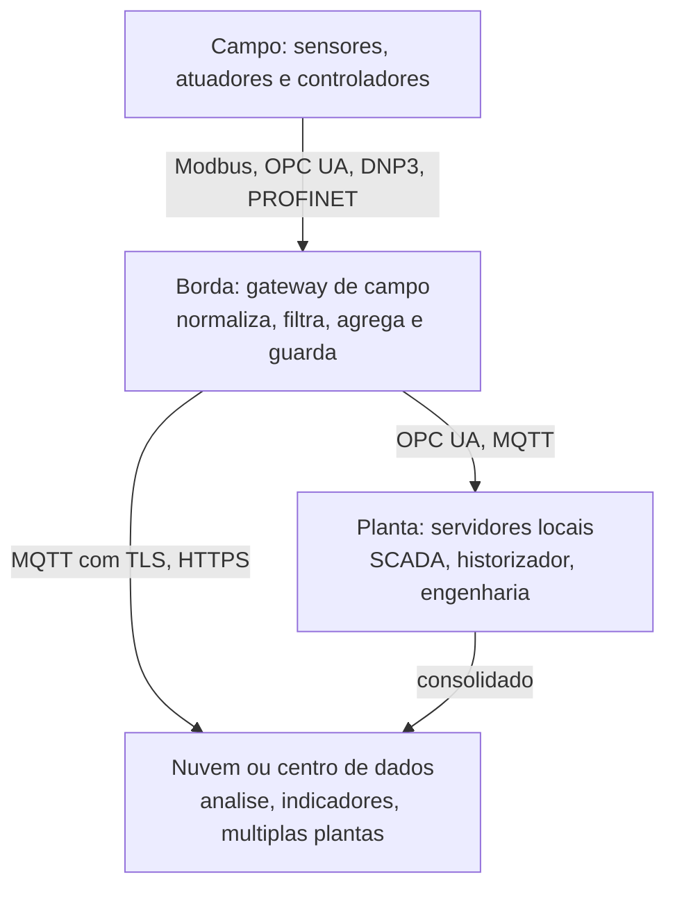
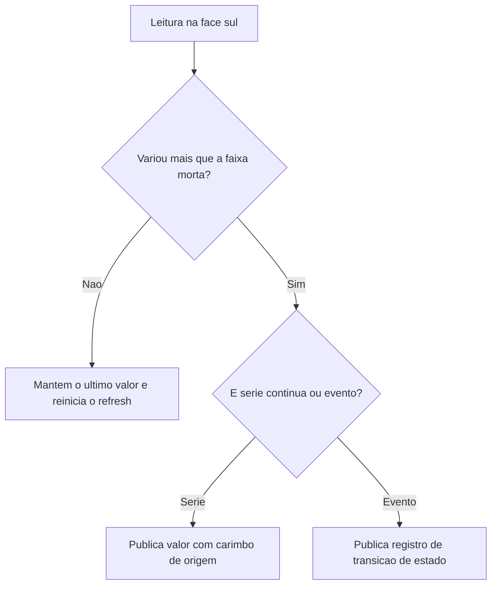

# Capítulo 17 – Edge Computing na Indústria

## Objetivos de Aprendizagem

Ao final deste capítulo, o leitor será capaz de:

- Explicar por que nem todo dado industrial deve ser enviado integralmente à nuvem.
- Descrever as funções de uma borda de campo e o que acontece quando cada uma falta.
- Dimensionar *store and forward*, agregação e filtro na borda.
- Reconhecer os limites do que se deve decidir na borda — e o que nunca deve sair do controlador.
- Projetar a operação de uma frota de gateways: provisionamento, atualização e monitoramento.

---

## 17.1 Por que a borda existe

A pergunta que cria a borda não é tecnológica, é econômica: **vale transportar este dado?** Enviar
todas as variáveis de uma planta, na resolução do controlador, para um servidor distante custa
enlace, armazenamento e energia — e a maior parte desse volume nunca é consultada. Ao mesmo tempo,
há exigências que a nuvem não atende: latência previsível, funcionamento durante a queda do enlace e
residência do dado dentro da planta.

**Computação na borda** (*edge computing*) é o processamento feito próximo à fonte — no próprio
dispositivo ou em um equipamento de campo —, em vez de no servidor central ou na nuvem. O critério
de projeto não é "onde é moderno processar", e sim qual decisão precisa ser tomada **onde** e **em
quanto tempo**.

Três forças explicam a borda industrial:

1. **Economia de enlace.** Publicar por exceção em vez de publicar por período reduz o volume em
   uma ordem de grandeza em variáveis estáveis — e enlace 4G com franquia é custo recorrente.
2. **Continuidade.** O processo não pode parar porque o enlace caiu. A borda guarda o dado e o
   entrega quando a comunicação volta, sem perder a série.
3. **Escala de protocolos.** Cada equipamento fala um dialeto. Concentrar a tradução em um ponto
   reduz o número de integrações de *n* × *m* para *n* + *m* (Capítulos 5 e 13).

> 📌 **Nota:** "borda" e "névoa" (*fog*) são usados como sinônimos na prática. Quando se distingue,
> *edge* é o processamento no próprio dispositivo ou no gateway imediatamente ao lado dele, e *fog*
> é a camada intermediária da planta — servidores locais que agregam vários gateways antes da
> nuvem. Para efeito de projeto, o que importa é a hierarquia de agregação, não o nome da camada.

---

## 17.2 O que uma borda faz — e o que acontece quando falta

Uma borda de campo acumula três funções distintas. Tratá-las como uma só é a origem da maioria dos
projetos frustrados.

**Tabela 17.1 – As três funções da borda**

| Função | O que faz | Sintoma da ausência |
|---|---|---|
| Aquisição e normalização | Conversa com o campo por vários protocolos, escala, valida e publica em um modelo único | Cada sistema integra com o campo do seu jeito; nomes e unidades divergem |
| Continuidade (*store and forward*) | Guarda o dado em fila local quando o enlace cai e reenvia depois, preservando o carimbo de origem | Buraco na série temporal exatamente nos períodos de problema — quando o dado mais importava |
| Decisão local | Filtra, agrega, detecta condição e dispara ação local sem depender de ida e volta à nuvem | Latência e indisponibilidade da nuvem contaminam a operação da planta |

> ⚠️ **Atenção:** a terceira função tem limite claro. **Proteção, intertravamento e segurança
> funcional permanecem no controlador** — nunca na borda, nunca na nuvem. Uma parada de emergência
> que depende de rede, de broker ou de servidor remoto é um acidente esperando a hora certa. A borda
> pode decidir publicar, agregar e até ajustar um *setpoint* dentro de limites já validados; ela não
> executa a função de segurança do processo.

---

## 17.3 O gateway na prática

O gateway é o equipamento que materializa a borda. Suas duas faces têm nomes próprios:

- **Face sul** (*southbound*): conversa com o campo — Modbus RTU/TCP, OPC UA, DNP3, IEC 60870-5-104,
  PROFINET, entradas digitais e analógicas locais. É onde está o **mapa de pontos**: a relação entre
  o endereço no equipamento e o nome publicado.
- **Face norte** (*northbound*): publica para cima — MQTT com TLS, HTTP/REST, OPC UA, Sparkplug B.
  É onde se define a **taxa de publicação** e a **faixa morta** por ponto.

O mapa de pontos da borda é o primo do mapa de memória do Capítulo 14, e sofre do mesmo mal: quando
não é documentado, ninguém sabe de onde veio o número que aparece no painel. A diferença é que, na
borda, o modelo de dados pode ser **descoberto** (OPC UA) em vez de digitado, o que diminui o erro
de digitação mas não elimina a necessidade de revisão.

> 🖼️ **[Figura 17.1 – Painel de configuração de um gateway de campo]**
> *Captura de tela de um gateway com duas abas visíveis: à esquerda, a lista de conexões face sul (duas conexões Modbus TCP e uma OPC UA, com endereço, porta e estado da conexão); à direita, a tabela de pontos com colunas nome publicado, endereço de origem, tipo, unidade, faixa, intervalo de leitura e faixa morta. Destacar o indicador de fila local (itens pendentes) e o carimbo de tempo da última publicação bem-sucedida.*

### 17.3.1 Store and forward: o teste que separa projeto de improviso

Guardar dados quando o enlace cai parece simples e não é. Quatro decisões definem se a fila local
serve para alguma coisa:

- **Volume da fila.** Quanto tempo de dado cabe em caso de queda prolongada? Uma semana de dado
  agregado é viável em memória local; uma semana de dado bruto, raramente.
- **Carimbo de tempo.** O dado entra na fila com o **carimbo de origem**, não com o horário da
  chegada (Capítulo 14). Sem isso, a série reenviada mente sobre quando as coisas aconteceram.
- **Política de descarte.** Se a fila enche, o que se perde: o mais antigo ou o mais novo? A resposta
  depende do uso — para diagnóstico, o recente importa mais; para relatório de conformidade, a
  sequência completa importa.
- **Proteção da memória.** Fila em cartão sujeito a desgaste por escrita exige cuidado com
  frequência de gravação e com o que se grava.

> 💡 **Dica:** o teste de aceitação de qualquer borda é simples e quase nunca é feito. Desligue o
> enlace por duas horas, com o processo em operação. Quando o enlace voltar, verifique três coisas:
> se o dado chegou, se chegou com o carimbo correto e se a plataforma o aceitou como histórico — e
> não como se tudo tivesse acontecido no instante da reconexão.

> 🖼️ **[Figura 17.2 – Comportamento da fila local durante a queda e o restabelecimento do enlace]**
> *Gráfico de duas séries no mesmo eixo de tempo: a vazão medida no processo (linha contínua) e o número de itens pendentes na fila do gateway (linha tracejada). No trecho de enlace ativo a fila fica em zero; no início da queda a fila cresce em rampa; ao final, cai até zero em um patamar diferente do de subida, mostrando o dreno controlado. Marcar a área do gráfico com o rótulo "sem perda de dado" e anotar que a série recuperada mantém o carimbo de origem.*

---

## 17.4 Reduzir na borda: filtro, agregação e evento

O ganho da borda aparece quando ela **reduz** o dado antes de publicá-lo. As técnicas são as mesmas do
Capítulo 15, aplicadas na publicação:

**Tabela 17.2 – Estratégias de redução na borda**

| Estratégia | Como funciona | Ganho típico | Risco |
|---|---|---|---|
| Publicação por exceção | Só publica quando o valor varia mais que a faixa morta | Alto em sinais estáveis | Esconde a tendência lenta se a faixa morta for grande |
| *Refresh* periódico | Publica o valor atual mesmo sem variação, a cada intervalo longo | Mantém a tela viva | Consumo fixo de enlace |
| Agregação local | Publica média, mínimo e máximo de um intervalo | Alto em variáveis rápidas | Perde o instante exato do pico (mitigado por mínimo/máximo) |
| Evento em vez de série | Publica um registro quando a condição ocorre, não a série que a originou | Muito alto | Perde o contexto da série anterior ao evento |
| Detecção local de condição | Compara com limites e publica somente a transição de estado | Alto, e reduz alarme espúrio | Exige que os limites estejam sincronizados com o SCADA |

> ⚠️ **Atenção:** limite configurado na borda e limite configurado no SCADA precisam ser o **mesmo**
> número, e mudar um sem o outro é defeito garantido. A prática recomendada é que o limite venha do
> sistema de gestão como configuração (atributo compartilhado, no Capítulo 12) e seja apenas
> aplicado na borda — não digitado duas vezes.

---

## 17.5 Edge analytics: o que cabe e o que não cabe

Há um entusiasmo previsível em rodar análise preditiva no gateway. Vale separar o que é razoável do
que é propaganda:

- **Cabe na borda:** filtros digitais, cálculo de indicadores simples (média, desvio, energia,
  horas de operação), detecção de condição por regra, comparação com *baseline* fixo, contagem de
  eventos. Tudo isso é aritmética leve, determinística e auditável.
- **Cabe com restrição:** inferência de modelos pequenos (classificação por árvore, regressão
  simples, detecção de anomalia por distância) — desde que a memória e o processamento disponíveis
  suportem, e desde que a atualização do modelo possa ser feita sem parar a aquisição.
- **Não cabe bem na borda:** treinamento de modelo, análise de séries longas, correlação entre
  ativos, otimização global de processo. Essas tarefas precisam de volume e de histórico — e o
  histórico consolidado vive na planta ou na nuvem.

> 📌 **Atualização tecnológica:** a forma atual de empacotar essa lógica na borda é a
> **contêiner** — a aplicação de aquisição, o motor de regras e o modelo são imagens versionadas,
> atualizáveis sem trocar o sistema operacional do gateway. Isso resolve o problema histórico de
> "não posso atualizar o gateway porque ele tem outras coisas rodando" e permite que a mesma
> automação de integração contínua usada em software corporativo chegue à borda com segurança.

---

## 17.6 Operar uma frota de gateways

Um gateway isolado é fácil. Cinquenta gateways espalhados por uma cidade são um problema de
operação, não de eletrônica. O que muda:

**Tabela 17.3 – Requisitos de operação em escala**

| Requisito | Prática |
|---|---|
| Identidade por dispositivo | Um certificado por gateway, nunca um certificado compartilhado entre a frota |
| Provisionamento repetível | Configuração versionada e aplicada em lote; gateway novo entra em serviço por *script*, não por digitação |
| Atualização de firmware e de aplicação | Janela planejada, com *rollback* possível e sem interromper a aquisição |
| Monitoramento da própria borda | O gateway publica o seu próprio estado: fila, uso de CPU e memória, tempo desde a última coleta, erros de protocolo |
| *Watchdog* e recuperação | Reinício automático de serviço travado; registro do motivo do reinício |
| Consolidação de alarmes da borda | Queda de gateway é evento de primeira ordem, não ruído de rede |

O item mais ignorado é o monitoramento da própria borda. Sem ele, a queda de um gateway se manifesta
como **ausência de dado** — e ausência de dado não gera alarme. A detecção precisa de um mecanismo
ativo: ou o gateway publica periodicamente o seu estado (o `NDEATH` e o `NBIRTH` do Sparkplug B
existem para isso, no Capítulo 13), ou o servidor verifica o silêncio e conclui a queda.

> 🖼️ **[Figura 17.3 – Painel de monitoramento da frota de gateways]**
> *Captura de painel com uma tabela de 12 gateways e colunas de identificador, última comunicação, estado da fila, uso de memória, versão de firmware e número de reinícios nas últimas 24 h. Linhas em destaque para dois gateways: um com fila acima do limite de atenção e outro sem comunicação há 40 minutos. Ao lado, um indicador do tipo semáforo com a contagem por estado (em operação, atenção, offline).*

> 💡 **Dica:** trate o par *last will* + publicação periódica de estado como requisito obrigatório de
> projeto. É a diferença entre "o dado parou de chegar" e "o gateway 37 caiu às 14h32, a fila tinha
> 1.204 itens e a causa provável é o cartão de memória". A primeira frase não permite ação; a
> segunda, sim.

---

## 17.7 Segurança e a borda

A borda aumenta a superfície de ataque: é um computador com sistema operacional, rede, acesso a
dispositivos industriais e conexão para fora (Capítulo 8). O que a torna administrável:

- **Sem exposição direta.** O gateway **inicia** as conexões para fora; ninguém entra. Interface de
  administração em rede segregada, nunca publicada.
- **Certificado por dispositivo** e verificação do certificado do servidor.
- **Contas individuais** para administração, com registro de quem alterou o quê.
- **Serviços mínimos.** Cada serviço ligado é uma porta a defender; se não é usado, desligue.
- **Atualização como processo.** Firmware e aplicação com versionamento, homologação em um gateway
  piloto e propagação por ondas.

---

## 17.8 Estudo de Caso — A borda que não guardava

**Cenário.** Um sistema de telemetria de 40 unidades consumidoras de água. Cada unidade tem um
*gateway* com modem 4G, lendo um medidor de vazão por pulso e a pressão da linha. A empresa de
saneamento precisava faturar o volume mensal e detectar vazamentos por comparação entre período
noturno e diurno.

**Diagnóstico.** Depois de três meses, a conciliação acusou divergência de até 18 % entre o volume
faturado e o volume real medido em um lote piloto. A investigação mostrou:

1. O gateway não tinha fila local. Em cada queda de sinal 4G — frequente à noite — os pulsos
   contados durante a queda eram perdidos.
2. O carimbo de tempo era atribuído pelo servidor no instante do recebimento. Quando o enlace
   voltava, várias horas de leitura apareciam concentradas em minutos, o que falseava a análise de
   consumo noturno.
3. A publicação era por período, a cada 60 s, o que não capturava pulsos em rajada.

**Decisão de engenharia.**

| Medida | Efeito |
|---|---|
| Contagem de pulsos acumulada no próprio gateway, com fila local em memória não volátil | Nenhum pulso é perdido durante a queda |
| Carimbo de tempo na origem, por pulso e por leitura | A série volta a refletir o horário real |
| Publicação por exceção com *refresh* a cada 15 min | Redução de cerca de 80 % no consumo do enlace |
| Monitoramento do estado do gateway e alarme de queda | A falha passa a ser vista em minutos, não no fechamento do mês |

**Resultado.** A divergência caiu para menos de 1 %, compatível com o erro do medidor. A detecção de
vazamento noturno passou a ser possível porque a série voltou a ser contínua — o que nunca dependeu
de inteligência artificial, e sim de a borda ter guardado o dado.

**Limitações do arranjo.** A fila local tem capacidade finita: uma queda de enlace de muitos dias
ainda perde dado, e por isso a política de descarte foi definida — prioriza-se o mais recente. Além
disso, o *setpoint* de pressão continua exclusivamente no controlador local; a nuvem apenas observa.

---

## Resumo

- A borda existe por **economia de enlace, continuidade e escala de protocolos** — não por moda.
- Uma borda tem três funções: aquisição e normalização, continuidade e decisão local. Faltando
  qualquer uma, o sintoma aparece longe dela.
- **Proteção e intertravamento permanecem no controlador**; a borda observa, filtra, agrega e
  publica.
- O **mapa de pontos** da borda é tão crítico quanto o mapa de memória do supervisório.
- *Store and forward* só funciona com carimbo de origem, política de descarte definida e capacidade
  dimensionada.
- Reduzir na borda (por exceção, por agregação, por evento) é o que torna a telemetria sustentável.
- **Limites configurados na borda e no SCADA precisam ser o mesmo número**, gerido em um só lugar.
- Frota de gateways exige identidade por dispositivo, provisionamento repetível, atualização com
  *rollback* e **monitoramento da própria borda**.
- O teste de aceitação é desligar o enlace por horas e verificar se o dado volta com o carimbo certo.

## Questões de Revisão

1. Explique, com um exemplo numérico de volume de dados, por que nem todo sinal de campo deve ser publicado na nuvem.
2. Quais são as três funções de uma borda de campo e qual o sintoma da ausência de cada uma?
3. Por que proteção e intertravamento não podem ser implementados na borda ou na nuvem?
4. Descreva o papel da face sul e da face norte de um gateway, citando dois protocolos de cada lado.
5. Um gateway publica a cada 60 s e o enlace cai por 8 horas. Descreva o que precisa existir para que nenhum dado se perca e para que o dado chegue com o horário correto.
6. Compare publicação por exceção, agregação local e publicação por evento quanto a ganho de banda e risco de perda de informação.
7. O mesmo limite de pressão está configurado com 6,0 bar no gateway e 6,2 bar no SCADA. Descreva as consequências e proponha a correção.
8. Por que "ausência de dado" não gera alarme por si só? Que mecanismo resolve isso?
9. Liste cinco requisitos de operação de uma frota de 50 gateways e explique o risco de ignorar cada um.

## Referências

- INTERNATIONAL SOCIETY OF AUTOMATION. **ISA-95 / IEC 62264 — Enterprise-control system integration** (níveis hierárquicos de integração; verificar edição vigente).
- VIANNA, W. S. **IIoT e suas Tecnologias Aderentes: Teoria e exemplos práticos**. Material didático do curso (tecnologias aderentes à IIoT, incluindo computação na borda e na nuvem).
- VIANNA, W. S. **Introdução a IoT**. Material didático do curso (conectividade, plataformas de nuvem e análise avançada).
- ECLIPSE FOUNDATION. **Sparkplug Specification 3.0** — `NBIRTH`, `NDATA` e `NDEATH` como mecanismo de detecção de queda de nó de borda. Disponível em: eclipse.org/tahu. Consulta: 2026.
- THINGSBOARD. **IoT Gateway** — arquitetura de gateway, conectores de face sul e mapeamento de pontos. Disponível em: thingsboard.io/docs/iot-gateway. Consulta: 2026.
- OPC FOUNDATION. **OPC UA** — informação de modelo, *subscription* e PubSub aplicados à borda. Disponível em: opcfoundation.org. Consulta: 2026.
- INTERNATIONAL ELECTROTECHNICAL COMMISSION. **IEC 62443** — requisitos de segurança para sistemas de automação e controle (zonas, conduítes e níveis de segurança; verificar edição das partes vigentes).
