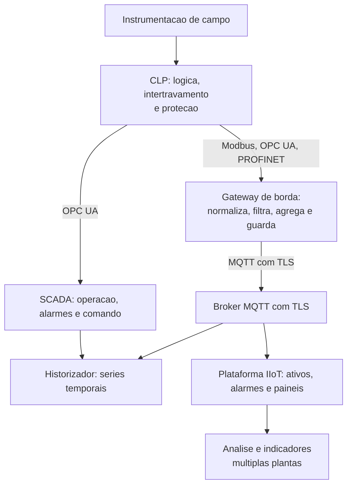
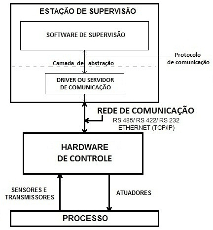
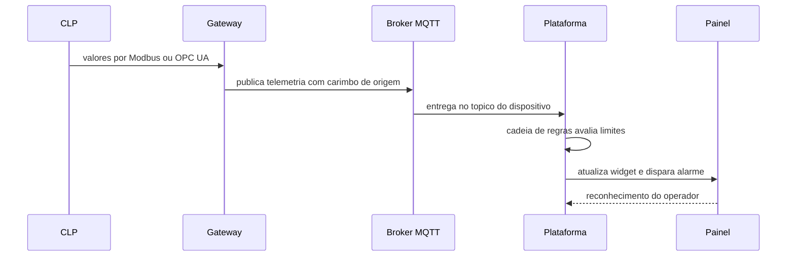

# Capítulo 18 – Integração SCADA + CLP + IoT + Cloud

## Objetivos de Aprendizagem

Ao final deste capítulo, o leitor será capaz de:

- Desenhar uma arquitetura de referência que integre controlador, supervisão, borda e nuvem.
- Decidir em qual camada cada função deve morar e justificar a escolha.
- Montar a sequência de dados de integrações típicas, do sensor ao painel.
- Reconhecer as falhas de integração mais comuns e o teste que as revela.
- Aplicar a regra que separa supervisão de comando em arquiteturas híbridas.

---

## 18.1 Quatro mundos, um dado só

O CLP, o SCADA, o mundo IoT e a nuvem têm requisitos que não se parecem:

**Tabela 18.1 – Requisitos que precisam conviver**

| Camada | Precisa de | Não tolera | Horizonte de tempo |
|---|---|---|---|
| CLP | Determinismo e disponibilidade | Depender de rede ou servidor para proteger | Milissegundos |
| SCADA | Estado atual confiável e comando auditável | Valor mentiroso na tela | Décimos de segundo a segundos |
| Borda | Reduzir, normalizar e guardar | Perder dado quando o enlace cai | Segundos a horas |
| Nuvem | Volume, histórico e visão de conjunto | Ser caminho crítico do processo | Minutos a meses |

A integração dá certo quando cada camada faz o que sabe fazer, e não quando uma tenta substituir a
outra. O Capítulo 6 já estabeleceu que IoT/IIoT não substituem SCADA; aqui a discussão é de projeto:
**onde colocar cada peça**.

---

## 18.2 Onde cada decisão deve morar

Esta é a tabela que evita a maior parte dos erros de arquitetura. Ela é curta de propósito.

**Tabela 18.2 – Alocação de funções por camada**

| Função | Camada correta | Por quê |
|---|---|---|
| Intertravamento, proteção, parada de emergência | CLP (ou SIS) | Precisa de determinismo e de independência de rede |
| Sequência de partida e controle regulatório | CLP | Ciclo de varredura adequado e disponibilidade local |
| Supervisão, comando do operador e alarmes de processo | SCADA | Interface, gestão de alarmes e trilha de auditoria (Capítulos 10 e 11) |
| Sincronização de nomes, unidades e faixas | Uma única fonte, aplicada às demais | Evita o mesmo dado com dois significados |
| Redução, agregação e *store and forward* | Borda | É onde o dado é volumoso e o enlace é caro (Capítulo 17) |
| Histórico de alta resolução | Historizador junto ao processo | Consulta rápida e resolução preservada (Capítulo 16) |
| Histórico longo, indicadores e análise entre plantas | Nuvem | Volume, retenção e visão consolidada |
| Detecção de anomalia em série longa e modelos | Nuvem ou planta | Exige histórico consolidado (Capítulo 20) |

**A regra que não se negocia:** o **comando** do processo nasce no SCADA ou na IHM local, por
protocolo autenticado, com trilha de auditoria. A nuvem **observa**. Quando o cliente pede "quero
ligar a bomba pelo celular", a resposta de engenharia é: você pode, se o caminho for autenticado,
com autorização por papel, com confirmação de estado de volta e com registro de quem comandou — e
mesmo assim só para comandos que não afetem segurança.

> **Fonte:** *Livro SCADA — versão para análise*, p. 24 (Machado, Pontes e Vianna, reproduzida com crédito).

A figura mostra o conceito que sustenta toda a integração: a **camada de abstração** permite
implementar a IHM sem conhecer a tecnologia do hardware de controle, e o **driver** é a peça que
pode ser trocada sem reescrever a aplicação. É por isso que o servidor de comunicação pode agregar
mais de um driver, para hardware e interfaces diferentes, sem que o software de supervisão precise
saber como cada um funciona.

---

## 18.3 A sequência de dados, passo a passo

Integração se aprende seguindo o dado. Os cinco arranjos abaixo são progressivos e cada um acrescenta
uma peça; todos são usados em plantas reais.

### 18.3.1 Válvula solenoide comandada por CLP

**Sequência:** o operador aciona o botão na IHM → o SCADA escreve `1` no tag de comando → o driver
grava na memória imagem do CLP → a lógica energiza a saída → a solenoide abre → o sensor de fim de
curso confirma → o CLP atualiza a entrada → o driver lê → o tag de estado muda → a IHM anima o
objeto.

**Configuração mínima:** dois tags (comando e estado), faixa morta zero no estado, tempo de retorno
esperado.

**O que observar no resultado:** o atraso entre comandar e ver o estado; se a confirmação não chega
no tempo esperado, deve existir alarme de falha de atuação — e não um botão que "não fez nada".

**Limitação:** o comando pelo supervisório não é proteção. Se a válvula precisa fechar por segurança,
quem fecha é o intertravamento, não a IHM.

### 18.3.2 CLP → SCADA

**Sequência:** leitura da memória do CLP pelo driver → escalonamento para unidade de engenharia →
validação de faixa → avaliação de alarme → atualização do objeto na tela → gravação no historizador.

**Configuração mínima:** classe de varredura por grupo de tags, faixa e unidade no cadastro, limites
de alarme documentados, tendência real com janela dimensionada.

**O que observar:** a coerência entre o valor exibido e o valor lido localmente no CLP, com o mesmo
instrumento e no mesmo instante.

**Limitação:** o SCADA é não determinístico — o atraso da tela não é erro, mas precisa ser conhecido
(Capítulo 15).

### 18.3.3 CLP → MQTT → plataforma IIoT

**Sequência:** a função de cliente MQTT no CLP ou no gateway publica no tópico de telemetria com o
identificador do dispositivo → a plataforma recebe, registra a telemetria e dispara a cadeia de
regras → a regra cria ou limpa alarme → o painel é atualizado.

**Configuração mínima:** identificador do dispositivo e credencial por dispositivo, estrutura de
tópico, formato do *payload* e carimbo de tempo, além da regra que distingue alarme de registro.

**O que observar:** o tempo entre a mudança no processo e a atualização do painel; o que acontece
com um valor fora da faixa no motor de alarme.

**Limitação:** a plataforma não executa controle. Ela observa, registra e notifica (Capítulo 12).

### 18.3.4 Sensor → Node-RED → MQTT → plataforma

**Sequência:** Node-RED lê a fonte (Modbus, serial, HTTP ou simulador) → normaliza nome e unidade →
injeta o carimbo de tempo → publica em MQTT → a plataforma persiste e apresenta.

**Configuração mínima:** nó de leitura com *timeout*, tratamento de erro explícito, injeção de
carimbo de tempo e retenção de última mensagem desativada para dado temporal.

**O que observar:** o comportamento com a fonte fora do ar — o fluxo precisa **não publicar** valor
antigo como se fosse atual.

**Limitação:** Node-RED é excelente para prototipar e mediar, e não é ambiente de controle nem de
garantia temporal (Capítulo 7).

### 18.3.5 SCADA + historiador + dashboard

**Sequência:** o SCADA coleta e disponibiliza por OPC UA → o historiador assina as variáveis com
intervalo de amostragem e faixa morta definidos → o dashboard consulta o histórico por período e
agregação.

**Configuração mínima:** o que é gravado, com que resolução e por quanto tempo (Capítulo 16); a
consulta do painel com agregação explícita.

**O que observar:** a diferença entre o valor lido na tela do SCADA e o ponto mais próximo no
histórico — se for grande, a faixa morta ou o filtro estão escondendo o transitório.

**Limitação:** painel não é sistema de operação. Ninguém deve comandar o processo por dashboard.

> 🖼️ **[Figura 18.2 – Caminho completo do dado, de ponta a ponta]**
> *Diagrama em faixas horizontais, no estilo de arquitetura de referência: no alto a instrumentação; abaixo o CLP com a lógica e o intertravamento destacados; em seguida a borda com as duas faces e a fila local; depois, em paralelo, o SCADA com estação de operação e o historizador; por último o broker, a plataforma e a análise. Sobre as setas, anotar protocolo e sentido; nas laterais, marcar com cadeado os trechos cifrados e anotar o carimbo de tempo em cada troca.*

---

## 18.4 Onde a integração costuma quebrar

Nenhuma dessas falhas é de protocolo. Todas são de projeto, e todas aparecem no mesmo lugar: no
número que está errado na tela de alguém.

**Tabela 18.3 – Falhas típicas e sua origem**

| Sintoma | Causa provável | Prevenção |
|---|---|---|
| O mesmo ativo tem três nomes diferentes | Nenhuma fonte única de nomes | Dicionário de dados único, aplicado às três camadas |
| Valor plausível e errado | Faixa ou unidade divergente entre CLP, cadastro e plataforma | Um cadastro por variável, revisado na partida |
| Sensor com defeito aparece como zero | Qualidade do dado descartada no caminho | Propagar `StatusCode` até a tela (Capítulos 14 e 15) |
| Ordem dos eventos não fecha | Carimbo atribuído em pontos diferentes da cadeia | Carimbo na origem e relógios sincronizados |
| Buraco no histórico em dia de problema | Ausência de fila local ou de *store and forward* | Fila dimensionada e testada com o enlace desligado |
| Alarmes duplicados no SCADA e na plataforma | Mesma condição avaliada em duas camadas, com limites diferentes | Um lugar avalia, o outro registra |
| Consumo de dados estourou a franquia | Publicação periódica de tudo | Publicação por exceção com *refresh* (Capítulo 17) |

---

## 18.5 Como provar que a integração funciona

Integração não se valida lendo configuração; valida-se **injetando perturbação**. O roteiro mínimo:

1. **Valor conhecido.** Injete um valor de teste no instrumento ou simule a fonte e siga o número por
   todas as camadas até o painel, conferindo unidade, faixa e casas decimais.
2. **Corte de enlace.** Desligue a comunicação por tempo significativo e verifique se o dado volta
   completo e com o carimbo correto.
3. **Reinício de nó.** Reinicie o gateway, o broker e a estação, um por vez, e observe o que cada
   reinício faz com a série e com os alarmes.
4. **Valor fora de faixa.** Envie um valor fisicamente impossível e verifique se ele é rejeitado com
   qualidade ruim em vez de alarmar o operador.
5. **Mudança de horário.** Desloque o relógio de um nó e verifique se a divergência é detectada.
6. **Desligamento da nuvem.** Deixe a plataforma fora do ar e confirme que o SCADA e o CLP continuam
   operando normalmente.

> 💡 **Dica:** transforme esses seis testes em um procedimento de aceitação com registro de resultado
> e data. Um sistema integrado sem esse registro é um sistema que ninguém sabe se está funcionando —
> só se sabe que ainda não falhou de forma visível.
> 🖼️ **[Figura 18.3 – Registro do teste de corte de enlace]**
> *Captura de uma tabela de procedimento de aceitação preenchida: colunas de item testado, condição imposta (enlace desligado por 2 h, entre 09h00 e 11h00), resultado esperado, resultado observado e responsável. Duas linhas em destaque: "dado recuperado com carimbo de origem" e "nenhum registro gravado com horário de reconexão". Ao lado, o gráfico da série temporal mostrando o trecho sem recepção e o preenchimento posterior da curva no intervalo correto.*
---

## 18.6 Estudo de Caso — A integração que duplicou os alarmes

**Cenário.** Uma indústria de alimentos integrou o SCADA existente a uma plataforma IIoT para dar
visão de indicadores à gestão. Seis meses depois, a plataforma foi liberada também para a supervisão
móvel dos coordenadores de turno, com notificação por mensagem.

**Diagnóstico.** No primeiro mês de uso, a operação reclamou de "alarme repetido no celular sem nada
de errado na tela do SCADA". A análise mostrou três problemas sobrepostos:

1. A plataforma avaliava limites próprios, digitados na configuração dos dispositivos, diferentes dos
   limites do SCADA — o alarme de temperatura alta da plataforma disparava 2 °C antes.
2. Não havia faixa morta na plataforma, e a variável oscilava em torno do limite: o celular recebia
   dezenas de mensagens por turno.
3. Os alarmes da plataforma não eram reconhecidos por ninguém: o operador reconhecia no SCADA, e a
   plataforma continuava notificando.

**Decisão de engenharia.**

| Problema | Medida |
|---|---|
| Limites divergentes | Limites passaram a ser atributos de configuração, geridos em um só lugar e distribuídos para SCADA e plataforma |
| Alarme espúrio | Faixa morta e atraso de confirmação configurados na plataforma, iguais aos do SCADA |
| Reconhecimento sem efeito | Reconhecimento unificado: quem reconhece no SCADA encerra a notificação na plataforma |
| Papel indefinido | Notificação móvel restrita a alarmes de prioridade alta e de equipamento, com registro de quem recebeu |

**Resultado.** As mensagens por turno caíram de algumas dezenas para menos de cinco, e voltaram a ser
lidas. O ganho não veio de tecnologia nova: veio de decidir quem avalia o quê e de um único lugar
para os limites.

**Limitações do arranjo.** O reconhecimento unificado exige um identificador comum de alarme nas duas
camadas e não funciona com plataformas que geram o seu próprio identificador sem correlação. E a
decisão de restringir a notificação por prioridade deixou a plataforma cega para alarmes de processo
de prioridade média — o que foi aceito como decisão de projeto, não como efeito colateral.

---

## Resumo

- Cada camada tem um **horizonte de tempo** próprio: milissegundos no CLP, segundos no SCADA, horas na borda, meses na nuvem.
- A alocação de funções é o que define o sucesso da integração, e não o protocolo escolhido.
- **Comando** nasce no SCADA ou na IHM local, com autenticação e trilha; a nuvem observa.
- Integração se aprende seguindo o dado: cada arranjo (CLP → SCADA, CLP → MQTT → plataforma, sensor → Node-RED → plataforma, SCADA + historian + dashboard) acrescenta uma peça.
- As falhas de integração são de **modelagem**: nomes divergentes, faixa errada, qualidade descartada, carimbo no lugar errado.
- O mesmo dado não deve ser avaliado em duas camadas com limites diferentes: **um lugar avalia, o outro registra**.
- Integração se valida **injetando perturbação** — corte de enlace, reinício, valor fora de faixa, desligamento da nuvem.
- Nenhuma dessas arquiteturas substitui CLP e SCADA no controle, na proteção e na segurança funcional.

## Questões de Revisão

1. Explique por que o determinismo do CLP e a imprevisibilidade da nuvem exigem uma arquitetura em camadas, e não um único sistema.
2. Preencha a alocação de funções para um projeto de sua escolha, indicando em que camada ficam intertravamento, alarme de processo, agregação e análise preditiva.
3. Descreva a sequência completa de dados de um comando de abertura de válvula pela IHM, identificando onde pode haver atraso.
4. Por que a nuvem não deve comandar o processo? Cite duas exceções aceitáveis e as condições que as tornam seguras.
5. Um operador reclama que o valor de vazão no dashboard é 5 % menor que na tela do SCADA. Liste quatro causas possíveis e como verificar cada uma.
6. Descreva o que deve acontecer com a série temporal quando o enlace é desligado por quatro horas e restabelecido.
7. Explique por que a mesma condição avaliada no SCADA e na plataforma gera alarme duplicado, e proponha a correção.
8. Monte um roteiro de aceitação de integração com seis testes de perturbação e o resultado esperado em cada um.
9. Uma planta quer publicar 800 variáveis por MQTT a cada 5 s em enlace 4G com franquia de 20 GB mensais. Estime o volume, critique a proposta e apresente uma arquitetura alternativa.

## Referências

- MACHADO, R.; PONTES, W.; VIANNA, W. **Livro SCADA — versão para análise**. Material didático do curso (arquitetura básica, servidor de comunicação, camada de abstração e sistema web server). Figura reproduzida com crédito.
- VIANNA, W. S. **Sistema SCADA Supervisório**. IFF, 2008 (arquiteturas típicas de sistemas SCADA, com CLP, fieldbus, controladores dedicados e controle digital direto; tecnologias web).
- INTERNATIONAL SOCIETY OF AUTOMATION. **ISA-95 / IEC 62264 — Enterprise-control system integration** (integração entre níveis de automação e de gestão; verificar edição vigente).
- OPC FOUNDATION. **OPC Unified Architecture** — cliente-servidor e PubSub aplicados à integração entre equipamento, supervisão e nuvem. Disponível em: opcfoundation.org. Consulta: 2026.
- ECLIPSE FOUNDATION. **Sparkplug Specification 3.0** — convenção de tópicos e estados de sessão para integração IIoT. Disponível em: eclipse.org/tahu. Consulta: 2026.
- THINGSBOARD. **Documentação oficial** — telemetria, atributos, motor de regras, alarmes e RPC. Disponível em: thingsboard.io/docs. Consulta: 2026.
- GRAFANA LABS. **Grafana Documentation** — consulta a séries temporais e painéis de supervisão. Disponível em: grafana.com/docs. Consulta: 2026.
