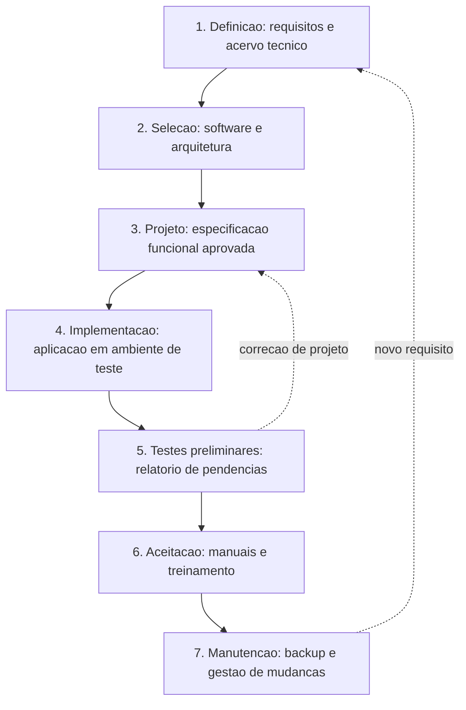
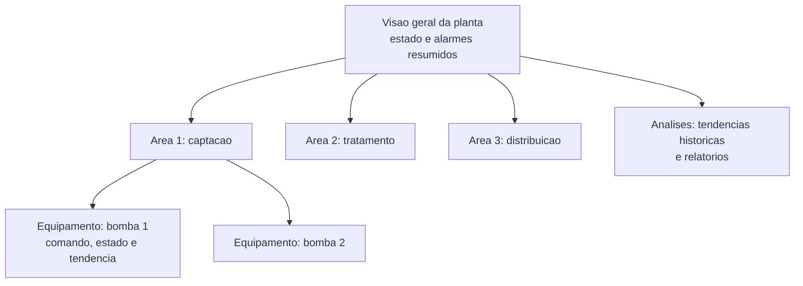
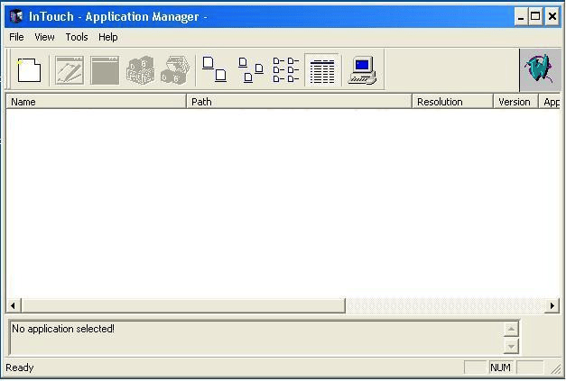
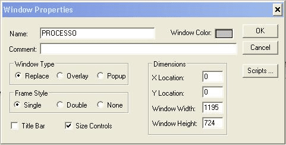

# Capítulo 19 – Projeto e Implantação de um Sistema Supervisório

## Objetivos de Aprendizagem

Ao final deste capítulo, o leitor será capaz de:

- Descrever o ciclo de vida de um projeto SCADA e os produtos de cada fase.
- Executar o levantamento de dados que antecede qualquer tela: entendimento do processo, tomada de dados, banco de dados e lista de alarmes.
- Aplicar critérios de ergonomia ao projeto de IHM e justificar cada decisão.
- Planejar hierarquia de navegação, layout e padronização entre telas.
- Conduzir testes, aceitação, treinamento e manutenção com registro.

---

## 19.1 A parte difícil não é a tela

Um projeto de supervisório falha raramente por falta de recurso gráfico. Falha por **levantamento
incompleto**: ninguém conversou com quem opera, a lista de variáveis foi montada por semelhança com
outro projeto, o mapa de memória chegou depois da implementação e a lista de alarmes foi copiada de
um sistema antigo. O resultado é uma IHM bonita que a operação não usa — ou pior, usa com desconfiança.

Este capítulo trata do que precisa ser feito **antes** de desenhar a primeira tela, e do que precisa
ser feito depois de entregá-la.

---

## 19.2 O ciclo de vida em sete fases

Um projeto SCADA segue um ciclo com fases que se repetem, com inspeção ao final de cada uma. Os
produtos de cada fase são o que permite saber se ela terminou.

**Tabela 19.1 – Fases do ciclo de vida e produtos**

| Fase | O que se faz | Produto que encerra a fase |
|---|---|---|
| 1. Definição | Entrevistas, coleta de dados, fluxogramas P&I, mapa de memória, requisitos de funcionamento e de interface | Documento de requisitos e acervo técnico recebido |
| 2. Seleção | Escolha do software e da arquitetura em função dos requisitos e dos recursos disponíveis | Matriz de decisão com justificativa |
| 3. Projeto | Arquitetura física e lógica, padrões, lista de janelas, fluxograma de navegação, *layout*, mapa de tagnames, lista de alarmes | Especificação funcional aprovada |
| 4. Implementação | Codificação das interfaces, com prototipação quando o escopo do cliente não está claro | Aplicação executável em ambiente de teste |
| 5. Testes preliminares | Verificação de funcionalidades e de comunicação, em ambiente simulado quando não há produção disponível | Relatório de testes com pendências |
| 6. Aceitação e implantação | Homologação pelo cliente, manuais de operação e treinamento da operação | Termo de aceitação e turma treinada |
| 7. Manutenção | Correções pós-entrega e manutenção regular: cópia de segurança de configurações, dados e sistema | Rotina de *backup* e registro de mudanças |

As fases não são estanques: uma decisão de projeto frequentemente obriga a voltar à definição. O que
não pode acontecer é pular a fase 1 e descobrir na fase 6 que a lista de variáveis estava errada.

> 📌 **Atualização tecnológica:** softwares de supervisão atuais trazem **edição colaborativa e
> controle de versão**, o que permite que dois ou mais desenvolvedores trabalhem na mesma aplicação
> sem corromper arquivos. Isso muda a fase 7: a manutenção deixa de ser "guardar uma cópia antes de
> mexer" e passa a ser ramo, revisão e registro — como em qualquer projeto de software. Se a
> ferramenta em uso não tem esse recurso, o *backup* datado antes de cada alteração continua
> obrigatório.

---

## 19.3 O levantamento que antecede a tela

O planejamento de uma IHM segue nove etapas. Elas não são burocracia: cada uma elimina uma classe de
retrabalho.

**Tabela 19.2 – As nove etapas do planejamento e o retrabalho que cada uma evita**

| Etapa | O que se define | Retrabalho evitado |
|---|---|---|
| 1. Entendimento do processo | Divisão do processo em etapas nomeadas; o que realmente acontece na planta | Tela que não corresponde à operação real |
| 2. Tomada de dados | Quais variáveis entram, e um limite superior para o número delas | Tráfego excessivo e sistema lento |
| 3. Banco de dados | Nomes, tipos, contexto, grupos e classes de varredura | Nome ilegível e tag sem sentido, que arruína a manutenção futura |
| 4. Alarmes | Condições de acionamento, prioridade, grupos, quem é notificado e qual ação se espera | Inundação de alarmes e perda de credibilidade (Capítulo 10) |
| 5. Hierarquia de navegação | Qual tela abre qual, e por qual caminho | Operador perdido, telas que não se alcançam |
| 6. Desenho das telas | Consistência, clareza, padronização de posições e símbolos | Reaprendizado a cada tela nova |
| 7. Gráficos de tendência | Tendência real ou histórica, quais variáveis e com que escala | Tendência inútil, com dinâmicas incompatíveis na mesma escala |
| 8. Acesso e segurança | Perfis, restrição de comandos, registro de acesso | Comando sem rastro; operador com permissão que não deveria ter |
| 9. Padrão de desenvolvimento | Convenções do projeto, seguindo o ambiente predominante na equipe | Curva de aprendizagem desnecessária |

Três documentos sustentam as etapas 2 e 3, e a ausência de qualquer um deles aparece mais tarde:

- **Fluxograma de processo e instrumentação (P&I)** — a fonte da verdade sobre o que existe em campo.
- **Mapa de memória ou tabela de alocação** — a relação entre o endereço no controlador e o tagname
  (Capítulo 14).
- **Lista de alarmes** — com causa, consequência, ação esperada e prioridade.

> 🖼️ **[Figura 19.1 – Mapa de memória consolidado de um projeto]**
> *Captura de planilha de alocação com colunas TAG, descrição, tipo de dado, contexto (interno ou I/O), servidor de comunicação, endereço no controlador, faixa em unidade de engenharia, faixa bruta, unidade, classe de varredura e grupo. Linhas agrupadas por área da planta e uma coluna de observações com marcações de revisão e data. Destacar que a planilha é versionada e que cada linha tem responsável.*

> ⚠️ **Atenção:** a tomada de dados tem **limite superior**. Cada variável acrescentada aumenta
> tráfego, tempo de varredura, tamanho do banco de tags, número de pontos de histórico e volume de
> alarmes possíveis. Um sistema com 40 % das variáveis que não são usadas por ninguém é mais lento,
> mais caro de licenciar e mais difícil de manter — e a culpa não é da ferramenta.

---

## 19.4 Ergonomia: o operador trabalha na tela

Ergonomia é o conjunto de disciplinas que estuda a organização do trabalho em que há interação entre
seres humanos e máquinas. Aplicada à IHM, ela tem quatro metas práticas:

- **Reduzir a sobrecarga.** Um único sistema de unidades de engenharia, tipos de controle
  padronizados, código de cores e mensagens consistentes. Padronizar reduz erro de leitura e de
  parametrização.
- **Reduzir a monotonia.** Sinópticos representativos e dinâmicos, com o mínimo de dado tabular.
- **Evitar o cansaço.** Sem excesso de cores extravagantes, com intermitência só quando estritamente
  necessária e com som de alarme que não agrida.
- **Evitar excesso de informação.** O ser humano consegue processar da ordem de **quatro informações
  simultâneas**. Um sinóptico deve chamar a atenção para o que interessa — o resto é ruído.

**Tabela 19.3 – Critérios práticos de desenvolvimento**

| Elemento | Critério |
|---|---|
| Sinóptico | Representa o processo de forma coerente; número de objetos compatível com a capacidade humana; contraste entre objetos, letras e fundo |
| Sistema gráfico | Resolução suficiente para leitura; uso de texturas e formas com parcimônia |
| Objetos estáticos | Forma próxima do equipamento real, sem excesso de detalhe; cores sóbrias; nada piscando; mesmo objeto representado do mesmo jeito em todas as telas |
| Objetos dinâmicos | Redundância na representação da variável (indicação numérica e barra); representação natural, como barra de enchimento para nível |
| Funções de operação | Ligar, desligar e alterar *setpoint* de forma simples e intuitiva |
| Mensagens | Claras, explícitas e autossuficientes, indicando o que fazer |

> 💡 **Dica:** o teste da mensagem é simples. Leia apenas a mensagem, sem olhar a tela, e pergunte:
> dá para saber o que aconteceu e o que fazer? "Alarme 47" não passa; "TEMPERATURA MUITO ALTA NO
> RESISTOR 6D4: DESENERGIZE A LINHA 6D" passa.

---

## 19.5 Hierarquia de navegação e layout

A navegação de um supervisório se organiza em hierarquia, do geral para o particular, e a boa
organização é a que guia o operador até o ponto certo em poucos cliques.

Três regras de projeto tornam essa navegação previsível:

1. **Barra de navegação fixa** (cabeçalho, rodapé ou lateral) presente em todas as telas, sempre no
   mesmo lugar, com os mesmos ícones.
2. **Navegação horizontal** entre subprocessos, pelas setas que acompanham a direção física do
   processo — o operador navega "seguindo o fluxo", como ele já pensa.
3. **Botões de retorno** para a tela anterior e para a visão geral, sem exceção.

Para o *layout*, a regra que resolve a maior parte dos problemas é **padronização por cópia**: cada
tela nova começa como cópia da anterior, preservando títulos, posição dos nomes de tag e botões de
navegação. Consistência vem de repetição, não de inspiração.

> ⚠️ **Atenção:** nunca troque a função de um botão entre telas. Se existe um botão de partida na
> posição inferior direita em uma tela, a posição inferior direita das outras telas não pode ser um
> botão de parada. O erro de clique é questão de tempo — e em planta, de consequência.

---

## 19.6 Implementação, testes e aceitação

Na implementação, o primeiro artefato é a **aplicação**, criada no gerenciador de aplicações do
software de supervisão; o segundo, o conjunto de **janelas**, com propriedades definidas.

> **Fonte:** *Livro SCADA — versão para análise*, p. 91 (Machado, Pontes e Vianna, reproduzida com crédito).

> **Fonte:** *Livro SCADA — versão para análise*, p. 91 (Machado, Pontes e Vianna, reproduzida com crédito).

Depois da aplicação vir os testes — e testar não é abrir a tela e ver se ela abre:

**Tabela 19.4 – Roteiro mínimo de testes**

| Teste | Como |
|---|---|
| Comunicação | Leitura e escrita em cada grupo de tags, com o hardware real ou simulador |
| Inicialização | Comportamento com o controlador fora do ar, com valor inválido e na primeira leitura |
| Comandos | Cada comando, com confirmação de estado e registro de auditoria |
| Alarmes | Disparo, reconhecimento, histórico e filtros; verificar o tempo de resposta percebido |
| Navegação | Todas as telas alcançáveis, e nenhum caminho que leve a lugar nenhum |
| Tendências | Janela de tempo, escala e variáveis conforme o especificado |
| Perfis | Cada perfil enxerga e faz exatamente o que foi definido — nada a mais |
| Falhas de rede | Comportamento com queda de comunicação e no restabelecimento |

> 💡 **Dica:** quando o ambiente de produção não pode ser perturbado, monte um **simulador de
> processo** — uma lógica que reproduz as respostas do controlador, incluindo atrasos e falhas. A
> prototipação na fase de implementação é o que permite ao cliente ver a tela antes de ela existir em
> produção, quando mudar ainda é barato.

A aceitação fecha com três entregas que costumam ser esquecidas: **manual de operação** das
interfaces, **treinamento** da operação e **plano de manutenção** com rotina de cópia de segurança de
configurações, dados e sistema operacional.

---

## 19.7 Manutenção: onde o projeto se prova

A fase de manutenção tem duas partes. A **pós-entrega** absorve correções e ajustes solicitados. A
**regular** mantém o sistema vivo:

- Cópia de segurança das configurações da aplicação e do sistema operacional, com restauração testada.
- Registro de cada alteração: o que mudou, por que, quem alterou e quando.
- Revisão periódica da lista de alarmes, porque alarme crônico aparece com o tempo (Capítulo 10).
- Revisão de acessos e de usuários, porque gente muda de função e a permissão fica.
- Atualização de *firmware* e de software com janela planejada.

---

## 19.8 Estudo de Caso — A IHM que a operação rejeitou

**Cenário.** Uma indústria contratou a modernização do supervisório de uma linha de envase. A empresa
de engenharia tinha um projeto semelhante, de outro cliente, e reaproveitou 80 % das telas. A entrega
ocorreu no prazo. Três meses depois, a operação continuava anotando os parâmetros em papel e usando o
painel local para comandos.

**Diagnóstico.** A auditoria de uso mostrou:

1. O vocabulário das telas era o do projeto antigo — nomes de equipamento diferentes dos usados na
   planta. O operador não reconhecia "TQ-02" onde todos diziam "tanque do xarope".
2. O sinóptico principal exibia 96 objetos com animação, em uma tela de 19 polegadas. Os alarmes
   prioritários estavam no meio de um painel apertado, sem destaque.
3. A tendência reunia nível, temperatura e vazão na mesma escala percentual: a vazão oscilava, o
   nível parecia uma reta e a temperatura era invisível.
4. O reconhecimento de alarme exigia três cliques em uma tela de histórico, em vez de um botão no
   rodapé presente em todas as telas.

**Decisão de engenharia.**

| Problema | Medida | Critério aplicado |
|---|---|---|
| Vocabulário alheio à planta | Renomeação com participação dos operadores e da manutenção | Entendimento do processo (etapa 1) |
| Sinóptico sobrecarregado | Divisão em três telas por área, com no máximo 30 objetos animados cada | Limite da capacidade humana de processar informação |
| Tendência inútil | Grupos por dinâmica, com escalas separadas e poucas penas por gráfico | Parâmetros de tendência (Capítulo 16) |
| Reconhecimento difícil | Barra de alarmes no rodapé de todas as telas, com o último alarme e acesso direto | Consistência e acesso imediato |

**Resultado.** O uso do painel local caiu, e a anotação em papel foi abandonada. O custo da correção
foi maior que teria sido o levantamento inicial — 14 semanas de retrabalho contra as duas semanas de
entrevistas que não foram feitas.

**Limitações do arranjo.** A renomeação consumiu tempo de operação e exigiu atualizar procedimentos e
treinamento. E o reaproveitamento de telas não é condenável em si: o erro foi reaproveitar **o
vocabulário** junto com a estrutura — o que dá certo é reaproveitar o padrão gráfico, mantendo os
nomes da planta.

---

## Resumo

- O projeto falha por **levantamento incompleto**, não por falta de recurso gráfico.
- O ciclo de vida tem **sete fases**, e cada uma termina com um produto verificável.
- **Entendimento do processo, tomada de dados, banco de dados e lista de alarmes** são as etapas que mais evitam retrabalho.
- A tomada de dados tem **limite superior**: variável que ninguém usa encarece e atrasa o sistema.
- Ergonomia tem quatro metas: reduzir sobrecarga, monotonia, cansaço e excesso de informação.
- O ser humano processa da ordem de **quatro informações simultâneas**: o sinóptico deve destacar o que interessa.
- **Navegação** hierárquica com barra fixa, navegação horizontal pelo fluxo e retorno sempre disponível.
- **Padronização por cópia** é o que dá consistência ao layout; nunca trocar a função de um botão de posição entre telas.
- Testar é injetar falha, não abrir tela. Aceitação inclui manual, treinamento e plano de manutenção.
- Manutenção regular é *backup* com restauração testada, registro de mudanças e revisão de alarmes e acessos.

## Questões de Revisão

1. Liste as sete fases do ciclo de vida de um projeto SCADA e o produto que encerra cada uma.
2. Por que a fase de definição é a que mais influencia o custo final? Dê um exemplo de retrabalho causado por deficiência nessa fase.
3. Descreva os três documentos que sustentam o levantamento de dados e o que acontece na falta de cada um.
4. Um cliente pede 3.000 variáveis para uma planta de 12 equipamentos. Como você conduz a discussão sobre a tomada de dados?
5. Explique as quatro metas da ergonomia de IHM e dê uma decisão de projeto para cada uma.
6. O que significa dizer que o ser humano processa cerca de quatro informações simultâneas? Como isso se aplica ao sinóptico principal?
7. Descreva a hierarquia de navegação de um sistema com três áreas e dois equipamentos por área, indicando os elementos fixos de navegação.
8. Por que nunca se deve trocar a função de um botão na mesma posição entre telas? Relacione com um risco de operação.
9. Monte um roteiro de testes com oito itens para aceitação de um supervisório de estação de bombeamento.
10. Um projeto entregou a aplicação sem manual e sem treinamento. Descreva as consequências e o que fazer para recuperar a situação.

## Referências

- MACHADO, R.; PONTES, W.; VIANNA, W. **Livro SCADA — versão para análise**. Material didático do curso (capítulo "Desenvolvimento de um projeto SCADA": ciclo de vida, ergonomia, critérios práticos e planejamento da IHM). Figuras reproduzidas com crédito.
- VIANNA, W. S. **Sistema SCADA Supervisório**. IFF, 2008 (capítulo "Desenvolvimento de um sistema interface homem-máquina": planejamento em nove etapas, hierarquia de navegação, desenho de telas, tendências, acesso e segurança, tecnologias web e licenciamento).
- MORAES, C. C.; CASTRUCCI, P. L. **Engenharia de Automação Industrial**. Rio de Janeiro: LTC, 2001 (etapas de planejamento de sistema supervisório citadas na obra de origem).
- KIRSHEN, D. S.; WOLLENBERG, B. F. **Intelligent alarm processing**. IEEE, 1992 (filtragem inteligente de alarmes citada na obra de origem).
- INTERNATIONAL SOCIETY OF AUTOMATION. **ISA-101 — Human-Machine Interfaces for Process Automation Systems** (princípios de projeto de IHM; verificar edição vigente).
- ENGINEERING EQUIPMENT AND MATERIALS USERS ASSOCIATION. **EEMUA 191 — Alarm Systems: A Guide to Design, Management and Procurement**. Londres: EEMUA, 3ª edição, 2013.
- INTERNATIONAL SOCIETY OF AUTOMATION. **ANSI/ISA-18.2 — Management of Alarm Systems for the Process Industries**. Edição vigente de 2016.
- ESTADOS UNIDOS. **NIST SP 800-82 — Guide to Operational Technology (OT) Security** (práticas de manutenção, atualização e gestão de mudanças em ambiente de automação; verificar revisão vigente).
