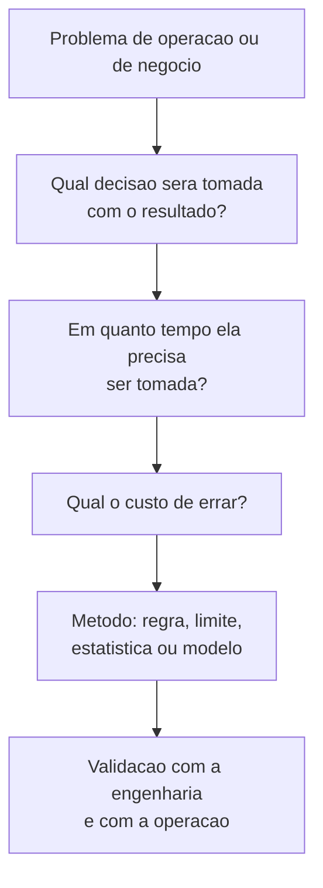
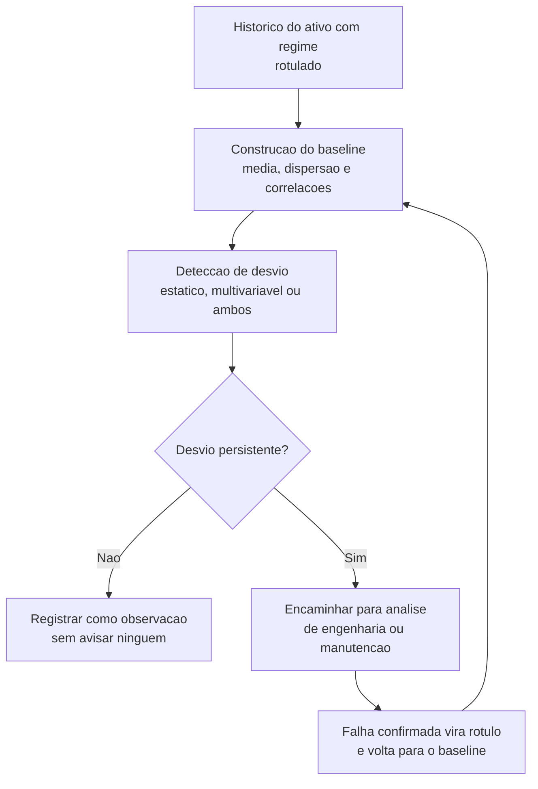

# Capítulo 20 – IA e Analítica Industrial

## Objetivos de Aprendizagem

Ao final deste capítulo, o leitor será capaz de:

- Distinguir as quatro famílias de problema que a analítica industrial resolve.
- Verificar se os dados de uma planta estão prontos para um modelo — antes de contratá-lo.
- Estruturar um projeto de manutenção preditiva e de detecção de anomalia.
- Descrever o ciclo de vida de um modelo industrial, do treino ao retreino.
- Reconhecer os modos de falha de um modelo em operação e os limites do seu uso.

---

## 20.1 O que a indústria realmente pede à IA

"Aplicar inteligência artificial" não é um problema de engenharia — é um guarda-chuva. Na prática, os
pedidos se organizam em quatro famílias, e cada uma tem pré-requisito diferente:

**Tabela 20.1 – As quatro famílias de problema**

| Família | Pergunta que responde | Exemplo industrial | Pré-requisito principal |
|---|---|---|---|
| Classificação | "Isto é A ou B?" | Peça conforme ou não conforme; motor em falha ou normal | Exemplos **rotulados** de cada classe |
| Regressão (sensor virtual) | "Quanto vale o que eu não meço?" | Estimar qualidade em linha a partir de variáveis medidas | Relação estável entre entrada e saída |
| Detecção de anomalia | "Isto está diferente do normal?" | Comportamento atípico de conjunto motobomba | *Baseline* de operação normal, bem definido |
| Otimização | "Qual o melhor ajuste agora?" | Reduzir consumo de energia mantendo a produção | Modelo do processo e função objetivo acordada |

O erro mais comum de projeto é começar pela técnica. A ordem correta é: **definir a decisão** que será
tomada com o resultado, o **tempo disponível** para tomá-la e o **custo** de errar. Só então se escolhe
o método — que, em boa parte dos casos industriais reais, é uma regra simples com limite bem ajustado.

---

## 20.2 O pré-requisito: dado com contexto

Nenhuma técnica compensa dado mal formado. Antes de qualquer modelo, quatro verificações:

1. **Tag com significado completo** — nome estável, unidade, faixa, contexto e qualidade
   (Capítulos 14 e 15).
2. **Histórico com resolução adequada ao fenômeno** — um modelo de vibração treinado com amostra de
   30 s não enxerga nada (Capítulo 16).
3. **Eventos de falha registrados** — com data, hora, equipamento e **causa**. Sem causa registrada,
   não existe rótulo, e sem rótulo não existe classificação.
4. **Contexto operacional** — regime de carga, produto sendo fabricado, turno, temperatura ambiente.
   Um modelo treinado em um regime e aplicado em outro aprendeu a reconhecer o regime, não a falha.

> ⚠️ **Atenção:** o gargalo mais frequente não é o algoritmo, é a **ordem de serviço**. Em muitas
> plantas, o registro de manutenção diz "bomba 2 — defeito" sem informar qual componente falhou.
> Sem essa informação, o histórico técnico mais rico da empresa é inútil para aprendizado
> supervisionado. Corrigir o formulário de manutenção é, literalmente, o primeiro passo do projeto de
> IA — e o mais barato.

> 🖼️ **[Figura 20.1 – Diagnóstico de prontidão dos dados para analítica]**
> *Painel de verificação com quatro blocos de semáforo: cobertura de tags (percentual de variáveis com unidade, faixa e qualidade definidas), resolução do histórico (variáveis com taxa de amostragem compatível com o fenômeno), registro de eventos (número de paradas com causa documentada no último ano) e rotulagem (proporção de ocorrências de manutenção com componente identificado). Abaixo, uma lista dos dez ativos prioritários com o bloco que falta em cada um.*

---

## 20.3 Manutenção preditiva

A manutenção evolui em níveis, e cada nível exige mais dado que o anterior:

**Tabela 20.2 – Níveis de manutenção**

| Nível | Quando se intervém | Dado necessário | Limitação |
|---|---|---|---|
| Corretiva | Depois da falha | Nenhum | Parada não planejada e dano secundário |
| Preventiva | Por calendário ou horas de operação | Contador de horas | Troca de componente bom e falha entre intervalos |
| Baseada em condição | Quando um indicador cruza um limite | Vibração, corrente, temperatura, análise de óleo | Depende de limite bem escolhido e de tendência confiável |
| Preditiva | Quando a projeção indica falha em janela útil | Série histórica com eventos rotulados | Exige histórico longo e disciplina de registro |
| Prescritiva | Antes, com recomendação de ação | Modelo de degradação e de custo | Depende de confiabilidade do modelo e de confiança da operação |

Os sinais de campo que alimentam a análise são conhecidos e não exigem instrumentação exótica: valor
eficaz de vibração e sua decomposição em faixas, temperatura de mancal, corrente do motor e seu
desvio do padrão, pressão diferencial, análise periódica de óleo. O que faz diferença não é o sensor,
é a **tendência com baseline**: a mesma leitura de vibração significa coisas diferentes em máquinas
diferentes e em regimes diferentes.

> 💡 **Dica:** comece pela manutenção **baseada em condição** com limites extraídos do próprio
> histórico, antes de partir para modelos preditivos. Ela entrega resultado em semanas, exige só o que
> já existe e — o mais importante — estabelece a disciplina de registro que o modelo preditivo vai
> precisar depois.

> 🖼️ **[Figura 20.2 – Tendência de indicador de condição com desvio progressivo]**
> *Gráfico de linha com a evolução de um indicador de vibração ao longo de seis meses, com faixa de referência sombreada (baseline com dispersão) e uma linha de limite de atenção. No início do período a curva oscila dentro da faixa; a partir de determinado ponto inicia subida gradual, cruza o limite de atenção e continua. Anotar na figura o início da subida, o cruzamento do limite e o instante da intervenção, mostrando a janela de antecedência obtida.*

---

## 20.4 Detecção de anomalia

Detecção de anomalia é a técnica mais promissora para a indústria, e a mais fácil de arruinar. Três
distinções precisam estar claras:

- **Anomalia não é falha.** Um comportamento diferente pode ser um regime novo, um produto diferente
  ou uma condição de clima. Anomalia é convite à investigação, não alarme.
- **Limite estático × dinâmico.** Um limite fixo é simples, previsível, auditável e frequentemente
  suficiente. Um modelo multivariável captura interações que o limite fixo não vê — e cobra o preço em
  explicabilidade.
- **O inimigo é o falso positivo.** Um detector que avisa dez vezes por dia é desligado na segunda
  semana. O mesmo raciocínio de racionalização de alarmes do Capítulo 10 se aplica: se ninguém age, o
  aviso não deveria existir.

O último passo do diagrama é o que separa um projeto vivo de um projeto abandonado: **a falha
confirmada volta como rótulo**. Sem esse retorno, o sistema não aprende e o detector continua com o
mesmo desempenho do primeiro dia — ou pior, porque o processo mudou.

---

## 20.5 Sensor virtual e controle avançado

Duas aplicações de regressão que pagam bem o investimento:

- **Sensor virtual** (*soft sensor*): estimar em tempo real uma variável que só é medida em
  laboratório ou por analisador de alto custo, a partir de variáveis medidas continuamente. Aplicação
  típica em qualidade de produto. Requisito: a relação entre entrada e saída precisa ser estável o
  suficiente, e o modelo precisa saber dizer quando está fora da sua região de validade.
- **Controle avançado**: usar um modelo do processo para calcular a ação considerando restrições e
  horizonte futuro — o que já era feito, sem aprendizado de máquina, pelo controle preditivo baseado
  em modelo (MPC). Aqui, a contribuição da analítica está em manter o modelo atualizado e em detectar
  quando ele deixa de representar o processo.

Em ambos os casos, a saída do modelo **orienta** a decisão; ela não escreve diretamente no atuador sem
malha de segurança. Usar uma predição como *setpoint* de proteção é confundir previsão com garantia.

---

## 20.6 O ciclo de vida do modelo em operação

Um modelo industrial não termina no treino. Ele tem ciclo de vida, e o ciclo tem modos de falha
próprios.

**Tabela 20.3 – Etapas do ciclo e os modos de falha**

| Etapa | O que se faz | Como falha |
|---|---|---|
| Preparação | Seleção de variáveis, tratamento de lacunas e de valores ruins | Misturar períodos com configuração diferente sem marcá-los |
| Treino e validação | Ajuste do modelo e verificação em dados não usados no treino | Vazamento de dados: treinar e validar no mesmo período |
| Implantação | Publicação do resultado onde a decisão acontece | Modelo certo no lugar errado — resultado em painel que ninguém abre |
| Monitoramento | Vigilância do erro e das entradas | Ninguém percebe que a variável de entrada mudou de comportamento |
| Deriva e retreino | Atualização com dado novo | Retreinar sem revisar: o modelo aprende a nova condição anormal como normal |

A **deriva** (*drift*) é o modo de falha mais silencioso. Ela acontece por três caminhos: o processo
muda (equipamento reformado, produto novo), o sensor muda (descalibração, substituição por outro
modelo) ou a relação muda (a causa deixou de ser a mesma). Nas três, o sintoma na tela é o mesmo:
o modelo continua respondendo, com confiança, errado.

> 📌 **Nota:** um modelo em produção é um **ativo com prazo de validade**, e precisa de dono, de
> indicador de desempenho e de rotina de revisão. Modelo sem dono é passivo técnico: fica na planta
> até alguém descobrir, em uma investigação de acidente, que a recomendação vinha de um sistema
> treinado com dados de quatro anos antes.

> 🖼️ **[Figura 20.3 – Painel de acompanhamento de um modelo em operação]**
> *Captura de painel com quatro blocos: desempenho do modelo ao longo do tempo (acerto e falsos positivos por mês), distribuição das variáveis de entrada comparada com a do treino, número de recomendações emitidas e quantas geraram intervenção, e lista das últimas recomendações com o desfecho registrado. Destacar o bloco de desvio de entrada, que é o alerta antecipado de deriva.*

---

## 20.7 Limites e riscos

**Tabela 20.4 – Riscos e a resposta de engenharia**

| Risco | Descrição | Resposta |
|---|---|---|
| Correlação tratada como causa | O modelo aprende que a parada vem junto com um evento que é consequência dela | Validar com engenharia de processo; nunca concluir causa a partir do modelo |
| Opacidade | Ninguém sabe explicar a recomendação | Preferir modelos interpretáveis quando a decisão for crítica |
| Viés de registro | Só falhas que já eram observadas estão rotuladas | Reconhecer o limite; não usar o modelo como detector do desconhecido |
| Uso fora do domínio | Aplicar em equipamento ou regime não representado no treino | Declarar a região de validade e recusar a resposta fora dela |
| Uso para segurança | Colocar predição no caminho de proteção | Proibido: proteção é do SIS e do intertravamento (Capítulos 8 e 15) |
| Custo invisível | O modelo melhora o indicador e piora a operação | Medir o efeito na planta, não só a métrica do modelo |

> ⚠️ **Atenção:** IA e analítica não substituem proteção, intertravamento nem sistema de segurança
> instrumentado. Um modelo estatístico não tem nível de integridade de segurança, não é certificado
> para função de proteção e não responde em tempo determinístico. Ele ajuda a decidir; não protege
> pessoas nem ativos.

---

## 20.8 Estudo de Caso — O modelo que acertava e ninguém usava

**Cenário.** Uma planta de celulose contratou o desenvolvimento de um modelo preditivo de falha para
os motores do setor de bombas. O modelo foi entregue com 91 % de acerto na validação, sobre um
histórico de três anos de vibração e corrente. A recomendação chegava por painel em nuvem.

**Diagnóstico.** Seis meses depois, a manutenção não havia mudado uma única intervenção por causa do
modelo. Três motivos:

1. **A decisão não passou pelo modelo.** O planejamento da manutenção é semanal; a recomendação
   chegava por painel, sem entrar na rotina do planejador.
2. **A região de validade não era dita.** Metade dos avisos vinha de dois motores que operavam em
   regime intermitente, ausente do histórico de treino.
3. **O retorno de rótulo não existia.** As falhas confirmadas nunca voltaram para o modelo, e as
   substituições preventivas — que evitam a falha — não foram registradas como tal, o que fazia o
   modelo parecer pior do que era.

**Decisão de engenharia.**

| Problema | Medida |
|---|---|
| Modelo fora da rotina | Recomendação injetada como item no plano semanal de manutenção, com justificativa e prioridade |
| Região de validade ignorada | Motores em regime intermitente separados em outro grupo, com baseline próprio |
| Sem retorno de rótulo | O registro de manutenção passou a exigir causa e componente; o resultado alimenta o retreino |
| Sem medição de resultado | Indicador de falsos positivos por mês e de acertos que geraram intervenção |

**Resultado.** No semestre seguinte, 11 intervenções foram antecipadas por recomendação do modelo, com
redução de paradas não planejadas. O acerto do modelo não mudou — o que mudou foi o sistema em torno
dele: a recomendação entrou na rotina, a região de validade foi respeitada e o resultado passou a ser
medido.

**Limitações do arranjo.** O modelo continua dependendo de um baseline revisado a cada mudança de
configuração de processo. E os motores em regime intermitente seguem com desempenho inferior, porque
o histórico disponível para eles é curto — limitação de dado, não de método.

---

## Resumo

- A indústria pede quatro coisas distintas: **classificação, regressão, detecção de anomalia e otimização** — cada uma com pré-requisito próprio.
- O projeto começa pela **decisão** a ser tomada e pelo custo de errar, não pela técnica.
- Dado com **contexto** (unidade, faixa, qualidade, regime, causa registrada) é pré-requisito; corrigir o formulário de manutenção costuma ser o primeiro passo.
- A manutenção evolui de corretiva a prescritiva; a **baseada em condição** já entrega resultado e prepara o terreno.
- **Anomalia não é falha**; o inimigo do detector é o falso positivo, e o mesmo raciocínio de racionalização de alarmes se aplica.
- A **falha confirmada precisa voltar como rótulo**, ou o sistema não aprende.
- Sensor virtual e controle avançado orientam a decisão; não escrevem no atuador sem malha de segurança.
- Modelo em produção **tem prazo de validade**, dono, indicador e rotina de revisão — a deriva é o modo de falha mais silencioso.
- **IA não substitui proteção, intertravamento nem SIS**; não tem nível de integridade de segurança.

## Questões de Revisão

1. Descreva as quatro famílias de problema da analítica industrial e dê um exemplo de cada em uma planta de sua escolha.
2. Por que a definição da decisão deve preceder a escolha do método? Ilustre com um caso em que uma regra simples resolve o problema.
3. Liste quatro verificações de prontidão dos dados e explique o que cada uma impede.
4. Por que a ausência de causa no registro de manutenção inviabiliza aprendizado supervisionado? Como corrigir isso na prática?
5. Compare manutenção baseada em condição e manutenção preditiva quanto a dado necessário e limitação.
6. Explique a diferença entre anomalia e falha, e por que o excesso de avisos leva ao abandono do sistema.
7. Descreva o ciclo de vida de um modelo industrial e um modo de falha de cada etapa.
8. O que é deriva de modelo, quais os três caminhos que a produzem e como detectá-la?
9. Explique por que um modelo com 91 % de acerto pode não gerar nenhum benefício. Cite três causas organizacionais.
10. Justifique tecnicamente por que um modelo de aprendizado de máquina não pode substituir o sistema de segurança instrumentado de uma planta.

## Referências

- VIANNA, W. S. **IIoT e suas Tecnologias Aderentes: Teoria e exemplos práticos**. Material didático do curso (Indústria 4.0, inteligência artificial, aprendizado de máquina e tecnologias aderentes).
- VIANNA, W. S. **Introdução a IoT**. Material didático do curso (aprendizado de máquina e análise avançada sobre dados de dispositivos; plataformas de nuvem).
- ORACLE. **O que é IoT** — conceitos de Internet das Coisas, conectividade e análise. Disponível em: oracle.com/br/internet-of-things. Consulta: 2026 (referência citada pelo material de origem do curso).
- CISCO. **An Introduction to IoT** (documento de pesquisa traduzido) — fundamentos de IoT e conectividade. Referência citada pelo material de origem do curso.
- INFLUXDATA. **InfluxDB Documentation** — consulta e agregação para análise de séries temporais. Disponível em: docs.influxdata.com. Consulta: 2026.
- GRAFANA LABS. **Grafana Documentation** — painéis de acompanhamento de indicadores e de desempenho de modelos. Disponível em: grafana.com/docs. Consulta: 2026.
- THINGSBOARD. **Documentação oficial** — telemetria, atributos e alarmes como fonte de dado para análise. Disponível em: thingsboard.io/docs. Consulta: 2026.
